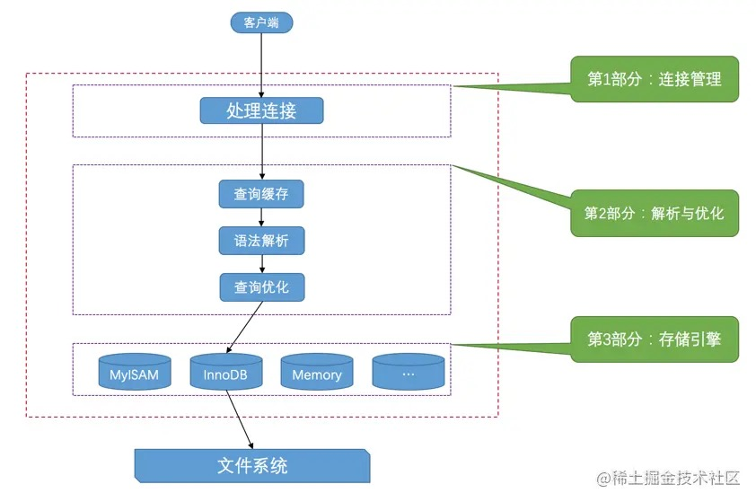

# 01-初识MySQL

MySQL是客户端服务器架构。

## 1.1 客户端连接服务器

    mysql -h 39.107.235.147 -P 33061 -u root -p
    Enter password:
    Welcome to the MySQL monitor.  Commands end with ; or \g.
    Your MySQL connection id is 464
    Server version: 5.7.37 MySQL Community Server (GPL)

    Copyright (c) 2000, 2020, Oracle and/or its affiliates. All rights reserved.

    Oracle is a registered trademark of Oracle Corporation and/or its
    affiliates. Other names may be trademarks of their respective
    owners.

    Type 'help;' or '\h' for help. Type '\c' to clear the current input statement.

    mysql> quit
    Bye

## 1.2 服务器处理客户端请求

### 1.2.1 连接管理

每当有一个客户端进程连接到服务器进程时，服务器进程都会创建一个线程来专门处理与这个客户端的交互。  
客户端连接关闭后，线程会复用，避免频繁创建和销毁线程的开销。  
同时连接进来的客户端太多了会严重影响系统性能，所以需要限制可以同时连接到服务器的客户端数量。

### 1.2.2 解析与优化

1. 查询缓存

MySQL服务器处理过的查询请求和结果会缓存起来，如果下一次有一模一样的请求过来，直接返回缓存中的结果。

2. 语法解析

MySQL服务器程序首先要对查询语句做分析，判断请求的语法是否正确，然后从文本中将要查询的表、各种查询条件都提取出来。

3. 查询优化

MySQL的优化程序会对查询语句做一些优化，如外连接转换为内连接、表达式简化、子查询转为连接等。  
优化的结果就是生成一个执行计划，这个执行计划表明了应该使用哪些索引进行查询，表之间的连接顺序是啥样的。

### 1.2.3 存储引擎

MySQL服务器把数据的存储和提取操作都封装到了一个叫存储引擎的模块里。  
MySQL提供了各式各样的存储引擎，不同存储引擎管理的表具体的存储结构可能不同，采用的存取算法也可能不同。

## 1.3 常用存储引擎

常用存储引擎就是InnoDB和MyISAM，其中InnoDB是MySQL默认的存储引擎。

## 1.4 关于存储引擎的一些操作

查看当前服务器程序支持的存储引擎：

    mysql> SHOW ENGINES;
    +--------------------+---------+----------------------------------------------------------------+--------------+------+------------+
    | Engine             | Support | Comment                                                        | Transactions | XA   | Savepoints |
    +--------------------+---------+----------------------------------------------------------------+--------------+------+------------+
    | InnoDB             | DEFAULT | Supports transactions, row-level locking, and foreign keys     | YES          | YES  | YES        |
    | MRG_MYISAM         | YES     | Collection of identical MyISAM tables                          | NO           | NO   | NO         |
    | MEMORY             | YES     | Hash based, stored in memory, useful for temporary tables      | NO           | NO   | NO         |
    | BLACKHOLE          | YES     | /dev/null storage engine (anything you write to it disappears) | NO           | NO   | NO         |
    | MyISAM             | YES     | MyISAM storage engine                                          | NO           | NO   | NO         |
    | CSV                | YES     | CSV storage engine                                             | NO           | NO   | NO         |
    | ARCHIVE            | YES     | Archive storage engine                                         | NO           | NO   | NO         |
    | PERFORMANCE_SCHEMA | YES     | Performance Schema                                             | NO           | NO   | NO         |
    | FEDERATED          | NO      | Federated MySQL storage engine                                 | NULL         | NULL | NULL       |
    +--------------------+---------+----------------------------------------------------------------+--------------+------+------------+
    9 rows in set (0.00 sec)

Support列表示该存储引擎是否可用，DEFAULT值代表是当前服务器程序的默认存储引擎。  
Comment列是对存储引擎的一个描述。  
Transactions列代表该存储引擎是否支持事务处理。  
XA列代表着该存储引擎是否支持分布式事务。  
Savepoints代表着该存储引擎是否支持部分事务回滚。  

# 完