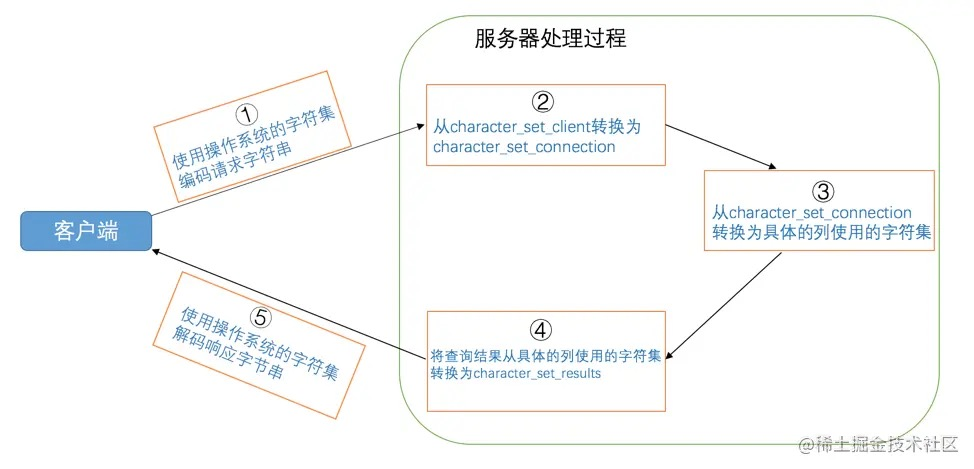

# 03-字符集和比较规则

## 3.1 字符集和比较规则简介

### 3.1.1 字符集简介

字符集描述某个字符范围的编码规则。

### 3.1.2 比较规则简介

同一字符集中的字符可以有多种比较规则。

### 3.1.3 一些重要的字符集

- `ASCII`字符集

  共收录128个字符，包括空格、标点符号、数字、大小写字母和一些不可见字符。  
  使用1个字节来进行编码。

- `ISO 8859-1`字符集

  共收录256个字符，是在ASCII字符集的基础上又扩充了128个西欧常用字符。  
  这个字符集也有一个别名latin1。  
  使用1个字节来进行编码。

- `GB2312`字符集

  收录了汉字以及拉丁字母、希腊字母等其他字母。  
  其中收录汉字6763个，其他文字符号682个。  
  兼容ASCII字符集。
  编码方式：
  - ASCII字符采用1字节编码。
  - 其他字符采用2字节编码。

- `GBK`字符集

  GBK字符集在收录字符范围上对GB2312字符集作了扩充。  
  编码方式兼容GB2312。

- `utf8`字符集

  收录地球上能想到的所有字符。  
  兼容ASCII字符集。  
  采用变长编码方式，编码一个字符需要使用1～4个字节。

  **注意**

  其实utf8只是Unicode字符集的一种编码方案。  
  Unicode字符集可以采用utf8、utf16、utf32这几种编码方案。  
  utf8使用1～4个字节编码一个字符。  
  utf16使用2个或4个字节编码一个字符。  
  utf32使用4个字节编码一个字符。  

## 3.2 MySQL中支持的字符集和比较规则

### 3.2.1 MySQL中的utf8和utf8mb4

出于对系统的存储和性能考虑，MySQL中的两个概念：
- utf8mb3  
  阉割过的utf8字符集，只使用1～3个字节表示字符。  
  也就是MySQL中的utf8。

- utf8mb4  
  正宗的utf8字符集，使用1～4个字节表示字符。  
  比如存储一些emoji表情啥的，那请使用utf8mb4。

### 3.2.2 字符集的查看

查看MySQL支持的字符集：

    SHOW CHARSET [LIKE 匹配的模式];

当前MySQL支持的字符集：

    mysql> SHOW CHARSET;
    +----------+---------------------------------+---------------------+--------+
    | Charset  | Description                     | Default collation   | Maxlen |
    +----------+---------------------------------+---------------------+--------+
    | big5     | Big5 Traditional Chinese        | big5_chinese_ci     |      2 |
    | latin1   | cp1252 West European            | latin1_swedish_ci   |      1 |
    | latin2   | ISO 8859-2 Central European     | latin2_general_ci   |      1 |
    | ascii    | US ASCII                        | ascii_general_ci    |      1 |
    | gb2312   | GB2312 Simplified Chinese       | gb2312_chinese_ci   |      2 |
    | gbk      | GBK Simplified Chinese          | gbk_chinese_ci      |      2 |
    | utf8     | UTF-8 Unicode                   | utf8_general_ci     |      3 |
    | utf8mb4  | UTF-8 Unicode                   | utf8mb4_general_ci  |      4 |
    | utf16    | UTF-16 Unicode                  | utf16_general_ci    |      4 |
    | utf32    | UTF-32 Unicode                  | utf32_general_ci    |      4 |
    | binary   | Binary pseudo charset           | binary              |      1 |
    | gb18030  | China National Standard GB18030 | gb18030_chinese_ci  |      4 |
    ...
    +----------+---------------------------------+---------------------+--------+
    41 rows in set (0.00 sec)

其中：
- `Default collation`：表示这种字符集默认的比较规则
- `Maxlen`：表示这种字符集一个字符最多需要几个字节

### 3.2.3 比较规则的查看

查看MySQL支持的比较规则：

    SHOW COLLATION [LIKE 匹配的模式];

当前MySQL支持的比较规则：

    mysql> SHOW COLLATION LIKE 'utf8\_%';
    +--------------------------+---------+-----+---------+----------+---------+
    | Collation                | Charset | Id  | Default | Compiled | Sortlen |
    +--------------------------+---------+-----+---------+----------+---------+
    | utf8_general_ci          | utf8    |  33 | Yes     | Yes      |       1 |
    | utf8_bin                 | utf8    |  83 |         | Yes      |       1 |
    | utf8_unicode_ci          | utf8    | 192 |         | Yes      |       8 |
    | utf8_icelandic_ci        | utf8    | 193 |         | Yes      |       8 |
    | utf8_latvian_ci          | utf8    | 194 |         | Yes      |       8 |
    | utf8_romanian_ci         | utf8    | 195 |         | Yes      |       8 |
    | utf8_slovenian_ci        | utf8    | 196 |         | Yes      |       8 |
    | utf8_polish_ci           | utf8    | 197 |         | Yes      |       8 |
    | utf8_estonian_ci         | utf8    | 198 |         | Yes      |       8 |
    | utf8_spanish_ci          | utf8    | 199 |         | Yes      |       8 |
    | utf8_swedish_ci          | utf8    | 200 |         | Yes      |       8 |
    | utf8_turkish_ci          | utf8    | 201 |         | Yes      |       8 |
    | utf8_czech_ci            | utf8    | 202 |         | Yes      |       8 |
    | utf8_danish_ci           | utf8    | 203 |         | Yes      |       8 |
    | utf8_lithuanian_ci       | utf8    | 204 |         | Yes      |       8 |
    | utf8_slovak_ci           | utf8    | 205 |         | Yes      |       8 |
    | utf8_spanish2_ci         | utf8    | 206 |         | Yes      |       8 |
    | utf8_roman_ci            | utf8    | 207 |         | Yes      |       8 |
    | utf8_persian_ci          | utf8    | 208 |         | Yes      |       8 |
    | utf8_esperanto_ci        | utf8    | 209 |         | Yes      |       8 |
    | utf8_hungarian_ci        | utf8    | 210 |         | Yes      |       8 |
    | utf8_sinhala_ci          | utf8    | 211 |         | Yes      |       8 |
    | utf8_german2_ci          | utf8    | 212 |         | Yes      |       8 |
    | utf8_croatian_ci         | utf8    | 213 |         | Yes      |       8 |
    | utf8_unicode_520_ci      | utf8    | 214 |         | Yes      |       8 |
    | utf8_vietnamese_ci       | utf8    | 215 |         | Yes      |       8 |
    | utf8_general_mysql500_ci | utf8    | 223 |         | Yes      |       1 |
    +--------------------------+---------+-----+---------+----------+---------+
    27 rows in set (0.00 sec)

比较规则命名规律：
- 比较规则名称以与其关联的字符集的名称开头。
- 后边紧跟着该比较规则主要作用于哪种语言。  
  utf8_spanish_ci是以西班牙语的规则比较。  
  utf8_general_ci是一种通用的比较规则。  
- 名称后缀表示比较规则是否区分语言中的重音、大小等：

| 后缀 | 英文释义 | 描述 |
| -------- | ------------------ | ---------------- |
| _ai      | accent insensitive | 不区分重音       |
| _as      | accent sensitive   | 区分重音         |
| _ci      | case insensitive   | 不区分大小写     |
| _cs      | case sensitive     | 区分大小写       |
| _bin     | binary             | 以二进制方式比较  |

## 3.3 字符集和比较规则的应用

### 3.3.1 各级别的字符集和比较规则

MySQL有4个级别的字符集和比较规则：
- 服务器级别
- 数据库级别
- 表级别
- 列级别

1. 服务器级别

MySQL提供了两个系统变量来表示服务器级别的字符集和比较规则：

| 系统变量 | 描述 |
| -------------------- | ----------------- |
| character_set_server | 服务器级别的字符集   |
| collation_server     | 服务器级别的比较规则  |

    mysql> SHOW VARIABLES LIKE 'character_set_server';
    +----------------------+-------+
    | Variable_name        | Value |
    +----------------------+-------+
    | character_set_server | utf8  |
    +----------------------+-------+
    
    mysql> SHOW VARIABLES LIKE 'collation_server';
    +------------------+-----------------+
    | Variable_name    | Value           |
    +------------------+-----------------+
    | collation_server | utf8_general_ci |
    +------------------+-----------------+

通过启动选项设置这两个变量的值：

    [server]
    character_set_server=gbk
    collation_server=gbk_chinese_ci

1. 数据库级别

创建和修改数据库的时候可以指定该数据库的字符集和比较规则。  
如果创建数据库时不指定则使用服务器级别的字符集和比较规则。

    CREATE DATABASE 数据库名
        [CHARACTER SET 字符集名称]
        [COLLATE 比较规则名称];
    
    ALTER DATABASE 数据库名
        [CHARACTER SET 字符集名称]
        [COLLATE 比较规则名称];

查看当前数据库使用的字符集和比较规则，可以查看下面两个系统变量的值：  

| 系统变量 | 描述 |
| ---------------------- | ----------------- |
| character_set_database | 当前数据库的字符集   |
| collation_database     | 当前数据库的比较规则  |

**注意**

需要使用USE语句选择当前默认数据库，如果没有默认数据库，则变量与相应的服务器级系统变量具有相同的值。

    mysql> use temp;
    Database changed
    mysql> SHOW VARIABLES LIKE 'character_set_database';
    +------------------------+---------+
    | Variable_name          | Value   |
    +------------------------+---------+
    | character_set_database | utf8mb4 |
    +------------------------+---------+
    
    mysql> SHOW VARIABLES LIKE 'collation_database';
    +--------------------+--------------------+
    | Variable_name      | Value              |
    +--------------------+--------------------+
    | collation_database | utf8mb4_general_ci |
    +--------------------+--------------------+

**注意**

`character_set_database` 和 `collation_database` 这两个系统变量是只读的。

3. 表级别

创建和修改表的时候可以指定表的字符集和比较规则。  
如果创建表时不指定则使用该表所在数据库的字符集和比较规则。

    CREATE TABLE 表名 (列的信息)
        [CHARACTER SET 字符集名称]
        [COLLATE 比较规则名称]]
    
    ALTER TABLE 表名
        [CHARACTER SET 字符集名称]
        [COLLATE 比较规则名称]

4. 列级别
   

对于存储字符串的列，同一个表中的不同的列可以有不同的字符集和比较规则。
创建和修改列定义的时候可以指定该列的字符集和比较规则。
如果创建列时不指定则使用该列所在表的字符集和比较规则。

    CREATE TABLE 表名(
        列名 字符串类型 [CHARACTER SET 字符集名称] [COLLATE 比较规则名称],
        其他列...
    );
    
    ALTER TABLE 表名 MODIFY 列名 字符串类型 [CHARACTER SET 字符集名称] [COLLATE 比较规则名称];

**注意**

在转换列的字符集时，如果转换前列中存储的数据不能用转换后的字符集进行表示会发生错误。

5. 仅修改字符集或仅修改比较规则

不论哪个级别的字符集和比较规则，由于字符集和比较规则是互相有联系的，只修改字符集，比较规则会跟着变化，只修改比较规则，字符集也会跟着变化：
- 只修改字符集，则比较规则将变为修改后的字符集默认的比较规则。
- 只修改比较规则，则字符集将变为修改后的比较规则对应的字符集。

6. 各级别字符集和比较规则小结

- 如果创建列时没有显式的指定字符集和比较规则，则该列默认用表的字符集和比较规则
- 如果创建表时没有显式的指定字符集和比较规则，则该表默认用数据库的字符集和比较规则
- 如果创建数据库时没有显式的指定字符集和比较规则，则该数据库默认用服务器的字符集和比较规则

### 3.3.2 客户端和服务器通信过程中使用的字符集

这个过程中会用到3个系统变量：

| 系统变量 | 描述 |
| ------------------------ | ------------------------------------------------------------------------------ |
| character_set_client     | 服务器解码请求时使用的字符集                                                        |
| character_set_connection | 服务器处理请求时会把请求字符串从`character_set_client`转为`character_set_connection` |
| character_set_results    | 服务器向客户端返回数据时使用的字符集                                                 |

    mysql> SHOW VARIABLES LIKE 'character_set_client';
    +----------------------+-------+
    | Variable_name        | Value |
    +----------------------+-------+
    | character_set_client | utf8  |
    +----------------------+-------+

    mysql> SHOW VARIABLES LIKE 'character_set_connection';
    +--------------------------+-------+
    | Variable_name            | Value |
    +--------------------------+-------+
    | character_set_connection | utf8  |
    +--------------------------+-------+

    mysql> SHOW VARIABLES LIKE 'character_set_results';
    +-----------------------+-------+
    | Variable_name         | Value |
    +-----------------------+-------+
    | character_set_results | utf8  |
    +-----------------------+-------+

交互图：

1. 客户端使用操作系统的字符集编码请求字符串，向服务器发送的是经过编码的一个字节串。
2. 服务器将客户端发送来的字节串采用`character_set_client`代表的字符集进行解码，将解码后的字符串再按照`character_set_connection`代表的字符集进行编码。
3. 如果`character_set_connection`代表的字符集和具体操作的列使用的字符集一致，则直接进行相应操作，否则的话需要将请求中的字符串从`character_set_connection`代表的字符集转换为具体操作的列使用的字符集之后再进行操作。
4. 将从某个列获取到的字节串从该列使用的字符集转换为`character_set_results`代表的字符集后发送到客户端。
5. 客户端使用操作系统的字符集解析收到的结果集字节串。

**注意**

1. 服务器认为客户端发送过来的请求是用`character_set_client`编码的。
2. 服务器将把得到的结果集使用`character_set_results`编码后发送给客户端。
3. `character_set_connection`只是服务器在将请求的字节串从`character_set_client`转换为`character_set_connection`时使用，它是什么其实没多重要，但是一定要注意，该字符集包含的字符范围一定涵盖请求中的字符，要不然会导致有的字符无法使用`character_set_connection`代表的字符集进行编码。

**注意**

通常都把 `character_set_client` 、`character_set_connection`、`character_set_results` 这三个系统变量设置成和客户端使用的字符集一致的情况，这样减少了很多无谓的字符集转换。MySQL提供了一条非常简便的语句：

    SET NAMES 字符集名;
    等价
    SET character_set_client = 字符集名;
    SET character_set_connection = 字符集名;
    SET character_set_results = 字符集名;

或者，在配置文件中设置客户端启动的时候就保持一致：

    [client]
    default-character-set=字符集名

### 3.3.3 比较规则的应用

比较规则的作用通常体现比较字符串大小的表达式以及对某个字符串列进行排序中，所以有时候也称为排序规则。

# 完