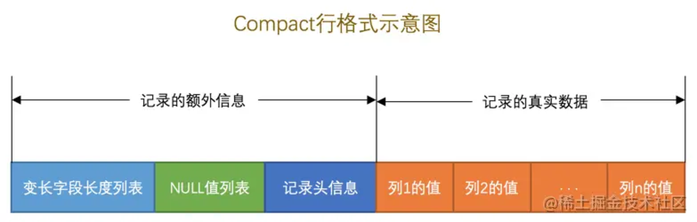
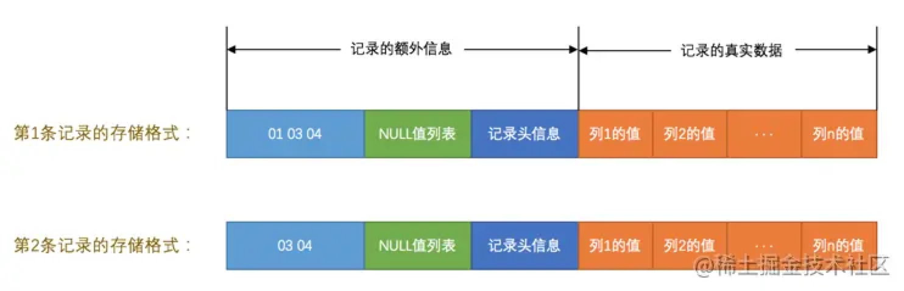
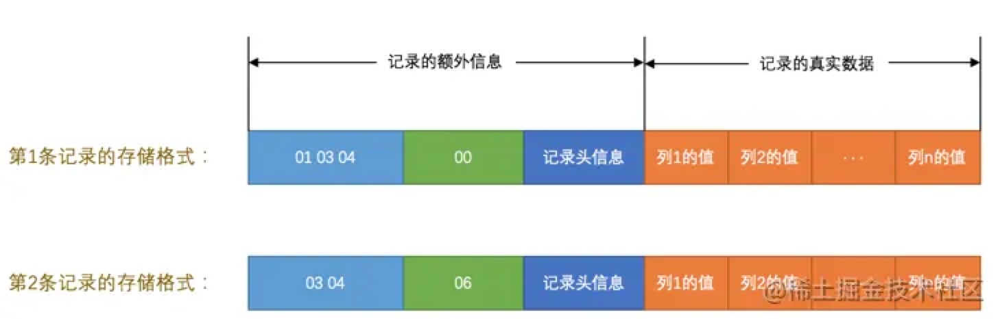
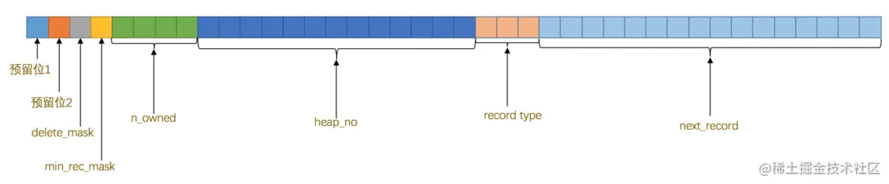
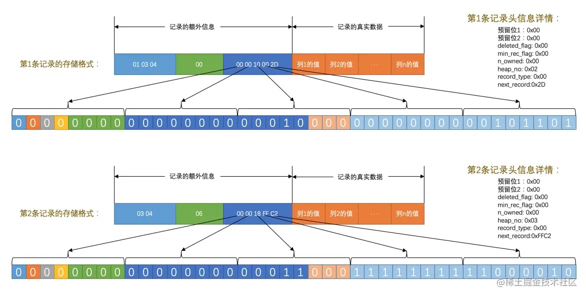
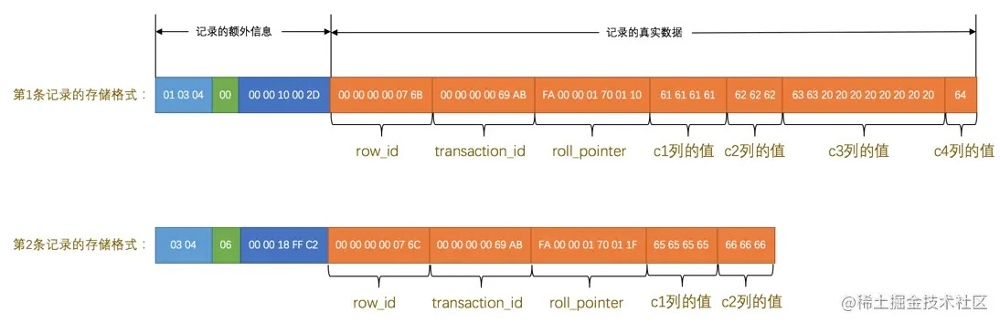
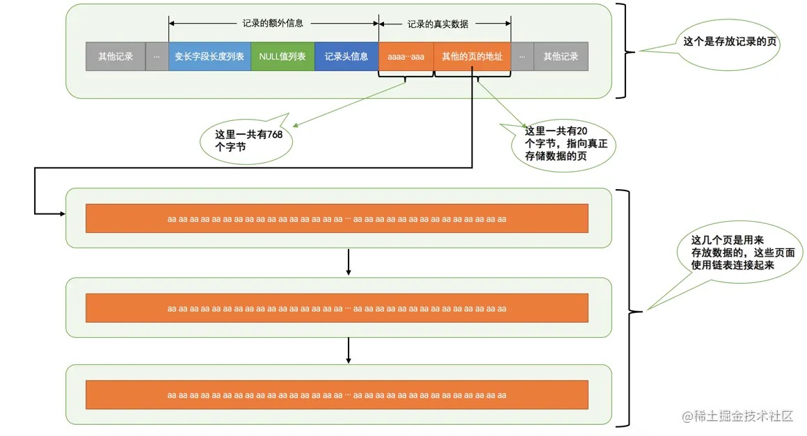

# 04-InnoDB记录存储结构

## 4.1 准备工作

InnoDB是MySQL默认的存储引擎，我们介绍InnoDB作为存储引擎的数据存储结构。

## 4.2 InnoDB页简介

InnoDB将表中的数据存储在磁盘上，在内存中处理数据，所以需要把磁盘中的数据加载到内存，或把内存中的数据刷新到磁盘。

InnoDB采取的方式是：  
将数据划分为若干个页，以页作为磁盘和内存之间交互的基本单位。  
页的大小一般为 `16KB`。  
一次最少从磁盘中读取`16KB`的内容到内存中。  
一次最少把内存中的`16KB`内容刷新到磁盘中。

## 4.3 InnoDB行格式

InnoDB存储引擎设计了4种行格式：
- Compact
- Redundant
- Dynamic
- Compressed

### 4.3.1 指定行格式的语法

创建或修改表指定行格式：

    CREATE TABLE 表名 (列的信息) ROW_FORMAT=行格式名称
        
    ALTER TABLE 表名 ROW_FORMAT=行格式名称

创建表：

    CREATE TABLE record_format_demo (
        c1 varchar(10) DEFAULT NULL,
        c2 varchar(10) NOT NULL,
        c3 char(10) DEFAULT NULL,
        c4 varchar(10) DEFAULT NULL
    ) ENGINE=InnoDB DEFAULT CHARSET=ascii ROW_FORMAT=COMPACT;

插入数据：

    +------+-----+------+------+
    | c1   | c2  | c3   | c4   |
    +------+-----+------+------+
    | aaaa | bbb | cc   | d    |
    | eeee | fff | NULL | NULL |
    +------+-----+------+------+

### 4.3.2 COMPACT行格式

1. 变长字段长度列表

所有变长字段的真实数据占用的字节长度都存放在记录开头的变长字段长度列表。  
按字段顺序的逆序存放。

每个变长字段的长度用1-2个字节表示：  
假设：

    W: 该变长字段字符集中表示一个字符最多需要使用的字节数
    M: 该变长字段最多能存储的字符数
    L: 该变长字段实际存储的内容占用的字节数

- 如果`M×W <= 255`，那么使用1个字节来表示真正字符串占用的字节数。
- 如果`M×W > 255`，则分为两种情况(首字节的第一个二进制位作为标志位)：
  - 如果`L <= 127`，则用1个字节来表示真正字符串占用的字节数(首字节的第一个二进制位为0)。
  - 如果`L >  127`，则用2个字节来表示真正字符串占用的字节数(首字节的第一个二进制位为1)。

**提示**

如果某个字段长度大于了16KB，在单个页面中无法存储时，InnoDB会把一部分数据存放到溢出页中。  
在变长字段长度列表处只存储留在本页面中的长度，所以两个字节够用。

**注意**

- 变长字段长度列表中只存储值为非NULL的列占用的长度，值为NULL的列的长度是不储存的。  
- 如果表中所有的列都不是变长的数据类型则变长字段长度列表是不需要的。

变长字段长度列表数据如下图：

2. NULL值列表

所有允许为NULL的列都使用NULL值列表中的一个二进制位来表示该列是否为NULL。  
按字段顺序的逆序存放。

- 二进制位的值为1时，代表该列的值为NULL。
- 二进制位的值为0时，代表该列的值不为NULL。

**提示**

NULL值列表必须用整数个字节的位表示，如果使用的二进制位个数不是整数个字节，则在字节的高位补0。

**注意**

如果表中没有允许存储NULL的列，则NULL值列表不存在。

NULL值列表数据如下图：

3. 记录头信息

记录头信息由固定的5个字节40个二进制位组成。

二进制位代表的详细信息如下表：

| 名称 | 大小（单位：bit） | 描述 |
| ------------ | ----------------- | ------------------------------------------------------ |
| 预留位1       | 1                 | 没有使用                                                 |
| 预留位2       | 1                 | 没有使用                                                 |
| delete_mask  | 1                 | 标记该记录是否被删除                                       |
| min_rec_mask | 1                 | B+树的每层非叶子节点中的最小记录都会添加该标记                 |
| n_owned      | 4                 | 表示当前记录拥有的记录数                                    |
| heap_no      | 13                | 表示当前记录在记录堆的位置信息                               |
| record_type  | 3                 | 表示当前记录的类型， `0`表示普通记录， `1`表示B+树非叶子节点记录， `2`表示最小记录， `3`表示最大记录 |
| next_record  | 16                | 表示下一条记录的相对位置                                    |

记录头信息数据如下图：

4. 记录的真实数据

MySQL会为每个记录默认的添加一些隐藏列，具体的列如下：

| 列名 | 是否必须 | 占用空间 | 描述 |
| -------------- | -------- | -------- | ----------------- |
| row_id         | 否       | `6`字节  | 行ID，唯一标识一条记录 |
| transaction_id | 是       | `6`字节  | 事务ID              |
| roll_pointer   | 是       | `7`字节  | 回滚指针             |

InnoDB表对主键的生成策略：
- 优先使用用户自定义主键作为主键。
- 如果没有定义主键，则选取一个Unique键作为主键。
- 如果没有Unique键，则为表默认添加一个名为row_id的隐藏列作为主键。

记录的真实数据如下图：

注意几点：
- 第1条记录中c3列是CHAR(10)，它实际存储的字符串是：cc，而ascii字符集中的字节表示是 0x6363，但c3列仍然占用了10个字节的空间，其余8个字节用空格字符0x20填充。
- 第2条记录中c3和c4列的值都为NULL，它们被存储在了前边的NULL值列表处，在记录的真实数据处不再存储。

5. CHAR(M)列的存储格式

对于CHAR(M)类型的列来说：
- 采用定长字符集时，该列占用的字节数不会被加到变长字段长度列表。
- 采用变长字符集时，该列占用的字节数也会被加到变长字段长度列表。

**注意**

变长字符集的CHAR(M)类型的列要求至少占用M个字节，而VARCHAR(M)却没有这个要求。  
比如使用utf8字符集的CHAR(10)的列存储的数据字节长度的范围是10～30个字节，即使该列存储一个空串也会占用10个字节，这样将来更新该列的值的字节长度小于10个字节时可以在该记录处直接更新，而不用重新分配一个新的记录空间，导致原有的记录空间成为所谓的碎片。

### 4.3.3 REDUNDANT行格式

略。

### 4.3.4 溢出列

1. VARCHAR(M)最多能存储的数据

创建`VARCHAR(65535)`的表：

    mysql> CREATE TABLE demo(
        ->     c VARCHAR(65535)
        -> ) CHARSET=ascii ROW_FORMAT=Compact;
    ERROR 1118 (42000): Row size too large. The maximum row size for the used table type, not counting BLOBs, is 65535. This includes storage overhead, check the manual. You have to change some columns to TEXT or BLOBs

MySQL对一条记录占用的最大存储空间是有限制的，除了BLOB或者TEXT类型的列之外，其他所有的列（不包括隐藏列和记录头信息）占用的字节长度加起来不能超过65535个字节。

一个VARCHAR(M)类型的列，其实需要占用3部分存储空间：
- 真实数据
- 真实数据占用字节的长度(占用2个字节)
- NULL值标识(占用1个字节)，如果该列有NOT NULL属性则可以没有这部分存储空间

所以`VARCHAR(65532)`可以：

    mysql> CREATE TABLE demo(
        ->     c VARCHAR(65532)
        -> ) CHARSET=ascii ROW_FORMAT=Compact;
    Query OK, 0 rows affected (0.01 sec)

**提示**
- gbk字符集下M的最大取值就是32766(65532/2)。
- utf8字符集下M的最大取值就是21844(65532/3)。
- 一条记录中的所有列（不包括隐藏列和记录头信息）占用的字节长度加起来不能超过65535个字节。

2. 记录中的数据太多产生的溢出

记录都会被分配到某个页中存储，一个页的大小一般是16KB，也就是16384字节。

在Compact和Redundant行格式中，对于占用存储空间非常大的列，在记录的真实数据处只会存储该列的一部分数据，把剩余的数据分散存储在几个其他的页中，然后记录的真实数据处用20个字节存储指向这些页的地址，如图所示：

记录的真实数据处只会存储该列的前768个字节的数据和一个指向其他页的地址，然后把剩下的数据存放到其他页中，这个过程也叫做行溢出，存储超出768字节的那些页面也被称为溢出页。

3. 行溢出的临界点

每个页除了存放记录以外，也需要存储一些额外的信息，额外信息加起来需要132个字节的空间，其他的空间都可以被用来存储记录。

MySQL中规定一个页中至少存放两行记录，每个记录需要的额外信息是27字节：
- 2个字节用于存储真实数据的长度
- 1个字节用于存储列是否是NULL值
- 5个字节大小的头信息
- 6个字节的row_id列
- 6个字节的transaction_id列
- 7个字节的roll_pointer列

针对只有一个列的表，假设列中存储的数据字节数为n，满足下边这个式子才不发生溢出：

    132 + 2×(27 + n) < 16384
    计算:
    n < 8099

**重点**

不用关注这个临界点是什么，一条记录的某个列中存储的数据占用的字节数非常多时，该列就可能成为溢出列。

### 4.3.5 DYNAMIC行格式和COMPRESSED行格式

- MySQL5.7默认行格式是Dynamic。
- 这俩行格式和Compact行格式挺像，只不过在处理行溢出数据时它们不会在记录的真实数据处存储字段真实数据的前768个字节，而是把所有的字节都存储到其他页面中，只在记录的真实数据处存储其他页面的地址。
- Compressed行格式会采用压缩算法对页面进行压缩来节省空间。

# 完