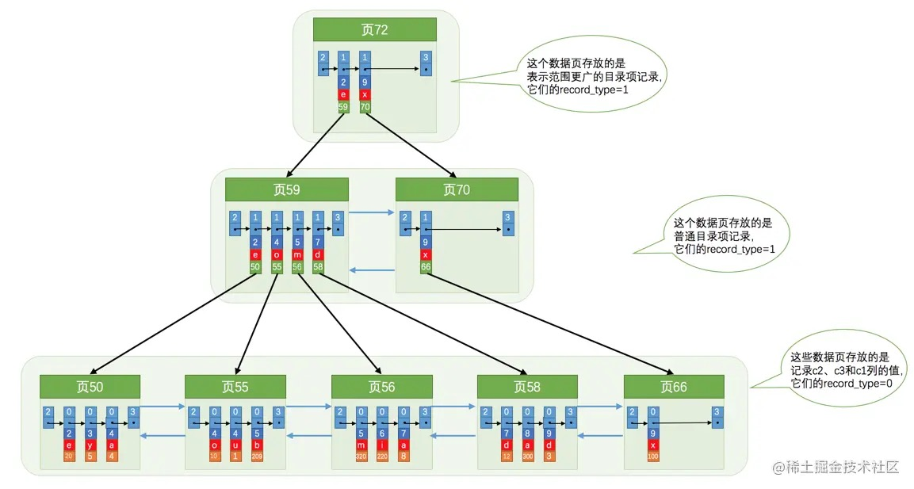

# 06-B+树索引

## 6.1 没有索引时进行查找

### 6.1.1 在一个页中查找

- 以主键为搜索条件
  
  在页目录中使用二分法快速定位到对应的槽，再遍历该槽对应分组中的记录即可。

- 以其他列作为搜索条件
  
  只能从页中最小记录开始依次遍历单链表中的每条记录。

### 6.1.2 在很多页中查找

只能从第一个页沿着双向链表一直往下找。

## 6.2 索引

先建一个表：

    CREATE TABLE index_demo (
        c1 int(11) NOT NULL,
        c2 int(11) DEFAULT NULL,
        c3 char(1) DEFAULT NULL,
    PRIMARY KEY (c1)
    ) ROW_FORMAT=COMPACT;

### 6.2.1 一个简单的索引方案

略。

### 6.2.2 InnoDB中的索引方案

InnoDB使用B+树来存储数据。

存放用户记录的数据页和存放目录项记录的数据页都存放在B+中。

用户记录其实都存放在B+树的最底层的节点上，这些节点也被称为叶子节点或叶节点。

存放目录项的节点称为非叶子节点或者内节点，其中B+树最上边的那个节点称为根节点。

一般情况下，B+树都不会超过4层，通过主键值去查找某条记录最多只需要做4个页面内的查找（查找3个目录项页和一个用户记录页）。因为在每个页面内有页目录，所以在页面内可以通过二分法实现快速定位记录。

**聚簇索引**

上边介绍的B+树本身就是一个索引。它有两个特点：

1. 使用记录主键值的大小进行记录和页的排序，包括三个方面的含义：
   - 页内的记录是按照主键的大小顺序排成一个单向链表。
   - 各个存放用户记录的页也是根据页中用户记录的主键大小顺序排成一个双向链表。
   - 存放目录项记录的页分为不同的层次，在同一层次中的页也是根据页中目录项记录的主键大小顺序排成一个双向链表。

2. B+树的叶子节点存储的是完整的用户记录。

具有这两种特性的B+树称为聚簇索引，所有完整的用户记录都存放在这个聚簇索引的叶子节点处。

InnoDB存储引擎会自动创建聚簇索引。

InnoDB存储引擎中，聚簇索引就是数据的存储方式，也就是索引即数据，数据即索引。

**二级索引**

我们可以多建几棵B+树，不同的B+树中的数据采用不同的排序规则。

我们用c2列的大小作为数据页、页中记录的排序规则，再建一棵B+树，如下图所示：

这个B+树与聚簇索引的B+树有几处不同：

- 使用记录c2列的大小进行记录和页的排序，这包括三个方面的含义：
  - 页内的记录是按照c2列的大小顺序排成一个单向链表。
  - 各个存放用户记录的页也是根据页中记录的c2列大小顺序排成一个双向链表。
  - 存放目录项记录的页分为不同的层次，在同一层次中的页也是根据页中目录项记录的c2列大小顺序排成一个双向链表。
- B+树的叶子节点存储的并不是完整的用户记录，而只是c2列+主键这两个列的值。
- 目录项记录中不再是主键+页号的搭配，而变成了c2列+页号的搭配。

通过c2列的值查找某些记录的话就可以使用这个B+树了。

查找过程如下：
1. 确定目录项记录页
2. 通过目录项记录页确定用户记录真实所在的页。
3. 在真实存储用户记录的页中定位到具体的记录。
4. 这个B+树的叶子节点中的记录只存储了c2和c1（也就是主键）两个列，所以必须再根据主键值去聚簇索引中再查找一遍完整的用户记录。

根据这个以c2列大小排序的B+树只能确定我们要查找记录的主键值，仍然需要到聚簇索引中再查一遍，这个过程也被称为回表。

因为这种按照非主键列建立的B+树需要一次回表操作才可以定位到完整的用户记录，所以这种B+树也被称为二级索引。

**联合索引**

也可以同时以多个列的大小作为排序规则，也就是同时为多个列建立索引。

比如想让B+树按照c2和c3列的大小进行排序，这个包含两层含义：

- 先把各个记录和页按照c2列进行排序。
- 在记录的c2列相同的情况下，采用c3列进行排序

为c2和c3列建立的索引，如下图所示：

注意一下几点：

- 每条目录项记录都由c2、c3、页号这三个部分组成，各条记录先按照c2列的值进行排序，如果记录的c2列相同，则按照c3列的值进行排序。
- B+树叶子节点处的用户记录由c2、c3和主键c1列组成。

以c2和c3列的大小为排序规则建立的B+树称为联合索引，本质上也是一个二级索引。

### 6.2.3 InnoDB中B+树索引的注意事项

**根页面万年不动窝**

真实的B+树的形成过程是这样的：

- 每当为某个表创建一个B+树索引（聚簇索引默认就有）的时候，都会为这个索引创建一个根节点页面。
- 随后向表中插入用户记录时，先把用户记录存储到这个根节点中。
- 当根节点中的可用空间用完时继续插入记录，此时会将根节点中的所有记录复制到一个新分配的页，比如页a中，然后对这个新页进行页分裂的操作，得到另一个新页，比如页b。这时新插入的记录根据键值（也就是聚簇索引中的主键值，二级索引中对应的索引列的值）的大小就会被分配到页a或者页b中，而根节点便升级为存储目录项记录的页。

特别注意：一个B+树索引的根节点自诞生之日起，便不会再移动。

只要对某个表建立一个索引，那么它的根节点的页号便会被记录到某个地方，然后凡是InnoDB存储引擎需要用到这个索引的时候，都会从那个固定的地方取出根节点的页号，从而来访问这个索引。

这个存储某个索引的根节点在哪个页面中的信息就是传说中的数据字典中的一项信息，后续介绍。

**内节点中目录项记录的唯一性**

聚簇索引B+树的内节点中目录项记录的内容是 `索引列 + 页号`。

二级索引的索引列的值可能不唯一，为了让新插入记录能确定自己在哪个页里，需要保证B+树的同一层内节点的目录项记录除页号这个字段以外是唯一的。

所以二级索引内节点的目录项记录实际上由三个部分构成：
- 索引列的值
- 主键值
- 页号
  

也就是把主键值也添加到二级索引内节点中的目录项记录了，这样就能保证B+树每一层节点中各条目录项记录除页号这个字段外是唯一的。

如下图：

再插入记录(9, 1, 'c')时，由于页3中存储的目录项记录是由c2列 + 主键 + 页号的值构成的，可以先把新记录的c2列的值和页3中各目录项记录的c2列的值作比较，如果c2列的值相同，接着比较主键值，因为B+树同一层中不同目录项记录的c2列 + 主键的值肯定是不一样的，所以最后肯定能定位唯一的一条目录项记录，在本例中最后确定新记录应该被插入到页5中。

**一个页面最少存储2条记录**

一个B+树只需要很少的层级就可以轻松存储数亿条记录，查询速度很快！

这是因为B+树本质上就是一个大的多层级目录，每经过一个目录时都会过滤掉许多无效的子目录，直到最后访问到存储真实数据的目录。

所以一个数据页至少存放两条记录或更多，才能降低树的高度，减少查询次数。

### 6.2.4 MyISAM中的索引方案简介

MyISAM 将索引和数据分开存储：
- 将表中的记录按照记录的插入顺序单独存储在数据文件。
  
  数据文件并不划分为若干数据页，有多少记录就往里写多少记录。可以通过行号快速定位一条记录。
  由于在插入数据的时候并没有刻意按照主键大小排序，所以我们并不能在这些数据上使用二分法进行查找。

- 索引信息存储到索引文件中。
  
  会单独为表的主键创建一个索引，索引的叶子节点中存储的是主键值 + 行号的组合。
  也就是先通过索引找到对应的行号，再通过行号去找对应的记录。
  
  根据主键查找也需要进行一次回表操作，主键索引也相当于二级索引。

- 二级索引和联合索引在叶子节点处存储的也是相应的列 + 行号。

**提示**

MyISAM 直接在索引叶子节点处存储该条记录在数据文件中的地址偏移量，所以回表操作是更快的。

InnoDB 中索引即数据，数据即索引。

MyISAM 中索引是索引，数据是数据。

### 6.2.5 MySQL中创建和删除索引的语句

MySQL会自动为主键或者声明为UNIQUE的列去自动建立B+树索引，其他的列建立索引需要显式去创建。

每建立一个索引都会建立一棵B+树，每插入一条记录都要维护各个记录、数据页的排序关系，这是很费性能和存储空间的。

在创建表的时候指定需要建立索引的单个列或者建立联合索引的多个列：

    CREATE TALBE 表名 (
        ··· 
        [KEY|INDEX] 索引名 (单个或多个索引列)
    );

在修改表结构的时候添加索引：

    ALTER TABLE 表名 ADD [KEY|INDEX] 索引名 (单个或多个索引列);

在修改表结构的时候删除索引：

    ALTER TABLE 表名 DROP [KEY|INDEX] 索引名;

# 完