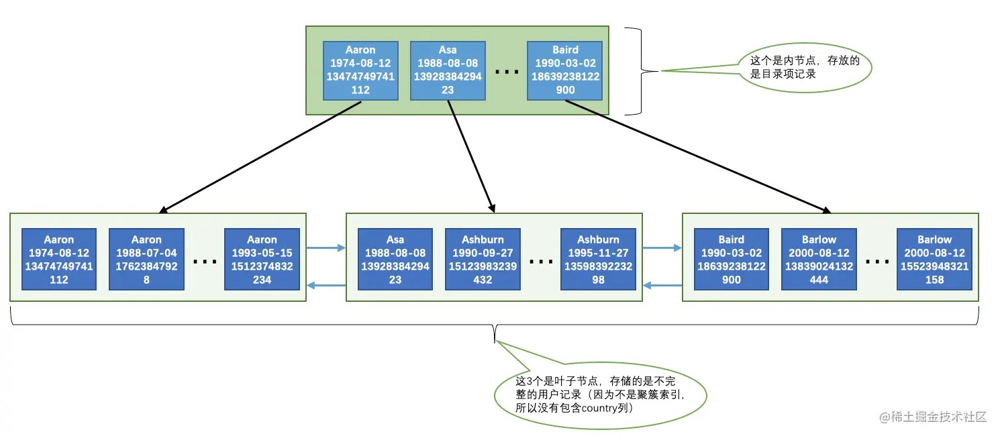

# 07-B+树索引的使用

## 7.1 B+树索引示意图的简化

无。

## 7.2 索引的代价

- 空间上的代价

  每建立一个索引都要建立一棵B+树，B+树的每一个节点都是一个数据页。

- 时间上的代价
  
  每次对表中的数据进行增、删、改操作时，都需要去修改各个B+树索引。

## 7.3 应用B+树索引

介绍几个可能使用B+树索引来进行查询的情况。

先创建一个用来存储人基本信息表：

    CREATE TABLE person_info (
        id int(11) NOT NULL AUTO_INCREMENT,
        name varchar(100) NOT NULL,
        birthday date NOT NULL,
        phone_number char(11) NOT NULL,
        country varchar(100) NOT NULL,
        PRIMARY KEY (id),
        KEY idx_name_birthday_phone_number (name,birthday,phone_number)
    );

这个表注意两点：

- 表的主键id列是自动递增的整数，存储引擎会自动为id列建立聚簇索引。

- 表的二级索引`idx_name_birthday_phone_number`是由3个列组成的联合索引。
  
  这个索引对应的B+树的叶子节点处存储的用户记录只保留name、birthday、phone_number这三个列的值以及主键id的值，并不会保存country列的值。

  这个索引对应的B+树中页面和记录的排序方式就是这样的：
  - 先按照name列的值进行排序。
  - 如果name列的值相同，则按照birthday列的值进行排序。
  - 如果birthday列的值也相同，则按照phone_number的值进行排序。

二级联合索引如图：

### 7.3.1 扫描区间和边界条件

1. 全值匹配
   

搜索条件中的列和索引列一致的话，这种情况就称为全值匹配。

    SELECT * FROM person_info WHERE name = 'Ashburn' AND birthday = '1990-09-27' AND phone_number = '15123983239';

2. 匹配左边的列

搜索条件中只包含索引左边的列。

    SELECT * FROM person_info WHERE name = 'Ashburn';
    SELECT * FROM person_info WHERE name = 'Ashburn' AND birthday = '1990-09-27';

如果想使用联合索引中尽可能多的列，搜索条件中的各个列必须是联合索引中从最左边连续的列。

3. 匹配列前缀

对于字符串类型的索引列，只匹配它的前缀也是可以快速定位记录。

    SELECT * FROM person_info WHERE name LIKE 'As%';

4. 匹配范围值

查找索引列的值在某个范围内的记录。

    SELECT * FROM person_info WHERE name > 'Asa' AND name < 'Barlow';

查询过程是这样的：
- 通过B+树在叶子节点中找到第一条name值大于Asa的二级索引记录，读取该记录的主键值进行回表操作，获得对应的聚簇索引记录后发送给客户端。
- 根据上一步找到的记录，沿着记录所在的链表向后查找（同一页面中的记录使用单向链表连接起来，数据页之间用双向链表连接起来）下一条二级索引记录，判断该记录是否符合name < 'Barlow'条件，如果符合，则进行回表操作后发送至客户端。
- 重复上一步骤，直到某条二级索引记录不符合name <'Barlow'条件为止。

5. 精确匹配某一列并范围匹配另外一列

如果左边的列是精确查找，则右边的列可以进行范围查找。

    SELECT * FROM person_info WHERE name = 'Ashburn' AND birthday > '1980-01-01' AND birthday < '2000-12-31';
    SELECT * FROM person_info WHERE name = 'Ashburn' AND birthday = '1980-01-01' AND phone_number > '15100000000';

### 7.3.2 索引用于排序

一般情况下，查询结果排序，只能把记录都加载到内存中再排序，如果查询的结果集太大以至于不能在内存中进行排序的话，还可能暂时借助磁盘的空间来存放中间结果。

在MySQL中，把这种在内存中或者磁盘上进行排序的方式统称为文件排序（filesort），如果使用磁盘排序就非常慢了。

如果ORDER BY子句里使用到了索引列，就有可能省去在内存或文件中排序的步骤。

    SELECT * FROM person_info ORDER BY name, birthday, phone_number LIMIT 10;

这个查询的结果集的排序和联合索引的规则是一致的，所以直接从索引中提取数据，然后进行回表操作取出该索引中不包含的列就好了。

**使用联合索引进行排序注意事项**

对于联合索引，ORDER BY的子句后边的列的顺序也必须按照索引列的顺序给出。

同理，使用索引左边的列排序也能用到联合索引，或者联合索引左边列的值为常量，也可以使用后边的列进行排序。

    SELECT * FROM person_info ORDER BY name LIMIT 10;
    SELECT * FROM person_info ORDER BY name, birthday LIMIT 10;
    SELECT * FROM person_info WHERE name = 'A' ORDER BY birthday, phone_number LIMIT 10;

**不可以使用索引进行排序的几种情况**

- ASC、DESC混用

如下这种混用的排序方式不会使用索引排序：

    SELECT * FROM person_info ORDER BY name ASC, birthday DESC LIMIT 10;

- 排序列包含非同一个索引的列

如果用来排序的多个列不是一个索引里的，也不能使用索引进行排序：

    SELECT * FROM person_info ORDER BY name, country LIMIT 10;

- 排序列使用了复杂的表达式

要想使用索引进行排序操作，必须保证索引列是以单独列的形式出现，而不是修饰过的形式：

    SELECT * FROM person_info ORDER BY UPPER(name) LIMIT 10;

### 7.3.3 索引用于分组

下边这个分组查询：

    SELECT name, birthday, phone_number, COUNT(*) FROM person_info GROUP BY name, birthday, phone_number;

这个查询做了3次分组操作：
1. 先把记录按照name值进行分组。
2. 将name值相同的分组里的记录再按照birthday的值进行分组。
3. 将上一步中产生的小分组按照phone_number的值分成更小的分组。

分组顺序和我们B+树联合索引中的索引列的顺序是一致的，B+树索引又是按照索引列排好序的，所以可以直接使用B+树索引进行分组。

**使用联合索引进行分组注意事项**

和使用B+树索引进行排序一样，分组列的顺序也需要和索引列的顺序一致，也可以只使用索引列中左边的列进行分组。

    SELECT name, COUNT(*) FROM person_info GROUP BY name;
    SELECT name, birthday, COUNT(*) FROM person_info GROUP BY name, birthday;
    SELECT name, birthday, phone_number, COUNT(*) FROM person_info WHERE name = 'A' GROUP BY name, birthday, phone_number;
    SELECT birthday, phone_number, COUNT(*) FROM person_info WHERE name = 'A' GROUP BY birthday, phone_number;

## 7.4 回表的代价

下边这个查询：

    SELECT * FROM person_info WHERE name > 'Asa' AND name < 'Barlow';

两个步骤：
1. 从二级索引中取出符合条件的用户记录。
2. 通过每一条用户记录的主键id字段到聚簇索引中找到完整的用户记录，这就是回表。

两个特点：
1. 会使用到两个B+树索引，一个二级索引，一个聚簇索引。
2. 访问二级索引使用顺序I/O，访问聚簇索引使用随机I/O。

需要回表的记录越多，使用二级索引的性能就越低，查询优化器甚至让某些查询宁愿使用全表扫描也不使用二级索引。

一般限制查询获取较少的记录数会让优化器更倾向于选择使用二级索引 + 回表的方式进行查询，因为回表的记录越少，性能提升就越高。

    SELECT * FROM person_info WHERE name > 'Asa' AND name < 'Barlow' LIMIT 10;

**覆盖索引**

如果查询列表里只包含索引列：

    SELECT name, birthday, phone_number FROM person_info WHERE name > 'Asa' AND name < 'Barlow';

因为只查询name, birthday, phone_number这三个索引列的值，所以在通过二级索引得到结果后就不必到聚簇索引中再查找记录的其他列了，这样就省去了回表操作带来的性能损耗。

这种只需要用到索引的查询方式称为索引覆盖。

## 7.5 更好地创建和使用索引

### 7.5.1 只为用于搜索、排序或分组的列创建索引

也就是说，只为出现在WHERE子句中的列、连接子句中的连接列，或者出现在ORDER BY或GROUP BY子句中的列创建索引。

### 7.5.2 考虑索引列中不重复值的个数

列的基数指的是某一列中不重复数据的个数，列的基数越大，该列中的值越分散，列的基数越小，该列中的值越集中。

所以为基数大的列建立索引，索引的查询效率更高。

### 7.5.3 索引列的类型尽量小

这里所说的类型大小指列的数据类型表示的数据范围的大小，要对某个列建立索引的话，在表示范围允许的情况下，尽量让索引列使用较小的类型，因为：
- 数据类型越小，在查询时进行的比较操作越快
- 数据类型越小，索引占用的存储空间就越少，在一个数据页内就可以放下更多的记录，从而减少磁盘I/O带来的性能损耗，也意味着可以把更多的数据页缓存在内存中，从而加快读写效率。

这个建议对于表的主键来说更加适用，因为不仅是聚簇索引中会存储主键值，其他所有的二级索引的节点处都会存储一份记录的主键值，如果主键适用更小的数据类型，也就意味着节省更多的存储空间和更高效的I/O。

### 7.5.4 为列前缀建立索引

只对字符串的前几个字符进行索引，也就是说在二级索引的记录中只保留字符串前几个字符。

这样在查找记录时虽然不能精确的定位到记录的位置，但是能定位到相应前缀所在的位置，然后根据前缀相同的记录的主键值回表查询完整的字符串值，再对比就好了。

这样只在B+树中存储字符串的前几个字符的编码，既节约空间，又减少了字符串的比较时间，还大概能解决排序的问题。

这种只索引字符串值的前缀的策略是非常鼓励的，尤其是在字符串类型能存储的字符比较多的时候。

**索引列前缀对排序的影响**

如果二级索引中使用了索引列前缀，因为索引中不包含完整的列信息，所以无法对完整的列进行排序，也就是使用索引列前缀的方式无法支持使用索引排序，只能用文件排序。

### 7.5.5 覆盖索引

无。

### 7.5.6 让索引列以列名的形式在搜索条件中单独出现

如果索引列不是以单独列的形式出现，而是以某个表达式，或者函数调用形式出现的话，是用不到索引的。

### 7.5.7 新插入记录时主键大小对效率的影响

使用InnoDB存储引擎的表中的记录实际上都是存储在聚簇索引的叶子节点的，记录又是存储在数据页中的，数据页和记录又是按照记录主键值从小到大的顺序进行排序的。

如果插入的记录的主键值是依次增大的话，那每插满一个数据页就换到下一个数据页继续插。  
如果插入的记录的主键值忽大忽小的话，会发生页面分裂和记录移动，会损耗性能。  
所以建议让主键具有AUTO_INCREMENT，让存储引擎自己为表生成自增主键。

### 7.5.8 冗余和重复索引

要尽可能避免重复创建没必要的索引。

    CREATE TABLE person_info(
        id INT UNSIGNED NOT NULL AUTO_INCREMENT,
        name VARCHAR(100) NOT NULL,
        birthday DATE NOT NULL,
        phone_number CHAR(11) NOT NULL,
        country varchar(100) NOT NULL,
        PRIMARY KEY (id),
        KEY idx_name_birthday_phone_number (name(10), birthday, phone_number),
        KEY idx_name (name(10))
    );

通过`idx_name_birthday_phone_number`索引就可以对`name`列进行快速搜索，再创建一个专门针对`name`列的索引就没必要了，这个索引只会增加维护成本。

# 完