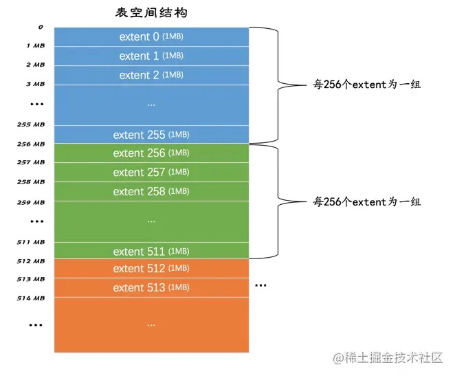
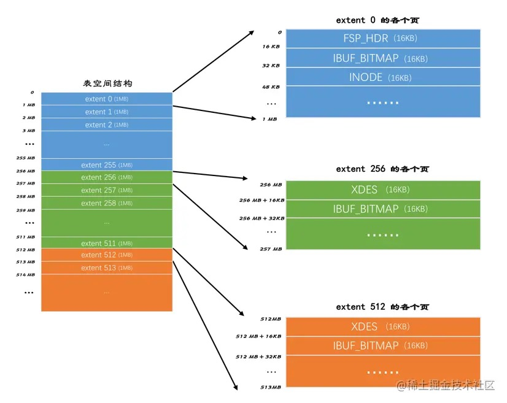
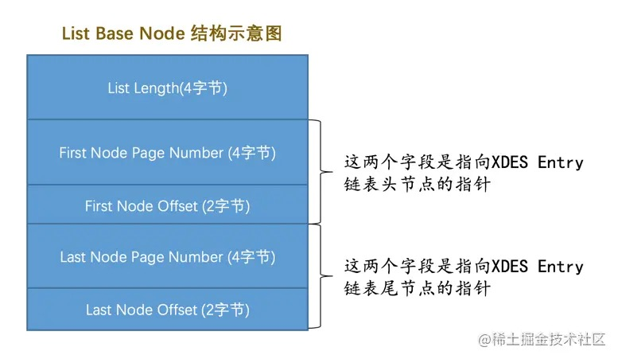
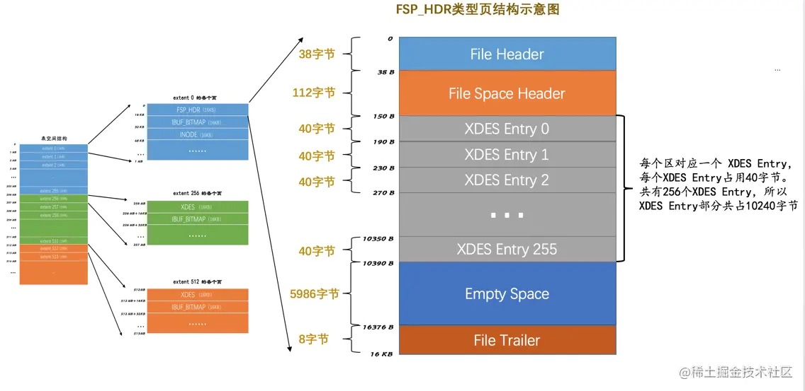
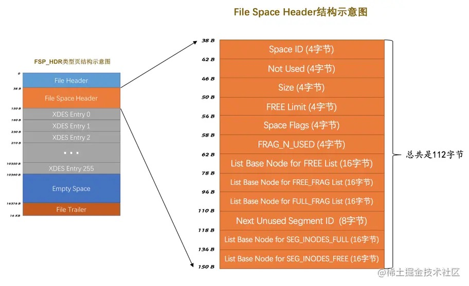
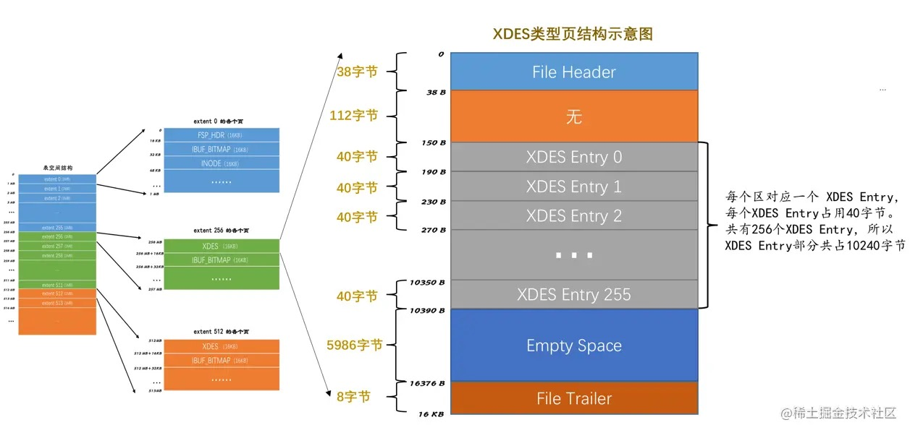
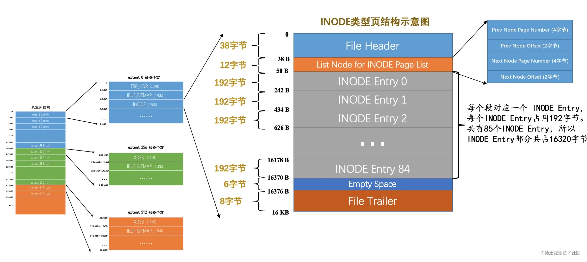
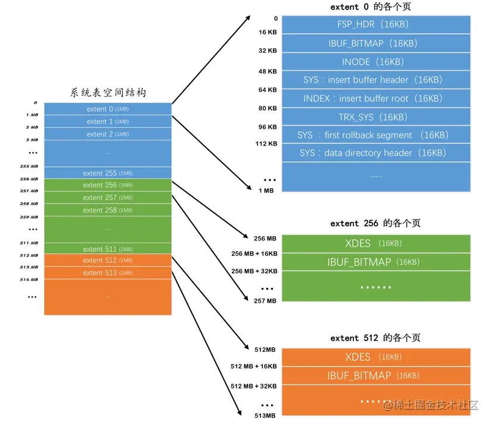
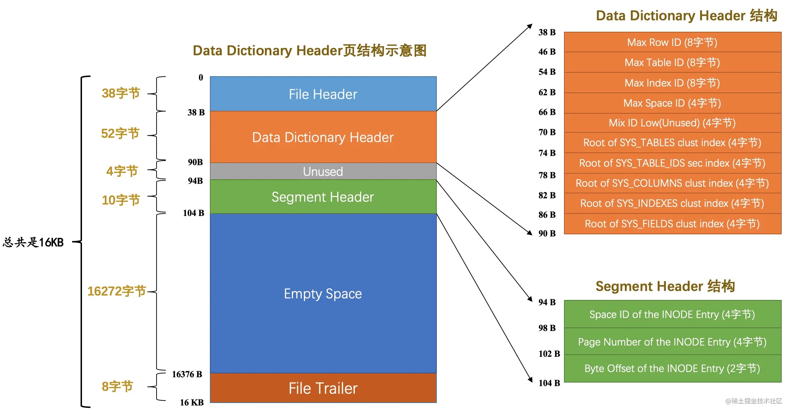
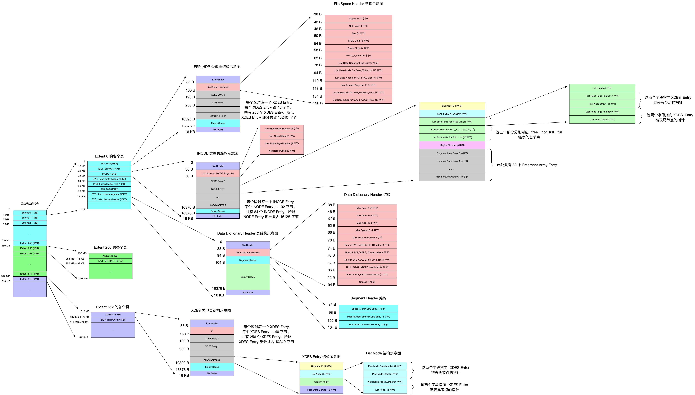

# 09-InnoDB的表空间

表空间是一个抽象的概念。  
对于系统表空间来说，对应着文件系统中一个或多个实际文件。  
对于每个独立表空间来说，对应着文件系统中一个名为`表名.ibd`的实际文件。  
可以把表空间想象成被切分为许许多多个页的池子。

## 9.1 回忆一些旧知识

### 9.1.1 页面类型

InnoDB以页为单位管理存储空间，聚簇索引和二级索引都是以B+树的形式保存到表空间的，B+树的节点就是数据页，数据页的类型名是：`FIL_PAGE_INDEX`。

InnoDB为了不同的目的设计了不同类型的页面：

| 类型名称 | 十六进制 | 描述 |
| ----------------------- | ------ | --------------- |
| FIL_PAGE_TYPE_ALLOCATED | 0x0000 | 最新分配，还没使用 |
| FIL_PAGE_UNDO_LOG       | 0x0002 | Undo日志页 |
| FIL_PAGE_INODE          | 0x0003 | 段信息节点 |
| FIL_PAGE_IBUF_FREE_LIST | 0x0004 | Insert Buffer空闲列表 |
| FIL_PAGE_IBUF_BITMAP    | 0x0005 | Insert Buffer位图 |
| FIL_PAGE_TYPE_SYS       | 0x0006 | 系统页 |
| FIL_PAGE_TYPE_TRX_SYS   | 0x0007 | 事务系统数据 |
| FIL_PAGE_TYPE_FSP_HDR   | 0x0008 | 表空间头部信息 |
| FIL_PAGE_TYPE_XDES      | 0x0009 | 扩展描述页 |
| FIL_PAGE_TYPE_BLOB      | 0x000A | 溢出页 |
| FIL_PAGE_INDEX          | 0x45BF | 索引页，也就是我们所说的`数据页` |

### 9.1.2 页面通用部分

任何类型的页都会包含这两个部分：
- `File Header`：记录页面的一些通用信息
- `File Trailer`：校验页是否完整，保证从内存到磁盘刷新时内容的一致性。

`File Header` 的各个组成部分：

| 名称                             | 占用空间大小 | 描述                                                         |
| -------------------------------- | ------------ | ------------------------------------------------------------ |
| FIL_PAGE_SPACE_OR_CHKSUM         | `4`字节      | 页的校验和（checksum值）                                     |
| FIL_PAGE_OFFSET                  | `4`字节      | 页号                                                         |
| FIL_PAGE_PREV                    | `4`字节      | 上一个页的页号                                               |
| FIL_PAGE_NEXT                    | `4`字节      | 下一个页的页号                                               |
| FIL_PAGE_LSN                     | `8`字节      | 页面被最后修改时对应的日志序列位置（英文名是：Log Sequence Number） |
| FIL_PAGE_TYPE                    | `2`字节      | 该页的类型                                                   |
| FIL_PAGE_FILE_FLUSH_LSN          | `8`字节      | 仅在系统表空间的一个页中定义，代表文件至少被刷新到了对应的LSN值 |
| FIL_PAGE_ARCH_LOG_NO_OR_SPACE_ID | `4`字节      | 页属于哪个表空间                                             |

强调几点：
- 表空间中的每一个页都对应着一个页号，页号由4个字节组成，也就是32个比特位，所以一个表空间最多可以拥有2³²个页，按照页的默认大小16KB算，一个表空间最多支持64TB的数据。表空间的页号从0开始依次递增。

- 某些类型的页可以组成链表，链表中的页可以不按照物理顺序存储，而是根据`FIL_PAGE_PREV`和`FIL_PAGE_NEXT`来存储上一个页和下一个页的页号。这两个字段主要是为了INDEX类型的页，也就是数据页建立B+树后，为每层节点建立双向链表用的，一般类型的页是不使用这两个字段的。

- 每个页的类型由`FIL_PAGE_TYPE`表示。

## 9.2 独立表空间结构

独立表空间和系统表空间的结构比较相似，系统表空间中还额外包含了一些关于整个系统的信息。

### 9.2.1 区（extent）的概念

表空间中：
- 每64 个页被划分成一个区(16K * 64 = 1MB)。
- 每256个区被划分成一个组(1MB * 256 = 256MB)。

如下图：

这些组的头几个页面的类型都是类似的：

- 第1个组中第1个区的前3个页面的类型是固定的，分别是：
  - FSP_HDR类型（表空间头部信息）：这个类型的页面是用来登记整个表空间的一些整体属性以及本组所有的区的属性，整个表空间只有一个FSP_HDR类型的页面。
  - IBUF_BITMAP类型（Insert Buffer位图）：这个类型的页面是存储本组所有的区的所有页面关于INSERT BUFFER的信息，后面介绍。
  - INODE类型（段信息节点）：这个类型的页面存储了许多称为INODE的数据结构，后面介绍。

- 其余各组中第1个区的前2个页面的类型是固定的，分别是：
  - XDES类型（扩展描述页）：全称是extent descriptor，用来登记本组所有的区的属性（和第1个组中的FSP_HDR类型的页面类似，只不过FSP_HDR类型的页面还会额外存储一些表空间的属性）。
  - IBUF_BITMAP类型：上边介绍过了。

### 9.2.2 段（segment）的概念

每向表中插入一条记录，本质上就是向该表的聚簇索引以及所有二级索引代表的B+树的节点中插入数据。
B+树的每一层中的页都会形成一个双向链表，如果以页为单位来分配存储空间，双向链表相邻的两个页之间的物理位置可能离得非常远。
B+树在执行范围查询时沿着双向链表扫描各个页的时候，如果链表中相邻的两个页物理位置离得非常远，就是随机I/O。
所以应该尽量让链表中相邻的页的物理位置也相邻，这样进行范围查询的时候就是顺序I/O。

所以才有了区的概念，在表中数据量大的时候，为某个索引分配空间的时候会以区为单位分配，甚至在数据非常多的时候可以一次性分配多个连续的区。
虽然可能造成一点空间的浪费，但可以消除很多的随机I/O。

B+树的叶子节点和非叶子节点有自己独有的区。存放叶子节点的区的集合算一个段，存放非叶子节点的区的集合算一个段。
这样一个索引会生成2个段，一个叶子节点段，一个非叶子节点段。

默认情况下一个表只有一个聚簇索引，如果一开始就为索引生成2个段，每个段申请一个区，一个区占用1M存储空间，一共要占用2M存储空间。
为了避免以完整的区为单位分配给某个段对于数据量较小的表造成的存储空间浪费的情况，InnoDB提出了碎片区的概念。
碎片区中的页可以用于不同的目的，有些页用于段A，有些页用于段B，有些页甚至哪个段都不属于。
碎片区直属于表空间，并不属于任何一个段。

所以为某个段分配存储空间的策略是这样的：
- 在刚开插入数据时，段是从某个碎片区以单个页为单位来分配存储空间的。
- 当某个段已经占用了32个碎片区页面之后，就会以完整的区为单位来分配存储空间。

所以更精确的说，段应该是某些零散的页面以及一些完整的区的集合。

除了索引的叶子节点段和非叶子节点段之外，还有为存储一些特殊的数据而定义的段，比如回滚段。
现在只需要知道段是一些零散的页面以及一些完整的区的集合就好了。

### 9.2.3 区的分类

表空间由若干个区组成的，区大体上可以分为4种类型：
- 空闲的区：还没有使用的区。
- 有剩余空间的碎片区：表示碎片区中还有可用的页面。
- 没有剩余空间的碎片区：表示碎片区中的所有页面都被使用，没有空闲页面。
- 附属于某个段的区：一个索引分叶子节点段和非叶子节点段，另外还有一些特殊作用的段，在这些段中的数据量很大时将使用区来作为基本的分配单位。

这4种类型的区对应区的4种状态：

| 状态名    | 含义                  |
| --------- | -------------------- |
| FREE      | 空闲的区              |
| FREE_FRAG | 有剩余空间的碎片区      |
| FULL_FRAG | 没有剩余空间的碎片区    |
| FSEG      | 附属于某个段的区       |

**注意**

处于`FREE`、`FREE_FRAG`、`FULL_FRAG`这三种状态的区都是独立的，直属于表空间。
处于`FSEG`状态的区是附属于某个段的。

InnoDB使用XDES Entry的结构来管理区，每一个区对应一个XDES Entry结构。

XDES Entry是一个40个字节的结构，分为4个部分：
- Segment ID（8字节）
  
  表示该区所在段的编号。前提是该区已经被分配给了某个段，否则无意义。

- List Node（12字节）
  
  这个部分可以将若干个XDES Entry结构串联成一个链表：
  - `Pre Node Page Number`和`Pre Node Offset`的组合就是指向前一个XDES Entry的指针。
  - `Next Node Page Number`和`Next Node Offset`的组合就是指向后一个XDES Entry的指针。

- State（4字节）
  
  区的状态，分别是：`FREE`、`FREE_FRAG`、`FULL_FRAG`和`FSEG`。

- Page State Bitmap（16字节）
  
  这个部分共占用16个字节共128个比特位。一个区默有64个页，每2个比特位对应区中的一个页。第一个位表示对应的页是否是空闲的，第二个比特位还没有用。

**XDES Entry链表**

向某个段中插入数据的过程：
- 当段中数据较少的时候，会使用到如下三个链表：
  - `FREE链表`：状态为FREE的区对应的XDES Entry结构通过List Node连接成的一个链表。
  - `FREE_FRAG链表`：状态为FREE_FRAG的区对应的XDES Entry结构通过List Node连接成的一个链表。
  - `FULL_FRAG链表`：状态为FULL_FRAG的区对应的XDES Entry结构通过List Node连接成的一个链表。
  
  首先从`FREE_FRAG链表`的头节点中取一些零散的页来插入数据，当这个节点对应的区用完时，修改这个节点的State字段的值，然后从`FREE_FRAG链表`中移到`FULL_FRAG链表`中。同理，如果`FREE_FRAG链表`中一个节点都没有，就直接从`FREE链表`中取一个节点移动到`FREE_FRAG链表`，并修改该节点的STATE字段值为FREE_FRAG，然后从这个节点对应的区中获取零散的页。

- 当段中数据已经占满了32个零散的页后，就直接申请完整的区来插入数据了。
  
  每个段中的区对应的XDES Entry结构建立三个链表：
  - `FREE链表`：同一个段中，所有页面都是空闲的区对应的XDES Entry结构会被加入到这个链表。
  - `NOT_FULL链表`：同一个段中，仍有空闲空间的区对应的XDES Entry结构会被加入到这个链表。
  - `FULL链表`：同一个段中，已经没有空闲空间的区对应的XDES Entry结构会被加入到这个链表。

  再次强调一遍，每一个索引都对应两个段（叶子节点段和非叶子节点段），每个段都会维护上述的3个链表。

举例：

    CREATE TABLE t (
        c1 INT NOT NULL AUTO_INCREMENT,
        c2 VARCHAR(100),
        c3 VARCHAR(100),
        PRIMARY KEY (c1),
        KEY idx_c2 (c2)
    )ENGINE=InnoDB;

这个表共有两个索引，一个聚簇索引，一个二级索引，所以这个表共有4个段，每个段都维护段对应的3个链表，共12个链表。
另外还有直属于表空间的3个链表，整个独立表空间共需要维护15个链表。

**链表基节点**

List Base Node 链表基节点。
这个结构中包含了链表的头节点和尾节点的指针以及这个链表中包含了多少节点的信息：

其中：
- List Length：链表一共有多少节点。
- First Node Page Number和First Node Offset：链表头节点在表空间中的位置。
- Last Node Page Number和Last Node Offset：链表的尾节点在表空间中的位置。

一般某个链表对应的List Base Node结构放置在表空间中固定的位置。

**链表小结**

- 表空间由若干个区组成，每个区都对应一个XDES Entry的结构。
- 直属于表空间的区对应的XDES Entry结构可以分成FREE、FREE_FRAG和FULL_FRAG这3个链表。
- 每个段可以附属若干个区，每个段中的区对应的XDES Entry结构可以分成FREE、NOT_FULL和FULL这3个链表。
- 每个链表都对应一个List Base Node的结构，这个结构里记录了链表的头、尾节点的位置以及该链表中包含的节点数。

### 9.2.4 段的结构

段是一个逻辑上的概念，由若干个零散的页面以及一些完整的区组成。
每个段都对应一个INODE Entry结构来记录段中的属性。

其中：
- Segment ID
  
  这个INODE Entry结构对应的段的编号。

- NOT_FULL_N_USED
  
  在NOT_FULL链表中已经使用了多少个页面。

- 3个List Base Node
  
  分别为段的FREE链表、NOT_FULL链表、FULL链表的List Base Node基节点。

- Magic Number：
  
  这个值是用来标记这个INODE Entry是否已经被初始化了。如果这个数字是值的97937874，表明该INODE Entry已经初始化，否则没有被初始化。

- Fragment Array Entry
  
  段是一些零散页面和一些完整的区的集合，每个Fragment Array Entry结构都对应着一个零散的页面，这个结构一共4个字节，表示一个零散页面的页号。
  一共对应32个零散页面。

### 9.2.5 各类型页面详细情况

1. FSP_HDR类型

第一个组的第一个页面，也是表空间的第一个页面，页号为0。
这个页面存储了表空间的一些整体属性以及第一个组内256个区对应的XDES Entry结构。

一个完整的FSP_HDR类型的页面由5个部分组成：

| 名称              | 中文名       | 占用空间大小 | 简单描述                       |
| ----------------- | ------------ | ------------ | ------------------------------ |
| File Header       | 文件头部     | `38`字节     | 页的一些通用信息               |
| File Space Header | 表空间头部   | `112`字节    | 表空间的一些整体属性信息       |
| XDES Entry        | 区描述信息   | `10240`字节  | 存储本组256个区对应的属性信息  |
| Empty Space       | 尚未使用空间 | `5986`字节   | 用于页结构的填充，没啥实际意义 |
| File Trailer      | 文件尾部     | `8`字节      | 校验页是否完整                 |

其中：
- File Header和File Trailer是页的通用信息。
- Empty Space是尚未使用的空间。
- 重点来看File Space Header和XDES Entry这两个部分。

**File Space Header部分**

这个部分用来存储表空间的一些整体属性。

| 名称 | 占用空间大小 | 描述 |
| ---- | ---------- | --- |
| Space ID | 4字节 | 表空间的ID |
| Not Used | 4字节 | 这4个字节未被使用，可以忽略 |
| Size | 4字节 | 当前表空间占有的页面数 |
| FREE Limit | 4字节 | 尚未被初始化的最小页号，大于或等于这个页号的区对应的XDES Entry结构都没有被加入FREE链表 |
| Space Flags | 4字节 | 表空间的一些占用存储空间比较小的属性 |
| FRAG_N_USED | 4字节 | FREE_FRAG链表中已使用的页面数量 |
| List Base Node for FREE List | 16字节 | FREE链表的基节点 |
| List Base Node for FREE_FRAG List | 16字节 | FREE_FRAG链表的基节点 |
| List Base Node for FULL_FRAG List | 16字节 | FULL_FRAG链表的基节点 |
| Next Unused Segment ID | 8字节 | 当前表空间中下一个未使用的 Segment ID |
| List Base Node for SEG_INODES_FULL List | 16字节 | SEG_INODES_FULL链表的基节点 |
| List Base Node for SEG_INODES_FREE List | 16字节 | SEG_INODES_FREE链表的基节点 |

其中：
- List Base Node for FREE List、List Base Node for FREE_FRAG List、List Base Node for FULL_FRAG List
  
  直属于表空间的FREE链表的基节点、FREE_FRAG链表的基节点、FULL_FRAG链表的基节点。

- FRAG_N_USED
  
  这个字段表明在FREE_FRAG链表中已经使用的页面数量。

- FREE Limit
  
  该字段表示的页号之前的区都被初始化了，之后的区尚未被初始化。

- Next Unused Segment ID
  
  该字段表明当前表空间中最大的段ID的下一个ID。

- Space Flags
  
  表空间对于一些布尔类型的属性，或者只需几个比特位的属性都放在了这个Space Flags中存储。

  | 标志名称 | 占用的空间（bit） | 描述 |
  | ------- | --------------- | --- |
  | POST_ANTELOPE | 1 | 表示文件格式是否大于ANTELOPE |
  | ZIP_SSIZE | 4 | 表示压缩页面的大小 |
  | ATOMIC_BLOBS | 1 | 表示是否自动把值非常长的字段放到BLOB页里 |
  | PAGE_SSIZE | 4 | 页面大小 |
  | DATA_DIR | 1 | 表示表空间是否是从默认的数据目录中获取的 |
  | SHARED | 1 | 是否为共享表空间 |
  | TEMPORARY | 1 | 是否为临时表空间 |
  | ENCRYPTION | 1 | 表空间是否加密 |
  | UNUSED | 18 | 没有使用到的比特位 |

- List Base Node for SEG_INODES_FULL List 和 List Base Node for SEG_INODES_FREE List
  
  每个段对应的INODE Entry结构会集中存放到一个类型为INODE的页中，如果表空间中的段特别多，则会有多个INODE Entry结构，可能一个页放不下，这些INODE类型的页会组成两种链表：
  - SEG_INODES_FULL链表：该链表中的INODE类型的页面都已经被INODE Entry结构填充满了，没空闲空间存放额外的INODE Entry了。
  - SEG_INODES_FREE链表：该链表中的INODE类型的页面仍有空闲空间来存放INODE Entry结构。

  后面介绍过INODE类型的页之后再回头看这两个链表。

**XDES Entry部分**

一个XDES Entry结构的大小是40字节，一个页面的大小有限，只能存放有限个XDES Entry结构，所以把256个区划分成一组，在每组的第一个页面中存放256个XDES Entry结构。
每个区对应的XDES Entry结构的地址是固定的，所以能很容易确定这些结构的位置。

2. XDES类型

每一个XDES Entry结构对应表空间的一个区，一个XDES Entry结构占用40字节，在区的数量非常多时，一个单独的页就不够存放足够多的XDES Entry结构，所以我们把表空间的区分为了若干个组，每组开头的一个页面记录着本组内所有的区对应的XDES Entry结构。

第一个组的第一个页面（FSP_HDR类型页）有些特殊，除了记录本组中的所有区对应的XDES Entry结构以外，还记录着表空间的一些整体属性。
除去第一个分组以外，之后的每个分组的第一个页面只需要记录本组内所有的区对应的XDES Entry结构即可，这个也就是XDES类型页，结构和FSP_HDR类型也相似：

与FSP_HDR类型的页面对比，除了少了File Space Header部分（记录表空间整体属性的部分）之外，其余的部分是一样一样的。

3. IBUF_BITMAP类型

表空间中每个组的第二个页面的类型都是IBUF_BITMAP，里边记录了一些有关Change Buffer的东东，后续章节介绍。

4. INODE类型

InnoDB为每个索引定义了两个段，而且为某些特殊功能定义了些特殊的段。
每个段对应一个INODE Entry结构，这个结构中记录了关于这个段的相关属性。
INODE类型的页就是为了存储INODE Entry结构而存在的。

| 名称 | 中文名 | 占用空间大小 | 简单描述 |
| ---  | ---- | ---------- | ------ |
| File Header | 文件头部 | 38字节 | 页的一些通用信息 |
| List Node for INODE Page List | 通用链表节点 | 12字节 | 存储上一个INODE页面和下一个INODE页面的指针 |
| INODE Entry | 段描述信息 | 16320字节 |  |
| Empty Space | 尚未使用空间 | 6字节 | 用于页结构的填充，没啥实际意义 |
| File Trailer | 文件尾部 | 8字节 | 校验页是否完整 |

其中：
- INODE Entry部分：
  
  已经详细介绍过，主要包括对应的段内零散页面的地址以及附属于该段的FREE、NOT_FULL和FULL链表的基节点。
  每个INODE Entry结构占用192字节，一个页面里可以存储85个这样的结构。

- List Node for INODE Page List部分：
  
  因为一个表空间中可能存在超过85个段，所以需要额外的INODE类型的页面来存储这些结构。
  为了方便管理这些INODE类型的页面，将这些INODE类型的页面串联成两个不同的链表：
  - SEG_INODES_FULL链表：该链表中的INODE类型的页面中已经没有空闲空间来存储额外的INODE Entry结构了。
  - SEG_INODES_FREE链表：该链表中的INODE类型的页面中还有空闲空间来存储额外的INODE Entry结构了。
  
  这俩个链表就是前面提到过的基节点存储在File Space Header里边的俩个链表，通过基节点可以访问到这两个链表。
  
  每当新创建一个段时，都会创建一个INODE Entry结构与之对应，存储INODE Entry的过程就是这样的：
  - 如果SEG_INODES_FREE链表不为空，直接从该链表中获取一个节点，也就相当于获取到一个仍有空闲空间的INODE类型的页面，然后把该INODE Entry结构放到该页面中。
    当该页面中无剩余空间时，就把该页放到SEG_INODES_FULL链表中。
  - 如果SEG_INODES_FREE链表为空，则需要从表空间的FREE_FRAG链表中申请一个页面，修改该页面的类型为INODE，把该页面放到SEG_INODES_FREE链表中，与此同时把该INODE Entry结构放入该页面。

### 9.2.6 Segment Header结构的运用

一个索引会产生两个段，分别是叶子节点段和非叶子节点段，每个段都会对应一个INODE Entry结构，在B+树的Root页的Page Header中保存了对应关系。

数据页专有的页面头部：

| 名称              | 占用空间大小 | 描述                                                         |
| ----------------- | ------------ | ------------------------------------------------------------ |
| PAGE_N_DIR_SLOTS  | `2`字节      | 在页目录中的槽数量                                           |
| PAGE_HEAP_TOP     | `2`字节      | 还未使用的空间最小地址，也就是说从该地址之后就是`Free Space` |
| PAGE_N_HEAP       | `2`字节      | 本页中的记录的数量（包括最小和最大记录以及标记为删除的记录） |
| PAGE_FREE         | `2`字节      | 第一个已经标记为删除的记录地址（各个已删除的记录通过`next_record`也会组成一个单链表，这个单链表中的记录可以被重新利用） |
| PAGE_GARBAGE      | `2`字节      | 已删除记录占用的字节数                                       |
| PAGE_LAST_INSERT  | `2`字节      | 最后插入记录的位置                                           |
| PAGE_DIRECTION    | `2`字节      | 记录插入的方向                                               |
| PAGE_N_DIRECTION  | `2`字节      | 一个方向连续插入的记录数量                                   |
| PAGE_N_RECS       | `2`字节      | 该页中记录的数量（不包括最小和最大记录以及被标记为删除的记录） |
| PAGE_MAX_TRX_ID   | `8`字节      | 修改当前页的最大事务ID，该值仅在二级索引中定义               |
| PAGE_LEVEL        | `2`字节      | 当前页在B+树中所处的层级                                     |
| PAGE_INDEX_ID     | `8`字节      | 索引ID，表示当前页属于哪个索引                               |
| PAGE_BTR_SEG_LEAF | `10`字节     | B+树叶子段的头部信息，仅在B+树的Root页定义                   |
| PAGE_BTR_SEG_TOP  | `10`字节     | B+树非叶子段的头部信息，仅在B+树的Root页定义                 |

其中的PAGE_BTR_SEG_LEAF和PAGE_BTR_SEG_TOP都占用10个字节，它们其实对应一个叫Segment Header的结构：

| 名称 | 占用字节数 | 描述 |
| ---  | -------- | --- |
| Space ID of the INODE Entry | 4 | INODE Entry结构所在的表空间ID |
| Page Number of the INODE Entry | 4 | INODE Entry结构所在的页面页号 |
| Byte Offset of the INODE Ent | 2 | INODE Entry结构在该页面中的偏移量 |

PAGE_BTR_SEG_LEAF记录着叶子节点段对应的INODE Entry结构的地址是哪个表空间的哪个页面的哪个偏移量。
PAGE_BTR_SEG_TOP记录着非叶子节点段对应的INODE Entry结构的地址是哪个表空间的哪个页面的哪个偏移量。
这样索引和其对应的段的关系就建立起来了。

### 9.2.7 真实表空间对应的文件大小

一开始表空间占用的空间小，因为表里边都没有数据。这些`.ibd`文件是自扩展的，随着表中数据的增多，表空间对应的文件也逐渐增大。

## 9.3 系统表空间

系统表空间的结构和独立表空间基本类似，比独立表空间额外多出一些记录整个系统信息的页面。
MySQL进程只有一个系统表空间，系统表空间的表空间ID（`Space ID`）是`0`。

**系统表空间的整体结构**

系统表空间在表空间开头有许多记录整个系统属性的页面：

系统表空间和独立表空间的前三个页面（页号分别为0、1、2）是一致的，只是页号为3～7的页面是系统表空间特有的：

| 页号 | 页面类型 | 英文描述 | 描述 |
| ---  | ------ | ------- | --- |
| 3 | SYS | Insert Buffer Header | 存储Insert Buffer的头部信息 |
| 4 | INDEX | Insert Buffer Root | 存储Insert Buffer的根页面 |
| 5 | TRX_SYS | Transction System | 事务系统的相关信息 |
| 6 | SYS | First Rollback Segment | 第一个回滚段的页面 |
| 7 | SYS | Data Dictionary Header | 数据字典头部信息 |

除了这几个记录系统属性的页面之外，系统表空间的`extent 1`和`extent 2`这两个区的128个页面被称为`Doublewrite buffer`，也就是双写缓冲区。

上述大部分涉及事务和多版本控制，这里只介绍InnoDB数据字典的知识。

**InnoDB数据字典**

MySQL除了保存用户数据外，还需要保存许多额外的信息，这些数据也称为元数据。
InnoDB定义了一些内部系统表记录这些元数据：

| 表名 | 描述 |
| ---- | --- |
| SYS_TABLES | 整个InnoDB存储引擎中所有的表的信息 |
| SYS_COLUMNS | 整个InnoDB存储引擎中所有的列的信息 |
| SYS_INDEXES | 整个InnoDB存储引擎中所有的索引的信息 |
| SYS_FIELDS | 整个InnoDB存储引擎中所有的索引对应的列的信息 |
| SYS_FOREIGN | 整个InnoDB存储引擎中所有的外键的信息 |
| SYS_FOREIGN_COLS | 整个InnoDB存储引擎中所有的外键对应列的信息 |
| SYS_TABLESPACES | 整个InnoDB存储引擎中所有的表空间信息 |
| SYS_DATAFILES | 整个InnoDB存储引擎中所有的表空间对应文件系统的文件路径信息 |
| SYS_VIRTUAL | 整个InnoDB存储引擎中所有的虚拟生成列的信息 |

这些系统表也被称为数据字典，它们以B+树的形式保存在系统表空间的某些页面中。
其中四个表尤其重要，称之为基本系统表：
1. SYS_TABLES
2. SYS_COLUMNS
3. SYS_INDEXES
4. SYS_FIELDS

**SYS_TABLES表**

| 列名 | 描述 |
| ---- | --- |
| NAME | 表的名称 |
| ID | InnoDB存储引擎中每个表都有一个唯一的ID |
| N_COLS | 该表拥有列的个数 |
| TYPE | 表的类型，记录了一些文件格式、行格式、压缩等信息 |
| MIX_ID | 已过时，忽略 |
| MIX_LEN | 表的一些额外的属性 |
| CLUSTER_ID | 未使用，忽略 |
| SPACE | 该表所属表空间的ID |

这个表有两个索引：
- 以NAME列为主键的聚簇索引
- 以ID列建立的二级索引

**SYS_COLUMNS表**

| 列名 | 描述 |
| ---- | --- |
| TABLE_ID | 该列所属表对应的ID |
| POS | 该列在表中是第几列 |
| NAME | 该列的名称 |
| MTYPE | main data type，主数据类型，就是那堆INT、CHAR、VARCHAR、FLOAT、DOUBLE之类的东东 |
| PRTYPE | precise type，精确数据类型，就是修饰主数据类型的那堆东东，比如是否允许NULL值，是否允许负数啥的 |
| LEN | 该列最多占用存储空间的字节数 |
| PREC | 该列的精度，不过这列貌似都没有使用，默认值都是0 |

这个表只有一个聚集索引：
- 以(TABLE_ID, POS)列为主键的聚簇索引

**SYS_INDEXES表**

| 列名 | 描述 |
| ---- | --- |
| TABLE_ID | 该索引所属表对应的ID |
| ID | InnoDB存储引擎中每个索引都有一个唯一的ID |
| NAME | 该索引的名称 |
| N_FIELDS | 该索引包含列的个数 |
| TYPE | 该索引的类型，比如聚簇索引、唯一索引、更改缓冲区的索引、全文索引、普通的二级索引等等各种类型 |
| SPACE | 该索引根页面所在的表空间ID |
| PAGE_NO | 该索引根页面所在的页面号 |
| MERGE_THRESHOLD | 如果页面中的记录被删除到某个比例，就把该页面和相邻页面合并，这个值就是这个比例 |

这个表只有一个聚集索引：
- 以(TABLE_ID, ID)列为主键的聚簇索引

**SYS_FIELDS表**

| 列名 | 描述 |
| ---- | --- |
| INDEX_ID | 该索引列所属的索引的ID |
| POS | 该索引列在某个索引中是第几列 |
| COL_NAME | 该索引列的名称 |

这个表只有一个聚集索引：
- 以(INDEX_ID, POS)列为主键的聚簇索引

**Data Dictionary Header页面**

通过上述4个基本系统表就可以获取其他系统表以及用户定义的表的所有元数据。

这4个表的元数据信息硬编码到代码中，然后页号为7的页面记录这4个表的聚簇索引和二级索引对应的B+树根页面位置。

这个页面类型为SYS，记录了Data Dictionary Header，也就是数据字典的头部信息。
这个页号还记录了整个InnoDB存储引擎的一些全局属性。

| 名称 | 中文名 | 占用空间大小 | 简单描述 |
| ---- | ----- | ---------- | --- |
| File Header | 文件头部 | 38字节 | 页的一些通用信息 |
| Data Dictionary Header | 数据字典头部信息 | 56字节 | 记录一些基本系统表的根页面位置以及InnoDB存储引擎的一些全局信息 |
| Segment Header | 段头部信息 | 10字节 | 记录本页面所在段对应的INODE Entry位置信息 |
| Empty Space | 尚未使用空间 | 16272字节 | 用于页结构的填充，没啥实际意义 |
| File Trailer | 文件尾部 | 8字节 | 校验页是否完整 |

这个页面里有Segment Header部分，意味着这些有关数据字典的信息当成一个段来分配存储空间，称之为数据字典段。
由于需要记录的数据字典信息非常少（Data Dictionary Header部分仅占用了56字节），所以该段只有一个碎片页，也就是页号为7的这个页。

介绍一下`Data Dictionary Header`各个字段：

- `Max Row ID`：没有定义主键的表会生成`row_id`自增列作为主键。`Max Row ID`表示下一个可用的主键值，所有没有定义主键的表共用（自增字段）。
- `Max Table ID`：下一个可用的表ID（自增字段）。
- `Max Index ID`：下一个可用的索引ID（自增字段）。
- `Max Space ID`：下一个可用的表空间ID（自增字段）。
- `Mix ID Low(Unused)`：这个字段没啥用。
- `Root of SYS_TABLES clust index`：代表`SYS_TABLES`表聚簇索引的根页面的页号。
- `Root of SYS_TABLE_IDS sec index`：代表`SYS_TABLES`表为`ID`列建立的二级索引的根页面的页号。
- `Root of SYS_COLUMNS clust index`：代表`SYS_COLUMNS`表聚簇索引的根页面的页号。
- `Root of SYS_INDEXES clust index`：代表`SYS_INDEXES`表聚簇索引的根页面的页号。
- `Root of SYS_FIELDS clust index`：代表`SYS_FIELDS`表聚簇索引的根页面的页号。
- `Unused`：这4个字节没用。

**information_schema系统数据库**

需要注意用户是不能直接访问InnoDB的这些内部系统表的。
InnoDB在系统数据库`information_schema`中提供了一些以`INNODB_SYS`开头的表：

    mysql> USE information_schema;
    Database changed
    mysql> SHOW TABLES LIKE 'INNODB_SYS%';
    +--------------------------------------------+
    | Tables_in_information_schema (INNODB_SYS%) |
    +--------------------------------------------+
    | INNODB_SYS_DATAFILES                       |
    | INNODB_SYS_VIRTUAL                         |
    | INNODB_SYS_INDEXES                         |
    | INNODB_SYS_TABLES                          |
    | INNODB_SYS_FIELDS                          |
    | INNODB_SYS_TABLESPACES                     |
    | INNODB_SYS_FOREIGN_COLS                    |
    | INNODB_SYS_COLUMNS                         |
    | INNODB_SYS_FOREIGN                         |
    | INNODB_SYS_TABLESTATS                      |
    +--------------------------------------------+
    10 rows in set (0.00 sec)

这些表并不是真正的内部系统表，只是存储引擎启动时会读取内部系统表的数据然后填充到这些表中。
这些表和内部系统表的字段也并不完全一样。

**总结图**

# 完