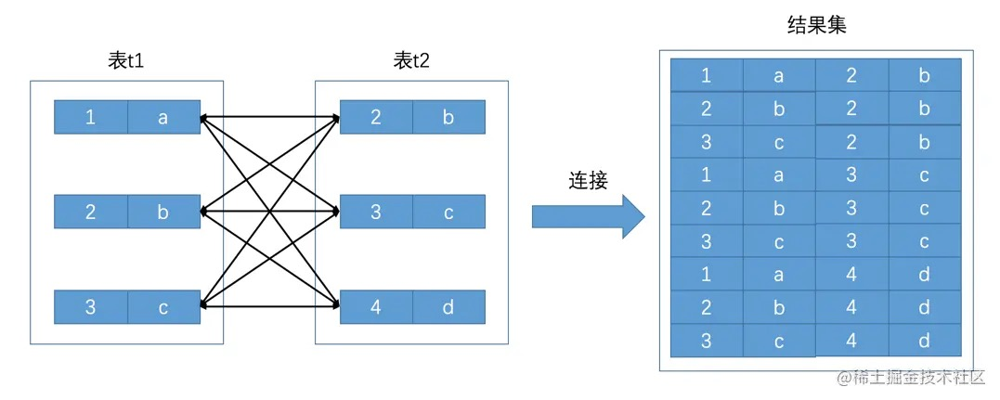
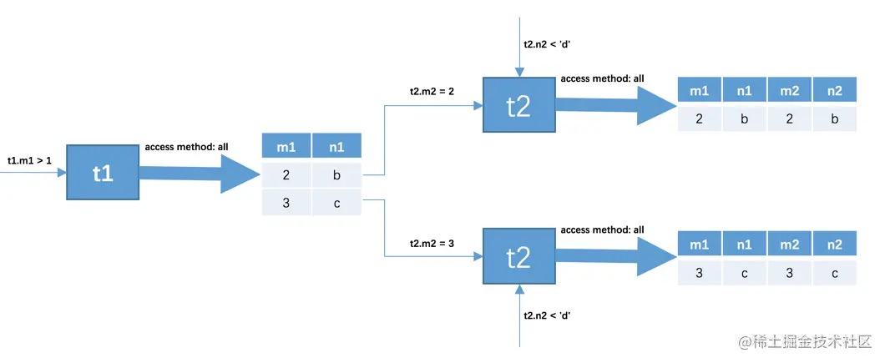
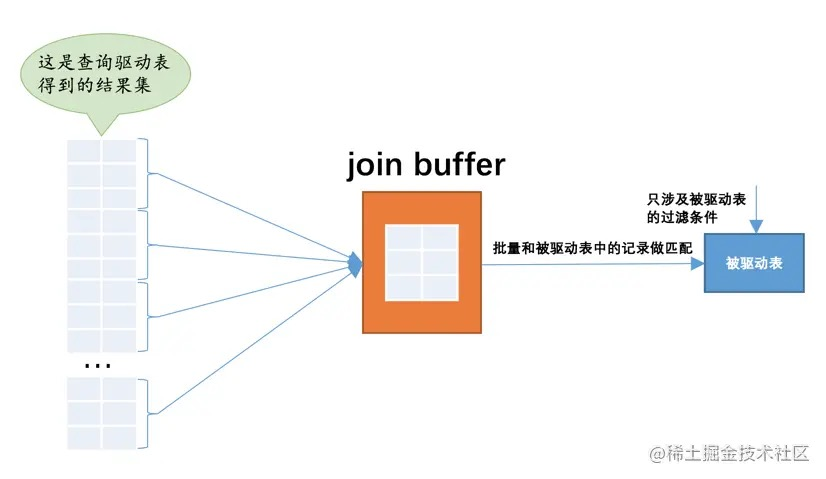

# 11-连接的原理

## 11.1 连接简介

示例表：

    CREATE TABLE t1 (
        m1 int(11) DEFAULT NULL,
        n1 char(1) DEFAULT NULL
    );

    CREATE TABLE t2 (
        m2 int(11) DEFAULT NULL,
        n2 char(1) DEFAULT NULL
    );

    mysql> select * from t1;
    +------+------+
    | m1   | n1   |
    +------+------+
    |    1 | a    |
    |    2 | b    |
    |    3 | c    |
    +------+------+

    mysql> select * from t2;
    +------+------+
    | m2   | n2   |
    +------+------+
    |    2 | b    |
    |    3 | c    |
    |    4 | d    |
    +------+------+

### 11.1.1 连接的本质

连接的本质就是把各个连接表中的记录都取出来依次相互匹配的组合加入结果集并返回给用户。

### 11.1.2 连接过程简介

连接查询中的过滤条件可以分成两种：
- 涉及单表的条件
- 涉及两表的条件

连接查询语句：

    mysql> SELECT * FROM t1, t2 WHERE t1.m1 > 1 AND t1.m1 = t2.m2 AND t2.n2 < 'd';
    +------+------+------+------+
    | m1   | n1   | m2   | n2   |
    +------+------+------+------+
    |    2 | b    |    2 | b    |
    |    3 | c    |    3 | c    |
    +------+------+------+------+

三个过滤条件：
- t1.m1 > 1
- t1.m1 = t2.m2
- t2.n2 < 'd'

这个连接查询的大致执行过程如下：
- 首先确定驱动表，并从驱动表中找出满足条件的记录。  
- 针对驱动表产生的结果集中的每一条记录，分别需要到被驱动表中查找匹配条件的记录。

在两表连接查询中，驱动表只需要访问一次，被驱动表可能被访问多次，取决于驱动表查询结果记录数。

### 11.1.3 内连接和外连接

- 对于内连接的两个表，驱动表中的记录在被驱动表中找不到匹配的记录，该记录不会加入到最后的结果集。
- 对于外连接的两个表，驱动表中的记录即使在被驱动表中没有匹配的记录，也仍然需要加入到结果集。

根据选取驱动表的不同，外连接仍然可以细分为2种：
- 左外连接：选取左侧的表为驱动表。
- 右外连接：选取右侧的表为驱动表。

对于外连接来说，不同地方的过滤条件有不同语义：

- `WHERE`子句中的过滤条件
  
  不论内连接还是外连接，不符合`WHERE`子句中的过滤条件的记录都不会被加入最后的结果集。

- `ON`子句中的过滤条件

  对于外连接驱动表的记录，如果无法在被驱动表中找到匹配`ON`子句中的过滤条件的记录，该记录仍然会被加入到结果集中，对应的被驱动表记录的各个字段使用`NULL`值填充。  
  对于内连接`WHERE`子句和`ON`子句是等价的。

一般情况下，把只涉及单表的过滤条件放到`WHERE`子句中，把涉及两表的过滤条件都放到`ON`子句中，`ON`子句中的过滤条件也称之为`连接条件`。

**左（外）连接的语法**

    SELECT * FROM t1 LEFT JOIN t2 ON 连接条件 [WHERE 普通过滤条件];

对于`LEFT JOIN`类型的连接来说，左边的表是驱动表，右边的表是被驱动表。

**右（外）连接的语法**

    SELECT * FROM t1 RIGHT JOIN t2 ON 连接条件 [WHERE 普通过滤条件];

对于`RIGHT JOIN`类型的连接来说，右边的表是驱动表，左边的表是被驱动表。

**内连接的语法**

内连接和外连接的根本区别就是在驱动表中的记录不符合ON子句中的连接条件时不会把该记录加入到最后的结果集。

    SELECT * FROM t1 INNER JOIN t2 [ON 连接条件] [WHERE 普通过滤条件];
    -- 等价
    SELECT * FROM t1, t2 [WHERE 普通过滤条件];

对于内连接来说，驱动表和被驱动表是可以互换的，并不会影响最后的查询结果。  
对于外连接来说，由于驱动表中的记录即使在被驱动表中找不到符合ON子句条件的记录时也要将其加入到结果集，驱动表和被驱动表不能轻易互换。

## 11.2 连接的原理

### 11.2.1 嵌套循环连接

两表连接，驱动表只会被访问一遍，但被驱动表却要被访问多遍，具体访问几遍取决于对驱动表执行单表查询后的结果集中的记录条数。

这个过程就像是一个嵌套的循环，这种连接执行方式称之为嵌套循环连接，这是最简单也是最笨拙的一种连接查询算法。

### 11.2.2 使用索引加快连接速度

- 从驱动表中找出满足条件的记录可以利用驱动表的索引来加快查询速度。

- 针对驱动表产生的结果集中的每一条记录，再访问被驱动表的时候，可以利用被驱动表的索引来加快查询速度。  
  特殊情况：  
  对被驱动表使用主键值或者唯一二级索引列的值进行等值查找的查询执行方式称为：`eq_ref`。

### 11.2.3 基于块的嵌套循环连接

当驱动表结果集中有多条记录时，每一条记录都会访问一次被驱动表，被驱动表的记录会被加载到内存中和驱动表结果集的一条记录做匹配，之后从内存中清除，周而复始。

如果把被驱动表的记录加载到内存的时候，一次性和多条驱动表中的记录做匹配，就可以大大减少重复从磁盘上加载被驱动表的代价了。

MySQL提出了一个`join buffer`的概念，在执行连接查询前申请的一块固定大小的内存，先把若干条驱动表结果集中的记录装在`join buffer`中，然后每加载一次被驱动表，都和`join buffer`中的多条驱动表记录做匹配，这样可以显著减少被驱动表的I/O代价。

MySQL把这种加入了`join buffer`的嵌套循环连接算法称之为基于块的嵌套连接算法。

这个`join buffer`的大小可以通过启动参数或者系统变量`join_buffer_size`进行配置，默认大小为262144字节（也就是256KB），最小可以设置为128字节。

如果机器的内存也比较大可以尝试调大`join_buffer_size`的值来对连接查询进行优化。

另外驱动表的记录并不是所有列都会被放到`join buffer`中，只有查询列表中的列和过滤条件中的列才会被放到`join buffer`中，所以最好不要把`*`作为查询列表，只把关心的列放到查询列表就好了，这样还可以在join buffer中放置更多的记录。

# 完