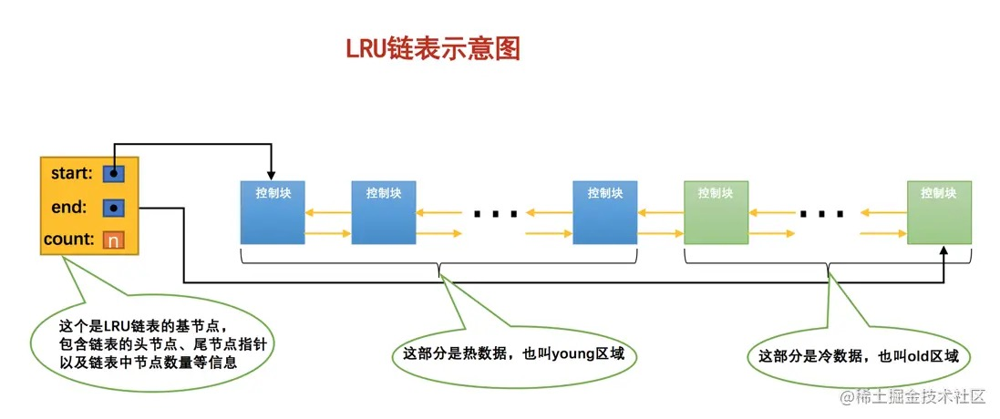

# 17-InnoDB的BufferPool

## 17.1 缓存的重要性

InnoDB存储引擎用户数据和系统数据都是以页的形式存放在表空间中的，表空间对应文件系统上一个或几个实际文件。

InnoDB存储引擎需要访问某个页的数据时，就会把完整的页的数据全部加载到内存中，即使只需要访问页的一条记录，也需要先把整个页的数据加载到内存中。

内存中的页读写访问之后并不立即释放内存空间，而是将其缓存起来，将来有请求再次访问该页面时，就可以省去磁盘IO的开销。

## 17.2 InnoDB的Buffer Pool

### 17.2.1 啥是Buffer Pool

服务器启动时向操作系统申请了一片连续的内存，叫做`Buffer Pool`（`缓冲池`），用来缓存磁盘中的页。

`Buffer Pool`默认大小是128M，可以在服务器启动时配置`innodb_buffer_pool_size`参数设置大小，单位是字节，系统允许的最小值是5M。

    mysql> show variables like 'innodb_buffer_pool_size';
    +-------------------------+-----------+
    | Variable_name           | Value     |
    +-------------------------+-----------+
    | innodb_buffer_pool_size | 134217728 |
    +-------------------------+-----------+

    [server]
    # 设置缓冲池为256M
    innodb_buffer_pool_size = 268435456

### 17.2.2 Buffer Pool内部组成

`Buffer Pool`中默认的缓存页大小和在磁盘上默认的页大小是一样的，都是`16KB`。

`Buffer Pool`中的每个缓存页都对应一个`控制块`，控制块包括页所属的表空间编号、页号、缓存页在`Buffer Pool`中的地址、链表节点信息、一些锁信息以及LSN信息。

每个`控制块`占用的内存大小是相同的，控制块在`Buffer Pool`前边，缓存页在`Buffer Pool`后边，整个`Buffer Pool`对应的内存空间是这样的：

其中的`碎片`是剩余的不够一对控制块和缓存页的大小的空间。

提示：  
每个`控制块`大约占用缓存页大小的5%，我们设置的`innodb_buffer_pool_size`并不包含这部分`控制块`占用的内存空间大小。

### 17.2.3 free链表的管理

所有空闲的缓存页对应的控制块都作为一个节点放到一个链表中，这个链表被称作`free链表`（空闲链表）。

最初的`Buffer Pool`中所有的缓存页都是空闲的，每一个缓存页对应的控制块都会被加入到`free链表`中：

`free链表`有一个基节点，包含链表的头节点地址，尾节点地址，以及当前链表中节点的数量。基节点不在`Buffer Pool`中，而是单独申请的一块内存空间，比较小。

每当需要从磁盘中加载一个页到`Buffer Pool`中时，就从`free链表`中取一个空闲的缓存页，并且把该缓存页对应的控制块的信息填上（该页所在的表空间、页号等信息），然后把该缓存页对应的控制块从从链表中移除。

### 17.2.4 缓冲页的哈希处理

用`表空间号 + 页号`作为`key`，`缓存页`作为`value`创建一个哈希表，需要访问某个页时，先从哈希表中根据`表空间号 + 页号`看看有没有对应的缓存页，如果有直接使用该缓存页，如果没有，从磁盘加载该页到缓冲池中`free链表`中一个空闲的缓存页。

### 17.2.5 flush链表的管理

当修改了`Buffer Pool`中某个缓存页的数据，它就和磁盘上的页不一致了，这样的缓存页被称为`脏页`（`dirty page`）。

`脏页`不会立即被同步到磁盘，而是先放在一个链表中，在后续的某个时间点一起同步到磁盘，这个链表就是`flush链表`。

`flush链表`有一个类似的基节点。

### 17.2.6 LRU链表的管理

- 缓存不够的窘境

  当Buffer Pool大小不够用的时候，需要把一些旧的页面移除。  
  这就需要把哪些缓冲命中率低的页面移除，把缓存命中率高的页面留下。

- 简单的LRU链表
  
  可以再创建一个链表，由于这个链表是为了按照最近最少使用的原则去淘汰缓存页的，所以这个链表可以被称为`LRU链表`（`Least Recently Used`）。
  
  当需要访问某个页时，这样处理`LRU链表`：
  - 如果该页不在`Buffer Pool`中，从磁盘加载到`Buffer Pool`中，并把对应的缓存页的控制块作为节点塞到`LRU链表`的头部。
  - 如果该页已在`Buffer Pool`中，直接把该页对应的控制块移动到`LRU链表`的头部。

  也就只要用到某个缓存页，就把该缓存页调整到`LRU链表`的头部，这样`LRU链表`尾部就是最近最少使用的缓存页。
  
  当`Buffer Pool`用完时，从`LRU链表`的尾部移除缓存页。

- 划分区域的LRU链表
  
  简单`LRU链表`存在两种比较尴尬的情况：

  - 情况一：InnoDB有一个预读策略，分俩种：
  
    - 线性预读  
      InnoDB提供了一个系统变量`innodb_read_ahead_threshold`，如果顺序访问了某个区的页面超过这个系统变量的值，就会触发一次异步读取下一个区中全部的页面到`Buffer Pool`的请求，它是一个全局变量，默认是`56`。
    - 随机预读  
      如果`Buffer Pool`中已经缓存了某个区的`13`个连续的页面，不论这些页面是不是顺序读取的，都会触发一次异步读取本区中所有其他页面到`Buffer Pool`的请求。全局系统变量`innodb_random_read_ahead`控制是否开启该功能，默认是关闭的。
    
    如果这些预读的页后续使用不到，还被放到了`LRU链表`的头部，反而尾部一些可能被用到的页被淘汰掉，会大大降低缓存命中率。

  - 情况二：一些需要扫描全表的查询语句。

    扫描全表将访问该表的所有页，会统统都加载到`Buffer Pool`中，而全表扫描语句执行的频率也不高，每次执行都要把`Buffer Pool中`的缓存页换一次血，这严重的影响到其他查询对`Buffer Pool`的使用，从而大大降低了缓存命中率。

  总结一下上边两种情况：
  - 加载到`Buffer Pool`中的页不一定被用到。
  - 非常多的使用频率偏低的页被同时加载到`Buffer Pool`，会把那些使用频率高的页从`Buffer Pool`中淘汰。

  因为这两种情况，InnoDB把这个`LRU链表`按比例分成两截，分别是：
  - 一部分存储使用频率非常高的缓存页，所以这一部分链表也叫做`热数据`，或者称`young`区域。
  - 一部分存储使用频率不太高的缓存页，所以这一部分链表也叫做`冷数据`，或者称`old`区域。

  

  按照某个比例将`LRU链表`分成两半的，不是某些节点固定是`young`区域的，某些节点固定是`old`区域的，随着程序的运行，某个节点所属的区域也可能发生变化。
  
  可以通过查看`全局`系统变量`innodb_old_blocks_pct`的值来确定`old`区域在`LRU链表`中所占的比例：

      mysql> SHOW VARIABLES LIKE 'innodb_old_blocks_pct';
      +-----------------------+-------+
      | Variable_name         | Value |
      +-----------------------+-------+
      | innodb_old_blocks_pct | 37    |
      +-----------------------+-------+

  默认情况下，`old`区域在LRU链表中所占的比例是`37%`。

  可以系统启动时设置：

      [server]
      innodb_old_blocks_pct = 40

  也可以在服务器运行期间设置：

      SET GLOBAL innodb_old_blocks_pct = 40;

  `LRU链表`分成`young`和`old`区域后，针对上边两种可能降低缓存命中率的情况进行优化：

  - 针对预读的页面可能不进行后续访问情况的优化

    初次加载的缓存页会被放到`old`区域的头部。  
    这样针对预读却不进行后续访问的页面会逐渐从`old`区域逐出，不会影响`young`区域中使用比较频繁的缓存页。

  - 针对全表扫描短时间内访问大量使用频率非常低的页面情况的优化
    
    全表扫描的页面初次加载也会放到`old`区域的头部。  
    全表扫描过程中读取一个页面的每一条记录都算对该页面的一次访问。  
    全表扫描执行频率非常低，但访问一个页面所花费的时间非常少。  

    所以规定：  
    在`old`区域缓存页对应的控制块中记下缓存页第一次访问时间，如果后续的访问时间与第一次访问时间在某个时间间隔内，那么该页面就不从`old`区域移动到`young`区域的头部，否则将它移动到`young`区域的头部。

    这个间隔时间由系统变量`innodb_old_blocks_time`控制：

        mysql> SHOW VARIABLES LIKE 'innodb_old_blocks_time';
        +------------------------+-------+
        | Variable_name          | Value |
        +------------------------+-------+
        | innodb_old_blocks_time | 1000  |
        +------------------------+-------+
    
    默认值是`1000`，它的单位是毫秒，也就是对于从磁盘上被加载到`LRU链表`的`old`区域的某个页来说，如果第一次和最后一次访问该页面的时间间隔小于`1s`该页就不会被加入到`young`区域。  
    很明显在一次全表扫描的过程中，多次访问一个页面中的时间不会超过`1s`。

    该系统变量可以在系统启动时设置，也可以在服务器运行期间设置。  
    如果设置为0，那么第一次访问就会把该页面放到`young`区域的头部。

    综上所述，正是因为将`LRU链表`划分为`young`和`old`区域两个部分，又添加了`innodb_old_blocks_time`这个系统变量，才使得预读机制和全表扫描造成的缓存命中率降低的问题得到了遏制，因为用不到的预读页面以及全表扫描的页面都只会被放到`old`区域，而不影响`young`区域中的缓存页。

- 更进一步优化LRU链表

  对于`young`区域的缓存页，如果每次访问一个缓存页就要把它移到`LRU链表`的头部，开销太大。  
  因为`young`区域的缓存页都是热点数据，没必要频繁的移动到`LRU链表`的头部，所以可以优化成只有被访问的缓存页位于`young`区域的`1/4`的后边，才会被移动到`LRU链表`头部，这样就可以降低调整`LRU链表`的频率，从而提升性能。
  
### 17.2.7 其他的一些链表

其他的先不介绍了。

### 17.2.8 刷新脏页到磁盘

后台有专门的线程每隔一段时间负责把脏页刷新到磁盘。

主要有两种刷新路径：
- 从`LRU链表`的冷数据中刷新一部分页面到磁盘。
  
  后台线程定时从`LRU链表`尾部扫描一些页面，扫描的页面数量可以通过系统变量`innodb_lru_scan_depth`来指定，如果发现脏页，会把它们刷新到磁盘。  
  这种刷新页面的方式被称之为`BUF_FLUSH_LRU`。

- 从`flush链表`中刷新一部分页面到磁盘。
  
  后台线程定时从`flush链表`中刷新一部分页面到磁盘，刷新的速率取决于当时系统是不是很繁忙。  
  这种刷新页面的方式被称之为`BUF_FLUSH_LIST`。

有时后台线程刷新脏页的进度较慢，导致用户线程在准备加载一个磁盘页面时没有可用的缓存页，这时会尝试看看`LRU链表`尾部有没有可以直接释放掉的未修改页面，如果没有则不得不将`LRU链表`尾部的一个脏页同步刷新到磁盘，磁盘交互很慢，这会降低处理用户请求的速度。  
这种刷新单个页面到磁盘中的刷新方式被称之为`BUF_FLUSH_SINGLE_PAGE`。

有时候系统特别繁忙时，也可能出现用户线程批量从`flush链表`中刷新脏页的情况，在处理用户请求过程中去刷新脏页会严重降低处理速度，是一种迫不得已的行为。

### 17.2.9 多个Buffer Pool实例

多线程环境访问`Buffer Pool`中的各种链表都需要加锁处理，所以单一的`Buffer Pool`会影响请求的处理速度。

可以把`Buffer Pool`拆分成若干个小实例，它们都是独立的，独立的去申请内存空间，独立的管理各种链表，这样在多线程并发访问时不会相互影响，从而提高并发处理能力。

服务器启动时通过设置`innodb_buffer_pool_instances`的值来设置`Buffer Pool`实例的个数：

    [server]
    innodb_buffer_pool_instances = 2

每个`Buffer Pool`实例占用的大小：

    innodb_buffer_pool_size/innodb_buffer_pool_instances

`Buffer Pool`实例创建太多，管理各个实例也会浪费性能。

InnoDB规定：  
当`innodb_buffer_pool_size`的值小于`1G`时设置多个实例无效，`InnoDB`会默认把`innodb_buffer_pool_instances`设置为1。

### 17.2.10 innodb_buffer_pool_chunk_size

MySQL5.7.5以及之后的版本支持在服务器运行过程中调整`Buffer Pool`的大小。  
但`Buffer Pool`默认需要是一块连续内存空间，每次重新调整大小，都需要重新向操作系统申请一块连续的内存空间，然后将旧的内容复制到这一块新空间，这是极其耗时的。

MySQL决定不再一次性为某个`Buffer Pool`实例申请一大片连续的内存空间，而是以`chunk`为单位申请空间。  
也就是一个`Buffer Pool`实例由若干个`chunk`组成，一个`chunk`代表一片连续的内存空间，包含了若干缓存页与其对应的控制块.

图中的`Buffer Pool`由2个实例组成，每个实例包含2个`chunk`。

这样在运行期间调整`Buffer Pool`大小时就是以`chunk`为单位增加或者删除内存空间，不需要重新申请一片大的内存然后复制。

这个`chunk`的大小在启动服务器时通过`innodb_buffer_pool_chunk_size`参数指定，默认值是`134217728`，也就是`128M`，并且只能在服务器启动时指定，在服务器运行过程中不可以修改。

### 17.2.11 配置Buffer Pool时的注意事项

- 为保证每一个`Buffer Pool`实例中包含相同数量的`chunk`，
  `innodb_buffer_pool_size`必须是`innodb_buffer_pool_chunk_size` × `innodb_buffer_pool_instances`的整数倍，
  如果不是整数倍服务器会自动调整`innodb_buffer_pool_size`的值为整数倍。
  
      // 128M × 16 = 2G
      // innodb_buffer_pool_size 会被调整为10G
      mysqld --innodb-buffer-pool-size=9G --innodb-buffer-pool-instances=16

- 如果`innodb_buffer_pool_chunk_size` × `innodb_buffer_pool_instances`的值已经大于`innodb_buffer_pool_size`的值，
  那么`innodb_buffer_pool_chunk_size`的值会被服务器自动设置为`innodb_buffer_pool_size`/`innodb_buffer_pool_instances`的值。

      // innodb_buffer_pool_chunk_size 会被调整为2G/16 = 128M
      mysqld --innodb-buffer-pool-size=2G --innodb-buffer-pool-instances=16 --innodb-buffer-pool-chunk-size=256M

### 17.2.12 查看Buffer Pool的状态信息

MySQL提供了`SHOW ENGINE INNODB STATUS`语句查看InnoDB存储引擎运行过程中的状态信息，其中就包括`Buffer Pool`的信息。

    =====================================
    2022-10-04 22:08:29 0x7f3b1bccf700 INNODB MONITOR OUTPUT
    =====================================
    Per second averages calculated from the last 44 seconds
    -----------------
    BACKGROUND THREAD
    -----------------
    srv_master_thread loops: 48305466 srv_active, 0 srv_shutdown, 454 srv_idle
    srv_master_thread log flush and writes: 48304766
    ----------
    SEMAPHORES
    ----------
    OS WAIT ARRAY INFO: reservation count 4849713
    OS WAIT ARRAY INFO: signal count 7087588
    RW-shared spins 0, rounds 16011355, OS waits 4634275
    RW-excl spins 0, rounds 4904427, OS waits 13845
    RW-sx spins 577307, rounds 7103485, OS waits 3186
    Spin rounds per wait: 16011355.00 RW-shared, 4904427.00 RW-excl, 12.30 RW-sx
    ------------------------
    LATEST DETECTED DEADLOCK
    ------------------------
    2022-02-20 17:01:10 0x7f38e737b700
    *** (1) TRANSACTION:
    TRANSACTION 50905880, ACTIVE 0 sec starting index read
    mysql tables in use 1, locked 1
    LOCK WAIT 5 lock struct(s), heap size 1136, 2 row lock(s), undo log entries 2
    MySQL thread id 11281806, OS thread handle 139885278115584, query id 1014495807 10.111.229.181 kifs updating
    UPDATE user_info
    SET point = 5
    WHERE (id = 50338)
    *** (1) HOLDS THE LOCK(S):
    RECORD LOCKS space id 395 page no 238 n bits 552 index user_id of table `kifs`.`user_point_balance` trx id 50905880 lock_mode X locks rec but not gap
    Record lock, heap no 484 PHYSICAL RECORD: n_fields 3; compact format; info bits 0
     0: len 8; hex 000000000000c4a6; asc         ;;
     1: len 3; hex 8fcf9f; asc    ;;
     2: len 8; hex 0000000000008d6d; asc        m;;
    
    *** (1) WAITING FOR THIS LOCK TO BE GRANTED:
    RECORD LOCKS space id 455 page no 617 n bits 200 index PRIMARY of table `kifs`.`user_info` trx id 50905880 lock_mode X locks rec but not gap waiting
    Record lock, heap no 123 PHYSICAL RECORD: n_fields 18; compact format; info bits 0
     0: len 8; hex 000000000000c4a2; asc         ;;
     1: len 6; hex 00000308c31b; asc       ;;
     2: len 7; hex 35000001ba2c64; asc 5    ,d;;
     3: len 8; hex 800000000000c4a6; asc         ;;
     4: len 4; hex 80001d00; asc     ;;
     5: len 4; hex 80001d00; asc     ;;
     6: len 4; hex 80000000; asc     ;;
     7: SQL NULL;
     8: len 4; hex 80000000; asc     ;;
     9: len 5; hex 30312d3031; asc 01-01;;
     10: len 4; hex 00000064; asc    d;;
     11: SQL NULL;
     12: SQL NULL;
     13: SQL NULL;
     14: SQL NULL;
     15: len 1; hex 81; asc  ;;
     16: len 5; hex 99ac28cdbb; asc   (  ;;
     17: len 5; hex 99ac29104a; asc   ) J;;
    
    *** (2) TRANSACTION:
    TRANSACTION 50905883, ACTIVE 0 sec inserting
    mysql tables in use 1, locked 1
    7 lock struct(s), heap size 1136, 3 row lock(s), undo log entries 5
    MySQL thread id 11310421, OS thread handle 139882374084352, query id 1014495837 10.111.229.181 kifs update
    INSERT INTO user_point_balance
     (user_id, expire_time, point_use, point_balance)
    VALUES (50342, '2023-12-31', 0, 100)
    *** (2) HOLDS THE LOCK(S):
    RECORD LOCKS space id 455 page no 617 n bits 200 index PRIMARY of table `kifs`.`user_info` trx id 50905883 lock_mode X locks rec but not gap
    Record lock, heap no 123 PHYSICAL RECORD: n_fields 18; compact format; info bits 0
     0: len 8; hex 000000000000c4a2; asc         ;;
     1: len 6; hex 00000308c31b; asc       ;;
     2: len 7; hex 35000001ba2c64; asc 5    ,d;;
     3: len 8; hex 800000000000c4a6; asc         ;;
     4: len 4; hex 80001d00; asc     ;;
     5: len 4; hex 80001d00; asc     ;;
     6: len 4; hex 80000000; asc     ;;
     7: SQL NULL;
     8: len 4; hex 80000000; asc     ;;
     9: len 5; hex 30312d3031; asc 01-01;;
     10: len 4; hex 00000064; asc    d;;
     11: SQL NULL;
     12: SQL NULL;
     13: SQL NULL;
     14: SQL NULL;
     15: len 1; hex 81; asc  ;;
     16: len 5; hex 99ac28cdbb; asc   (  ;;
     17: len 5; hex 99ac29104a; asc   ) J;;
    
    *** (2) WAITING FOR THIS LOCK TO BE GRANTED:
    RECORD LOCKS space id 395 page no 238 n bits 552 index user_id of table `kifs`.`user_point_balance` trx id 50905883 lock mode S waiting
    Record lock, heap no 484 PHYSICAL RECORD: n_fields 3; compact format; info bits 0
     0: len 8; hex 000000000000c4a6; asc         ;;
     1: len 3; hex 8fcf9f; asc    ;;
     2: len 8; hex 0000000000008d6d; asc        m;;
    
    *** WE ROLL BACK TRANSACTION (1)
    ------------
    TRANSACTIONS
    ------------
    Trx id counter 196368758
    Purge done for trx's n:o < 196368758 undo n:o < 0 state: running but idle
    History list length 2012
    LIST OF TRANSACTIONS FOR EACH SESSION:
    ---TRANSACTION 421366594548376, not started
    0 lock struct(s), heap size 1136, 0 row lock(s)
    ---TRANSACTION 421366594579376, not started
    0 lock struct(s), heap size 1136, 0 row lock(s)
    ---TRANSACTION 421366594573376, not started
    0 lock struct(s), heap size 1136, 0 row lock(s)
    ---TRANSACTION 421366594566376, not started
    0 lock struct(s), heap size 1136, 0 row lock(s)
    ---TRANSACTION 421366594562376, not started
    0 lock struct(s), heap size 1136, 0 row lock(s)
    ---TRANSACTION 421366594551376, not started
    0 lock struct(s), heap size 1136, 0 row lock(s)
    ---TRANSACTION 421366594663376, not started
    0 lock struct(s), heap size 1136, 0 row lock(s)
    ---TRANSACTION 421366594662376, not started
    0 lock struct(s), heap size 1136, 0 row lock(s)
    ---TRANSACTION 421366594660376, not started
    0 lock struct(s), heap size 1136, 0 row lock(s)
    ---TRANSACTION 421366594647376, not started
    0 lock struct(s), heap size 1136, 0 row lock(s)
    ---TRANSACTION 421366594643376, not started
    0 lock struct(s), heap size 1136, 0 row lock(s)
    ---TRANSACTION 421366594639376, not started
    0 lock struct(s), heap size 1136, 0 row lock(s)
    ---TRANSACTION 421366594635376, not started
    0 lock struct(s), heap size 1136, 0 row lock(s)
    ---TRANSACTION 421366594633376, not started
    0 lock struct(s), heap size 1136, 0 row lock(s)
    ---TRANSACTION 421366594626376, not started
    0 lock struct(s), heap size 1136, 0 row lock(s)
    ---TRANSACTION 421366594623376, not started
    0 lock struct(s), heap size 1136, 0 row lock(s)
    ---TRANSACTION 421366594621376, not started
    0 lock struct(s), heap size 1136, 0 row lock(s)
    ---TRANSACTION 421366594617376, not started
    0 lock struct(s), heap size 1136, 0 row lock(s)
    ---TRANSACTION 421366594614376, not started
    0 lock struct(s), heap size 1136, 0 row lock(s)
    ---TRANSACTION 421366594588376, not started
    0 lock struct(s), heap size 1136, 0 row lock(s)
    ---TRANSACTION 421366594578376, not started
    0 lock struct(s), heap size 1136, 0 row lock(s)
    ---TRANSACTION 421366594615376, not started
    0 lock struct(s), heap size 1136, 0 row lock(s)
    ---TRANSACTION 421366594610376, not started
    0 lock struct(s), heap size 1136, 0 row lock(s)
    ---TRANSACTION 421366594609376, not started
    0 lock struct(s), heap size 1136, 0 row lock(s)
    ---TRANSACTION 421366594596376, not started
    0 lock struct(s), heap size 1136, 0 row lock(s)
    ---TRANSACTION 421366594589376, not started
    0 lock struct(s), heap size 1136, 0 row lock(s)
    ---TRANSACTION 421366594560376, not started
    0 lock struct(s), heap size 1136, 0 row lock(s)
    ---TRANSACTION 421366594552376, not started
    0 lock struct(s), heap size 1136, 0 row lock(s)
    ---TRANSACTION 421366594539376, not started
    0 lock struct(s), heap size 1136, 0 row lock(s)
    ---TRANSACTION 421366594673376, not started
    0 lock struct(s), heap size 1136, 0 row lock(s)
    ---TRANSACTION 421366594666376, not started
    0 lock struct(s), heap size 1136, 0 row lock(s)
    ---TRANSACTION 421366594659376, not started
    0 lock struct(s), heap size 1136, 0 row lock(s)
    ---TRANSACTION 421366594658376, not started
    0 lock struct(s), heap size 1136, 0 row lock(s)
    ---TRANSACTION 421366594640376, not started
    0 lock struct(s), heap size 1136, 0 row lock(s)
    ---TRANSACTION 421366594637376, not started
    0 lock struct(s), heap size 1136, 0 row lock(s)
    ---TRANSACTION 421366594576376, not started
    0 lock struct(s), heap size 1136, 0 row lock(s)
    ---TRANSACTION 421366594570376, not started
    0 lock struct(s), heap size 1136, 0 row lock(s)
    ---TRANSACTION 421366594564376, not started
    0 lock struct(s), heap size 1136, 0 row lock(s)
    ---TRANSACTION 421366594619376, not started
    0 lock struct(s), heap size 1136, 0 row lock(s)
    ---TRANSACTION 421366594602376, not started
    0 lock struct(s), heap size 1136, 0 row lock(s)
    ---TRANSACTION 421366594601376, not started
    0 lock struct(s), heap size 1136, 0 row lock(s)
    ---TRANSACTION 421366594584376, not started
    0 lock struct(s), heap size 1136, 0 row lock(s)
    ---TRANSACTION 421366594580376, not started
    0 lock struct(s), heap size 1136, 0 row lock(s)
    ---TRANSACTION 421366594575376, not started
    0 lock struct(s), heap size 1136, 0 row lock(s)
    ---TRANSACTION 421366594577376, not started
    0 lock struct(s), heap size 1136, 0 row lock(s)
    ---TRANSACTION 421366594574376, not started
    0 lock struct(s), heap size 1136, 0 row lock(s)
    ---TRANSACTION 421366594567376, not started
    0 lock struct(s), heap size 1136, 0 row lock(s)
    ---TRANSACTION 421366594675376, not started
    0 lock struct(s), heap size 1136, 0 row lock(s)
    ---TRANSACTION 421366594670376, not started
    0 lock struct(s), heap size 1136, 0 row lock(s)
    ---TRANSACTION 421366594668376, not started
    0 lock struct(s), heap size 1136, 0 row lock(s)
    ---TRANSACTION 421366594665376, not started
    0 lock struct(s), heap size 1136, 0 row lock(s)
    ---TRANSACTION 421366594657376, not started
    0 lock struct(s), heap size 1136, 0 row lock(s)
    ---TRANSACTION 421366594651376, not started
    0 lock struct(s), heap size 1136, 0 row lock(s)
    ---TRANSACTION 421366594650376, not started
    0 lock struct(s), heap size 1136, 0 row lock(s)
    ---TRANSACTION 421366594648376, not started
    0 lock struct(s), heap size 1136, 0 row lock(s)
    ---TRANSACTION 421366594646376, not started
    0 lock struct(s), heap size 1136, 0 row lock(s)
    ---TRANSACTION 421366594645376, not started
    0 lock struct(s), heap size 1136, 0 row lock(s)
    ---TRANSACTION 421366594642376, not started
    0 lock struct(s), heap size 1136, 0 row lock(s)
    ---TRANSACTION 421366594641376, not started
    0 lock struct(s), heap size 1136, 0 row lock(s)
    ---TRANSACTION 421366594599376, not started
    0 lock struct(s), heap size 1136, 0 row lock(s)
    ---TRANSACTION 421366594546376, not started
    0 lock struct(s), heap size 1136, 0 row lock(s)
    ---TRANSACTION 421366594634376, not started
    0 lock struct(s), heap size 1136, 0 row lock(s)
    ---TRANSACTION 421366594632376, not started
    0 lock struct(s), heap size 1136, 0 row lock(s)
    ---TRANSACTION 421366594624376, not started
    0 lock struct(s), heap size 1136, 0 row lock(s)
    ---TRANSACTION 421366594613376, not started
    0 lock struct(s), heap size 1136, 0 row lock(s)
    ---TRANSACTION 421366594607376, not started
    0 lock struct(s), heap size 1136, 0 row lock(s)
    ---TRANSACTION 421366594603376, not started
    0 lock struct(s), heap size 1136, 0 row lock(s)
    ---TRANSACTION 421366594600376, not started
    0 lock struct(s), heap size 1136, 0 row lock(s)
    ---TRANSACTION 421366594598376, not started
    0 lock struct(s), heap size 1136, 0 row lock(s)
    ---TRANSACTION 421366594593376, not started
    0 lock struct(s), heap size 1136, 0 row lock(s)
    ---TRANSACTION 421366594595376, not started
    0 lock struct(s), heap size 1136, 0 row lock(s)
    ---TRANSACTION 421366594591376, not started
    0 lock struct(s), heap size 1136, 0 row lock(s)
    ---TRANSACTION 421366594556376, not started
    0 lock struct(s), heap size 1136, 0 row lock(s)
    ---TRANSACTION 421366594568376, not started
    0 lock struct(s), heap size 1136, 0 row lock(s)
    ---TRANSACTION 421366594549376, not started
    0 lock struct(s), heap size 1136, 0 row lock(s)
    ---TRANSACTION 421366594582376, not started
    0 lock struct(s), heap size 1136, 0 row lock(s)
    ---TRANSACTION 421366594572376, not started
    0 lock struct(s), heap size 1136, 0 row lock(s)
    ---TRANSACTION 421366594630376, not started
    0 lock struct(s), heap size 1136, 0 row lock(s)
    ---TRANSACTION 421366594628376, not started
    0 lock struct(s), heap size 1136, 0 row lock(s)
    ---TRANSACTION 421366594597376, not started
    0 lock struct(s), heap size 1136, 0 row lock(s)
    ---TRANSACTION 421366594554376, not started
    0 lock struct(s), heap size 1136, 0 row lock(s)
    ---TRANSACTION 421366594541376, not started
    0 lock struct(s), heap size 1136, 0 row lock(s)
    ---TRANSACTION 421366594586376, not started
    0 lock struct(s), heap size 1136, 0 row lock(s)
    ---TRANSACTION 421366594585376, not started
    0 lock struct(s), heap size 1136, 0 row lock(s)
    ---TRANSACTION 421366594583376, not started
    0 lock struct(s), heap size 1136, 0 row lock(s)
    ---TRANSACTION 421366594606376, not started
    0 lock struct(s), heap size 1136, 0 row lock(s)
    ---TRANSACTION 421366594592376, not started
    0 lock struct(s), heap size 1136, 0 row lock(s)
    ---TRANSACTION 421366594555376, not started
    0 lock struct(s), heap size 1136, 0 row lock(s)
    ---TRANSACTION 421366594565376, not started
    0 lock struct(s), heap size 1136, 0 row lock(s)
    ---TRANSACTION 421366594558376, not started
    0 lock struct(s), heap size 1136, 0 row lock(s)
    ---TRANSACTION 421366594625376, not started
    0 lock struct(s), heap size 1136, 0 row lock(s)
    ---TRANSACTION 421366594622376, not started
    0 lock struct(s), heap size 1136, 0 row lock(s)
    ---TRANSACTION 421366594559376, not started
    0 lock struct(s), heap size 1136, 0 row lock(s)
    ---TRANSACTION 421366594547376, not started
    0 lock struct(s), heap size 1136, 0 row lock(s)
    ---TRANSACTION 421366594545376, not started
    0 lock struct(s), heap size 1136, 0 row lock(s)
    ---TRANSACTION 421366594571376, not started
    0 lock struct(s), heap size 1136, 0 row lock(s)
    ---TRANSACTION 421366594620376, not started
    0 lock struct(s), heap size 1136, 0 row lock(s)
    ---TRANSACTION 421366594587376, not started
    0 lock struct(s), heap size 1136, 0 row lock(s)
    ---TRANSACTION 421366594605376, not started
    0 lock struct(s), heap size 1136, 0 row lock(s)
    ---TRANSACTION 421366594604376, not started
    0 lock struct(s), heap size 1136, 0 row lock(s)
    ---TRANSACTION 421366594553376, not started
    0 lock struct(s), heap size 1136, 0 row lock(s)
    ---TRANSACTION 421366594550376, not started
    0 lock struct(s), heap size 1136, 0 row lock(s)
    ---TRANSACTION 421366594685376, not started
    0 lock struct(s), heap size 1136, 0 row lock(s)
    ---TRANSACTION 421366594672376, not started
    0 lock struct(s), heap size 1136, 0 row lock(s)
    ---TRANSACTION 421366594540376, not started
    0 lock struct(s), heap size 1136, 0 row lock(s)
    ---TRANSACTION 421366594661376, not started
    0 lock struct(s), heap size 1136, 0 row lock(s)
    ---TRANSACTION 421366594557376, not started
    0 lock struct(s), heap size 1136, 0 row lock(s)
    ---TRANSACTION 421366594594376, not started
    0 lock struct(s), heap size 1136, 0 row lock(s)
    ---TRANSACTION 421366594563376, not started
    0 lock struct(s), heap size 1136, 0 row lock(s)
    ---TRANSACTION 421366594612376, not started
    0 lock struct(s), heap size 1136, 0 row lock(s)
    ---TRANSACTION 421366594649376, not started
    0 lock struct(s), heap size 1136, 0 row lock(s)
    ---TRANSACTION 421366594631376, not started
    0 lock struct(s), heap size 1136, 0 row lock(s)
    ---TRANSACTION 421366594654376, not started
    0 lock struct(s), heap size 1136, 0 row lock(s)
    ---TRANSACTION 421366594644376, not started
    0 lock struct(s), heap size 1136, 0 row lock(s)
    ---TRANSACTION 421366594544376, not started
    0 lock struct(s), heap size 1136, 0 row lock(s)
    ---TRANSACTION 421366594543376, not started
    0 lock struct(s), heap size 1136, 0 row lock(s)
    ---TRANSACTION 421366594542376, not started
    0 lock struct(s), heap size 1136, 0 row lock(s)
    --------
    FILE I/O
    --------
    I/O thread 0 state: waiting for i/o request (insert buffer thread)
    I/O thread 1 state: waiting for i/o request (log thread)
    I/O thread 2 state: waiting for i/o request (read thread)
    I/O thread 3 state: waiting for i/o request (read thread)
    I/O thread 4 state: waiting for i/o request (read thread)
    I/O thread 5 state: waiting for i/o request (read thread)
    I/O thread 6 state: waiting for i/o request (write thread)
    I/O thread 7 state: waiting for i/o request (write thread)
    I/O thread 8 state: waiting for i/o request (write thread)
    I/O thread 9 state: waiting for i/o request (write thread)
    Pending normal aio reads: [0, 0, 0, 0] , aio writes: [0, 0, 0, 0] ,
     ibuf aio reads:, log i/o's:, sync i/o's:
    Pending flushes (fsync) log: 0; buffer pool: 0
    396636610 OS file reads, 142745530 OS file writes, 129913442 OS fsyncs
    0.09 reads/s, 16384 avg bytes/read, 17.50 writes/s, 17.50 fsyncs/s
    -------------------------------------
    INSERT BUFFER AND ADAPTIVE HASH INDEX
    -------------------------------------
    Ibuf: size 1, free list len 215, seg size 217, 4248149 merges
    merged operations:
     insert 4536156, delete mark 277442, delete 24052
    discarded operations:
     insert 0, delete mark 0, delete 0
    Hash table size 1106407, node heap has 479 buffer(s)
    Hash table size 1106407, node heap has 1552 buffer(s)
    Hash table size 1106407, node heap has 625 buffer(s)
    Hash table size 1106407, node heap has 1378 buffer(s)
    Hash table size 1106407, node heap has 1635 buffer(s)
    Hash table size 1106407, node heap has 380 buffer(s)
    Hash table size 1106407, node heap has 1203 buffer(s)
    Hash table size 1106407, node heap has 1900 buffer(s)
    2400.88 hash searches/s, 128.79 non-hash searches/s
    ---
    LOG
    ---
    Log sequence number 82907868007
    Log flushed up to   82907867908
    Pages flushed up to 82729795160
    Last checkpoint at  82729795160
    0 pending log flushes, 0 pending chkp writes
    125805478 log i/o's done, 17.50 log i/o's/second
    ----------------------
    BUFFER POOL AND MEMORY
    ----------------------
    Total large memory allocated 4397727744
    Dictionary memory allocated 11565626
    Buffer pool size   262144
    Free buffers       1029
    Database pages     251963
    Old database pages 92989
    Modified db pages  12820
    Pending reads      0
    Pending writes: LRU 0, flush list 0, single page 0
    Pages made young 42862145, not young 4412850428
    0.18 youngs/s, 4.32 non-youngs/s
    Pages read 396636141, created 4372890, written 15846613
    0.09 reads/s, 0.00 creates/s, 0.00 writes/s
    Buffer pool hit rate 1000 / 1000, young-making rate 0 / 1000 not 0 / 1000
    Pages read ahead 0.00/s, evicted without access 0.00/s, Random read ahead 0.00/s
    LRU len: 251963, unzip_LRU len: 0
    I/O sum[1]:cur[0], unzip sum[0]:cur[0]
    --------------
    ROW OPERATIONS
    --------------
    0 queries inside InnoDB, 0 queries in queue
    0 read views open inside InnoDB
    Process ID=10263, Main thread ID=139886474544896, state: sleeping
    Number of rows inserted 44568651917, updated 69658652, deleted 2314416, read 2132736788419
    1236.84 inserts/s, 16.00 updates/s, 0.00 deletes/s, 95010.50 reads/s
    Number of system rows inserted 129210, updated 7669753, deleted 5, read 12612403
    0.00 inserts/s, 0.09 updates/s, 0.00 deletes/s, 0.14 reads/s
    ----------------------------
    END OF INNODB MONITOR OUTPUT
    ============================

其中`BUFFER POOL AND MEMORY`部分就是缓冲池的状态信息：

    BUFFER POOL AND MEMORY
    ----------------------
    Total large memory allocated 4397727744
    代表Buffer Pool向操作系统申请的连续内存空间大小，包括全部控制块、缓存页、以及碎片的大小。

    Dictionary memory allocated 11565626
    为数据字典信息分配的内存空间大小，注意这个内存空间和Buffer Pool没啥关系，不包括在Total memory allocated中。

    Buffer pool size   262144
    代表该Buffer Pool可以容纳多少缓存页，注意，单位是页！

    Free buffers       1029
    代表当前Buffer Pool还有多少空闲缓存页，也就是free链表中还有多少个节点。

    Database pages     251963
    代表LRU链表中的页的数量，包含young和old两个区域的节点数量。

    Old database pages 92989
    代表LRU链表old区域的节点数量。

    Modified db pages  12820
    代表脏页数量，也就是flush链表中节点的数量。

    Pending reads      0
    正在等待从磁盘上加载到Buffer Pool中的页面数量。
    当准备从磁盘中加载某个页面时，
    会先为这个页面在Buffer Pool中分配一个缓存页以及它对应的控制块，
    然后把这个控制块添加到LRU的old区域的头部，
    但是这个时候真正的磁盘页并没有被加载进来，Pending reads的值会跟着加1。

    Pending writes: LRU 0, flush list 0, single page 0
    LRU 0:          即将从LRU链表中刷新到磁盘中的页面数量。
    flush list 0:   即将从flush链表中刷新到磁盘中的页面数量。
    single page 0:  即将以单个页面的形式刷新到磁盘中的页面数量。

    Pages made young 42862145, not young 4412850428
    young 42862145: 代表LRU链表中曾经从old区域移动到young区域头部的节点数量。
                    一个节点每次只有从old区域移动到young区域头部时才会将Pages made young的值加1，
                    也就是说如果该节点本来就在young区域，由于它符合在young区域1/4后边的要求，
                    下一次访问这个页面时也会将它移动到young区域头部，
                    但这个过程并不会导致Pages made young的值加1。
    not young 4412850428: 在将innodb_old_blocks_time设置的值大于0时，
                          首次访问或者后续访问某个处在old区域的节点时由于不符合时间间隔的限制而不能将其移动到young区域头部时，
                          Page made not young的值会加1。

    0.18 youngs/s, 4.32 non-youngs/s
    0.18 youngs/s: 代表每秒从old区域被移动到young区域头部的节点数量。
    4.32 non-youngs/s: 代表每秒由于不满足时间限制而不能从old区域移动到young区域头部的节点数量。

    Pages read 396636141, created 4372890, written 15846613
    0.09 reads/s, 0.00 creates/s, 0.00 writes/s
    代表读取，创建，写入了多少页。
    后边跟着读取、创建、写入的速率。

    Buffer pool hit rate 1000 / 1000, young-making rate 0 / 1000 not 0 / 1000
    Buffer pool hit rate 1000 / 1000: 表示在过去某段时间，平均访问1000次页面，有多少次该页面已经被缓存到Buffer Pool了。
    young-making rate 0 / 1000: 表示在过去某段时间，平均访问1000次页面，有多少次访问使页面移动到young区域的头部了。
                                这里统计的将页面移动到young区域的头部次数不仅仅包含从old区域移动到young区域头部的次数，
                                还包括从young区域移动到young区域头部的次数（访问某个young区域的节点，只要该节点在young区域的1/4处往后，就会把它移动到young区域的头部）。
    not 0 / 1000: 表示在过去某段时间，平均访问1000次页面，有多少次访问没有使页面移动到young区域的头部。
                  这里统计的没有将页面移动到young区域的头部次数不仅仅包含因为设置了innodb_old_blocks_time系统变量而导致访问了old区域中的节点但没把它们移动到young区域的次数，
                  还包含因为该节点在young区域的前1/4处而没有被移动到young区域头部的次数。

    Pages read ahead 0.00/s, evicted without access 0.00/s, Random read ahead 0.00/s
    Pages read ahead 0.00/s:        每秒钟线性预读页面数。
    evicted without access 0.00/s:  预读页面未从缓冲池访问，每秒被逐出的页面数。
    Random read ahead 0.00/s:       每秒钟随机预读页面数。

    LRU len: 251963, unzip_LRU len: 0
    LRU len: 251963:  代表LRU链表中节点的数量。
    unzip_LRU len: 0: 代表unzip_LRU链表中节点的数量。

    I/O sum[1]:cur[0], unzip sum[0]:cur[0]
    I/O sum:       最近50s读取磁盘页的总数。
    I/O cur:       现在正在读取的磁盘页数量。
    I/O unzip sum: 最近50s解压的页面数量。
    I/O unzip cur: 正在解压的页面数量。
    --------------

## 17.3 总结

- 磁盘太慢，用内存作为缓存很有必要。
- `Buffer Pool`本质上是InnoDB向操作系统申请的一段连续的内存空间，可以通过`innodb_buffer_pool_size`来调整它的大小。
- `Buffer Pool`向操作系统申请的连续内存由`控制块`和`缓存页`组成，每个控制块和缓存页都是一一对应的，
  在填充足够多的控制块和缓存页的组合后，`Buffer Pool`剩余的空间不够填充一组控制块和缓存页，这部分空间不能被使用，也被称为`碎片`。
- InnoDB使用了许多链表来管理`Buffer Pool`。
- `free`链表中每一个节点都代表一个空闲的缓存页，在将磁盘中的页加载到`Buffer Pool`时，会从`free`链表中寻找空闲的缓存页。
- 为了快速定位某个页是否被加载到`Buffer Pool`，使用`表空间号 + 页号`作为`key`，缓存页作为`value`，建立哈希表。
- 在`Buffer Pool`中被修改的页称为`脏页`，脏页并不是立即刷新，而是被加入到`flush`链表中，待之后的某个时刻同步到磁盘上。
- `LRU链表`分为`young`和`old`两个区域，可以通过`innodb_old_blocks_pct`来调节old区域所占的比例。
  首次从磁盘上加载到`Buffer Pool`的页会被放到old区域的头部，在`innodb_old_blocks_time`间隔时间内访问该页不会把它移动到young区域头部。
  在`Buffer Pool`没有可用的空闲缓存页时，会首先淘汰掉old区域的一些页。
- 我们可以通过指定`innodb_buffer_pool_instances`来控制`Buffer Pool`实例的个数，每个`Buffer Pool`实例中都有各自独立的链表，互不干扰。
- 自MySQL 5.7.5版本之后，可以在服务器运行过程中调整`Buffer Pool`大小。每个`Buffer Pool`实例由若干个`chunk`组成，每个`chunk`的大小可以在服务器启动时通过启动参数调整。
- 可以用下边的命令查看`Buffer Pool`的状态信息：

      SHOW ENGINE INNODB STATUS\G

# 完

