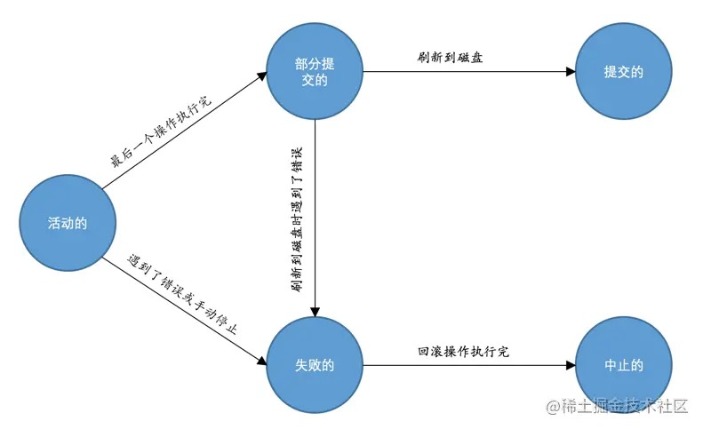

# 18-事务简介

## 18.1 事务的起源

在对某个页面进行读写访问时，都会先把这个页面加载到`Buffer Pool`中，之后如果修改了某个页面，也不会立即把修改同步到磁盘，而只是把这个修改了的页面加到`Buffer Pool`的`flush链表`中，在之后的某个时间点才会刷新到磁盘。

如果在将修改过的页刷新到磁盘之前系统崩溃了，或者只刷新了部分数据到磁盘上系统奔溃了，怎么办？

### 18.1.1 原子性（Atomicity）

现实世界中转账操作是一个不可分割的操作，也就是说要么压根儿就没转，要么转账成功，不能存在中间的状态。

数据库把这种要么全做，要么全不做的规则称之为`原子性`。

### 18.1.2 隔离性（Isolation）

对于现实世界中状态转换对应的某些数据库操作来说，不仅要保证这些操作以`原子性`的方式执行完成，而且要保证其它的状态转换不会影响到本次状态转换，这个规则被称之为`隔离性`。

数据库需要采取一些措施来让访问相同数据的不同状态转换对应的数据库操作的执行顺序有一定规律。

### 18.1.3 一致性（Consistency）

数据库是现实世界的一个映射，如果数据库中的数据全部符合现实世界中的约束，那这些数据就符合`一致性`。

保证数据库中数据的一致性：
- 数据库本身能保证一部分一致性需求。
- 更多的一致性需求靠业务代码保证。

前边的`原子性`和`隔离性`都会对`一致性`产生影响：
- 如果数据库不遵循`原子性`要求，转账转一半不转了，就不符合`一致性`需求。
- 如果数据库不遵循`隔离性`要求，多个转账操作同时操作一个账户，也可能导致不符合`一致性`需求。

数据库操作的`原子性`和`隔离性`都是保证`一致性`的手段。

### 18.1.4 持久性（Durability）

当现实世界的一个状态转换完成后，这个转换的结果将永久的保留，这个规则在数据库中称为`持久性`。

在数据库中`持久性`意味着该转换对应的数据库操作所修改的数据都应该在磁盘上保留下来。

## 18.2 事务的概念

`原子性`（`Atomicity`）、`隔离性`（`Isolation`）、`一致性`（`Consistency`）和`持久性`（`Durability`）简称 `ACID`。

数据库把需要保证`原子性`、`隔离性`、`一致性`和`持久性`的一个或多个数据库操作称之为一个`事务`（`transaction`）。

事务其实对应着一个或多个数据库操作，根据这些操作所执行的不同阶段，事务大致上划分成几个状态：

- 活动的（active）

  事务对应的数据库操作正在执行过程中。

- 部分提交的（partially committed）

  当事务中的最后一个操作执行完成，这些操作都在内存中执行，还没有刷新到磁盘时。

- 失败的（failed）

  当事务处在活动的或者部分提交的状态时，遇到了某些错误而无法继续执行，或者人为停止当前事务的执行，该事务就处在失败的状态。

- 中止的（aborted）

  如果事务执行了半截而变为失败的状态，需要回滚之前的操作，当回滚操作执行完毕时，也就是数据库恢复到了执行事务之前的状态，该事务就处于中止的状态。

- 提交的（committed）

  当一个处在部分提交的状态的事务将修改过的数据都同步到磁盘上之后，该事务处于提交的状态。

当事务处于提交的或者中止的状态时，一个事务的生命周期就结束了。

对于已经提交的事务对数据库所做的所有修改将永久生效。

对于中止状态的事务对数据库所做的所有修改都会被回滚到没执行该事务之前的状态。

## 18.3 MySQL中事务的语法

`事务`的本质只是一系列符合`ACID`特性的数据库操作。

### 18.3.1 开启事务

两种语句之一来开启一个事务：

- BEGIN;

  BEGIN语句代表开启一个事务：

      mysql> BEGIN;
      Query OK, 0 rows affected (0.00 sec)

- START TRANSACTION;

  START TRANSACTION语句代表开启一个事务：

      START TRANSACTION [READ ONLY | READ WRITE | WITH CONSISTENT SNAPSHOT];

      mysql> START TRANSACTION;
      Query OK, 0 rows affected (0.00 sec)

  - READ ONLY - 标识当前事务是一个只读事务(但可以对本事务创建的临时表进行增、删、改操作)。
  - READ WRITE - 标识当前事务是一个读写事务(默认模式)。
  - WITH CONSISTENT SNAPSHOT - 启动一致性读。

  如果不指定事务的访问模式，该事务的访问模式是读写模式。

### 18.3.2 提交事务

提交事务语句很简单：

    mysql> COMMIT;
    Query OK, 0 rows affected (0.00 sec)

### 18.3.3 手动中止事务

手动回滚事务：

    mysql> ROLLBACK;
    Query OK, 0 rows affected (0.00 sec)

需要强调：  
`ROLLBACK`语句是手动回滚事务使用的，如果事务在执行过程中遇到了某些错误而无法继续执行的话，事务自身会自动的回滚。

### 18.3.4 支持事务的存储引擎

MySQL中只有`InnoDB`和`NDB`存储引擎支持支持事务。

### 18.3.5 自动提交

MySQL有一个系统变量`autocommit`：

    mysql> SHOW VARIABLES LIKE 'autocommit';
    +---------------+-------+
    | Variable_name | Value |
    +---------------+-------+
    | autocommit    | ON    |
    +---------------+-------+

它的默认值为`ON`，也就是说默认情况下，如果不显式的使用`START TRANSACTION`或者`BEGIN`语句开启一个事务，那么每一条语句都算是一个独立的事务，这种特性称之为事务的`自动提交`。

关闭自动提交功能的两种方法：
- 显式的的使用`START TRANSACTION`或者`BEGIN`语句开启一个事务。
  
  这样在本次事务提交或者回滚前会暂时关闭掉自动提交的功能。

- 把系统变量`autocommit`的值设置为`OFF`：

      SET autocommit = OFF;
  
  这样写入的多条语句就算是属于同一个事务了，直到显式的使用`COMMIT`语句把这个事务提交，或者显式的使用`ROLLBACK`语句把这个事务回滚。

### 18.3.6 隐式提交

当使用`START TRANSACTION`或者`BEGIN`语句开启一个事务，或者把系统变量`autocommit`设置为`OFF`时，事务就不会自动提交。

但是输入某些语句之后就会悄悄的提交，就像输入了`COMMIT`语句了一样，这种因为某些特殊的语句而导致事务提交的情况称为`隐式提交`。

会导致事务隐式提交的语句包括：

- 定义或修改数据库对象的数据定义语言(DDL)  
  数据库对象指`数据库`、`表`、`视图`、`存储过程`等。当使用`CREATE`、`ALTER`、`DROP`等语句去修改这些数据库对象时，就会隐式的提交前边语句所属于的事务。

- 隐式使用或修改`mysql`数据库中的表  
  当使用`ALTER USER`、`CREATE USER`、`DROP USER`、`GRANT`、`RENAME USER`、`REVOKE`、`SET PASSWORD`等语句时也会隐式的提交前边语句所属于的事务。

- 事务控制或关于锁定的语句  
  当在一个事务还没提交或者回滚时就又使用`START TRANSACTION`或者`BEGIN`语句开启了另一个事务时，会隐式的提交上一个事务。  
  或者当前的`autocommit`系统变量的值为`OFF`，手动把它调为`ON`时，也会隐式的提交前边语句所属的事务。  
  或者使用`LOCK TABLES`、`UNLOCK TABLES`等关于锁定的语句也会隐式的提交前边语句所属的事务。  

- 加载数据的语句  
  使用`LOAD DATA`语句来批量往数据库中导入数据时，也会隐式的提交前边语句所属的事务。

- 关于MySQL复制的一些语句  
  使用`START SLAVE`、`STOP SLAVE`、`RESET SLAVE`、`CHANGE MASTER TO`等语句时也会隐式的提交前边语句所属的事务。

- 其它的一些语句  
  使用`ANALYZE TABLE`、`CACHE INDEX`、`CHECK TABLE`、`FLUSH`、 `LOAD INDEX INTO CACHE`、`OPTIMIZE TABLE`、`REPAIR TABLE`、`RESET`等语句也会隐式的提交前边语句所属的事务。

### 18.3.7 保存点

`保存点`（`savepoint`）就是在事务对应的数据库语句中打几个点，在调用`ROLLBACK`语句时可以指定会滚到哪个点，而不是回到最初的原点。

定义保存点的语法如下：

    SAVEPOINT 保存点名称;

回滚到某个保存点：

    ROLLBACK TO 保存点名称;

如果`ROLLBACK`语句后边不跟保存点名称，会直接回滚到事务执行之前的状态。

删除某个保存点语句：

    RELEASE SAVEPOINT 保存点名称;

# 完