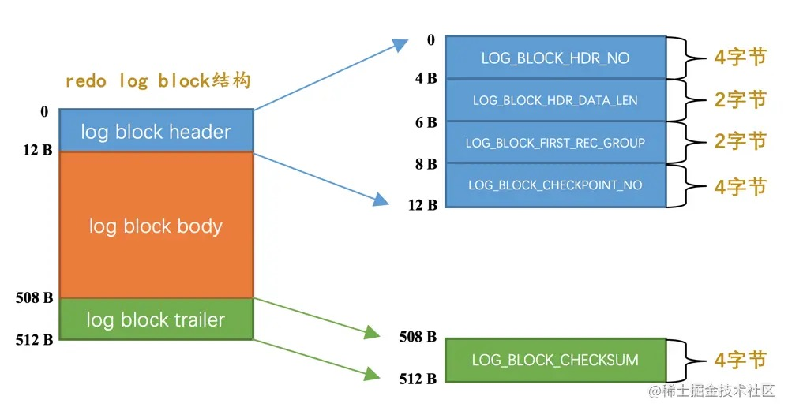

# 19-redo日志

## 19.1 事先说明

接下来会频繁的使用到InnoDB记录行格式、页面格式、索引原理、表空间的组成等基础知识。

## 19.2 redo日志是啥

事务对数据页的操作是在内存的`缓存池`中进行的，为保证事务的`持久性`，需要保证事务提交后即使系统发生了崩溃，事务对数据的更改也不能丢失。

简单做法是在事务提交前把事务修改的所有页面都刷新到磁盘，但有些问题：
- 刷新一个完整的数据页太浪费了(即使只修改页面中很小一部分数据)
- 随机IO刷起来比较慢

其实只需要把事务修改了的内容记录下就好，比如：

    将第0号表空间的100号页面的偏移量为1000处的值更新为2

在事务提交时把修改的内容刷新到磁盘中，即使之后系统崩溃了，重启之后按照这些内容所记录的步骤重新更新一下数据页，该事务对数据库所做的修改就可以恢复出来，这就满足了`持久性`的要求。

因为在系统崩溃重启时需要按照这些内容所记录的步骤重新更新数据页，所以这些内容也被称之为`重做日志`，即`redo日志`。

`redo`日志好处如下：
- 空间非常小
- 是顺序写入磁盘的

## 19.3 redo日志格式

`redo`日志本质是记录事务对数据库做的修改。 

InnoDB针对事务对数据库的不同修改定义了多种类型的`redo`日志。

通用的结构：

其中：
- type - 日志类型
- space ID - 表空间ID
- page number - 页号
- data - 日志具体内容

### 19.3.1 简单的redo日志类型

InnoDB会自动为没有定义主键、也没有定义`Unique`键的表添加一个`row_id`隐藏列作为主键。

这个`row_id`的赋值方式：
- 服务器在内存中维护一个全局变量，每当向包含隐藏列`row_id`的表中插入一条记录时，就会把该变量的值做为新记录的`row_id`列的值，该全局变量自增1。
- 当这个变量的值为`256`的倍数时，会将该变量的值刷新到系统表空间的页号为`7`的页面中`Max Row ID`属性处。
- 当系统启动时会将`Max Row ID`属性加载到内存中，并将该值加上`256`后赋值给内存中维护的全局变量。

这个`Max Row ID`属性占用`8`个字节，当某个事务向包含`row_id`列的表插入一条记录，并且为该记录分配的`row_id`值为`256`的倍数时，就会向系统表空间页号为`7`的页面的相应偏移量处写入`8`个字节的值。这个写入也是写入到`缓冲池`中的页的，需要为这个页面的修改记录一条`redo`日志。

这种对页面的修改是极其简单的，`redo`日志中只需要记录在某个页面的某个偏移量处修改了几个字节的值，以及被修改的内容。

InnoDB把这种极其简单的`redo`日志称之为`物理日志`，并根据在页面中写入数据的多少分了几种不同的类型：
- `MLOG_1BYTE`（type=1）：表示在页面的某个偏移量处写入1个字节的`redo`日志类型。
- `MLOG_2BYTE`（type=2）：表示在页面的某个偏移量处写入2个字节的`redo`日志类型。
- `MLOG_4BYTE`（type=4）：表示在页面的某个偏移量处写入4个字节的`redo`日志类型。
- `MLOG_8BYTE`（type=8）：表示在页面的某个偏移量处写入8个字节的`redo`日志类型。
- `MLOG_WRITE_STRING`（type=30）：表示在页面的某个偏移量处写入一串数据的`redo`日志类型。

`MLOG_8BYTE`的`redo`日志结构：

`MLOG_WRITE_STRING`类型的`redo`日志表示写入一串数据，在日志结构中添加一个`len`字段：

## 19.3.2 复杂一些的redo日志类型

一条`INSERT`语句对`B+`树的更新：
- 表中包含多少个索引，就更新多少棵`B+`树。
- 针对某一棵`B+`树，既可能更新叶子节点页面，也可能更新内节点页面，也可能创建新的页面。

另外往叶子节点的数据页里插入一条记录，该页的一些相关数据都要更新。

总之就是把一条记录插入到一个页面时需要更改的地方非常多。

InnoDB提出了一些新的`redo`日志类型：
- `MLOG_REC_INSERT`（type=9）：表示插入一条使用非紧凑行格式的记录时的redo日志类型（Redundant行格式）。
- `MLOG_COMP_REC_INSERT`（type=38）：表示插入一条使用紧凑行格式的记录时的redo日志类型（Compact、Dynamic以及Compressed行格式）。
- `MLOG_COMP_PAGE_CREATE`（type=58）：表示创建一个存储紧凑行格式记录的页面的redo日志类型。
- `MLOG_COMP_REC_DELETE`（type=42）：表示删除一条使用紧凑行格式记录的redo日志类型。
- `MLOG_COMP_LIST_START_DELETE`（type=44）：表示从某条给定记录开始删除页面中的一系列使用紧凑行格式记录的redo日志类型。
- `MLOG_COMP_LIST_END_DELETE`（type=43）：表示到某条给定记录结束删除页面中的一系列使用紧凑行格式记录的redo日志类型。
- `MLOG_ZIP_PAGE_COMPRESS`（type=51）：表示压缩一个数据页的redo日志类型。

这些类型的`redo`日志包含`物理层面`和`逻辑层面`的意思：
- 物理层面，这些日志都指明了对哪个表空间的哪个页进行了修改。
- 逻辑层面，在系统崩溃重启时，需要调用一些事先准备好的函数，执行完这些函数后才可以将页面恢复成系统崩溃前的样子。

下面是类型为`MLOG_COMP_REC_INSERT`（插入一条使用紧凑行格式的记录）的`redo`日志的结构：

这个类型为`MLOG_COMP_REC_INSERT`的`redo`日志只是把在本页面中插入一条记录所有必备的要素记了下来。

之后系统崩溃重启时，服务器会调用相关向某个页面插入一条记录的那个函数，`redo`日志中的这些数据就是调用这个函数所需的参数。

在调用完该函数后，页面中的各种信息等等的值也就都被恢复到系统崩溃前的样子了。

这就是所谓的逻辑日志的意思。

### 19.3.3 redo日志格式小结

`redo`日志会把事务在执行过程中对数据库所做的所有修改都记录下来，在之后系统崩溃重启后可以把事务所做的任何修改都恢复出来。

## 19.4 Mini-Transaction

### 19.4.1 以组的形式写入redo日志

语句在执行可能会修改若干个页面。

在执行语句的过程中产生的`redo`日志被InnoDB划分成若干个`不可分割的组`。

比如：
- 更新`Max Row ID`属性时产生的`redo`日志是不可分割的。
- 向聚簇索引对应`B+`树的页面中插入一条记录时产生的`redo`日志是不可分割的。
- 向某个二级索引对应`B+`树的页面中插入一条记录时产生的`redo`日志是不可分割的。

InnoDB认为向某个索引对应的`B+`树中插入一条记录的这个过程必须是原子的，不能说插了一半之后就停止了，否则`B+`树是不正确的。

在执行这些需要保证原子性的操作时必须以`组`的形式来记录`redo`日志。

在进行系统崩溃重启恢复时，针对某个组中的`redo`日志，要么把全部的日志都恢复，要么一条也不恢复。

如何分组：
- 需要保证原子性的操作生成多条`redo`日志
  
  在生成的多条`redo`日志后加上一条特殊类型的`redo`日志表示该组`redo`日志结束：  
  `MLOG_MULTI_REC_END`（type=31）：表示该组`redo`日志结束。

- 需要保证原子性的操作生成一条`redo`日志
  
  日志类型`type`字段占用`1`个字节，用第一个比特位表示该需要保证原子性的操作只产生一条`redo`日志，剩余`7`个比特位表示日志类型值。

  如果第一个比特位为`1`，表示该需要保证原子性的操作只产生一条`redo`日志，否则表示该需要保证原子性的操作产生了一系列的`redo`日志。

### 19.4.2 Mini-Transaction的概念

MySQL把对底层页面中的一次原子访问的过程称之为一个`Mini-Transaction`，简称`mtr`。

一个`mtr`包含一组`redo`日志，在进行崩溃恢复时这一组`redo`日志作为一个不可分割的整体。

一个`事务`可以包含若干条`语句`，每一条语句其实是由若干个`mtr`组成，每一个mtr又可以包含若干条`redo`日志：

## 19.5 redo日志的写入过程

### 19.5.1 redo log block

InnoDB把通过`mtr`生成的`redo`日志都放在了大小为`512`字节的页中，我们把这些页称为`block`。

`redo log block`结构：

真正的`redo`日志都是存储到占用`496`字节大小的`log block body`中，`log block header`和`log block trailer`存储一些管理信息。

`log block header`属性：
- `LOG_BLOCK_HDR_NO`：  
  每一个`block`都有一个大于0的唯一标号值。

- `LOG_BLOCK_HDR_DATA_LEN`：  
  表示`block`中已经使用了多少字节，初始值为`12`（`log block body`从第12个字节开始）。  
  随着写入的`redo`日志越来也多，本属性值也跟着增长。  
  如果`log block body`已经被全部写满，那么本属性的值被设置为`512`。  

- `LOG_BLOCK_FIRST_REC_GROUP`：  
  代表该`block`中第一个`mtr`生成的`redo`日志记录组的偏移量。

- `LOG_BLOCK_CHECKPOINT_NO`：  
  表示所谓的`checkpoint`的序号，`checkpoint`是后续内容的重点。

`log block trailer`属性：
- `LOG_BLOCK_CHECKSUM`：表示校验值，用于正确性校验。

### 19.5.2 redo日志缓冲区

写入`redo`日志也不能直接写到磁盘上，服务器启动时就向操作系统申请一块连续内存空间用来存储`redo`日志，也就是`redo日志缓冲区`（`redo log buffer`），简称为`log buffer`。

可以通过启动参数`innodb_log_buffer_size`来指定`log buffer`的大小，该启动参数的默认值为`16MB`。

### 19.5.3 redo日志写入log buffer

向`log buffer`中写入`redo`日志的过程是顺序的。

InnoDB提供了一个称为`buf_free`的全局变量，该变量指明后续写入的`redo`日志应该写入到`log buffer`中的哪个位置。

一个`mtr`执行过程中产生的若干条`redo`日志形成一个不可分割的组，所以每个`mtr`运行过程中产生的日志先暂时存到一个地方，当该`mtr`结束的时候，将过程中产生的一组`redo`日志再全部复制到`log buffer`中。

不同的并发执行的事务中的每个`mtr`执行完成时，就会把该`mtr`生成的一组`redo`日志复制到`log buffer`中，也就是说不同事务的`mtr`可能是交替写入`log buffer`的。

## 19.6 redo日志文件
### 19.6.1 redo日志刷盘时机
### 19.6.2 redo日志文件组
### 19.6.3 redo日志文件格式

## 19.7 log sequence number
### 19.7.1 flushed_to_disk_lsn
### 19.7.2 lsn值和redo日志文件组中的偏移量的对应关系
### 19.7.3 flush链表中的lsn

## 19.8 checkpoint

## 19.9 用户线程批量从flush链表中刷出脏页

## 19.10 查看系统中的各种lsn值

## 19.11 innodb_flush_log_at_trx_commit的用法

## 19.12 崩溃恢复
### 19.12.1 确定恢复的起点
### 19.12.2 确定恢复的终点
### 19.12.3 怎么恢复

## 19.13 遗漏的问题：LOG_BLOCK_HDR_NO是如何计算的

## 19.14 总结

# 完