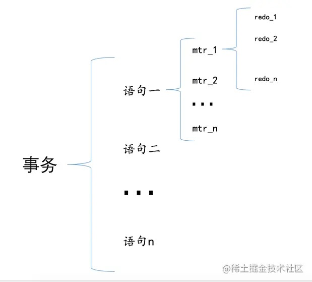
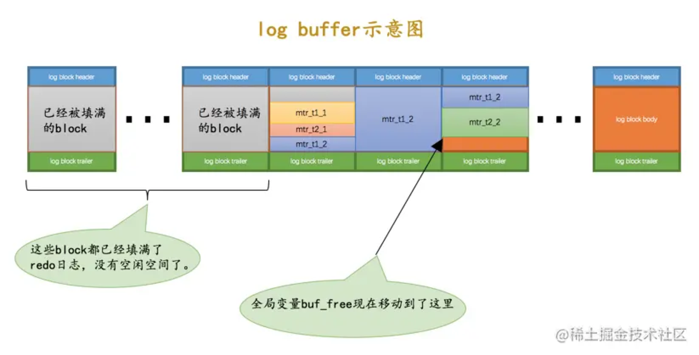

# 19-redo日志

## 19.1 事先说明

接下来会频繁的使用到InnoDB记录行格式、页面格式、索引原理、表空间的组成等基础知识。

## 19.2 redo日志是啥

事务对数据页的操作是在内存的`缓存池`中进行的，为保证事务的`持久性`，需要保证事务提交后即使系统发生了崩溃，事务对数据的更改也不能丢失。

简单做法是在事务提交前把事务修改的所有页面都刷新到磁盘，但有些问题：
- 刷新一个完整的数据页太浪费了(即使只修改页面中很小一部分数据)
- 随机IO刷起来比较慢

其实只需要把事务修改了的内容记录下就好，比如：

    将第0号表空间的100号页面的偏移量为1000处的值更新为2

在事务提交时把修改的内容刷新到磁盘中，即使之后系统崩溃了，重启之后按照这些内容所记录的步骤重新更新一下数据页，该事务对数据库所做的修改就可以恢复出来，这就满足了`持久性`的要求。

因为在系统崩溃重启时需要按照这些内容所记录的步骤重新更新数据页，所以这些内容也被称之为`重做日志`，即`redo日志`。

`redo`日志好处如下：
- 空间非常小
- 是顺序写入磁盘的

## 19.3 redo日志格式

`redo`日志本质是记录事务对数据库做的修改。 

InnoDB针对事务对数据库的不同修改定义了多种类型的`redo`日志。

通用的结构：

其中：
- type - 日志类型
- space ID - 表空间ID
- page number - 页号
- data - 日志具体内容

### 19.3.1 简单的redo日志类型

InnoDB会自动为没有定义主键、也没有定义`Unique`键的表添加一个`row_id`隐藏列作为主键。

这个`row_id`的赋值方式：
- 服务器在内存中维护一个全局变量，每当向包含隐藏列`row_id`的表中插入一条记录时，就会把该变量的值做为新记录的`row_id`列的值，该全局变量自增1。
- 当这个变量的值为`256`的倍数时，会将该变量的值刷新到系统表空间的页号为`7`的页面中`Max Row ID`属性处。
- 当系统启动时会将`Max Row ID`属性加载到内存中，并将该值加上`256`后赋值给内存中维护的全局变量。

这个`Max Row ID`属性占用`8`个字节，当某个事务向包含`row_id`列的表插入一条记录，并且为该记录分配的`row_id`值为`256`的倍数时，就会向系统表空间页号为`7`的页面的相应偏移量处写入`8`个字节的值。这个写入也是写入到`缓冲池`中的页的，需要为这个页面的修改记录一条`redo`日志。

这种对页面的修改是极其简单的，`redo`日志中只需要记录在某个页面的某个偏移量处修改了几个字节的值，以及被修改的内容。

InnoDB把这种极其简单的`redo`日志称之为`物理日志`，并根据在页面中写入数据的多少分了几种不同的类型：
- `MLOG_1BYTE`（type=1）：表示在页面的某个偏移量处写入1个字节的`redo`日志类型。
- `MLOG_2BYTE`（type=2）：表示在页面的某个偏移量处写入2个字节的`redo`日志类型。
- `MLOG_4BYTE`（type=4）：表示在页面的某个偏移量处写入4个字节的`redo`日志类型。
- `MLOG_8BYTE`（type=8）：表示在页面的某个偏移量处写入8个字节的`redo`日志类型。
- `MLOG_WRITE_STRING`（type=30）：表示在页面的某个偏移量处写入一串数据的`redo`日志类型。

`MLOG_8BYTE`的`redo`日志结构：

`MLOG_WRITE_STRING`类型的`redo`日志表示写入一串数据，在日志结构中添加一个`len`字段：

## 19.3.2 复杂一些的redo日志类型

一条`INSERT`语句对`B+`树的更新：
- 表中包含多少个索引，就更新多少棵`B+`树。
- 针对某一棵`B+`树，既可能更新叶子节点页面，也可能更新内节点页面，也可能创建新的页面。

另外往叶子节点的数据页里插入一条记录，该页的一些相关数据都要更新。

总之就是把一条记录插入到一个页面时需要更改的地方非常多。

InnoDB提出了一些新的`redo`日志类型：
- `MLOG_REC_INSERT`（type=9）：表示插入一条使用非紧凑行格式的记录时的redo日志类型（Redundant行格式）。
- `MLOG_COMP_REC_INSERT`（type=38）：表示插入一条使用紧凑行格式的记录时的redo日志类型（Compact、Dynamic以及Compressed行格式）。
- `MLOG_COMP_PAGE_CREATE`（type=58）：表示创建一个存储紧凑行格式记录的页面的redo日志类型。
- `MLOG_COMP_REC_DELETE`（type=42）：表示删除一条使用紧凑行格式记录的redo日志类型。
- `MLOG_COMP_LIST_START_DELETE`（type=44）：表示从某条给定记录开始删除页面中的一系列使用紧凑行格式记录的redo日志类型。
- `MLOG_COMP_LIST_END_DELETE`（type=43）：表示到某条给定记录结束删除页面中的一系列使用紧凑行格式记录的redo日志类型。
- `MLOG_ZIP_PAGE_COMPRESS`（type=51）：表示压缩一个数据页的redo日志类型。

这些类型的`redo`日志包含`物理层面`和`逻辑层面`的意思：
- 物理层面，这些日志都指明了对哪个表空间的哪个页进行了修改。
- 逻辑层面，在系统崩溃重启时，需要调用一些事先准备好的函数，执行完这些函数后才可以将页面恢复成系统崩溃前的样子。

下面是类型为`MLOG_COMP_REC_INSERT`（插入一条使用紧凑行格式的记录）的`redo`日志的结构：

这个类型为`MLOG_COMP_REC_INSERT`的`redo`日志只是把在本页面中插入一条记录所有必备的要素记了下来。

之后系统崩溃重启时，服务器会调用相关向某个页面插入一条记录的那个函数，`redo`日志中的这些数据就是调用这个函数所需的参数。

在调用完该函数后，页面中的各种信息等等的值也就都被恢复到系统崩溃前的样子了。

这就是所谓的逻辑日志的意思。

### 19.3.3 redo日志格式小结

`redo`日志会把事务在执行过程中对数据库所做的所有修改都记录下来，在之后系统崩溃重启后可以把事务所做的任何修改都恢复出来。

## 19.4 Mini-Transaction

### 19.4.1 以组的形式写入redo日志

语句执行可能会修改若干个页面。

在执行语句的过程中产生的`redo`日志被InnoDB划分成若干个`不可分割的组`。

比如：
- 更新`Max Row ID`属性时产生的`redo`日志是不可分割的。
- 向聚簇索引对应`B+`树的页面中插入一条记录时产生的`redo`日志是不可分割的。
- 向某个二级索引对应`B+`树的页面中插入一条记录时产生的`redo`日志是不可分割的。

InnoDB认为向某个索引对应的`B+`树中插入一条记录的这个过程必须是原子的，不能说插了一半之后就停止了，否则`B+`树是不正确的。

在执行这些需要保证原子性的操作时必须以`组`的形式来记录`redo`日志。

在进行系统崩溃重启恢复时，针对某个组中的`redo`日志，要么把全部的日志都恢复，要么一条也不恢复。

如何分组：
- 需要保证原子性的操作生成多条`redo`日志
  
  在生成的多条`redo`日志后加上一条特殊类型的`redo`日志表示该组`redo`日志结束：  
  `MLOG_MULTI_REC_END`（type=31）：表示该组`redo`日志结束。

- 需要保证原子性的操作生成一条`redo`日志
  
  日志类型`type`字段占用`1`个字节，用第一个比特位表示该需要保证原子性的操作只产生一条`redo`日志，剩余`7`个比特位表示日志类型值。

  如果第一个比特位为`1`，表示该需要保证原子性的操作只产生一条`redo`日志，否则表示该需要保证原子性的操作产生了一系列的`redo`日志。

### 19.4.2 Mini-Transaction的概念

MySQL把对底层页面中的一次原子访问的过程称之为一个`Mini-Transaction`，简称`mtr`。

一个`mtr`包含一组`redo`日志，在进行崩溃恢复时这一组`redo`日志作为一个不可分割的整体。

一个`事务`可以包含若干条`语句`，每一条语句其实是由若干个`mtr`组成，每一个mtr又可以包含若干条`redo`日志：

## 19.5 redo日志的写入过程

### 19.5.1 redo log block

InnoDB把通过`mtr`生成的`redo`日志都放在了大小为`512`字节的页中，我们把这些页称为`block`。

`redo log block`结构：

真正的`redo`日志都是存储到占用`496`字节大小的`log block body`中，`log block header`和`log block trailer`存储一些管理信息。

`log block header`属性：
- `LOG_BLOCK_HDR_NO`：  
  每一个`block`都有一个大于0的唯一标号值。

- `LOG_BLOCK_HDR_DATA_LEN`：  
  表示`block`中已经使用了多少字节，初始值为`12`（`log block body`从第12个字节开始）。  
  随着写入的`redo`日志越来也多，本属性值也跟着增长。  
  如果`log block body`已经被全部写满，那么本属性的值被设置为`512`。  

- `LOG_BLOCK_FIRST_REC_GROUP`：  
  代表该`block`中第一个`mtr`生成的`redo`日志记录组的偏移量。

- `LOG_BLOCK_CHECKPOINT_NO`：  
  表示所谓的`checkpoint`的序号，`checkpoint`是后续内容的重点。

`log block trailer`属性：
- `LOG_BLOCK_CHECKSUM`：表示校验值，用于正确性校验。

### 19.5.2 redo日志缓冲区

写入`redo`日志也不能直接写到磁盘上，服务器启动时就向操作系统申请一块连续内存空间用来存储`redo`日志，也就是`redo日志缓冲区`（`redo log buffer`），简称为`log buffer`。

可以通过启动参数`innodb_log_buffer_size`来指定`log buffer`的大小，该启动参数的默认值为`16MB`。

### 19.5.3 redo日志写入log buffer

向`log buffer`中写入`redo`日志的过程是顺序的。

InnoDB提供了一个称为`buf_free`的全局变量，该变量指明后续写入的`redo`日志应该写入到`log buffer`中的哪个位置。

一个`mtr`执行过程中产生的若干条`redo`日志形成一个不可分割的组，所以每个`mtr`运行过程中产生的日志先暂时存到一个地方，当该`mtr`结束的时候，将过程中产生的一组`redo`日志再全部复制到`log buffer`中。

不同的并发执行的事务中的每个`mtr`执行完成时，就会把该`mtr`生成的一组`redo`日志复制到`log buffer`中，也就是说不同事务的`mtr`可能是交替写入`log buffer`的。

## 19.6 redo日志文件

### 19.6.1 redo日志刷盘时机

`mtr`产生的一组`redo`日志在`mtr`结束时会被复制到`log buffer`中。

在下面这些情况下它们会被刷新到磁盘：
- `log buffer`空间不足时。
- 事务提交时。  
  为了保证事务持久性，在事务提交时必须要把对应的`redo`日志刷新到磁盘。
- 将某个脏页刷新到磁盘前，会保证先将该脏页对应的`redo`日志刷新到磁盘。  
  因为`redo`日志是顺序刷新的，所以也会将在其之前产生的`redo`日志也刷新到磁盘。
- 后台线程大约每秒都会刷新一次。
- 正常关闭服务器时。
- 做`checkpoint`时(后续介绍)。
- 其他情况...

### 19.6.2 redo日志文件组

MySQL的数据目录下默认有两个名为`ib_logfile0`和`ib_logfile1`的文件，`log buffer`中的日志默认情况下就是刷新到这两个磁盘文件中。

可以通过下边几个启动参数来调节：
- `innodb_log_group_home_dir` - 指定redo日志文件目录，默认值是数据目录。
- `innodb_log_file_size` - 指定了每个redo日志文件的大小，默认值为`48MB`。
- `innodb_log_files_in_group` - 指定redo日志文件的个数，默认值为`2`，最大值为`100`。

磁盘上的redo日志文件不只一个，是以一个日志文件组的形式出现的。
这些文件以`ib_logfile[数字]`的形式进行命名。
日志写入日志文件组时，依次写入`ib_logfile0`，`ib_logfile1`，`ib_logfile2`...，依此类推，写到最后一个文件再重新转到`ib_logfile0`继续写。

提示：  
采用循环写入的方式向redo日志文件组里写数据，那后写入的redo日志可能覆盖掉前边写的redo日志！所以InnoDB提出了`checkpoint`的概念，稍后介绍。

### 19.6.3 redo日志文件格式

redo日志文件也是由若干个`512`字节大小的`block`组成。

redo日志文件组中的每个文件大小都一样，格式也一样，由两部分组成：
- 前`2048`个字节，也就是前`4`个`block`是用来存储一些管理信息的。
- 从第`2048`字节往后是用来存储`log buffer`中的`block`镜像的。

每个redo日志文件前`2048`个字节，也就是前`4`个特殊`block`的格式：

`log file header`描述该redo日志文件的一些整体属性：

| 属性名                        | 长度（单位：字节）| 描述              |
| ---------------------------- | -------------- | ----------------- |
| LOG_HEADER_FORMAT            |  4             | redo日志的版本 |
| LOG_HEADER_PAD1              |  4             | 字节填充，没实际意义 |
| LOG_HEADER_START_LSN         |  8             | 本redo日志文件开始的`LSN`值，也就是文件偏移量为`2048`字节处对应的`LSN`值 |
| LOG_HEADER_CREATOR           | 32             | 一个字符串，标记本redo日志文件的创建者是谁。正常运行时该值为MySQL的版本号，使用`mysqlbackup`命令创建的redo日志文件的该值为"ibbackup"和创建时间。 |
| LOG_BLOCK_CHECKSUM           |  4             | 本block的校验值，所有block都有，不用关心 |

`checkpoint1`和`checkpoint2`结构一样，记录关于`checkpoint`的一些属性：

| 属性名                        | 长度（单位：字节）| 描述              |
| ---------------------------- | -------------- | ----------------- |
| LOG_CHECKPOINT_NO            | 8              | 服务器做`checkpoint`的编号，每做一次`checkpoint`，该值就加1 |
| LOG_CHECKPOINT_LSN           | 8              | 服务器做`checkpoint`结束时对应的LSN值，系统崩溃恢复时将从该值开始 |
| LOG_CHECKPOINT_OFFSET        | 8              | 上个属性中的`LSN`值在redo日志文件组中的偏移量 |
| LOG_CHECKPOINT_LOG_BUF_SIZE  | 8              | 服务器在做`checkpoint`操作时对应的`log buffer`的大小 |
| LOG_BLOCK_CHECKSUM           | 4              | 本block的校验值，所有block都有，不用关心 |

## 19.7 log sequence number

自系统开始运行，就不断的在修改页面，也就意味着会不断的生成redo日志。

InnoDB为记录已经写入的redo日志量，设计了一个`Log Sequence Number`全局变量，也就是`日志序列号`，简称`lsn`。

InnoDB规定初始的`lsn`值为`8704`。

redo日志是以一个`mtr`生成的一组redo日志为单位写入`log buffer`的，而且是写在了`log block body`处。

`lsn`的增长量是按照实际写入的日志量加上占用的`log block header`和`log block trailer`来计算的。

举例：
- 系统第一次启动后，`buf_free`指向第一个`block`的偏移量为`12`字节（`log block header`的大小）的地方，那么`lsn`值也会跟着增加`12`：

  

- 如果某个`mtr`产生的一组redo日志占用的存储空间较小，待插入的`block`剩余空闲空间够用，`lsn`增长的量就是该`mtr`生成的redo日志占用的字节数：

  

- 如果某个`mtr`产生的一组redo日志占用的存储空间较大，待插入的`block`剩余空闲空间不够，`lsn`增长的量就是该`mtr`生成的redo日志占用的字节数加上额外占用的`log block header`和`log block trailer`的字节数：

  

可以看出，每一组由`mtr`生成的redo日志都有一个唯一的`LSN`值与其对应，`LSN`值越小，redo日志产生的越早。

### 19.7.1 flushed_to_disk_lsn

redo日志是首先写到`log buffer`中，之后才会被刷新到磁盘上的redo日志文件。

全局变量`buf_next_to_write`标记当前`log buffer`中已经有哪些日志被刷新到磁盘了。

InnoDB提出了一个表示刷新到磁盘中的redo日志量的全局变量，称之为`flushed_to_disk_lsn`。

系统第一次启动时，该变量的值和初始的`lsn`值是相同的，都是`8704`。  
随着系统的运行，redo日志被不断写入`log buffer`，但是并不会立即刷新到磁盘，`lsn`的值就和`flushed_to_disk_lsn`的值拉开了差距。

综上所述，当有新的redo日志写入到log buffer时，首先`lsn`的值会增长，但`flushed_to_disk_lsn`不变。  
随后随着不断有log buffer中的日志被刷新到磁盘上，`flushed_to_disk_lsn`的值也跟着增长。  
如果两者的值相同时，说明log buffer中的所有redo日志都已经刷新到磁盘中了。  

### 19.7.2 lsn值和redo日志文件组中的偏移量的对应关系

因为`lsn`的值是代表系统写入的redo日志量的一个总和，一个`mtr`中产生多少日志，`lsn`的值就增加多少（有时候要加上`log block header`和`log block trailer`的大小）。

这样`mtr`产生的日志写到磁盘中时，很容易计算某一个`lsn`值在redo日志文件组中的偏移量：

### 19.7.3 flush链表中的lsn

一个`mtr`代表一次对底层页面的原子访问，在访问过程中会产生一组不可分割的redo日志，在`mtr`结束时，会把这一组redo日志写入到`log buffer`中。

除此之外，在`mtr`结束时还要把执行过程中可能修改过的页面加入到`Buffer Pool`的`flush链表`。

第一次修改`Buffer Pool`中的某个页面时，会把这个页面对应的控制块插入到`flush链表`的头部，之后再修改该页面时就不再次插入了。

在这个过程中会在缓存页对应的`控制块`中记录两个关于页面何时修改的属性：
- `oldest_modification`：如果某个页面被第一次修改，那么就将修改该页面的`mtr`开始时对应的`lsn`值写入这个属性。
- `newest_modification`：每修改一次页面，都会将修改该页面的`mtr`结束时对应的`lsn`值写入这个属性。

举例：

- mtr_1执行过程中修改了页a
  
  

- mtr_2执行过程中又修改了页b和页c
  
  

- mtr_3执行过程中修改了页b和页d
  
  

总结一下：  
`flush链表`中的脏页按照修改发生的时间顺序进行排序，也就是按照`oldest_modification`代表的`LSN`值进行排序。  
被多次更新的页面不会重复插入到`flush链表`中，但是会更新`newest_modification`属性的值。

## 19.8 checkpoint

redo日志文件组容量是有限的，redo日志文件组中的文件是循环使用的，这会造成最后写的redo日志与最开始写的redo日志追尾。

如果某些redo日志对应的脏页已经刷新到磁盘了，这些redo日志也就没有存在的必要了，它们占用的磁盘空间就可以被后续的redo日志所重用。

判断某些redo日志占用的磁盘空间是否可以覆盖的依据就是它对应的脏页是否已经刷新到磁盘里了。

举例：

如上图`mtr_1`和`mtr_2`生成的redo日志都已经被写到了磁盘上，但是它们修改的脏页仍然留在`Buffer Pool`中，所以它们生成的redo日志在磁盘上的空间是不可以被覆盖的。

随着系统的运行，`页a`被刷新到了磁盘，它对应的控制块就会从`flush链表`中移除，如下图：

这样`mtr_1`生成的redo日志就没有用了，它们占用的磁盘空间就可以被覆盖掉了。

InnoDB使用全局变量`checkpoint_lsn`来记录当前系统中可以被覆盖的redo日志总量是多少，这个变量初始值也是`8704`。

现在`页a`被刷新到了磁盘，`mtr_1`生成的redo日志就可以被覆盖了，所以可以进行一个增加`checkpoint_lsn`的操作，这个过程称之为做一次`checkpoint`。

做一次`checkpoint`分为两个步骤：

- 步骤一：计算一下当前系统中可以被覆盖的redo日志对应的`lsn`值最大是多少。
  
  只要计算出当前系统中最早修改的脏页对应的`oldest_modification`值，`lsn`值小于该`oldest_modification`值时产生的redo日志就都是可以被覆盖的。  
  把该脏页的`oldest_modification`赋值给`checkpoint_lsn`。

  上图中`页a`已经被刷新到磁盘，那么`flush链表`的尾节点就是`页c`，该节点就是当前系统中最早修改的脏页了。
  它的`oldest_modification`值为`8916`，就把`8916`赋值给`checkpoint_lsn`，也就是说redo日志对应的`lsn`值小于`8916`的就可以被覆盖了。

- 步骤二：将`checkpoint_lsn`和对应的redo日志文件组偏移量以及此次`checkpint`的编号写到日志文件的管理信息（`checkpoint1`或者`checkpoint2`）中。
  
  InnoDB维护了一个目前系统做了多少次`checkpoint`的变量`checkpoint_no`，每做一次`checkpoint`，该变量的值就加`1`。  
  计算得到该`checkpoint_lsn`在redo日志文件组中对应的偏移量`checkpoint_offset`。  
  然后把这三个值都写到redo日志文件组的管理信息中。

  上述关于`checkpoint`的信息只会被写到日志文件组的第一个日志文件的管理信息中。  
  当`checkpoint_no`的值是偶数时，写到`checkpoint1`中，是奇数时，写到`checkpoint2`中。

记录完`checkpoint`的信息后，redo日志文件组中各个`lsn`值的关系：

## 19.9 用户线程批量从flush链表中刷出脏页

一般情况下是后台线程对`LRU链表`和`flush链表`进行刷脏操作，这主要因为刷脏操作比较慢，不想影响用户线程处理请求。

如果当前系统修改页面的操作十分频繁，这样就导致写日志操作十分频繁，系统`lsn`值增长过快。

如果后台的刷脏操作不能将脏页刷出，那么系统无法及时做`checkpoint`，可能就需要用户线程同步的从`flush链表`中把那些最早修改的脏页刷新到磁盘，
这样这些脏页对应的redo日志就没用了，然后就可以去做`checkpoint`了。

## 19.10 查看系统中的各种lsn值

    mysql> SHOW ENGINE INNODB STATUS\G

    (...省略前边的许多状态)
    LOG
    ---
    Log sequence number 124476971
    Log flushed up to   124099769
    Pages flushed up to 124052503
    Last checkpoint at  124052494
    0 pending log flushes, 0 pending chkp writes
    24 log i/o's done, 2.00 log i/o's/second
    ----------------------
    (...省略后边的许多状态)

其中：  
- `Log sequence number`：代表系统中的`lsn`值，也就是当前系统已经写入的redo日志量，包括写入`log buffer`中的日志。
- `Log flushed up to`：代表`flushed_to_disk_lsn`的值，也就是当前系统已经写入磁盘的redo日志量。
- `Pages flushed up to`：代表`flush链表`中被最早修改的那个页面对应的`oldest_modification`属性值。
- `Last checkpoint at`：当前系统的`checkpoint_lsn`值。

## 19.11 innodb_flush_log_at_trx_commit的用法

为了保证事务的持久性，用户线程在事务提交时需要将该事务执行过程中产生的所有redo日志都刷新到磁盘上。

如果对事务的持久性要求不太高的话，可以调整系统变量`innodb_flush_log_at_trx_commit`的值来提高性能：
- `0`：表示在事务提交时不立即向磁盘同步redo日志，这个任务交给后台线程来做。  
  这样会加快请求处理速度，但该事务对页面的修改可能会丢失。

- `1`：表示在事务提交时需要将redo日志同步到磁盘，可以保证事务的持久性（默认值）。
  
- `2`：表示在事务提交时需要将redo日志写到操作系统的缓冲区中，但并不需要保证将日志真正的刷新到磁盘。  
  这种情况下如果数据库挂了，操作系统没挂的话，事务的持久性还是可以保证的，但是操作系统也挂了的话，那就不能保证持久性了。

## 19.12 崩溃恢复

### 19.12.1 确定恢复的起点

`checkpoint_lsn`之前的redo日志对应的脏页都已经被刷新到磁盘中了，没必要恢复。

`checkpoint_lsn`之后的redo日志对应的脏页可能没被刷盘，也可能被刷盘了，不能确定，所以需要从`checkpoint_lsn`开始读取redo日志来恢复页面。

redo日志文件组的第一个文件的管理信息中的`checkpoint1`和`checkpoint2`都存储了`checkpoint_lsn`的信息，`checkpoint_no`大的那个就是最近发生的`checkpoint`的信息。

最近发生的`checkpoint`对应的`checkpoint_lsn`值以及它在redo日志文件组中的偏移量`checkpoint_offset`就是恢复起点。

### 19.12.2 确定恢复的终点

redo日志都是顺序写的，写满了一个`block`再写下一个。

`block`的`log block header`部分有一个称之为`LOG_BLOCK_HDR_DATA_LEN`的属性，该属性值记录了当前`block`里使用了多少字节的空间。

被填满的`block`来说，该值永远为`512`，如果该属性的值不为`512`，那么它就是此次崩溃恢复中需要扫描的最后一个`block`。

### 19.12.3 怎么恢复

按照redo日志的顺序依次扫描`checkpoint_lsn`之后的各条redo日志，按照日志中记载的内容将对应的页面恢复出来。

InnoDB想了一些办法加快恢复的过程：

- 使用哈希表  
  根据redo日志的`space ID`和`page number`属性计算出散列值，把`space ID`和`page number`相同的redo日志按先后顺序放到哈希表的同一个槽里。  
  之后遍历哈希表，可以一次性将一个页面修复好，加快恢复速度。
  
- 跳过已经刷新到磁盘的页面  
  `checkpoint_lsn`之前的redo日志对应的脏页确定都已经刷到磁盘了。  
  `checkpoint_lsn`之后的redo日志对应的脏页不能确定是否已经刷到磁盘，因为在最近一次`checkpoint`后，可能后台线程又不断的从`LRU链表`和`flush链表`中将一些脏页刷出`Buffer Pool`。  
  对于这些已经刷新到磁盘的页也是没有必要根据redo日志的内容修改该页面的。
  
  每个页面的`File Header`里有一个`FIL_PAGE_LSN`属性，记载了最近一次修改页面时对应的`lsn`值，也就是页面控制块中的`newest_modification`值。  
  如果页面对应的`FIL_PAGE_LSN`大于等于恢复过程中某组redo日志的`lsn`值，那就不需要对该页面进行改组redo日志的恢复。
  
## 19.13 遗漏的问题：LOG_BLOCK_HDR_NO是如何计算的

系统最多能产生不重复的`LOG_BLOCK_HDR_NO`值为`1GB`个。
InnoDB规定redo日志文件组中包含的所有文件大小总和不得超过`512GB`，一个`block`大小是`512`字节，也就是说redo日志文件组中包含的block块最多为`1GB`个，所以有`1GB`个不重复的编号值够用。

另外，`LOG_BLOCK_HDR_NO`值的第一个比特位比较特殊，称之为`flush bit`，如果该值为`1`，代表着本`block`是在某次将`log buffer`中的`block`刷新到磁盘的操作中的第一个被刷入的`block`。

# 完