# 20-undo日志

## 20.1 事务回滚的需求

对一条记录做改动时（`INSERT`、`DELETE`、`UPDATE`），需要把回滚时所需的东西记下来：
- 插入一条记录，要把这条记录的主键记下来，回滚的时候需要把这个主键值对应的记录删除。
- 删除一条记录，要把这条记录的内容记下来，回滚的时候再把这条记录重新插入到表中。
- 修改一条记录，要把这条记录的旧值记下来，回滚的时候再把这条记录更新为旧值。

这些为了回滚而记录的信息称之为`撤销日志`，英文名为`undo log`，我们也称之为`undo日志`。

## 20.2 事务id

### 20.2.1 分配事务id的时机

如果某个事务执行过程中对某个表执行了`增`、`删`、`改`操作，那么InnoDB存储引擎就会给它分配一个独一无二的`事务id`：
- 对于只读事务来说，只有在它第一次对某个用户创建的临时表（不包括内部临时表）执行`增`、`删`、`改`操作时才会为这个事务分配一个`事务id`，否则是不分配事务id的。
- 对于读写事务来说，只有在它第一次对某个表（包括用户创建的临时表）执行`增`、`删`、`改`操作时才会为这个事务分配一个`事务id`，否则是不分配事务id的。

总之只有在事务对表中的记录做改动时才会为这个事务分配一个唯一的`事务id`。

### 20.2.2 事务id是怎么生成的

`事务id`是一个数字，它的分配策略和记录的隐藏主键列`row_id`的分配策略相同：
- 服务器维护一个全局变量，当需要分配一个`事务id`时，把该变量的值作为`事务id`分配给该事务，并且把该变量自增`1`。
- 每当这个变量的值为`256`的倍数时，就将该变量的值刷新到系统表空间的页号为`5`的页面中的`Max Trx ID`属性处，这个属性占用`8`个字节的存储空间。
- 当系统重新启动时，会将`Max Trx ID`属性的值加上`256`之后赋值该全局变量。

这样系统中分配的`事务id`值是一个递增的数字。

### 20.2.3 trx_id隐藏列

聚簇索引的记录中会自动添加名为`trx_id`、`roll_pointer`的隐藏列，如果用户没有定义主键以及UNIQUE键，还会自动添加一个名为`row_id`的隐藏列。

其中的`trx_id`就是某个对这个记录做改动的语句所在的事务对应的`事务id`。

## 20.3 undo日志的格式

每对一条记录做一次改动，就对应着`1`条`undo日志`，在某些更新记录的操作中，也可能会对应着`2`条`undo日志`。

一个事务在执行过程中可能新增、删除、更新若干条记录，也就是说需要记录很多条对应的undo日志，这些undo日志会被从0开始编号，依次递增，这个编号也被称之为`undo no`。

这些undo日志是被记录到类型为`FIL_PAGE_UNDO_LOG`（`0x0002`）的页面中，这些页面可以从系统表空间中分配，也可以从专门存放undo日志的表空间（`undo tablespace`）中分配。

先创建一个表：

    CREATE TABLE undo_demo (
        id INT NOT NULL,
        key1 VARCHAR(100),
        col VARCHAR(100),
        PRIMARY KEY (id),
        KEY idx_key1 (key1)
    )Engine=InnoDB CHARSET=utf8;

每个表都会分配一个唯一的`table id`，可以通过系统数据库`information_schema`中的`innodb_sys_tables`表来查看：

    mysql> SELECT * FROM information_schema.innodb_sys_tables WHERE name = 'temp/undo_demo';
    +----------+----------------+------+--------+-------+-------------+------------+---------------+------------+
    | TABLE_ID | NAME           | FLAG | N_COLS | SPACE | FILE_FORMAT | ROW_FORMAT | ZIP_PAGE_SIZE | SPACE_TYPE |
    +----------+----------------+------+--------+-------+-------------+------------+---------------+------------+
    |      138 | temp/undo_demo |   33 |      6 |    90 | Barracuda   | Dynamic    |             0 | Single     |
    +----------+----------------+------+--------+-------+-------------+------------+---------------+------------+

### 20.3.1 INSERT操作对应的undo日志

插入操作最终结果就是这条记录被放到了一个数据页中。

如果希望回滚这个插入操作，那么把这条记录删除就好了，也就是说在写对应的undo日志时，主要是把这条记录的主键信息记上。

插入操作undo日志类型为`TRX_UNDO_INSERT_REC`：

其中：  
- `undo no`在一个事务中是从`0`开始递增的，只要事务没提交，每生成一条undo日志，该条日志的`undo no`就增`1`。
- 如果记录中的主键只含一个列，那么在undo日志中只需要把该列占用的存储空间大小和真实值记录下来。
- 如果记录中的主键包含多个列，那么在undo日志中需要把每个列占用的存储空间大小和真实值记录下来。

提示：  
插入一条记录需要向聚簇索引和所有的二级索引都插入一条记录。  
记录undo日志时只需要考虑向聚簇索引插入记录的情况就好了，因为聚簇索引记录和二级索引记录是一一对应的，回滚时按主键对各个索引做删除操作就可以了。  
后边的`DELETE`操作和`UPDATE`操作对应的undo日志也都是针对聚簇索引记录而言。

插入两条记录：

    BEGIN; # 假设该事务的id为100

    # 插入两条记录
    INSERT INTO undo_demo(id, key1, col) VALUES 
    (1, 'AWM', '狙击枪'), 
    (2, 'M416', '步枪');

主键只包含一个id列，所以对应的undo日志中只需要将待插入记录的id列占用的存储空间长度和真实值记录下来。

插入两条记录，会产生两条类型为`TRX_UNDO_INSERT_REC`的undo日志：

- 第一条undo日志的`undo no`为`0`，记录主键占用的存储空间长度为`4`，真实值为`1`：

  

- 第二条undo日志的`undo no`为`1`，记录主键占用的存储空间长度为`4`，真实值为`2`：

  

**roll_pointer隐藏列的含义**

`roll_pointer`本质上就是一个指向记录对应的undo日志的一个指针。

上边插入了2条记录，每条记录都有与其对应的一条undo日志。

记录存到了类型为`FIL_PAGE_INDEX`的页中。  
undo日志存到了类型为`FIL_PAGE_UNDO_LOG`的页面中。

图中`roll_pointer`指向记录对应的undo日志。  
这`7`个字节的`roll_pointer`的每一个字节具体的含义后边介绍。

### 20.3.2 DELETE操作对应的undo日志

页面中的记录会根据记录头信息中的`next_record`属性组成一个单向链表，称之为`正常记录链表`。
页面中被删除的记录也会根据记录头信息中的`next_record`属性组成一个链表，这个链表中的记录占用的存储空间可以被重新利用，称之为`垃圾链表`。
`Page Header`的`PAGE_FREE`属性指向被删除记录组成的`垃圾链表`中的头节点。

删除一条记录过程：

某个页面中的记录分布情况：

假设现在把正常记录链表中的最后一条记录删除，删除过程需要经历两个阶段：

- 阶段一：仅仅将记录的`delete_mask`标识位设置为`1`（其实还会修改记录的`trx_id`、`roll_pointer`隐藏列的值），其他的不做修改。这个阶段称之为`delete mark`。
  
  此时记录处于一个中间状态，在删除语句所在的事务提交之前，被删除的记录一直都处于这种`中间状态`。  
  这个`中间状态`主要是为了实现`MVCC`功能。

  

- 阶段二：当删除语句所在事务提交后，会有专门的线程真正的把记录删除。这个阶段称之为`purge`。
  
  真正的删除就是把该记录从`正常链表`中移除，并且加入到`垃圾链表`，然后还要调整一些页面的其他信息，比如垃圾链表头节点的指针`PAGE_FREE`、页面中可重用的字节数`PAGE_GARBAGE`等等。
  
  将被删除记录加入到`垃圾链表`时，实际上加入到链表的头节点处，会跟着修改`PAGE_FREE`属性的值。

  

  提示：  
  每当新插入记录时，首先判断`PAGE_FREE`指向的头节点代表的已删除记录占用的存储空间是否足够容纳这条新插入的记录。  
  如果空间不够，就直接向页面申请新的空间来存储这条记录。  
  如果空间够用，就直接使用这个已删除记录空间来存储这条记录。  
  这就有可能产生`碎片空间`，这些`碎片空间`也会被统计到`PAGE_GARBAGE`属性中。  
  之后当新插入记录页面空间不足时，会首先看`PAGE_GARBAGE`的空间和剩余可利用空间加起来是不是可以容纳下新记录，如果可以，系统会重新组织页内的记录，把碎片空间都释放出来存储新记录。

在删除语句所在的事务提交前，只会经历`阶段一`，也就是`delete mark`阶段。  
提交之后就不用回滚了，所以只需考虑对删除操作的`阶段一`的影响进行回滚。

删除操作undo日志类型为`TRX_UNDO_DEL_MARK_REC`：

- 删除操作undo日志中存储了该记录的旧的`trx_id`和`roll_pointer`隐藏列的值。
  
  这样可以通过`old roll_pointer`找到记录在修改之前对应的undo日志。  
  比如先插入了一条记录，然后又执行对该记录的删除操作：

  

  如图执行完`delete mark`操作后，它对应的undo日志和INSERT操作对应的undo日志就串成了一个链表，这个链表称为`版本链`。

- 删除操作undo日志多了一个索引列各列信息的内容，包括列在记录中的位置（`pos`），列占用的存储空间大小（`len`），列实际值（`value`）。
  
  索引列各列信息存储的内容实质上就是`<pos, len, value>`的一个列表。  
  这部分信息主要是用在事务提交后，对该中间状态记录做真正删除的阶段二，也就是`purge`阶段中使用。

现在继续在上边那个事务id为100的事务中删除一条记录，把id为`1`的那条记录删除掉：

    BEGIN; # 假设该事务的id为100

    # 插入两条记录
    INSERT INTO undo_demo(id, key1, col) VALUES 
    (1, 'AWM', '狙击枪'), 
    (2, 'M416', '步枪');

    # 删除一条记录    
    DELETE FROM undo_demo WHERE id = 1; 

这个`delete mark`操作对应的undo日志的结构就是这样：

- 这条undo日志是id为100的事务中产生的第3条undo日志，所以它对应的`undo no`就是`2`。

- 在做`delete mark`操作时，记录的`trx_id`隐藏列的值是`100`（该记录最近的一次修改就发生在本事务中），所以把`100`填入`old trx_id`属性中。
  把记录的`roll_pointer`隐藏列填入`old roll_pointer`属性中，这样就可以通过`old roll_pointer`属性值找到最近一次对该记录做改动时产生的undo日志。

- 表中有2个索引：一个是聚簇索引，一个是二级索引idx_key1，他们都会存储到undo日志中。

  - 对于聚簇索引，只包含一个`id`列，存储的相关信息分别是：

    

  - 对于idx_key1，只包含一个`key1`列，排在`id`、`trx_id`、`roll_pointer`后，对应的`pos`值为`3`，存储的相关信息分别是：

    

  这样`index_col_info len`本身占用2个字节，所以加起来一共占用`13`(`2+6+5`)个字节。

### 20.3.3 UPDATE操作对应的undo日志

执行`UPDATE`语句时对更新主键和不更新主键两种情况有截然不同的处理方案。

**不更新主键的情况**

在不更新主键的情况下，又分为被更新的列占用的存储空间不发生变化和发生变化2种情况。

- 就地更新

  如果更新后的列和更新前的列占用的存储空间都一样大(必须一样大)，就进行`就地更新`，直接在原记录的基础上修改对应列的值。

- 先删除掉旧记录，再插入新记录
  
  如果有任何一个被更新的列更新前和更新后占用的存储空间大小不一致，就先把这条旧的记录从聚簇索引页面中删除，再根据更新后列的值创建一条新的记录插入到页面中。

  这里的删除并不是`delete mark`操作，而是真正的删除，也就是把这条记录从`正常记录链表`中移除并加入到`垃圾链表`中，并且修改页面中相应的统计信息。  
  这里的删除是由用户线程同步执行真正的删除操作，真正删除之后接着根据各个列更新后的值创建新记录插入。

  如果新创建的记录占用的存储空间大小不超过旧记录占用的空间，可以直接重用被加入到垃圾链表中的旧记录所占用的存储空间，否则需要在页面中新申请一段空间以供新记录使用，如果本页面内已经没有可用的空间，还需要进行页面分裂操作，然后再插入新记录。

针对不更新主键的更新操作，undo日志类型为`TRX_UNDO_UPD_EXIST_REC`：

注意几点：

- `n_updated`表示有几个列被更新，后边的`<pos, old_len, old_value>`分别表示被更新列在记录中的位置、更新前该列占用的存储空间大小、更新前该列的值。

- 如果更新的列包含索引列，会添加`索引列各列信息`这个部分，否则的话不添加。

现在继续在上边那个事务id为100的事务中更新一条记录，把id为`2`的那条记录更新一下：

    BEGIN; # 假设该事务的id为100

    # 插入两条记录
    INSERT INTO undo_demo(id, key1, col) VALUES 
    (1, 'AWM', '狙击枪'), 
    (2, 'M416', '步枪');

    # 删除一条记录    
    DELETE FROM undo_demo WHERE id = 1;

    # 更新一条记录
    UPDATE undo_demo SET key1 = 'M249', col = '机枪' WHERE id = 2;

这个语句更新的列大小都没有改动，采用`就地更新`的方式来执行，记录undo日志如下：

注意一下这几个地方：

- 这条undo日志是id为100的事务中产生的第4条undo日志，所以它对应的`undo no`就是`3`。

- 这条undo日志的`roll_pointer`指向`undo no`为`1`的那条日志，也就是这条记录的插入undo日志，也就是最近一次对该记录做改动时产生的undo日志。

- 由于更新语句更新了索引列`key1`的值，所以`索引列各列信息`部分记录了主键和`key1`列更新前的信息。

**更新主键的情况**

InnoDB在聚簇索引中分两步处理：

- 将旧记录进行`delete mark`操作
  
  这里是`delete mark`操作！  
  在的事务提交前，对旧记录只做一个`delete mark`操作，在事务提交后才由专门的线程做`purge`操作，把它加入到垃圾链表中。  
  这里要和上边的不更新记录主键值时，先`真正删除`旧记录，再插入新记录的方式区分开！  

  提示：  
  只对旧记录做`delete mark`操作，是因为别的事务同时也可能访问这条记录，如果把它真正的删除加入到垃圾链表后，别的事务就访问不到了。  
  这个功能就是所谓的`MVCC`。

- 根据更新后各列的值创建一条新记录，并将其插入到聚簇索引中。
  
  由于更新后的记录主键值发生了改变，所以需要重新从聚簇索引中定位这条记录所在的位置，然后把它插进去。

针对更新主键的情况：  
- 在对该记录进行`delete mark`操作前，会记录一条类型为`TRX_UNDO_DEL_MARK_REC`的undo日志。
- 之后插入新记录时，会记录一条类型为`TRX_UNDO_INSERT_REC`的undo日志。

即每对一条记录的主键值做改动，会记录`2`条undo日志。

这些日志的格式上边已经介绍过了。

提示：  
其实还有一种`TRX_UNDO_UPD_DEL_REC`的undo日志类型，先不介绍了。

## 20.4 通用链表结构

在写入undo日志的过程中会使用到多个链表，很多链表都有同样的节点结构：

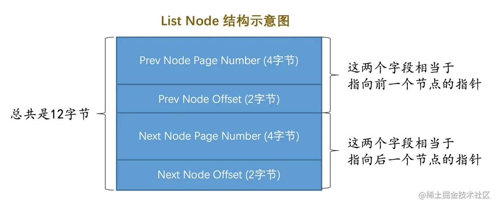

为了管理链表，设计了一个基节点的结构，里边存储了这个链表的`头节点`、`尾节点`以及`链表长度`信息，基节点的结构：

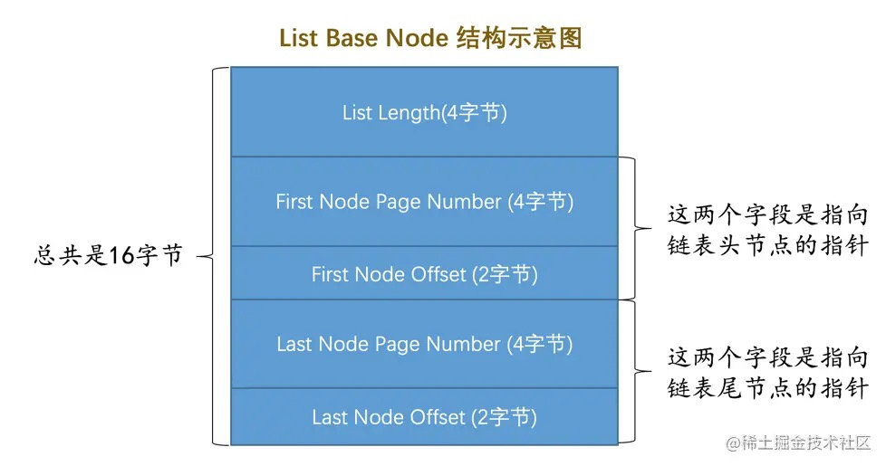

所以链表的结构就是这样：

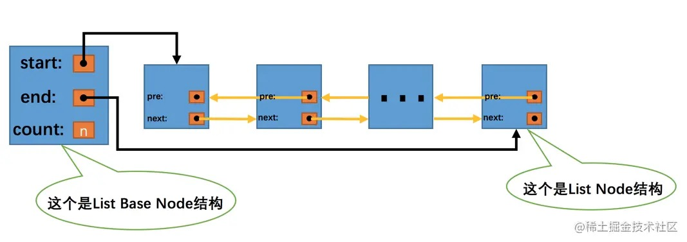

## 20.5 FIL_PAGE_UNDO_LOG页面

类型为`FIL_PAGE_UNDO_LOG`的页面用来存储`undo日志`，我们简称为`Undo页面`，通用结构如下：

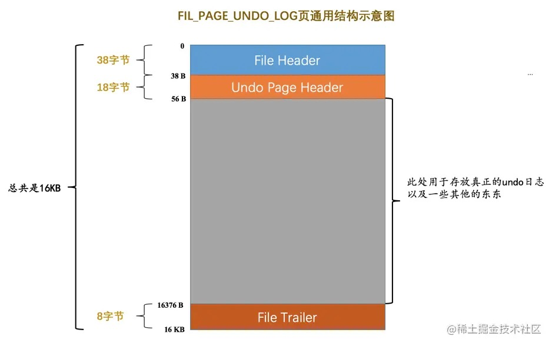

图中`File Header`和`File Trailer`是页面都有的通用结构。

图中`Undo Page Header`是`Undo页面`特有的：

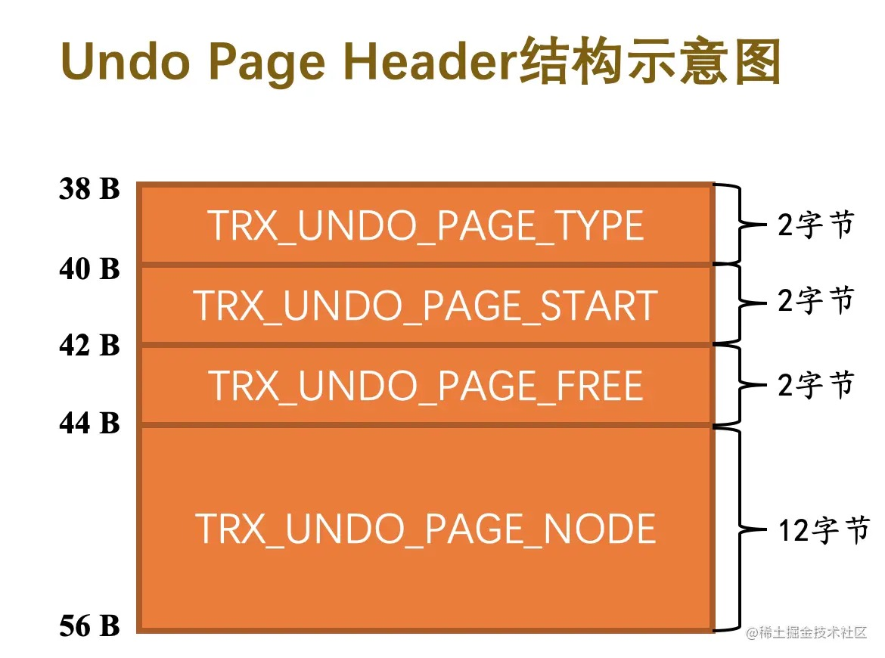

其中：
- `TRX_UNDO_PAGE_TYPE`：页面存储什么种类的undo日志。
  
  分为两个大类：
  - `TRX_UNDO_INSERT`（十进制1表示）：存储类型为`TRX_UNDO_INSERT_REC`的undo日志。
  - `TRX_UNDO_UPDATE`（十进制2表示）：存储类型为`TRX_UNDO_INSERT_REC`之外的其他类型的undo日志。

  提示：  
  不同大类的undo日志不能混着存储。  
  类型为`TRX_UNDO_INSERT_REC`的undo日志在事务提交后可以直接删除，而其他类型的undo日志还需要为MVCC服务，不能直接删除，所以对它们需要区别对待。

- `TRX_UNDO_PAGE_START`：页面是从什么位置开始存储undo日志，也就是第一条undo日志在页面中的起始偏移量。
- `TRX_UNDO_PAGE_FREE`：页面中存储的最后一条undo日志结束时的偏移量，也就是从这个位置开始可以继续写入新的undo日志。
- `TRX_UNDO_PAGE_NODE`：代表一个`List Node`结构，也就是上边介绍的链表的普通节点。

## 20.6 Undo页面链表

### 20.6.1 单个事务中的Undo页面链表

一个事务执行过程中可能产生很多undo日志，这些日志可能需要多个页面存放，这些页面通过上边介绍的`TRX_UNDO_PAGE_NODE`属性连成了链表：

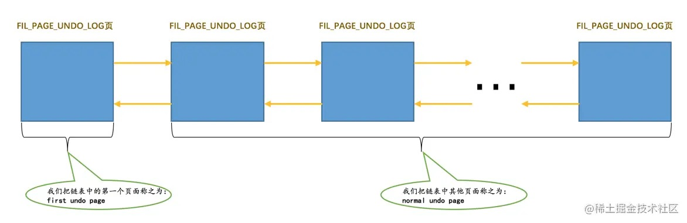

链表中的第一个Undo页面，称为`first undo page`，其余页面称为`normal undo page`。

在`first undo page`中除了记录`Undo Page Header`之外，还会记录其他的一些管理信息，稍后介绍。

因为不同类型的undo日志不能混着存，所以一个事务就可能需要`2`个Undo页面的链表：
- 一个称为`insert undo`链表
- 一个称为`update undo`链表
  
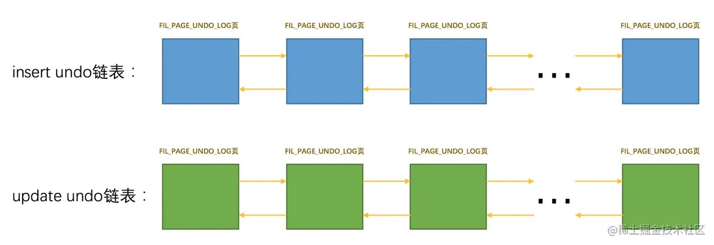

另外，InnoDB规定普通表和临时表的undo日志要分别记录，所以一个事务中最多有`4`个Undo页面的链表：

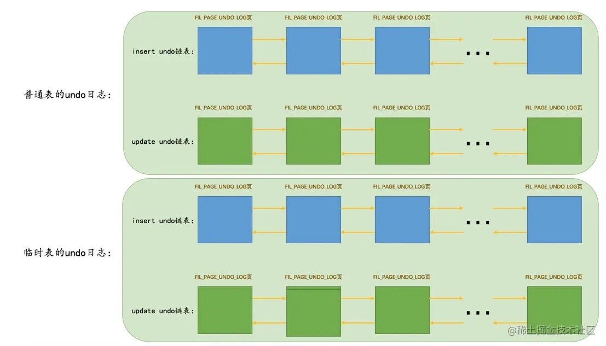

并不是在事务一开始就为这个事务分配这`4`个链表，只有在需要记录对应的undo日志时才分配。

### 20.6.2 多个事务中的Undo页面链表

不同事务执行过程中产生的undo日志需要被写入到不同的Undo页面链表中。

例如：

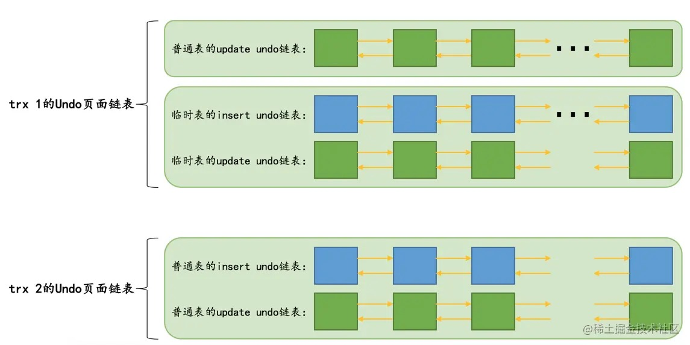

## 20.7 undo日志具体写入过程

### 20.7.1 段的概念

`段`是一个逻辑上的概念，本质上是由若干个零散页面和若干个完整的区组成的。  
每一个`段`对应一个`INODE Entry`结构，这个结构描述了段的各种信息，段的ID，段内的各种链表基节点，零散页面的页号等信息。  
为了定位一个`INODE Entry`，设计了一个`Segment Header`结构：

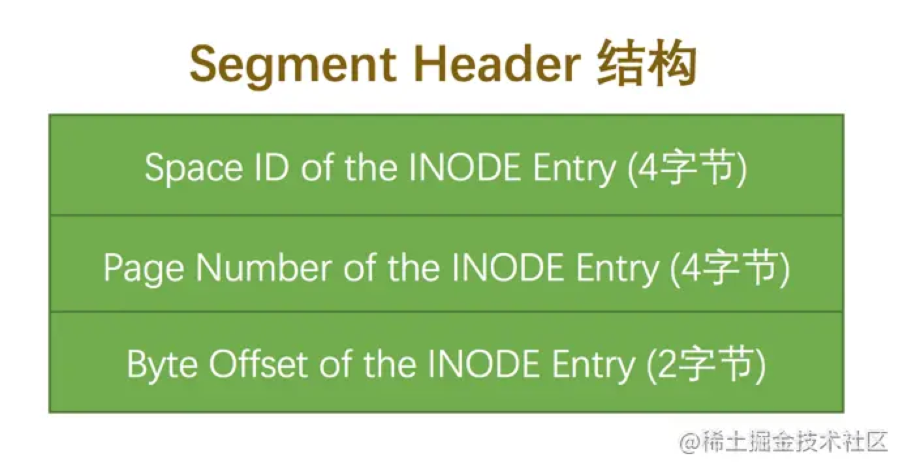

各个属性：
- `Space ID of the INODE Entry`：`INODE Entry`结构所在的表空间ID。
- `Page Number of the INODE Entry`：`INODE Entry`结构所在的页面页号。
- `Byte Offset of the INODE Entry`：`INODE Entry`结构在该页面中的偏移量。

### 20.7.2 Undo Log Segment Header

每一个`Undo页面`链表都对应着一个`段`，称之为`Undo Log Segment`，链表中的页面都是从这个段里申请的。

在`Undo页面`链表的第一个页面，设计了一个`Undo Log Segment Header`：

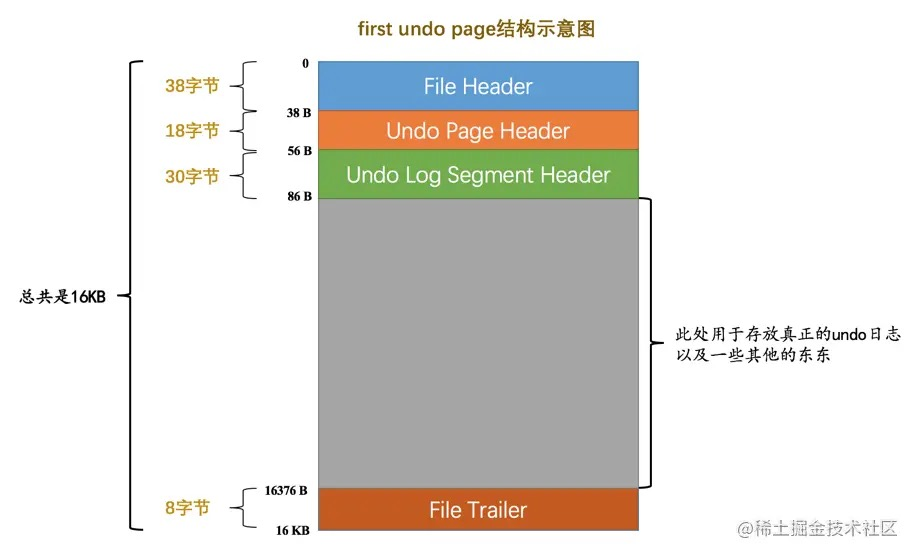

`Undo Log Segment Header`的结构：

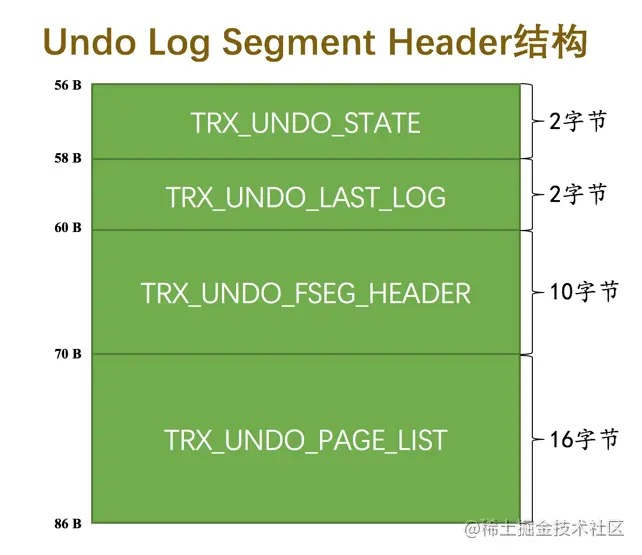

其中：
- `TRX_UNDO_STATE`：`Undo页面`链表的状态。
  - `TRX_UNDO_ACTIVE`：活跃状态，也就是一个活跃的事务正在往这个段里边写入undo日志。
  - `TRX_UNDO_CACHED`：被缓存的状态，等待着之后被其他事务重用。
  - `TRX_UNDO_TO_FREE`：对于`insert undo链表`来说，如果在它对应的事务提交之后，该链表不能被重用，那么就会处于这种状态。
  - `TRX_UNDO_TO_PURGE`：对于`update undo链表`来说，如果在它对应的事务提交之后，该链表不能被重用，那么就会处于这种状态。
  - `TRX_UNDO_PREPARED`：包含处于`PREPARE`阶段的事务产生的undo日志（分布式事务中才出现，忽略）。
  
- `TRX_UNDO_LAST_LOG`：`Undo页面`链表中最后一个`Undo Log Header`的位置。
- `TRX_UNDO_FSEG_HEADER`：`Undo页面`链表对应的段的`Segment Header`信息（上面的`Segment Header`结构，通过它找到该段对应的`INODE Entry`）。
- `TRX_UNDO_PAGE_LIST`：`Undo页面`链表的基节点。

### 20.7.3 Undo Log Header

一个事务在向`Undo页面`中写入undo日志时，写完一条接着写另一条，写完一个`Undo页面`后接着写下一个`Undo页面`。

同一个事务向一个`Undo页面`链表中写入的undo日志算是`一个组`，向多个`Undo页面`链表中写入undo日志就会有`多个组`。

在每写入一组undo日志时，都会在这组undo日志前先记录一下关于这个组的一些属性，存储这些属性的就是`Undo Log Header`。

所以`Undo页面`链表的第一个页面在真正写入undo日志前，其实会有`Undo Page Header`、`Undo Log Segment Header`、`Undo Log Header`这`3`个部分：

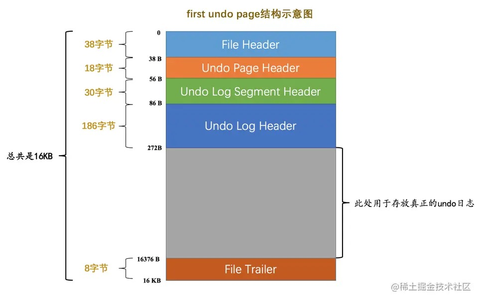

`Undo Log Header`结构：

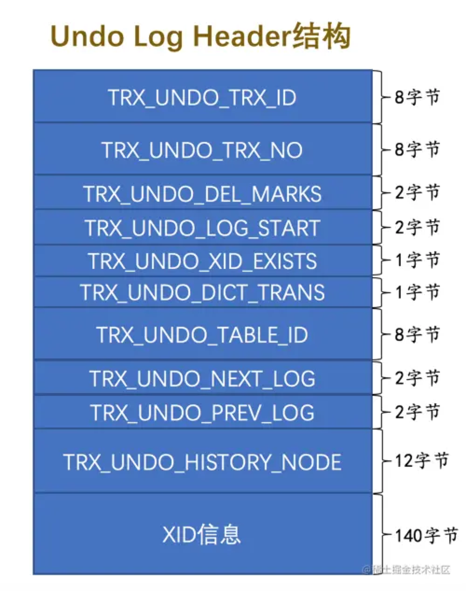

其中：
- `TRX_UNDO_TRX_ID`：生成本组undo日志的`事务id`。
- `TRX_UNDO_TRX_NO`：事务提交后生成的一个`事务序号`，使用此序号来标记事务的提交顺序。
- `TRX_UNDO_DEL_MARKS`：标记本组undo日志中是否包含由于`Delete mark`操作产生的undo日志。
- `TRX_UNDO_LOG_START`：表示本组undo日志中第一条undo日志的在页面中的偏移量。
- `TRX_UNDO_XID_EXISTS`：本组undo日志是否包含XID信息（不讨论）。
- `TRX_UNDO_DICT_TRANS`：标记本组undo日志是不是由`DDL`语句产生的。
- `TRX_UNDO_TABLE_ID`：如果`TRX_UNDO_DICT_TRANS`为真，那么本属性表示`DDL`语句操作的表的`table id`。
- `TRX_UNDO_NEXT_LOG`：下一组的undo日志在页面中开始的偏移量。
- `TRX_UNDO_PREV_LOG`：上一组的undo日志在页面中开始的偏移量。
- `TRX_UNDO_HISTORY_NODE`：一个12字节的`List Node`结构，代表一个称之为`History`链表的节点。

提示：  
一般来说一个`Undo页面`链表只存储一个事务执行过程中产生的一组undo日志。  
在某些情况下，可能会在一个事务提交之后，之后开启的事务重复利用这个`Undo页面`链表，这样一个`Undo页面`链表中可能存放多组Undo日志。  
`TRX_UNDO_NEXT_LOG`和`TRX_UNDO_PREV_LOG`就是用来标记下一组和上一组undo日志在页面中的偏移量的。

### 20.7.4 小结

对于没有被重用的Undo页面链表来说，链表的第一个页面，也就是`first undo page`在真正写入undo日志前，会填充`Undo Page Header`、`Undo Log Segment Header`、`Undo Log Header`这3个部分，之后才开始正式写入undo日志。

对于其他的页面来说，也就是`normal undo page`在真正写入undo日志前，只会填充`Undo Page Header`。

链表的`List Base Node`存放到`first undo page`的`Undo Log Segment Header`部分，`List Node`信息存放到每一个Undo页面的`Undo Page Header`部分：

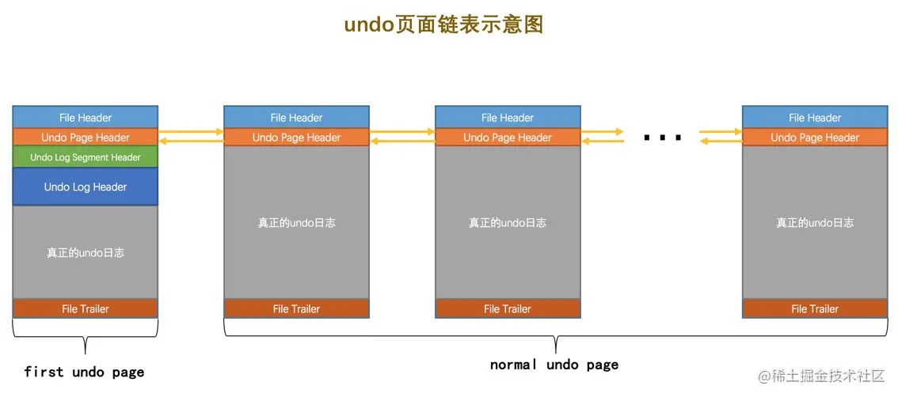

## 20.8 重用Undo页面

为了提高并发执行的多个事务写入undo日志的性能，为每个事务单独分配相应的Undo页面链表（最多4个链表）。  
大部分事务针对某个Undo页面链表只产生非常少的undo日志，每开启一个事务就新创建一个Undo页面链表（开始只有一个页面）太浪费了。

事务提交后在某些情况下可以重用该事务的Undo页面链表。

重用条件：
- 该链表中只包含一个`Undo页面`。
- 该`Undo页面`已经使用的空间小于整个页面空间的`3/4`。

Undo页面链表分为`insert undo链表`和`update undo链表`两种，这两种链表在被重用时的策略也是不同的：

- `insert undo链表`
  
  `insert undo链表`中的undo日志在事务提交之后就没用了，重用时直接从头开始写入新事务的一组undo日志，把之前事务的undo日志覆盖掉就可以了。

  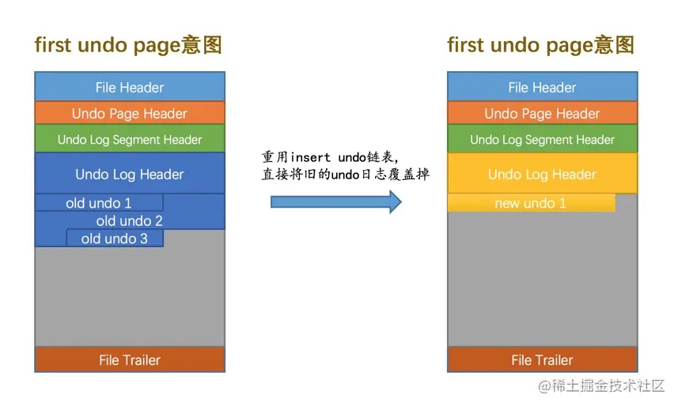

- `update undo链表`
  
  事务提交后，`update undo链表`中的undo日志不能立即删除（这些日志用于MVCC），所以重用时不能覆盖之前事务写入的undo日志。  
  相当于在同一个Undo页面中写入了多组undo日志。

  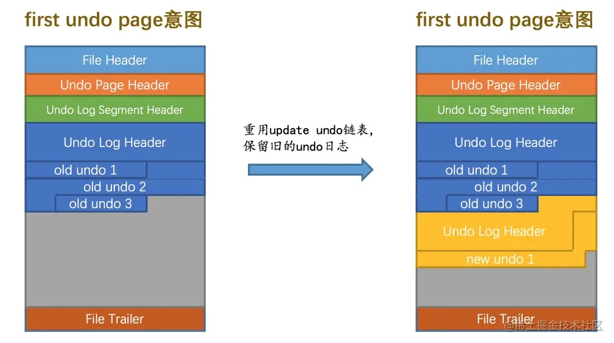

## 20.9 回滚段

### 20.9.1 回滚段的概念

一个事务在执行过程中最多可以分配4个Undo页面链表，各个事务都拥有自己的的Undo页面链表，所以系统里其实有许许多多个Undo页面链表存在。

为了更好的管理这些链表，设计了`Rollback Segment Header`页面，这个页面中存放了各个Undo页面链表的`frist undo page`的`页号`，这些页号称为`undo slot`。

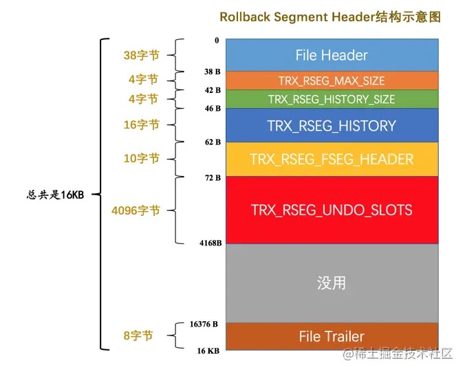

InnoDB规定，每一个`Rollback Segment Header`页面都对应着一个`段`，这个`段`就称为`Rollback Segment`，也就是`回滚段`。

这个`Rollback Segment`里其实只有一个`页面`。

其中：
- `TRX_RSEG_MAX_SIZE`：本回滚段中管理的所有Undo页面链表中的Undo页面数量之和的最大值。该属性的值默认为无限大(0xFFFFFFFE)。
- `TRX_RSEG_HISTORY_SIZE`：`History`链表占用的页面数量。
- `TRX_RSEG_HISTORY`：`History`链表的基节点。
- `TRX_RSEG_FSEG_HEADER`：本回滚段对应的`10`字节大小的`Segment Header`结构，通过它可以找到本段对应的`INODE Entry`。
- `TRX_RSEG_UNDO_SLOTS`：各个`Undo页面链表`的`first undo page`的页号集合，也就是`undo slot`集合。
  
  一个页号占用`4`个字节，`TRX_RSEG_UNDO_SLOTS`部分共存储了`1024`个`undo slot`，占用`4096`个字节。

### 20.9.2 从回滚段中申请Undo页面链表

初始情况下，`Rollback Segment Header`页面的各个`undo slot`都被设置成了一个特殊的值：`FIL_NULL`（0xFFFFFFFF），表示该`undo slot`不指向任何页面。

当有事务需要分配`Undo页面`链表了，就从回滚段的第一个`undo slot`开始，看该`undo slot`的值是不是`FIL_NULL`：
- 如果是`FIL_NULL`，那么在表空间中新创建一个段（`Undo Log Segment`），从段里申请一个页面作为`Undo页面`链表的`first undo page`，把该`undo slot`的值设置为刚刚申请的这个页面的`页号`，这个`undo slot`就被分配给了这个事务。
- 如果不是`FIL_NULL`，就跳到下一个`undo slot`，判断该`undo slot`的值是不是`FIL_NULL`，重复上边的步骤。

一个`Rollback Segment Header`页面中包含`1024`个`undo slot`，如果这`1024`个`undo slot`的值都不为`FIL_NULL`，此时由于事务无法获得`Undo页面`链表，会回滚这个事务并报错：

    Too many active concurrent transactions

当一个事务提交时，它占用的`undo slot`有两种命运：

- 该`undo slot`指向的`Undo页面`链表符合被重用的条件：
  
  该`undo slot`就处于`被缓存`的状态，这时该`Undo页面`链表的`TRX_UNDO_STATE`属性会被设置为`TRX_UNDO_CACHED`。

  被缓存的`undo slot`都会根据其对应的`Undo页面`链表的类型不同被加入到不同的链表：
  - 如果对应的`Undo页面`链表是`insert undo链表`，则该`undo slot`会被加入`insert undo cached链表`。
  - 如果对应的`Undo页面`链表是`update undo链表`，则该`undo slot`会被加入`update undo cached链表`。
  
  一个回滚段就对应着上述两个`cached链表`，如果有新事务要分配`undo slot`，先从对应的`cached链表`中找。  
  如果没有被缓存的`undo slot`，才会到回滚段的`Rollback Segment Header`页面中再去找。

- 该`undo slot`指向的`Undo页面`链表不符合被重用的条件：
  - 如果对应的`Undo页面`链表是`insert undo链表`，则该链表的`TRX_UNDO_STATE`属性会被设置为`TRX_UNDO_TO_FREE`，之后该链表对应的段会被释放掉，然后把该`undo slot`的值设置为`FIL_NULL`。
  - 如果对应的`Undo页面`链表是`update undo链表`，则该链表的`TRX_UNDO_STATE`属性会被设置为`TRX_UNDO_TO_PRUGE`，把该`undo slot`的值设置为`FIL_NULL`，然后将本次事务写入的一组undo日志放到所谓的`History`链表中（这里不会将`Undo页面`链表对应的段释放，这些undo日志还有用）。

### 20.9.3 多个回滚段

一个事务执行过程中最多分配`4`个`Undo页面`链表，而一个回滚段里只有`1024`个`undo slot`，很显然有点少。

InnoDB定义了`128`个回滚段，也就相当于有了`128 × 1024 = 131072`个`undo slot`。

每个回滚段都对应一个`Rollback Segment Header`页面，`128`个回滚段就要有`128`个`Rollback Segment Header`页面。

InnoDB在系统表空间的第`5`号页面的某个区域包含了`128`个`8`字节大小的格子，每个格子由两部分组成：
- `4`字节大小的`表空间的ID`。
- `4`字节大小的`页号`。

每个格子相当于一个指针，指向某个表空间中的某个页面，这些页面就是`Rollback Segment Header`。

总结：  
在系统表空间的第`5`号页面中存储了`128`个`Rollback Segment Header`页面地址，每个`Rollback Segment Header`就相当于一个回滚段。  
在`Rollback Segment Header`页面中，又包含`1024`个`undo slot`，每个`undo slot`都对应一个`Undo页面链表`。

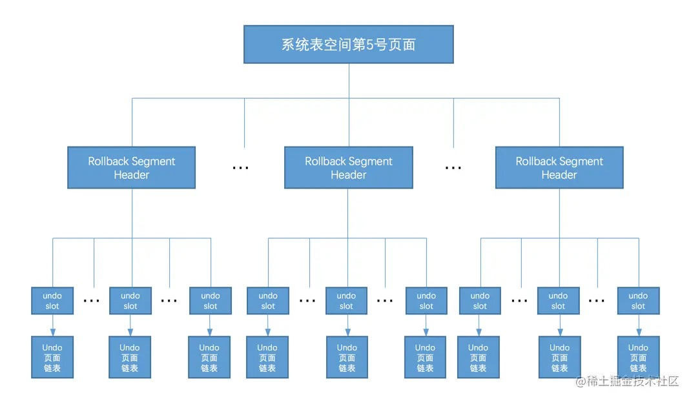

### 20.9.4 回滚段的分类

这`128`个回滚段编一下号，最开始的回滚段为第`0`号回滚段，依次递增，最后一个回滚段为第`127`号回滚段。

这`128`个回滚段可以分成两大类：

- 第`0`号、第`33～127`号回滚段属于一类。
  
  其中第`0`号回滚段必须在`系统表空间`中（对应的`Rollback Segment Header`页面必须在系统表空间中）。  
  第`33～127`号回滚段既可以在`系统表空间`中，也可以在自己配置的`undo表空间`中。

  事务对`普通表`的改动需要分配Undo页面链表时，必须从这一类的段中分配相应的`undo slot`。

- 第`1～32`号回滚段属于一类。
  
  这些回滚段必须在`临时表空间`中（对应着数据目录中的`ibtmp1`文件）。

  事务对`临时表`的改动需要分配Undo页面链表时，必须从这一类的段中分配相应的`undo slot`。

为啥针对`普通表`和`临时表`来划分不同种类的回滚段呢？
- 修改针对`普通表`的回滚段中的Undo页面时，需要记录对应的redo日志。
- 修改针对`临时表`的回滚段中的Undo页面时，不需要记录对应的redo日志。

### 20.9.5 roll_pointer的组成

后续补充...

### 20.9.6 为事务分配Undo页面链表的详细过程

事务对`普通表`的记录做改动分配Undo页面链表过程：

- 事务在对普通表的记录首次改动之前，首先到系统表空间的第`5`号页面中分配一个回滚段（获取一个`Rollback Segment Header`页面的地址），这里粗暴的使用循环使用的方式来分配回滚段。

- 分配到回滚段后，首先根据对应的操作（`插入`、`更新`、`删除`）看这个回滚段的两个`cached链表`（`insert undo cached链表`和`update undo cached链表`）有没有已经缓存的`undo slot`。如果有缓存的`undo slot`，就把这个缓存的`undo slot`分配给该事务。

- 如果没有缓存的`undo slot`可分配，就到`Rollback Segment Header`页面中找一个可用的`undo slot`分配给当前事务，如果没有可用的，直接报错。

- 找到可用的`undo slot`后，如果是从`cached链表`中获取的，那么它对应的`Undo Log Segment`已经分配了，否则需要重新分配一个`Undo Log Segment`，然后从该`Undo Log Segment`中申请一个页面作为`Undo页面链表`的`first undo page`。

- 然后事务把undo日志写入申请的`Undo页面链表`。

## 20.10 回滚段相关配置

### 20.10.1 配置回滚段数量

系统默认有`128`个回滚段，可以通过启动参数`innodb_rollback_segments`配置回滚段的数量，可配置的范围是`1~128`。

这个参数并不会影响针对`临时表`的回滚段数量，针对`临时表`的回滚段数量一直是`32`。

也就是说，把`innodb_rollback_segments`的值设置为`1～33`效果是一样的，有`1`个针对普通表的可用回滚段和`32`个针对临时表的可用回滚段。

### 20.10.2 配置undo表空间

默认情况下，针对普通表设立的回滚段（第`0`号以及第`33~127`号回滚段）都是被分配到`系统表空间`的。

其中的第第`0`号回滚段是一直在系统表空间的，第`33~127`号回滚段可以通过配置放到`自定义的undo表空间`中。

这种配置只能在系统初始化（创建数据目录时）的时候使用，初始化完成之后就不能更改了。

- 通过`innodb_undo_directory`指定undo表空间所在的目录，如果没有指定该参数，则默认undo表空间所在的目录就是数据目录。

- 通过`innodb_undo_tablespaces`定义undo表空间的数量。该参数的默认值为0，表明不创建任何undo表空间。

## 20.11 undo日志在崩溃恢复时的作用

后续补充...

# 完