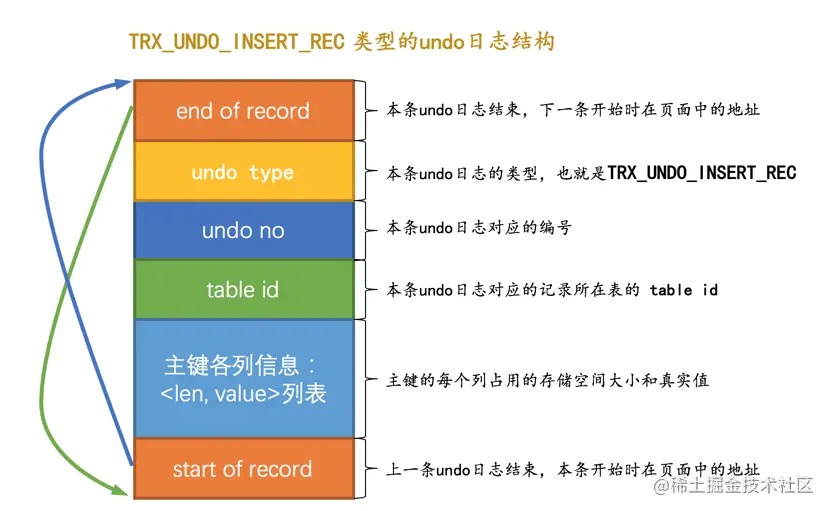
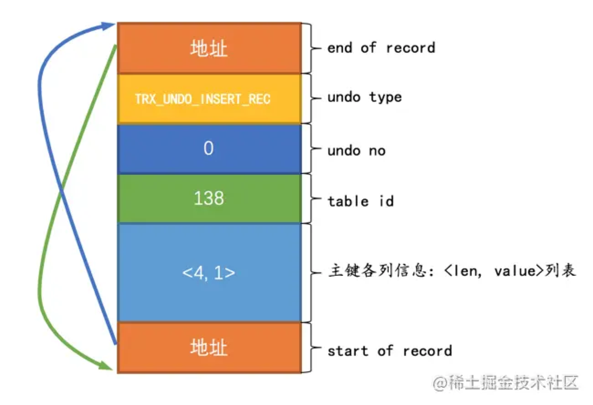
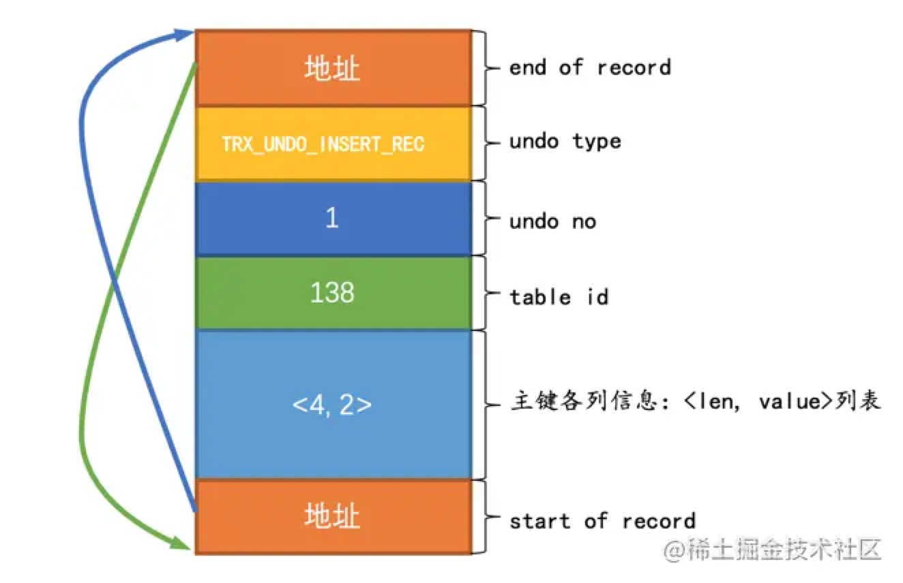
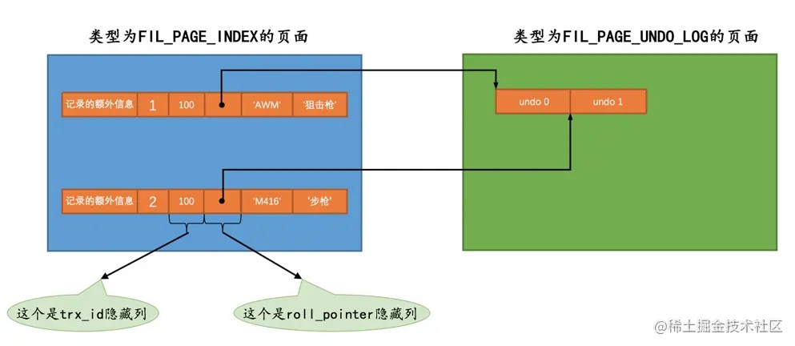

# 20-undo日志

## 20.1 事务回滚的需求

对一条记录做改动时（`INSERT`、`DELETE`、`UPDATE`），需要把回滚时所需的东西记下来：
- 插入一条记录，要把这条记录的主键记下来，回滚的时候需要把这个主键值对应的记录删除。
- 删除一条记录，要把这条记录的内容记下来，回滚的时候再把这条记录重新插入到表中。
- 修改一条记录，要把这条记录的旧值记下来，回滚的时候再把这条记录更新为旧值。

这些为了回滚而记录的信息称之为`撤销日志`，英文名为`undo log`，我们也称之为`undo日志`。

## 20.2 事务id

### 20.2.1 分配事务id的时机

如果某个事务执行过程中对某个表执行了`增`、`删`、`改`操作，那么InnoDB存储引擎就会给它分配一个独一无二的`事务id`：
- 对于只读事务来说，只有在它第一次对某个用户创建的临时表（不包括内部临时表）执行`增`、`删`、`改`操作时才会为这个事务分配一个`事务id`，否则是不分配事务id的。
- 对于读写事务来说，只有在它第一次对某个表（包括用户创建的临时表）执行`增`、`删`、`改`操作时才会为这个事务分配一个`事务id`，否则是不分配事务id的。

总之只有在事务对表中的记录做改动时才会为这个事务分配一个唯一的`事务id`。

### 20.2.2 事务id是怎么生成的

`事务id`是一个数字，它的分配策略和记录的隐藏主键列`row_id`的分配策略相同：
- 服务器维护一个全局变量，当需要分配一个`事务id`时，把该变量的值作为`事务id`分配给该事务，并且把该变量自增`1`。
- 每当这个变量的值为`256`的倍数时，就将该变量的值刷新到系统表空间的页号为`5`的页面中的`Max Trx ID`属性处，这个属性占用`8`个字节的存储空间。
- 当系统重新启动时，会将`Max Trx ID`属性的值加上`256`之后赋值该全局变量。

这样系统中分配的`事务id`值是一个递增的数字。

### 20.2.3 trx_id隐藏列

聚簇索引的记录中会自动添加名为`trx_id`、`roll_pointer`的隐藏列，如果用户没有定义主键以及UNIQUE键，还会自动添加一个名为`row_id`的隐藏列。

其中的`trx_id`就是某个对这个记录做改动的语句所在的事务对应的`事务id`。

## 20.3 undo日志的格式

每对一条记录做一次改动，就对应着`1`条`undo日志`，在某些更新记录的操作中，也可能会对应着`2`条`undo日志`。

一个事务在执行过程中可能新增、删除、更新若干条记录，也就是说需要记录很多条对应的undo日志，这些undo日志会被从0开始编号，依次递增，这个编号也被称之为`undo no`。

这些undo日志是被记录到类型为`FIL_PAGE_UNDO_LOG`（`0x0002`）的页面中，这些页面可以从系统表空间中分配，也可以从专门存放undo日志的表空间（`undo tablespace`）中分配。

先创建一个表：

    CREATE TABLE undo_demo (
        id INT NOT NULL,
        key1 VARCHAR(100),
        col VARCHAR(100),
        PRIMARY KEY (id),
        KEY idx_key1 (key1)
    )Engine=InnoDB CHARSET=utf8;

每个表都会分配一个唯一的`table id`，可以通过系统数据库`information_schema`中的`innodb_sys_tables`表来查看：

    mysql> SELECT * FROM information_schema.innodb_sys_tables WHERE name = 'temp/undo_demo';
    +----------+----------------+------+--------+-------+-------------+------------+---------------+------------+
    | TABLE_ID | NAME           | FLAG | N_COLS | SPACE | FILE_FORMAT | ROW_FORMAT | ZIP_PAGE_SIZE | SPACE_TYPE |
    +----------+----------------+------+--------+-------+-------------+------------+---------------+------------+
    |      138 | temp/undo_demo |   33 |      6 |    90 | Barracuda   | Dynamic    |             0 | Single     |
    +----------+----------------+------+--------+-------+-------------+------------+---------------+------------+

### 20.3.1 INSERT操作对应的undo日志

插入操作最终结果就是这条记录被放到了一个数据页中。

如果希望回滚这个插入操作，那么把这条记录删除就好了，也就是说在写对应的undo日志时，主要是把这条记录的主键信息记上。

插入操作undo日志类型为`TRX_UNDO_INSERT_REC`：

其中：  
- `undo no`在一个事务中是从`0`开始递增的，只要事务没提交，每生成一条undo日志，该条日志的`undo no`就增`1`。
- 如果记录中的主键只含一个列，那么在undo日志中只需要把该列占用的存储空间大小和真实值记录下来。
- 如果记录中的主键包含多个列，那么在undo日志中需要把每个列占用的存储空间大小和真实值记录下来。

提示：  
插入一条记录需要向聚簇索引和所有的二级索引都插入一条记录。  
记录undo日志时只需要考虑向聚簇索引插入记录的情况就好了，因为聚簇索引记录和二级索引记录是一一对应的，回滚时按主键做对各个索引做删除操作就可以了。
后边的`DELETE`操作和`UPDATE`操作对应的undo日志也都是针对聚簇索引记录而言。

插入两条记录：

    BEGIN;

    INSERT INTO undo_demo(id, key1, col) VALUES 
    (1, 'AWM', '狙击枪'), 
    (2, 'M416', '步枪');

主键只包含一个id列，所以对应的undo日志中只需要将待插入记录的id列占用的存储空间长度和真实值记录下来。

插入两条记录，会产生两条类型为`TRX_UNDO_INSERT_REC`的undo日志：

- 第一条undo日志的`undo no`为`0`，记录主键占用的存储空间长度为`4`，真实值为`1`：

  

- 第二条undo日志的`undo no`为`1`，记录主键占用的存储空间长度为`4`，真实值为`2`：

  

**roll_pointer隐藏列的含义**

`roll_pointer`本质上就是一个指向记录对应的undo日志的一个指针。

上边插入了2条记录，每条记录都有与其对应的一条undo日志。

记录存到了类型为`FIL_PAGE_INDEX`的页中。  
undo日志存到了类型为`FIL_PAGE_UNDO_LOG`的页面中。

图中`roll_pointer`指向记录对应的undo日志。  
这`7`个字节的`roll_pointer`的每一个字节具体的含义后边介绍。

### 20.3.2 DELETE操作对应的undo日志

### 20.3.3 UPDATE操作对应的undo日志
### 20.3.4 增删改操作对二级索引的影响

## 20.4 通用链表结构

## 20.5 FIL_PAGE_UNDO_LOG页面

## 20.6 Undo页面链表
### 20.6.1 单个事务中的Undo页面链表
### 20.6.2 多个事务中的Undo页面链表

## 20.7 undo日志具体写入过程
### 20.7.1 段的概念
### 20.7.2 Undo Log Segment Header
### 20.7.3 Undo Log Header
### 20.7.4 小结

## 20.8 重用Undo页面

## 20.9 回滚段
### 20.9.1 回滚段的概念
### 20.9.2 从回滚段中申请Undo页面链表
### 20.9.3 多个回滚段
### 20.9.4 回滚段的分类
### 20.9.5 roll_pointer的组成
### 20.9.6 为事务分配Undo页面链表的详细过程

## 20.10 回滚段相关配置
### 20.10.1 配置回滚段数量
### 20.10.2 配置undo表空间

## 20.11 undo日志在崩溃恢复时的作用

## 20.12 总结

# 完