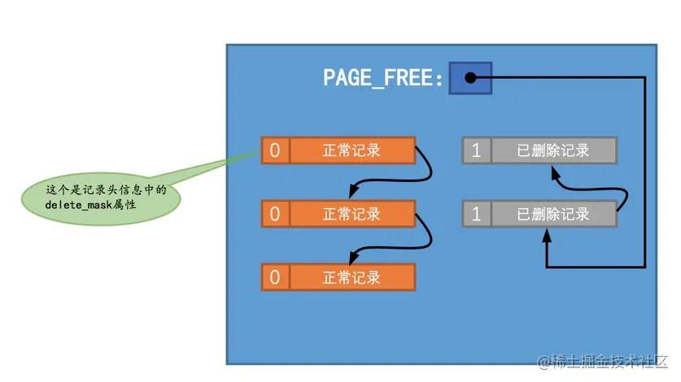
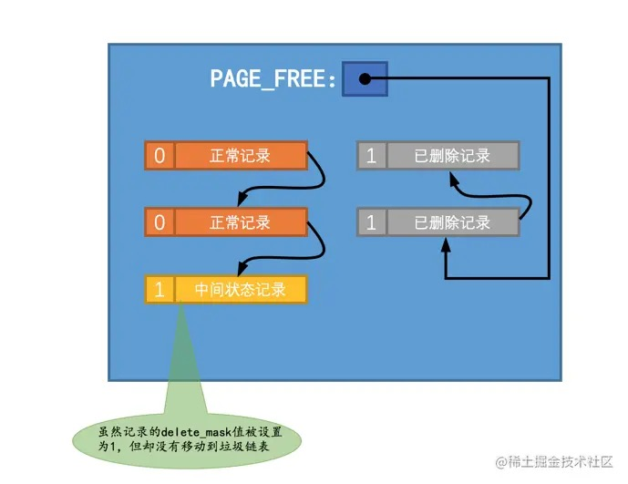
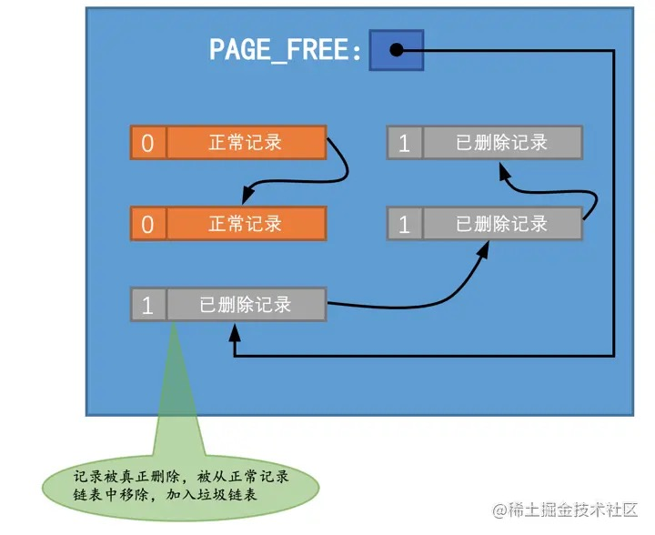
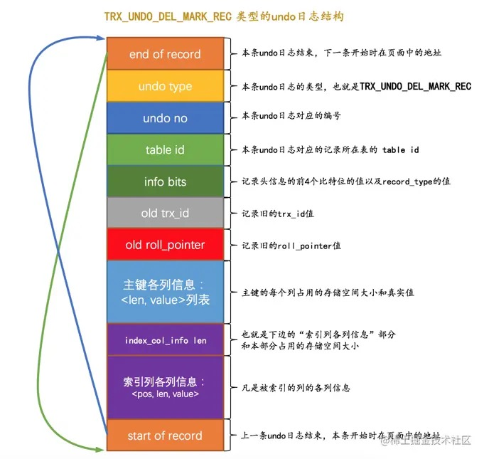
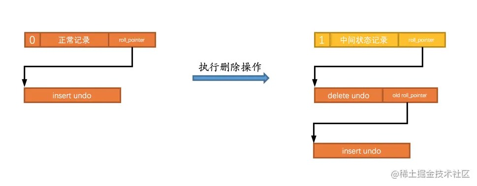
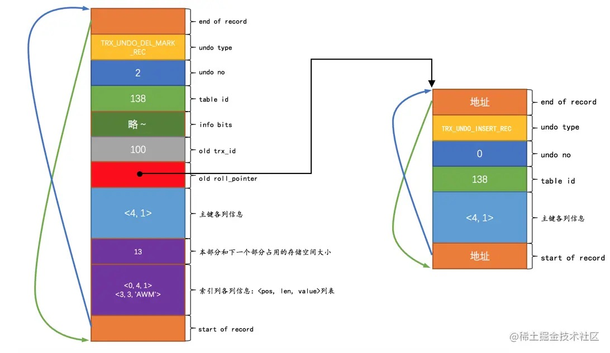
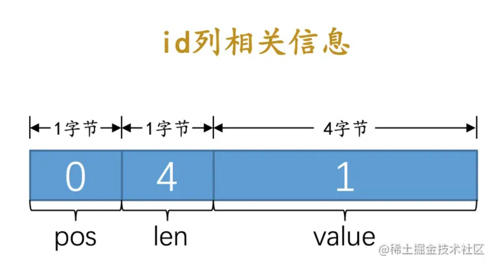
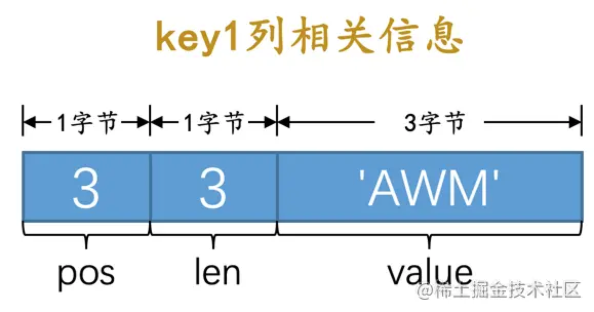
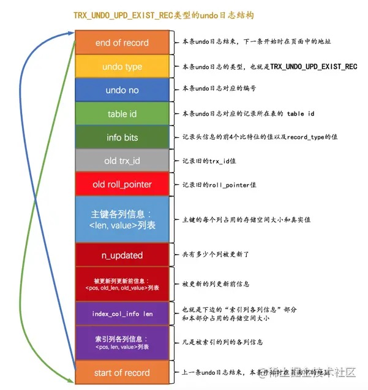
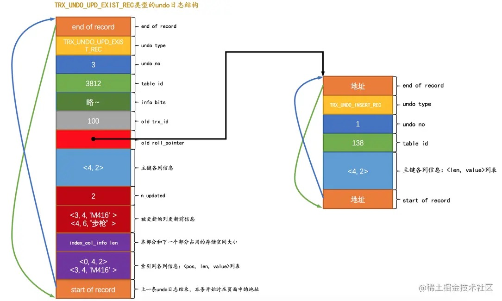

# 20-undo日志

## 20.1 事务回滚的需求

对一条记录做改动时（`INSERT`、`DELETE`、`UPDATE`），需要把回滚时所需的东西记下来：
- 插入一条记录，要把这条记录的主键记下来，回滚的时候需要把这个主键值对应的记录删除。
- 删除一条记录，要把这条记录的内容记下来，回滚的时候再把这条记录重新插入到表中。
- 修改一条记录，要把这条记录的旧值记下来，回滚的时候再把这条记录更新为旧值。

这些为了回滚而记录的信息称之为`撤销日志`，英文名为`undo log`，我们也称之为`undo日志`。

## 20.2 事务id

### 20.2.1 分配事务id的时机

如果某个事务执行过程中对某个表执行了`增`、`删`、`改`操作，那么InnoDB存储引擎就会给它分配一个独一无二的`事务id`：
- 对于只读事务来说，只有在它第一次对某个用户创建的临时表（不包括内部临时表）执行`增`、`删`、`改`操作时才会为这个事务分配一个`事务id`，否则是不分配事务id的。
- 对于读写事务来说，只有在它第一次对某个表（包括用户创建的临时表）执行`增`、`删`、`改`操作时才会为这个事务分配一个`事务id`，否则是不分配事务id的。

总之只有在事务对表中的记录做改动时才会为这个事务分配一个唯一的`事务id`。

### 20.2.2 事务id是怎么生成的

`事务id`是一个数字，它的分配策略和记录的隐藏主键列`row_id`的分配策略相同：
- 服务器维护一个全局变量，当需要分配一个`事务id`时，把该变量的值作为`事务id`分配给该事务，并且把该变量自增`1`。
- 每当这个变量的值为`256`的倍数时，就将该变量的值刷新到系统表空间的页号为`5`的页面中的`Max Trx ID`属性处，这个属性占用`8`个字节的存储空间。
- 当系统重新启动时，会将`Max Trx ID`属性的值加上`256`之后赋值该全局变量。

这样系统中分配的`事务id`值是一个递增的数字。

### 20.2.3 trx_id隐藏列

聚簇索引的记录中会自动添加名为`trx_id`、`roll_pointer`的隐藏列，如果用户没有定义主键以及UNIQUE键，还会自动添加一个名为`row_id`的隐藏列。

其中的`trx_id`就是某个对这个记录做改动的语句所在的事务对应的`事务id`。

## 20.3 undo日志的格式

每对一条记录做一次改动，就对应着`1`条`undo日志`，在某些更新记录的操作中，也可能会对应着`2`条`undo日志`。

一个事务在执行过程中可能新增、删除、更新若干条记录，也就是说需要记录很多条对应的undo日志，这些undo日志会被从0开始编号，依次递增，这个编号也被称之为`undo no`。

这些undo日志是被记录到类型为`FIL_PAGE_UNDO_LOG`（`0x0002`）的页面中，这些页面可以从系统表空间中分配，也可以从专门存放undo日志的表空间（`undo tablespace`）中分配。

先创建一个表：

    CREATE TABLE undo_demo (
        id INT NOT NULL,
        key1 VARCHAR(100),
        col VARCHAR(100),
        PRIMARY KEY (id),
        KEY idx_key1 (key1)
    )Engine=InnoDB CHARSET=utf8;

每个表都会分配一个唯一的`table id`，可以通过系统数据库`information_schema`中的`innodb_sys_tables`表来查看：

    mysql> SELECT * FROM information_schema.innodb_sys_tables WHERE name = 'temp/undo_demo';
    +----------+----------------+------+--------+-------+-------------+------------+---------------+------------+
    | TABLE_ID | NAME           | FLAG | N_COLS | SPACE | FILE_FORMAT | ROW_FORMAT | ZIP_PAGE_SIZE | SPACE_TYPE |
    +----------+----------------+------+--------+-------+-------------+------------+---------------+------------+
    |      138 | temp/undo_demo |   33 |      6 |    90 | Barracuda   | Dynamic    |             0 | Single     |
    +----------+----------------+------+--------+-------+-------------+------------+---------------+------------+

### 20.3.1 INSERT操作对应的undo日志

插入操作最终结果就是这条记录被放到了一个数据页中。

如果希望回滚这个插入操作，那么把这条记录删除就好了，也就是说在写对应的undo日志时，主要是把这条记录的主键信息记上。

插入操作undo日志类型为`TRX_UNDO_INSERT_REC`：

其中：  
- `undo no`在一个事务中是从`0`开始递增的，只要事务没提交，每生成一条undo日志，该条日志的`undo no`就增`1`。
- 如果记录中的主键只含一个列，那么在undo日志中只需要把该列占用的存储空间大小和真实值记录下来。
- 如果记录中的主键包含多个列，那么在undo日志中需要把每个列占用的存储空间大小和真实值记录下来。

提示：  
插入一条记录需要向聚簇索引和所有的二级索引都插入一条记录。  
记录undo日志时只需要考虑向聚簇索引插入记录的情况就好了，因为聚簇索引记录和二级索引记录是一一对应的，回滚时按主键做对各个索引做删除操作就可以了。
后边的`DELETE`操作和`UPDATE`操作对应的undo日志也都是针对聚簇索引记录而言。

插入两条记录：

    BEGIN; # 假设该事务的id为100

    # 插入两条记录
    INSERT INTO undo_demo(id, key1, col) VALUES 
    (1, 'AWM', '狙击枪'), 
    (2, 'M416', '步枪');

主键只包含一个id列，所以对应的undo日志中只需要将待插入记录的id列占用的存储空间长度和真实值记录下来。

插入两条记录，会产生两条类型为`TRX_UNDO_INSERT_REC`的undo日志：

- 第一条undo日志的`undo no`为`0`，记录主键占用的存储空间长度为`4`，真实值为`1`：

  

- 第二条undo日志的`undo no`为`1`，记录主键占用的存储空间长度为`4`，真实值为`2`：

  

**roll_pointer隐藏列的含义**

`roll_pointer`本质上就是一个指向记录对应的undo日志的一个指针。

上边插入了2条记录，每条记录都有与其对应的一条undo日志。

记录存到了类型为`FIL_PAGE_INDEX`的页中。  
undo日志存到了类型为`FIL_PAGE_UNDO_LOG`的页面中。

图中`roll_pointer`指向记录对应的undo日志。  
这`7`个字节的`roll_pointer`的每一个字节具体的含义后边介绍。

### 20.3.2 DELETE操作对应的undo日志

页面中的记录会根据记录头信息中的`next_record`属性组成一个单向链表，称之为`正常记录链表`。
页面中被删除的记录也会根据记录头信息中的`next_record`属性组成一个链表，这个链表中的记录占用的存储空间可以被重新利用，称之为`垃圾链表`。
`Page Header`的`PAGE_FREE`属性指向被删除记录组成的`垃圾链表`中的头节点。

删除一条记录过程：

某个页面中的记录分布情况：

假设现在把正常记录链表中的最后一条记录删除，删除过程需要经历两个阶段：

- 阶段一：仅仅将记录的`delete_mask`标识位设置为`1`（其实还会修改记录的`trx_id`、`roll_pointer`隐藏列的值），其他的不做修改。这个阶段称之为`delete mark`。
  
  此时记录处于一个中间状态，在删除语句所在的事务提交之前，被删除的记录一直都处于这种`中间状态`。  
  这个`中间状态`主要是为了实现`MVCC`功能。

  

- 阶段二：当删除语句所在事务提交后，会有专门的线程真正的把记录删除。这个阶段称之为`purge`。
  
  真正的删除就是把该记录从`正常链表`中移除，并且加入到`垃圾链表`，然后还要调整一些页面的其他信息，比如垃圾链表头节点的指针`PAGE_FREE`、页面中可重用的字节数`PAGE_GARBAGE`等等。
  
  将被删除记录加入到`垃圾链表`时，实际上加入到链表的头节点处，会跟着修改`PAGE_FREE`属性的值。

  

  提示：  
  每当新插入记录时，首先判断`PAGE_FREE`指向的头节点代表的已删除记录占用的存储空间是否足够容纳这条新插入的记录。  
  如果空间不够，就直接向页面申请新的空间来存储这条记录。  
  如果空间够用，就直接使用这个已删除记录空间来存储这条记录。  
  这就有可能产生`碎片空间`，这些`碎片空间`也会被统计到`PAGE_GARBAGE`属性中。  
  之后当新插入记录页面空间不足时，会首先看`PAGE_GARBAGE`的空间和剩余可利用空间加起来是不是可以容纳下新记录，如果可以，系统会重新组织页内的记录，把碎片空间都释放出来存储新记录。

在删除语句所在的事务提交前，只会经历`阶段一`，也就是`delete mark`阶段。  
提交之后就不用回滚了，所以只需考虑对删除操作的`阶段一`的影响进行回滚。

删除操作undo日志类型为`TRX_UNDO_DEL_MARK_REC`：

- 删除操作undo日志中存储了该记录的旧的`trx_id`和`roll_pointer`隐藏列的值。
  
  这样可以通过`old roll_pointer`找到记录在修改之前对应的undo日志。  
  比如先插入了一条记录，然后又执行对该记录的删除操作：

  

  如图执行完`delete mark`操作后，它对应的undo日志和INSERT操作对应的undo日志就串成了一个链表，这个链表称为`版本链`。

- 删除操作undo日志多了一个索引列各列信息的内容，包括列在记录中的位置（`pos`），列占用的存储空间大小（`len`），列实际值（`value`）。
  
  索引列各列信息存储的内容实质上就是`<pos, len, value>`的一个列表。  
  这部分信息主要是用在事务提交后，对该中间状态记录做真正删除的阶段二，也就是`purge`阶段中使用。

现在继续在上边那个事务id为100的事务中删除一条记录，把id为`1`的那条记录删除掉：

    BEGIN; # 假设该事务的id为100

    # 插入两条记录
    INSERT INTO undo_demo(id, key1, col) VALUES 
    (1, 'AWM', '狙击枪'), 
    (2, 'M416', '步枪');

    # 删除一条记录    
    DELETE FROM undo_demo WHERE id = 1; 

这个`delete mark`操作对应的undo日志的结构就是这样：

- 这条undo日志是id为100的事务中产生的第3条undo日志，所以它对应的`undo no`就是`2`。

- 在做`delete mark`操作时，记录的`trx_id`隐藏列的值是`100`（该记录最近的一次修改就发生在本事务中），所以把`100`填入`old trx_id`属性中。
  把记录的`roll_pointer`隐藏列填入`old roll_pointer`属性中，这样就可以通过`old roll_pointer`属性值找到最近一次对该记录做改动时产生的undo日志。

- 表中有2个索引：一个是聚簇索引，一个是二级索引idx_key1，他们都会存储到undo日志中。

  - 对于聚簇索引，只包含一个`id`列，存储的相关信息分别是：

    

  - 对于idx_key1，只包含一个`key1`列，存储的相关信息分别是：

    

  这样`index_col_info len`本身占用2个字节，所以加起来一共占用`13`(`2+6+5`)个字节。

### 20.3.3 UPDATE操作对应的undo日志

执行`UPDATE`语句时对更新主键和不更新主键两种情况有截然不同的处理方案。

**不更新主键的情况**

在不更新主键的情况下，又分为被更新的列占用的存储空间不发生变化和发生变化2种情况。

- 就地更新

  如果更新后的列和更新前的列占用的存储空间都一样大(必须一样大)，就进行`就地更新`，直接在原记录的基础上修改对应列的值。

- 先删除掉旧记录，再插入新记录
  
  如果有任何一个被更新的列更新前和更新后占用的存储空间大小不一致，就先把这条旧的记录从聚簇索引页面中删除，再根据更新后列的值创建一条新的记录插入到页面中。

  这里的删除并不是`delete mark`操作，而是真正的删除，也就是把这条记录从`正常记录链表`中移除并加入到`垃圾链表`中，并且修改页面中相应的统计信息。  
  这里的删除是由用户线程同步执行真正的删除操作，真正删除之后接着根据各个列更新后的值创建新记录插入。

  如果新创建的记录占用的存储空间大小不超过旧记录占用的空间，可以直接重用被加入到垃圾链表中的旧记录所占用的存储空间，否则需要在页面中新申请一段空间以供新记录使用，如果本页面内已经没有可用的空间，还需要进行页面分裂操作，然后再插入新记录。

针对不更新主键的更新操作，undo日志类型为`TRX_UNDO_UPD_EXIST_REC`：

注意几点：

- `n_updated`表示有几个列被更新，后边的`<pos, old_len, old_value>`分别表示被更新列在记录中的位置、更新前该列占用的存储空间大小、更新前该列的值。

- 如果更新的列包含索引列，会添加`索引列各列信息`这个部分，否则的话不添加。

现在继续在上边那个事务id为100的事务中更新一条记录，把id为`2`的那条记录更新一下：

    BEGIN; # 假设该事务的id为100

    # 插入两条记录
    INSERT INTO undo_demo(id, key1, col) VALUES 
    (1, 'AWM', '狙击枪'), 
    (2, 'M416', '步枪');

    # 删除一条记录    
    DELETE FROM undo_demo WHERE id = 1;

    # 更新一条记录
    UPDATE undo_demo SET key1 = 'M249', col = '机枪' WHERE id = 2;

这个语句更新的列大小都没有改动，采用`就地更新`的方式来执行，记录undo日志如下：

注意一下这几个地方：

- 这条undo日志是id为100的事务中产生的第4条undo日志，所以它对应的`undo no`就是`3`。

- 这条undo日志的`roll_pointer`指向`undo no`为`1`的那条日志，也就是这条记录的插入undo日志，也就是最近一次对该记录做改动时产生的undo日志。

- 由于更新语句更新了索引列`key1`的值，所以`索引列各列信息`部分记录了主键和`key1`列更新前的信息。

**更新主键的情况**

InnoDB在聚簇索引中分两步处理：

- 将旧记录进行`delete mark`操作
  
  这里是`delete mark`操作！  
  在的事务提交前，对旧记录只做一个`delete mark`操作，在事务提交后才由专门的线程做`purge`操作，把它加入到垃圾链表中。  
  这里要和上边的不更新记录主键值时，先`真正删除`旧记录，再插入新记录的方式区分开！  

  提示：  
  只对旧记录做`delete mark`操作，是因为别的事务同时也可能访问这条记录，如果把它真正的删除加入到垃圾链表后，别的事务就访问不到了。  
  这个功能就是所谓的`MVCC`。

- 根据更新后各列的值创建一条新记录，并将其插入到聚簇索引中。
  
  由于更新后的记录主键值发生了改变，所以需要重新从聚簇索引中定位这条记录所在的位置，然后把它插进去。

针对更新主键的情况：  
- 在对该记录进行`delete mark`操作前，会记录一条类型为`TRX_UNDO_DEL_MARK_REC`的undo日志。
- 之后插入新记录时，会记录一条类型为`TRX_UNDO_INSERT_REC`的undo日志。

即每对一条记录的主键值做改动，会记录`2`条undo日志。

这些日志的格式上边已经介绍过了。

提示：  
其实还有一种`TRX_UNDO_UPD_DEL_REC`的undo日志类型，先不介绍了。

### 20.3.4 增删改操作对二级索引的影响

## 20.4 通用链表结构

## 20.5 FIL_PAGE_UNDO_LOG页面

## 20.6 Undo页面链表
### 20.6.1 单个事务中的Undo页面链表
### 20.6.2 多个事务中的Undo页面链表

## 20.7 undo日志具体写入过程
### 20.7.1 段的概念
### 20.7.2 Undo Log Segment Header
### 20.7.3 Undo Log Header
### 20.7.4 小结

## 20.8 重用Undo页面

## 20.9 回滚段
### 20.9.1 回滚段的概念
### 20.9.2 从回滚段中申请Undo页面链表
### 20.9.3 多个回滚段
### 20.9.4 回滚段的分类
### 20.9.5 roll_pointer的组成
### 20.9.6 为事务分配Undo页面链表的详细过程

## 20.10 回滚段相关配置
### 20.10.1 配置回滚段数量
### 20.10.2 配置undo表空间

## 20.11 undo日志在崩溃恢复时的作用

## 20.12 总结

# 完