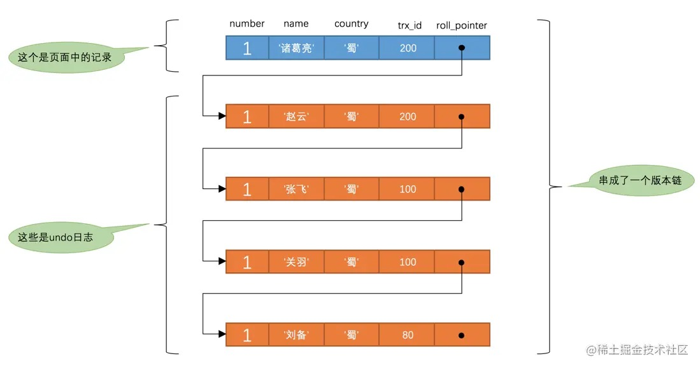

# 21-事务隔离级别和MVCC

## 21.1 事前准备

    -- 创建一个表
    CREATE TABLE hero (
        number INT,
        name VARCHAR(100),
        country varchar(100),
        PRIMARY KEY (number)
    ) Engine=InnoDB CHARSET=utf8;

    -- 插入一条数据
    INSERT INTO hero VALUES(1, '刘备', '蜀');

    -- 表里的数据
    SELECT * FROM hero;
    +--------+--------+---------+
    | number | name   | country |
    +--------+--------+---------+
    |      1 | 刘备   | 蜀      |
    +--------+--------+---------+

## 21.2 事务隔离级别

事务的`隔离性`特性，理论上某个事务对某个数据进行访问时，其他事务应该排队等待，当该事务提交之后，其他事务才可以继续访问这个数据。

但这样对性能影响太大，如果既想保持事务的`隔离性`，又想让访问同一数据的多个事务性能尽量高，只能舍一部分`隔离性`而取性能。

### 21.2.1 事务并发执行时遇到的一致性问题

- 脏写（`Dirty Write`）  
  一个事务修改了另一个未提交事务修改过的数据，当另一个事务回滚后，这个事务的修改也就没有了，那就是发生了`脏写`。
- 脏读（`Dirty Read`）  
  一个事务读取了另一个未提交事务修改过的数据，当另一个事务回滚后，这个事务读取到的数据也就没有了，那就是发生了`脏读`。
- 不可重复读（`Non-Repeatable Read`）  
  如果一个事务能读到其他已经提交的事务修改过的数据，当其他事务对某数据修改并提交后，这个事务每次都会读取到该数据的最新值，那就是发生了`不可重复读`。
- 幻读（`Phantom`）  
  如果一个事务先根据某些条件查询出一些记录，之后另一个事务又向表中插入了符合这些条件的记录，原先的事务再次按照该条件查询时，能把另一个事务插入的记录也读出来，那就是发生了`幻读`。

  提示：  
  如果另一个事务删除了一些符合这些条件的记录，原先的事务再次按照该条件查询时，读取到的的记录`变少`了，这种现象不算`幻读`，`幻读`强调的是读取到了之前没有读到的记录。  
  其实这种情况相当于`每一条记录`都发生了`不可重复读`的现象。

### 21.2.2 SQL标准中的4种隔离级别

问题按严重性排序：

    脏写 > 脏读 > 不可重复读 > 幻读

`SQL标准`中设立了`4`个隔离级别：
- `READ UNCOMMITTED`：未提交读。
- `READ COMMITTED`：已提交读。
- `REPEATABLE READ`：可重复读。
- `SERIALIZABLE`：可串行化。

不同的隔离级别可以发生不同严重程度的问题：

| 隔离级别 | 脏写 | 脏读 | 不可重复读 | 幻读
| ---------------- | ------------ | ------------ | ------------ | ------------- |
| READ UNCOMMITTED | Not Possible | Possible     | Possible     | Possible      |
| READ COMMITTED   | Not Possible | Not Possible | Possible     | Possible      |
| REPEATABLE READ  | Not Possible | Not Possible | Not Possible | Possible      |
| SERIALIZABLE     | Not Possible | Not Possible | Not Possible | Not Possible  |

提示：
- `SERIALIZABLE`隔离级别下，所有问题都不会发生。
- 所有隔离级别，都不允许`脏写`发生。

### 21.2.3 MySQL中支持的4种隔离级别

MySQL支持`4`种隔离级别，但在`REPEATABLE READ`隔离级别下，可以禁止幻读发生。

MySQL默认隔离级别为`REPEATABLE READ`，可以手动修改。

**如何设置事务的隔离级别**

    SET [GLOBAL|SESSION] TRANSACTION ISOLATION LEVEL [REPEATABLE READ|READ COMMITTED|READ UNCOMMITTED|SERIALIZABLE];

- 使用`GLOBAL`关键字（`在全局范围影响`）- 之后建立的会话有效：
  - 只对执行完该语句之后产生的会话起作用。
  - 当前已经存在的会话无效。
- 使用`SESSION`关键字（`在会话范围影响`）- 当前会话之后建立的事务有效：
  - 对当前会话的所有后续的事务有效
  - 该语句可以在已经开启的事务中间执行，但不会影响当前正在执行的事务。
  - 如果在事务之间执行，则对后续的事务有效。
- 上述两个关键字都不用（`只对执行语句后的下一个事务产生影响`）- 当前会话之后建立的第一个事务有效：
  - 只对当前会话中下一个即将开启的事务有效。
  - 下一个事务执行完后，后续事务将恢复到之前的隔离级别。
  - 该语句不能在已经开启的事务中间执行，会报错的。

在服务器启动时设置事务的默认隔离级别：

    transaction-isolation=SERIALIZABLE

查看当前会话默认的事务隔离级别：

    mysql> SHOW VARIABLES LIKE 'transaction_isolation';
    +-----------------------+-----------------+
    | Variable_name         | Value           |
    +-----------------------+-----------------+
    | transaction_isolation | REPEATABLE-READ |
    +-----------------------+-----------------+

## 21.3 MVCC原理

### 21.3.1 版本链

InnoDB存储引擎的聚簇索引记录中都包含两个必要的隐藏列（`row_id`不是必要的）：
- `trx_id`：修改该记录的事务的事务id。
- `roll_pointer`：修改该记录的undo日志指针。

表hero现在只包含一条记录：

    mysql> SELECT * FROM hero;
    +--------+--------+---------+
    | number | name   | country |
    +--------+--------+---------+
    |      1 | 刘备   | 蜀      |
    +--------+--------+---------+

假设插入该记录的事务id为`80`：

提示：  
`insert undo`只在事务回滚时有用，事务提交后，会被系统回收。  
但`roll_pointer`不会清除，它占用`7`个字节，第一个比特位标记它指向的`undo日志`的类型，为`1`就代表它指向的`undo日志`类型为`insert undo`。

假设两个`事务id`分别为`100`、`200`的事务对这条记录进行`UPDATE`操作：

每次改动都会记录一条`undo日志`，每条`undo日志`都有一个`roll_pointer`属性（`INSERT`操作的undo日志没有，因为没有更早版本了），将这些undo日志连起来形成一个`链表`：

记录更新的`undo日志`都被`roll_pointer`连接成一个`链表`，这个链表称为`版本链`，版本链的头节点就是当前记录最新的值。

每个版本中还包含生成该版本时对应的`事务id`，这个信息很重要。

### 21.3.2 ReadView

对于`READ UNCOMMITTED`隔离级别的事务，可以读到未提交事务修改过的记录，直接读取记录的最新版本就行。
对于`SERIALIZABLE`隔离级别的事务，使用加锁的方式来访问记录。

对于`READ COMMITTED`和`REPEATABLE READ`隔离级别的事务，必须保证读到的是已经提交了的事务修改过的记录，不能直接读取最新版本的记录。

核心问题：`需要判断版本链中的哪个版本是当前事务可见的`。

InnoDB提出了`ReadView`的概念，主要包含`4`个比较重要的内容：
- `m_ids`：表示在生成ReadView时当前系统中活跃的读写事务的`事务id列表`。
- `min_trx_id`：表示在生成ReadView时当前系统中活跃的读写事务中最小的`事务id`。
- `max_trx_id`：表示生成ReadView时系统中应该分配给`下一个事务的id值`。
- `creator_trx_id`：表示生成该`ReadView`的事务的`事务id`。

有了`ReadView`，按照下边的步骤判断某条记录的某个版本是否可见：

- 如果被访问版本的`trx_id`属性值与`ReadView`中的`creator_trx_id`值相同，意味着当前事务在访问它自己修改过的记录，所以该版本可以被当前事务访问。

- 如果被访问版本的`trx_id`属性值小于`ReadView`中的`min_trx_id`值，表明生成该版本的事务在当前事务生成`ReadView`前已经提交，所以该版本可以被当前事务访问。

- 如果被访问版本的`trx_id`属性值大于或等于`ReadView`中的`max_trx_id`值，表明生成该版本的事务在当前事务生成`ReadView`后才开启，所以该版本不可以被当前事务访问。

- 如果被访问版本的`trx_id`属性值在`ReadView`的`min_trx_id`和`max_trx_id`之间，那就需要判断一下`trx_id`属性值是不是在`m_ids`列表中：
  - 如果在，说明创建`ReadView`时生成该版本的事务还是活跃的，该版本不可以被访问。
  - 如果不在，说明创建`ReadView`时生成该版本的事务已经被提交，该版本可以被访问。

如果某个版本的数据对当前事务不可见，就顺着版本链找下一个版本的数据，继续按照上边的步骤判断可见性，直到版本链中的最后一个版本。
如果最后一个版本也不可见的话，那么就意味着该条记录对该事务完全不可见，查询结果就不包含该记录。

MySQL中`READ COMMITTED`和`REPEATABLE READ`隔离级别的一个非常大的区别就是它们生成ReadView的时机不同。

**举例说明**

以表`hero`为例，假设现在表`hero`中只有一条由事务id为`80`的事务插入的一条记录：

    mysql> SELECT * FROM hero;
    +--------+--------+---------+
    | number | name   | country |
    +--------+--------+---------+
    |      1 | 刘备   | 蜀      |
    +--------+--------+---------+

**1、READ COMMITTED —— 每次读取数据前都生成一个ReadView**

系统里有两个事务id分别为`100`、`200`的事务在执行：

    # Transaction 100
    BEGIN;

    UPDATE hero SET name = '关羽' WHERE number = 1;

    UPDATE hero SET name = '张飞' WHERE number = 1;
    
    
    # Transaction 200
    BEGIN;

    # 更新了一些别的表的记录
    ...

此时记录的版本链表如下：

现在有一个使用`READ COMMITTED`隔离级别的事务开始执行：

    # 使用READ COMMITTED隔离级别的事务
    BEGIN;

    # SELECT1：Transaction 100、200未提交
    SELECT * FROM hero WHERE number = 1; # 得到的列name的值为'刘备'

`SELECT1`的执行过程：

- 执行SELECT语句时先生成一个ReadView，ReadView的m_ids列表的内容就是[100, 200]，min_trx_id为100，max_trx_id为201，creator_trx_id为0。
- 然后从版本链中挑选可见的记录，最新版本的列name的内容是'张飞'，该版本的trx_id值为100，在m_ids列表内，不符合可见性要求，跳到下一个版本。
- 下一个版本的列name的内容是'关羽'，该版本的trx_id值也为100，也在m_ids列表内，所以也不符合要求，继续跳到下一个版本。
- 下一个版本的列name的内容是'刘备'，该版本的trx_id值为80，小于ReadView中的min_trx_id值100，所以这个版本是符合要求的，最后返回给用户的版本就是这条列name为'刘备'的记录。

把事务id为`100`的事务提交一下：

    # Transaction 100
    BEGIN;

    UPDATE hero SET name = '关羽' WHERE number = 1;

    UPDATE hero SET name = '张飞' WHERE number = 1;

    COMMIT;

再到事务id为`200`的事务中更新一下表hero中number为1的记录：

    # Transaction 200
    BEGIN;

    # 更新了一些别的表的记录
    ...

    UPDATE hero SET name = '赵云' WHERE number = 1;

    UPDATE hero SET name = '诸葛亮' WHERE number = 1;

此时记录的版本链表如下：

然后再到刚才使用`READ COMMITTED`隔离级别的事务中继续查找这个number为1的记录：

    # 使用READ COMMITTED隔离级别的事务
    BEGIN;

    # SELECT1：Transaction 100、200均未提交
    SELECT * FROM hero WHERE number = 1; # 得到的列name的值为'刘备'

    # SELECT2：Transaction 100提交，Transaction 200未提交
    SELECT * FROM hero WHERE number = 1; # 得到的列name的值为'张飞'

`SELECT2`的执行过程：

- 执行SELECT语句时又会单独生成一个ReadView，该ReadView的m_ids列表的内容就是[200]（事务id为100的那个事务已经提交），min_trx_id为200，max_trx_id为201，creator_trx_id为0。
- 然后从版本链中挑选可见的记录，最新版本的列name的内容是'诸葛亮'，该版本的trx_id值为200，在m_ids列表内，所以不符合可见性要求，跳到下一个版本。
- 下一个版本的列name的内容是'赵云'，该版本的trx_id值为200，也在m_ids列表内，所以也不符合要求，继续跳到下一个版本。
- 下一个版本的列name的内容是'张飞'，该版本的trx_id值为100，小于ReadView中的min_trx_id值200，所以这个版本是符合要求的，最后返回给用户的版本就是这条列name为'张飞'的记录。

以此类推，如果之后事务id为`200`的事务也提交了，再次在使用`READ COMMITTED`隔离级别的事务查询时，得到的结果就是'诸葛亮'了。

总结一下就是：  
使用`READ COMMITTED`隔离级别的事务在每次查询开始时都会生成一个独立的`ReadView`。

**2、REPEATABLE READ —— 在第一次读取数据时生成一个ReadView**

对于使用`REPEATABLE READ`隔离级别的事务来说，只会在第一次执行查询语句时生成一个`ReadView`，之后的查询就不会重复生成了。

系统里有两个事务id分别为`100`、`200`的事务在执行：

    # Transaction 100
    BEGIN;

    UPDATE hero SET name = '关羽' WHERE number = 1;

    UPDATE hero SET name = '张飞' WHERE number = 1;

    # Transaction 200
    BEGIN;

    # 更新了一些别的表的记录
    ...

此时记录的版本链表如下：

现在有一个使用`REPEATABLE READ`隔离级别的事务开始执行：

    # 使用REPEATABLE READ隔离级别的事务
    BEGIN;

    # SELECT1：Transaction 100、200未提交
    SELECT * FROM hero WHERE number = 1; # 得到的列name的值为'刘备'

`SELECT1`的执行过程：

- 执行SELECT语句时先生成一个ReadView，ReadView的m_ids列表的内容就是[100, 200]，min_trx_id为100，max_trx_id为201，creator_trx_id为0。
- 然后从版本链中挑选可见的记录，最新版本的列name的内容是'张飞'，该版本的trx_id值为100，在m_ids列表内，所以不符合可见性要求，跳到下一个版本。
- 下一个版本的列name的内容是'关羽'，该版本的trx_id值也为100，也在m_ids列表内，所以也不符合要求，继续跳到下一个版本。
- 下一个版本的列name的内容是'刘备'，该版本的trx_id值为80，小于ReadView中的min_trx_id值100，所以这个版本是符合要求的，最后返回给用户的版本就是这条列name为'刘备'的记录。

把事务id为`100`的事务提交一下：

    # Transaction 100
    BEGIN;

    UPDATE hero SET name = '关羽' WHERE number = 1;

    UPDATE hero SET name = '张飞' WHERE number = 1;

    COMMIT;

再到事务id为`200`的事务中更新一下表hero中number为1的记录：

    # Transaction 200
    BEGIN;

    # 更新了一些别的表的记录
    ...

    UPDATE hero SET name = '赵云' WHERE number = 1;

    UPDATE hero SET name = '诸葛亮' WHERE number = 1;

此时记录的版本链表如下：

再到刚才使用`REPEATABLE READ`隔离级别的事务中继续查找这个number为1的记录：

    # 使用REPEATABLE READ隔离级别的事务
    BEGIN;

    # SELECT1：Transaction 100、200均未提交
    SELECT * FROM hero WHERE number = 1; # 得到的列name的值为'刘备'

    # SELECT2：Transaction 100提交，Transaction 200未提交
    SELECT * FROM hero WHERE number = 1; # 得到的列name的值仍为'刘备'

`SELECT2`的执行过程：

- 因为当前事务的隔离级别为REPEATABLE READ，之前在执行SELECT1时已经生成过ReadView了，所以此时直接复用之前的ReadView，之前的ReadView的m_ids列表的内容就是[100, 200]，min_trx_id为100，max_trx_id为201，creator_trx_id为0。
- 然后从版本链中挑选可见的记录，最新版本的列name的内容是'诸葛亮'，该版本的trx_id值为200，在m_ids列表内，所以不符合可见性要求，跳到下一个版本。
- 下一个版本的列name的内容是'赵云'，该版本的trx_id值为200，也在m_ids列表内，所以也不符合要求，继续跳到下一个版本。
- 下一个版本的列name的内容是'张飞'，该版本的trx_id值为100，也在m_ids列表内，所以也不符合要求，继续跳到下一个版本。
- 下一个版本的列name的内容是'刘备'，该版本的trx_id值为80，小于ReadView中的min_trx_id值100，所以这个版本是符合要求的，最后返回给用户的版本就是这条列c为'刘备'的记录。

两次`SELECT`查询得到的结果是一样的，记录的列c值都是'刘备'，这就是`可重复读`的含义。

### 21.3.3 二级索引与MVCC

后续补充...

### 21.3.4 MVCC小结

`MVCC`（`多版本并发控制`）指的就是在使用`READ COMMITTD`、`REPEATABLE READ`这两种隔离级别的事务在执行普通的`SELECT`操作时访问记录的版本链的过程，这样子可以使不同事务的`读-写`、`写-读`操作并发执行，从而提升系统性能。

`READ COMMITTD`、`REPEATABLE READ`这两个隔离级别的一个很大不同就是：生成`ReadView`的时机不同。
- `READ COMMITTD`在每一次进行普通`SELECT`操作前都会生成一个`ReadView`。
- `REPEATABLE READ`只在第一次进行普通`SELECT`操作前生成一个`ReadView`，之后的查询操作都重复使用这个`ReadView`。

## 21.4 关于purge

两件事儿：
- `insert undo`在事务提交之后就可以被释放了，而`update undo`由于还需要支持`MVCC`，不能立即删除。
- 为了支持`MVCC`，对于`delete mark`操作来说，仅仅是在记录上打一个删除标记，并没有真正将它删除掉。

随着系统的运行，系统中存在的最早产生的`ReadView`的事务不会再访问某些`update undo`日志，以及被打了删除标记的记录后，后台运行的`purge线程`会把它们真正的删除。

# 完