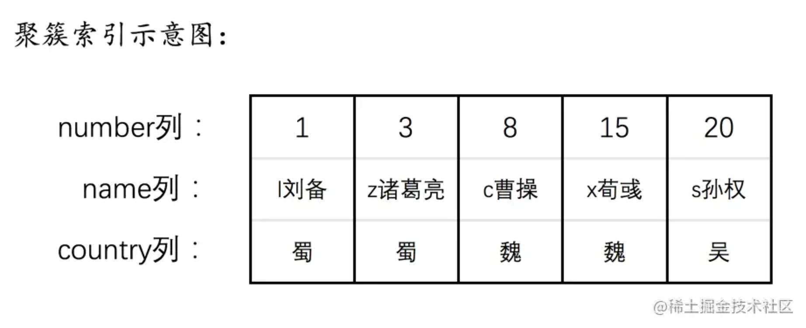
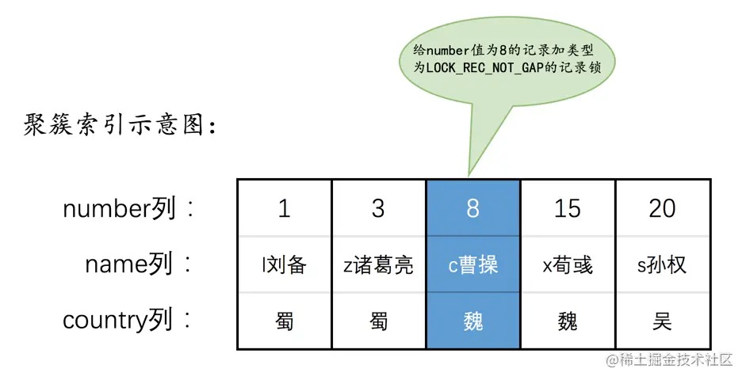
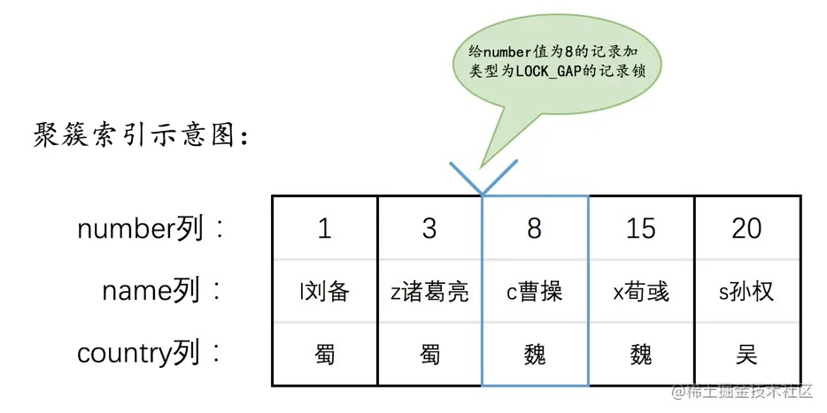
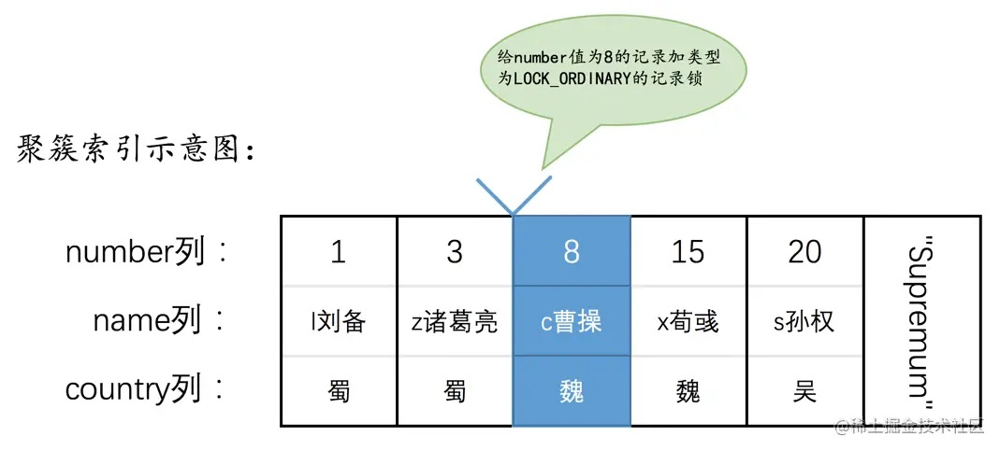
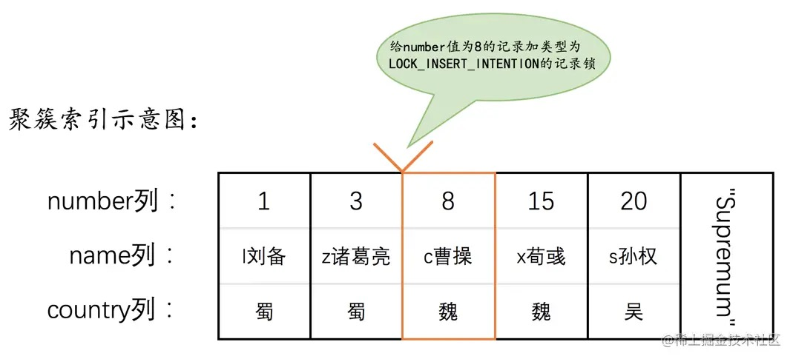
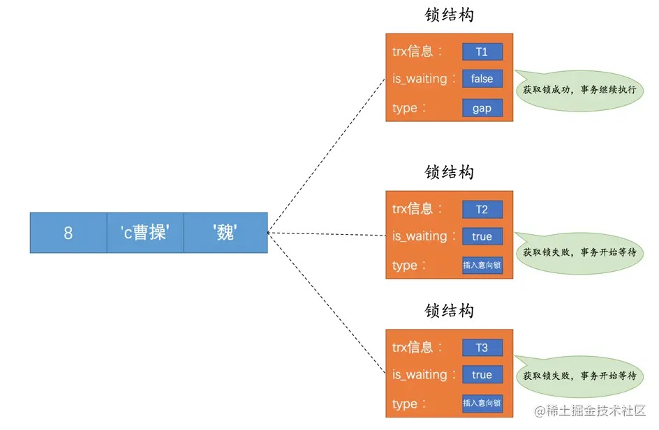
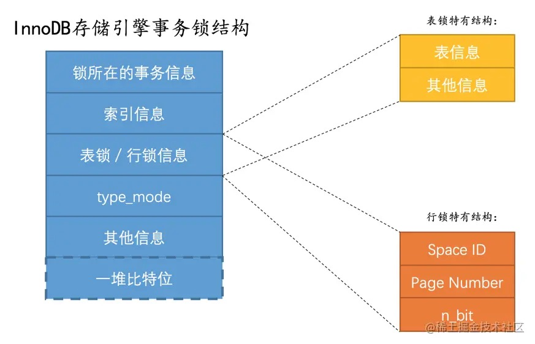
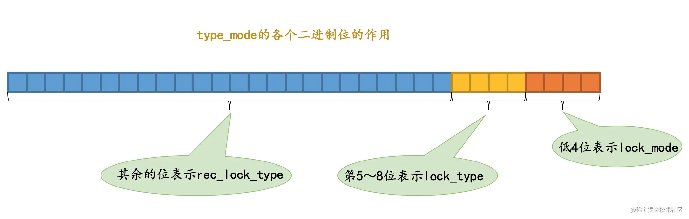
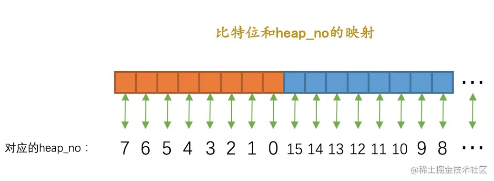

# 22-锁

## 22.1 解决并发事务带来问题的两种基本方式

并发事务访问相同记录的情况可以分3种：
- `读-读`情况：即并发事务相继读取相同的记录。
- `写-写`情况：即并发事务相继对相同的记录做出改动。
- `读-写`或`写-读`情况：一个事务进行读取操作，另一个进行改动操作。

其中`读-读`情况本身不会对记录有改动，不会引起问题。

### 22.1.1 `写-写`情况

这种情况会发生`脏写`问题，任何隔离级别都不允许发生。

多个事务对一条记录做改动时，通过`锁`来保证排队执行。

这个`锁`是一个内存中的结构，在事务执行前本来是没有锁的。

当一个事务想对某条记录做改动时，首先看有没有与这条记录关联的`锁结构`，如果没有就生成一个`锁结构`与之关联：

`锁结构`里有很多信息，两个比较重要的属性：
- `trx信息`：代表这个锁结构是哪个事务生成的。
- `is_waiting`：代表当前事务是否在等待。

因为之前没有别的事务为这条记录加锁，所以`is_waiting`是`false`，这个场景就称之为`获取锁成功`，或者`加锁成功`，然后就可以继续执行操作了。

在事务提交之前，另一个事务也要对该记录做改动，它先看有没有锁结构与这条记录关联，发现有一个锁结构与之关联后，然后也生成了一个锁结构与这条记录关联，锁结构的`is_waiting`为`true`，表示当前事务需要等待，这个场景就称之为`获取锁失败`，或者`加锁失败`。

在第一个事务提交后，会把事务生成的`锁结构`释放，然后看有没有别的事务在等待获取锁，如果有就把那个事务对应的锁结构的is_waiting设为false，然后把那个事务对应的线程唤醒，让它继续执行。

总结：
- `不加锁`  
  不需要在内存中生成对应的锁结构，可以直接执行操作。
- `获取锁成功`，或者`加锁成功`  
  在内存中生成了对应的锁结构，而且锁结构的`is_waiting`为`false`，也就是事务可以继续执行操作。
- `获取锁失败`，或者`加锁失败`，或者`没有获取到锁`  
  在内存中生成了对应的锁结构，不过锁结构的`is_waiting`为`true`，也就是事务需要等待，不可以继续执行操作。

### 22.1.2 `读-写`或`写-读`情况

这种情况下可能发生`脏读`、`不可重复读`、`幻读`问题。

`SQL标准`规定：
- 在`READ UNCOMMITTED`隔离级别下，`脏读`、`不可重复读`、`幻读`都可能发生。
- 在`READ COMMITTED`隔离级别下，`不可重复读`、`幻读`可能发生，`脏读`不可以发生。
- 在`REPEATABLE READ`隔离级别下，`幻读可能发生`，`脏读`和`不可重复读`不可以发生。
- 在`SERIALIZABLE`隔离级别下，上述问题`都不可以发生`。

`MySQL`在`REPEATABLE READ`隔离级别实际上就已经解决了`幻读`问题。

解决`脏读`、`不可重复读`、`幻读`有两种可选方案：

- 方案一：读操作利用多版本并发控制（`MVCC`），写操作进行`加锁`。  
  `MVCC`通过生成一个`ReadView`找到符合条件的记录版本，查询语句只能读到在生成`ReadView`之前已提交事务所做的更改，未提交和之后才开启的事务所做的更改是看不到的。  
  写操作针对的是最新版本的记录，读记录的历史版本和改动记录的最新版本并不冲突。  
  采用`MVCC`时，`读-写`操作并不冲突。  

  提示：  
  在`READ COMMITTED`隔离级别下，事务每次执行`SELECT`操作时都会生成一个`ReadView`，保证了事务不可以读取到未提交的事务所做的更改，避免了`脏读`问题。  
  在`REPEATABLE READ`隔离级别下，事务只在第一次执行`SELECT`操作生成一个`ReadView`，之后的`SELECT`操作都复用这个`ReadView`，避免了`不可重复读`和`幻读`问题。  

- 方案二：读、写操作都采用`加锁`的方式。  
  一些业务场景不允许读取记录的旧版本，每次都必须读取记录的最新版本。  
  比如在银行存款的事务中，需要先把账户的余额读出来，然后加上本次存款的数额，最后再写到数据库中。  
  在将账户余额读取出来后，就不想让别的事务再访问该余额，直到本次存款事务执行完成，其他事务才可以访问账户的余额。  
  这样在读取记录的时候就需要对其进行`加锁`操作，这样`读操作`和`写操作`也像`写-写`操作那样排队执行。  

  提示：  
  `脏读`是当前事务读取了另一个未提交事务的写入，如果另一个事务在写记录的时候就给这条记录加锁，当前事务读取记录也需要加锁，所以就无法继续读取该记录了，就不会有`脏读`问题。  
  `不可重复读`是当前事务先读取一条记录，另外一个事务对该记录做了改动之后并提交，当前事务再次读取时获得不同的值，如果当前事务读取记录时就给该记录加锁，另一个事务修改记录也需要加锁，所以就无法修改该记录，也就不会发生`不可重复读`问题了。  
  
  `幻读`是因为当前事务读取了一个范围的记录，然后另外的事务向该范围内插入了新记录，当前事务再次读取该范围的记录时发现了新插入的新记录。  
  采用`加锁`方式解决`幻读`有点麻烦，因为当前事务第一次读取记录时那些幻影记录并不存在，所以读取的时候并不知道给谁加锁，稍后揭晓答案。  

很明显：
- 采用`MVCC`的方式`读-写`操作彼此并不冲突，性能更高。
- 采用`加锁`方式的`读-写`操作彼此需要排队执行，影响性能。

一般情况下采用`MVCC`来解决`读-写`操作并发执行的问题，只有在某些特殊情况下，才采用`加锁`的方式执行。

### 22.1.3 一致性读

事务利用`MVCC`进行的读取操作称为`一致性读`，或者`一致性无锁读`，也称之为`快照读`。

所有普通的`SELECT`语句在`READ COMMITTED`、`REPEATABLE READ`隔离级别下都是一致性读：

    SELECT * FROM t;
    SELECT * FROM t1 INNER JOIN t2 ON t1.col1 = t2.col2;

`一致性读`并不会对表中的任何记录做`加锁`操作，其他事务可以自由的对表中的记录做改动。

### 22.1.4 锁定读

**共享锁和独占锁**

并发事务的`读-读`情况不会有问题，但`写-写`、`读-写`或`写-读`这些情况可能会有问题，需要使用`MVCC`或者`加锁`的方式来解决。

使用`加锁`方式时，既要允许`读-读`情况不受影响，又要使`写-写`、`读-写`或`写-读`情况中的操作相互阻塞，MySQL给锁分了个类：
- `共享锁`（Shared Locks）：简称`S锁`。  
  在事务要读取一条记录时，需要先获取该记录的`S锁`。
- `独占锁`（Exclusive Locks）：也称`排他锁`，简称`X锁`。  
  在事务要改动一条记录时，需要先获取该记录的`X锁`。

`S锁`和`S锁`是兼容的，`S锁`和`X锁`是不兼容的，`X锁`和`X锁`也是不兼容的：

| 兼容性 | X     | S     |
| ----- | ----- | ----- |
| X     | 不兼容 | 不兼容 |
| S     | 不兼容 | 兼容  |

**锁定读的语句**

前边说在采用`加锁`方式解决`脏读`、`不可重复读`、`幻读`这些问题时，读取一条记录时需要获取该记录的`S锁`，其实有时候也想在读取记录时就获取记录的`X锁`，来禁止别的事务读写该记录。

MySQL提出了`两种`比较特殊的`SELECT`语句格式：

- 对读取的记录加`S锁`：
  
      SELECT ... LOCK IN SHARE MODE;

  如果事务执行了该语句，那么会为读取到的记录加`S锁`，这样允许别的事务继续获取这些记录的`S锁`，但不能获取这些记录的`X锁`，会阻塞直到当前事务提交之后将这些记录上的`S锁`释放。

- 对读取的记录加`X锁`：
  
      SELECT ... FOR UPDATE;

  如果事务执行了该语句，那么会为读取到的记录加`X锁`，这样既不允许别的事务获取这些记录的`S锁`，也不允许获取这些记录的`X锁`，会阻塞直到当前事务提交之后将这些记录上的`X锁`释放掉。

### 22.1.5 写操作

- `DELETE`：
  
  对一条记录做`DELETE`操作的过程是先在`B+`树中定位到这条记录的位置，然后获取一下这条记录的`X锁`，然后再执行`delete mark`操作。  
  这个定位待删除记录在B+树中位置的过程看成是一个`获取X锁的锁定读`。

- `UPDATE`：
  
  分三种情况：
  - 如果未修改该记录的主键值，并且被更新的列占用的存储空间在修改前后未发生变化，则先在`B+`树中定位到这条记录的位置，然后再获取一下这条记录的`X锁`，最后在原记录的位置进行修改操作。  
    这个定位待修改记录在B+树中位置的过程看成是一个`获取X锁的锁定读`。

  - 如果未修改该记录的主键值，并且至少有一个被更新的列占用的存储空间在修改前后发生变化，则先在`B+`树中定位到这条记录的位置，然后获取一下记录的`X锁`，将该记录彻底删除掉，最后再插入一条新记录。  
    这个定位待修改记录在B+树中位置的过程看成是一个`获取X锁的锁定读`，新插入的记录由`INSERT`操作提供的`隐式锁`进行保护。

  - 如果修改了该记录的主键值，则相当于在原记录上做`DELETE`操作之后再来一次`INSERT`操作，加锁操作就需要按照`DELETE`和`INSERT`的规则进行了。

- `INSERT`：
  
  一般情况下，新插入一条记录的操作并不加锁，InnoDB通过`隐式锁`来保护这条新插入的记录在本事务提交前不被别的事务访问。

## 22.2 多粒度锁

前边提到的锁都是针对记录的`行级锁`或者`行锁`，对一条记录加锁只影响这条记录，这个锁的粒度比较细。

事务也可以在表级别进行加锁，称为`表级锁`或者`表锁`，对一个表加锁影响整个表中的记录，这个锁的粒度比较粗。

给表加的锁也可以分为`共享锁`（`S锁`）和`独占锁`（`X锁`）：

- 给表加`S锁`：

  如果一个事务给表加了`S锁`：
  - 别的事务`可以`继续获得该表的`S锁`
  - 别的事务`可以`继续获得该表中的某些记录的`S锁`
  - 别的事务`不可以`继续获得该表的`X锁`
  - 别的事务`不可以`继续获得该表中的某些记录的`X锁`

- 给表加`X锁`：

  如果一个事务给表加了`X锁`：
  - 别的事务`不可以`继续获得该表的`S锁`
  - 别的事务`不可以`继续获得该表中的某些记录的`S锁`
  - 别的事务`不可以`继续获得该表的`X锁`
  - 别的事务`不可以`继续获得该表中的某些记录的`X锁`

`意向锁`（`Intention Locks`）：
- `意向共享锁`（`Intention Shared Lock`）：简称`IS锁`。  
  当事务准备在某条记录上加`S锁`时，需要先在表级别加一个`IS锁`。
- `意向独占锁`（`Intention Exclusive Lock`）：简称`IX锁`。  
  当事务准备在某条记录上加`X锁`时，需要先在表级别加一个`IX锁`。

意向锁`IS锁`和`IX锁`是`表级锁`，它们是为了在加`表级别`的`S锁`和`X锁`时可以快速判断表中是否有记录被加上对应的锁，来决定是否可以为表加相应的锁。

意向锁是互相兼容的：
- `IS锁`和`IS锁`是兼容的。
- `IS锁`和`IX锁`是兼容的。
- `IX锁`和`IX锁`是兼容的。

各种锁的兼容性：

| 兼容性 |   X    |   IX   |    S   |   IS   | 
| ----- | ------ | ------ | ------ | ------ |
| X     | 不兼容  | 不兼容  |  不兼容 |  不兼容 |
| IX    | 不兼容  | 兼容    |  不兼容 |  兼容  |
| S     | 不兼容  | 不兼容  |  兼容   |  兼容  |
| IS    | 不兼容  | 兼容    |  兼容   |  兼容  |

## 22.3 MySQL中的行锁和表锁

不同存储引擎对锁的支持不一样，重点讨论InnoDB存储引擎中的锁。

### 22.3.1 其他存储引擎中的锁

对于`MyISAM`、`MEMORY`、`MERGE`这些存储引擎，只支持`表级锁`，并且不支持事务，所以这些存储引擎的锁一般都是针对会话来说的。

比如：
- Session 1中对一个表执行`SELECT`操作，相当于为这个表加了一个表级别的`S锁`。
- Session 2中对这个表执行`UPDATE`操作，相当于要获取表的`X锁`，此时会被阻塞，直到Session 1中的`SELECT`操作完成，释放表级别的`S锁`后，Session 2才能继续获取`X锁`，然后执行具体的更新语句。

### 22.3.2 InnoDB存储引擎中的锁

InnoDB存储引擎既支持`表锁`，也支持`行锁`。
- `表锁`实现简单，占用资源较少，不过粒度很粗，性能较差。
- `行锁`粒度更细，可以实现更精准的并发控制。

**InnoDB中的表级锁**

- 表级别的`S锁`、`X锁`

  在对表执行`DML`语句（`SELECT`、`INSERT`、`DELETE`、`UPDATE`）时，InnoDB存储引擎不会为表添加表级别的`S锁`或者`X锁`。

  在对表执行`DDL`语句（`ALTER TABLE`、`DROP TABLE`等）时，其他事务对该表执行`DML`语句（`SELECT`、`INSERT`、`DELETE`、`UPDATE`）会发生阻塞，同理，反过来也会发生阻塞。
  
  这个过程是在`server层`使用`元数据锁`（`Metadata Locks`，`MDL`）实现的，不会使用InnoDB存储引擎自己提供的`表级别`的`S锁`和`X锁`。

  其实InnoDB存储引擎提供的表级`S锁`或者`X锁`只会在一些特殊情况下用到，比如崩溃恢复过程中会用到。

- 表级别的`IS锁`、`IX锁`
  
  对表的记录加`S锁`之前，需要先在表级别加一个`IS锁`。

  对表的记录加`X锁`之前，需要先在表级别加一个`IX锁`。

  `IS锁`和`IX锁`的使命只是为了后续在加表级别的`S锁`和`X锁`时判断表中是否有已经被加锁的记录，避免用遍历的方式来查看表中有没有上锁的记录。

- 表级别的`AUTO-INC锁`
  
  系统自动给`AUTO_INCREMENT`修饰的列递增赋值的原理有两个：

  - 采用`AUTO-INC锁`
    
    在执行插入语句时在表级别加一个`AUTO-INC锁`，然后为每条待插入记录的`AUTO_INCREMENT`修饰的列分配递增的值，该语句执行结束后，把`AUTO-INC锁`释放。
    
    一个事务在持有`AUTO-INC锁`的过程中，其他事务的插入语句都要阻塞，可以保证一个语句中分配的`递增值`是`连续`的。

    当插入语句在执行前不确定具体要插入多少条记录（`INSERT ... SELECT` 等语句），一般使用`AUTO-INC锁`为`AUTO_INCREMENT`修饰的列生成对应的值。

    提示：  
    `AUTO-INC锁`的作用范围只是单个插入语句，插入语句执行完成后，这个锁就被释放了，和之前介绍的锁在事务结束时释放是不一样的。

  - 采用一个`轻量级的锁`
    
    为插入语句生成`AUTO_INCREMENT`修饰的列的值时获取一下这个轻量级锁，生成本次插入语句需要用到的`AUTO_INCREMENT`列的值之后，就把该轻量级锁释放，并不需要等到整个插入语句执行完才释放锁。

    当插入语句在执行前可以确定具体要插入多少条记录时，一般采用轻量级锁的方式对`AUTO_INCREMENT`修饰的列进行赋值。
    
    这种方式可以避免锁定表，可以提升插入性能。

    提示：  
    系统变量`innodb_autoinc_lock_mode`控制使用哪种方式为`AUTO_INCREMENT`修饰的列进行赋值：
    - 当`innodb_autoinc_lock_mode`为`0`时，一律采用`AUTO-INC锁`。
    - 当`innodb_autoinc_lock_mode`为`2`时，一律采用`轻量级锁`。
    - 当`innodb_autoinc_lock_mode`为`1`时，两种方式都使用（插入记录数量确定时采用`轻量级锁`，不确定时使用`AUTO-INC锁`）。

**InnoDB中的行级锁**

`行锁`，也称为`记录锁`，就是在记录上加的锁。

InnoDB的`行锁`分成了各种类型，类型不同，起到的功效也是不同的。

新建表并插入数据：

    CREATE TABLE hero (
      number int(11) NOT NULL,
      name varchar(100) DEFAULT NULL,
      country varchar(100) DEFAULT NULL,
      PRIMARY KEY (number),
      KEY idx_name (name)
    ) ENGINE=InnoDB DEFAULT CHARSET=utf8;

    select * from hero;
    +--------+------------+---------+
    | number | name       | country |
    +--------+------------+---------+
    |      1 | l刘备      | 蜀      |
    |      3 | z诸葛亮    | 蜀      |
    |      8 | c曹操      | 魏      |
    |     15 | x荀彧      | 魏      |
    |     20 | s孙权      | 吴      |
    +--------+------------+---------+

表的聚簇索引示意图：

聚簇索引中的记录是按照主键大小排序的。

常用的`行锁类型`：

- `Record Locks`
  
  前边提到的记录锁就是这种类型，仅仅把一条记录锁上，起一个名字：`正经记录锁`。  
  官方的类型名称为：`LOCK_REC_NOT_GAP`。

  把number值为8的那条记录加一个正经记录锁：

  

  正经记录锁有`S锁`和`X锁`之分，称为`S型正经记录锁`和`X型正经记录锁`。
  - 当一个事务获取了一条记录的`S型正经记录锁`后，其他事务也可以继续获取该记录的`S型正经记录锁`，但不可以继续获取`X型正经记录锁`。
  - 当一个事务获取了一条记录的`X型正经记录锁`后，其他事务既不可以继续获取该记录的`S型正经记录锁`，也不可以继续获取`X型正经记录锁`。

- `Gap Locks`
  
  MySQL在`REPEATABLE READ`隔离级别可以解决`幻读`问题，解决方案有两种：
  - 使用`MVCC`方案解决。
  - 采用`加锁`方案解决。
  
  使用`加锁`方案时，事务第一次执行读取操作时，幻影记录还不存在，无法给这些幻影记录加`正经记录锁`。
  
  InnoDB提出了一种称为`Gap Locks`的锁，官方的类型名称为：`LOCK_GAP`，也简称为`gap锁`。
  
  把number值为8的那条记录加一个gap锁：

  

  这样就不允许别的事务在number值为8的记录前边的间隙插入新记录，也就是number列的值(3, 8)这个区间不允许新记录立即插入，会一直阻塞直到拥有这个`gap锁`的事务提交之后才可以插入。

  `gap锁`仅仅是为了防止插入幻影记录而提出的，虽然有`共享gap锁`和`独占gap锁`，但是它们起到的作用都是`相同`的，而且对一条记录加`gap锁`并不会限制其他事务对这条记录加`正经记录锁`或者继续加`gap锁`。

  对于最后一条记录之后的间隙，是通过给索引中的最后一条记录所在页中的`最大伪记录`（`Supremum记录`）加`gap锁`来实现的。
  
  给number值为20的那条记录所在页面的Supremum记录加一个gap锁：

  

  这样就可以阻止其他事务插入number值在(20, +∞)这个区间的新记录。

- `Next-Key Locks`
  
  有时候既想锁住某条记录，又想阻止其他事务在该记录前边的间隙插入新记录，InnoDB提出了一种称为`Next-Key Locks`的锁，官方的类型名称为：`LOCK_ORDINARY`，也简称为`next-key锁`。
  
  把number值为8的那条记录加一个next-key锁：

  

  `next-key锁`的本质就是一个`正经记录锁`和一个`gap锁`的合体，既能保护该条记录，又能阻止别的事务将新记录插入被保护记录前边的间隙。

- `Insert Intention Locks`
  
  一个事务在插入一条记录时需要判断一下插入位置是不是被别的事务加了`gap锁`（`next-key锁`也包含`gap锁`），如果有插入操作需要等待，直到拥有`gap锁`的那个事务提交。
  
  InnoDB规定事务在等待的时候也需要在内存中生成一个`锁结构`，表明事务想在某个间隙中插入新记录，现在在等待。
  
  InnoDB把这种类型的锁命名为`Insert Intention Locks`，官方的类型名称为：`LOCK_INSERT_INTENTION`，也称为`插入意向锁`。
  
  把number值为8的那条记录加一个插入意向锁：

  

  举个例子：
  
  现在`T1`为number值为8的记录加了一个gap锁，然后`T2`和`T3`分别想向表中插入number值分别为4、5的两条记录，现在为number值为8的记录加的锁如下所示：

  

  由于`T1`持有gap锁，所以`T2`和`T3`需要生成一个插入意向锁的锁结构并且处于等待状态。
  
  当`T1`提交后会把它获取到的锁都释放掉，这样`T2`和`T3`就能获取到对应的插入意向锁了，`T2`和`T3`之间也并不会相互阻塞，它们可以同时获取到number值为8的插入意向锁，然后执行插入操作。
  
  事实上`插入意向锁`并不会阻止别的事务继续获取该记录上`任何类型的锁`。

- `隐式锁`
  
  一个事务在执行`INSERT`操作时，如果即将插入的间隙已经被其他事务加了`gap锁`，那么本次`INSERT`操作会阻塞，并且当前事务会在该间隙上加一个`插入意向锁`，否则一般情况下`INSERT`操作是不加锁的。
  
  那如果一个事务首先插入了一条记录，此时并没有与该记录关联的`锁结构`，然后另一个事务：

  - 立即使用`SELECT ... LOCK IN SHARE MODE`语句读取这条记录，也就是获取这条记录的`S锁`，或者使用`SELECT ... FOR UPDATE`语句读取这条记录，也就获取这条记录的`X锁`。

    如果允许这种情况的发生，可能产生`脏读`问题。

  - 立即修改这条记录，也就获取这条记录的`X锁`。

    如果允许这种情况的发生，可能产生`脏写`问题。

  这时候`事务id`又起作用了。
  
  把`聚簇索引`和`二级索引`中的记录分开：

  - 情景一：
    
    对于`聚簇索引记录`，有一个`trx_id`隐藏列，该隐藏列记录着最后改动该记录的`事务id`。  
    当前事务中新插入一条聚簇索引记录后，该记录的`trx_id`隐藏列代表的的就是当前事务的`事务id`。  
    如果其他事务此时想对该记录添加`S锁`或者`X锁`时，首先会看该记录的`trx_id`隐藏列代表的事务是否是当前的`活跃事务`。  
    如果是`活跃事务`，帮助当前事务创建一个`X锁`（为当前事务创建一个`锁结构`，`is_waiting`属性是`false`），然后自己进入等待状态（为自己也创建一个`锁结构`，`is_waiting`属性是`true`）。  

  - 情景二：
    
    对于`二级索引记录`，并没有`trx_id`隐藏列，但在二级索引页面的`Page Header`部分有一个`PAGE_MAX_TRX_ID`属性，代表对该页面做改动的最大的`事务id`。  
    如果`PAGE_MAX_TRX_ID`属性值小于当前最小的`活跃事务id`，那么说明对该页面做修改的事务都已经提交了。  
    否则需要在页面中定位到对应的二级索引记录，然后`回表`找到它对应的聚簇索引记录，然后再重复`情景一`的做法。  

  综上所述：  
  一个事务对新插入的记录可以不显式的加锁，但是由于`事务id`的存在，相当于加了一个`隐式锁`。  
  别的事务在对这条记录加`S锁`或者`X锁`时，由于`隐式锁`的存在，会先帮助当前事务生成一个`锁结构`，然后自己再生成一个`锁结构`后进入`等待状态`。  

### 22.3.3 InnoDB锁的内存结构

对一条记录`加锁`的本质就是在内存中创建一个`锁结构`与之关联。

    # 事务T1
    SELECT * FROM hero LOCK IN SHARE MODE;

这条语句需要为表中的`所有记录`进行`加锁`。

在对不同记录加锁时，如果符合下边这些条件：
- 在同一个事务中进行加锁操作
- 被加锁的记录在同一个页面中
- 加锁的类型是一样的
- 等待状态是一样的

那么这些记录的锁就可以被放到`一个锁结构`中。

InnoDB存储引擎中的`锁结构`：

其中：

- `锁所在的事务信息`
  
  不论是`表锁`还是`行锁`，都是生成`锁结构`的事务信息。

- `索引信息`
  
  对于`行锁`来说，加锁的记录属于哪个索引信息。

- `表锁／行锁信息`
  
  `表锁结构`和`行锁结构`在这个位置的内容不同：

  - `表锁`
    
    对哪个表加的锁，还有其他的一些信息。

  - `行锁`
    
    记载了三个重要的信息：
    - `Space ID`：记录所在表空间。
    - `Page Number`：记录所在页号。
    - `n_bits`：对于行锁来说，一条记录对应着一个比特位，一个页面中包含很多记录，用不同的比特位来区分到底是哪一条记录加了锁。
              为此在行锁结构的末尾放置了一堆比特位，这个`n_bits`属性代表使用了多少比特位。

- `type_mode`
  
  这是一个`32位`的数，被分成了`lock_mode`、`lock_type`和`rec_lock_type`三个部分：

  
  
  - 锁的模式（`lock_mode`），占用低4位：
    - `LOCK_IS`（十进制的`0`）：表示共享意向锁，也就是`IS锁`。
    - `LOCK_IX`（十进制的`1`）：表示独占意向锁，也就是`IX锁`。
    - `LOCK_S` （十进制的`2`）：表示共享锁，也就是`S锁`。
    - `LOCK_X` （十进制的`3`）：表示独占锁，也就是`X锁`。
    - `LOCK_AUTO_INC`（十进制的`4`）：表示`AUTO-INC锁`。

  - 锁的类型（`lock_type`），占用`5～8`位，只有第`5`位和第`6`位被使用：
    - `LOCK_TABLE`（十进制的`16`），也就是当第`5`个比特位置为`1`时，表示`表级锁`。
    - `LOCK_REC`（十进制的`32`），也就是当第`6`个比特位置为`1`时，表示`行级锁`。

  - 行锁的具体类型（`rec_lock_type`），使用其余的位来表示。

    只有在`lock_type`的值为`行级锁`（`LOCK_REC`）时，才分为更多类型：
    - `LOCK_ORDINARY`（十进制的`0`）：表示`next-key锁`。
    - `LOCK_GAP`（十进制的`512`）：也就是当第`10`个比特位置为`1`时，表示`gap锁`。
    - `LOCK_REC_NOT_GAP`（十进制的`1024`）：也就是当第`11`个比特位置为`1`时，表示`正经记录锁`。
    - `LOCK_INSERT_INTENTION`（十进制的`2048`）：也就是当第`12`个比特位置为`1`时，表示`插入意向锁`。
    - `其他的类型`：一些不常用的类型。
  
    - `LOCK_WAIT`（十进制的`256`） ：使用第`9`个比特位。
      - 为`1`时，表示`is_waiting`为`true`，当前事务未获取到锁，处在等待状态。
      - 为`0`时，表示`is_waiting`为`false`，当前事务获取锁成功。

- `其他信息`
  
  忽略这部分信息。

- `一堆比特位`
  
  如果是`行锁结构`，该结构末尾放置了一堆比特位，比特位的数量是由上边的`n_bits`属性表示的。
  
  页面中的每条记录在记录头信息中都包含一个`heap_no`属性，伪记录`Infimum`的`heap_no`值为`0`，伪记录`Supremum`的`heap_no`值为`1`，之后每插入一条记录，`heap_no`值就增`1`。
  
  `锁结构`最后的一堆比特位就对应着一个页面中的记录，一个比特位映射一个`heap_no`，映射方式有点怪：
  
  

  只需要知道一个比特位映射到页内的一条记录就好了。

## 22.4 语句加锁分析
### 22.4.1 普通的SELECT语句
### 22.4.2 锁定读的语句
### 22.4.3 半一致性读的语句
### 22.4.4 INSERT语句

## 22.5 查看事务加锁情况
### 22.5.1 使用information_schema数据库中的表获取锁信息
### 22.5.2 使用SHOW ENINGE INNODB STATUS获取锁信息

## 22.6 死锁

## 22.7 总结

# 完