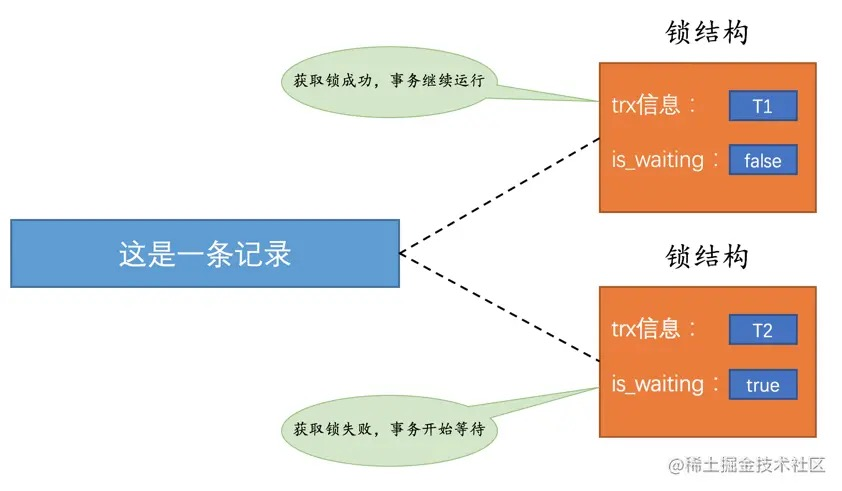

# 22-锁

## 22.1 解决并发事务带来问题的两种基本方式

并发事务访问相同记录的情况可以分3种：
- `读-读`情况：即并发事务相继读取相同的记录。
- `写-写`情况：即并发事务相继对相同的记录做出改动。
- `读-写`或`写-读`情况：一个事务进行读取操作，另一个进行改动操作。

其中`读-读`情况本身不会对记录有改动，不会引起问题。

### 22.1.1 `写-写`情况

这种情况会发生`脏写`问题，任何隔离级别都不允许发生。

多个事务对一条记录做改动时，通过`锁`来保证排队执行。

这个`锁`是一个内存中的结构，在事务执行前本来是没有锁的。

当一个事务想对某条记录做改动时，首先看有没有与这条记录关联的`锁结构`，如果没有就生成一个`锁结构`与之关联：

`锁结构`里有很多信息，两个比较重要的属性：
- `trx信息`：代表这个锁结构是哪个事务生成的。
- `is_waiting`：代表当前事务是否在等待。

因为之前没有别的事务为这条记录加锁，所以`is_waiting`是`false`，这个场景就称之为`获取锁成功`，或者`加锁成功`，然后就可以继续执行操作了。

在事务提交之前，另一个事务也要对该记录做改动，它先看有没有锁结构与这条记录关联，发现有一个锁结构与之关联后，然后也生成了一个锁结构与这条记录关联，锁结构的`is_waiting`为`true`，表示当前事务需要等待，这个场景就称之为`获取锁失败`，或者`加锁失败`。

在第一个事务提交后，会把事务生成的`锁结构`释放，然后看有没有别的事务在等待获取锁，如果有就把那个事务对应的锁结构的is_waiting设为false，然后把那个事务对应的线程唤醒，让它继续执行。

总结：
- `不加锁`  
  不需要在内存中生成对应的锁结构，可以直接执行操作。
- `获取锁成功`，或者`加锁成功`  
  在内存中生成了对应的锁结构，而且锁结构的`is_waiting`为`false`，也就是事务可以继续执行操作。
- `获取锁失败`，或者`加锁失败`，或者`没有获取到锁`  
  在内存中生成了对应的锁结构，不过锁结构的`is_waiting`为`true`，也就是事务需要等待，不可以继续执行操作。

### 22.1.2 `读-写`或`写-读`情况

这种情况下可能发生`脏读`、`不可重复读`、`幻读`问题。

`SQL标准`规定：
- 在`READ UNCOMMITTED`隔离级别下，`脏读`、`不可重复读`、`幻读`都可能发生。
- 在`READ COMMITTED`隔离级别下，`不可重复读`、`幻读`可能发生，`脏读`不可以发生。
- 在`REPEATABLE READ`隔离级别下，`幻读可能发生`，`脏读`和`不可重复读`不可以发生。
- 在`SERIALIZABLE`隔离级别下，上述问题`都不可以发生`。

`MySQL`在`REPEATABLE READ`隔离级别实际上就已经解决了`幻读`问题。

解决`脏读`、`不可重复读`、`幻读`有两种可选方案：

- 方案一：读操作利用多版本并发控制（`MVCC`），写操作进行`加锁`。  
  `MVCC`通过生成一个`ReadView`找到符合条件的记录版本，查询语句只能读到在生成`ReadView`之前已提交事务所做的更改，未提交和之后才开启的事务所做的更改是看不到的。  
  写操作针对的是最新版本的记录，读记录的历史版本和改动记录的最新版本并不冲突。  
  采用`MVCC`时，`读-写`操作并不冲突。  

  提示：  
  在`READ COMMITTED`隔离级别下，事务每次执行`SELECT`操作时都会生成一个`ReadView`，保证了事务不可以读取到未提交的事务所做的更改，避免了`脏读`问题。  
  在`REPEATABLE READ`隔离级别下，事务只在第一次执行`SELECT`操作生成一个`ReadView`，之后的`SELECT`操作都复用这个`ReadView`，避免了`不可重复读`和`幻读`问题。  

- 方案二：读、写操作都采用`加锁`的方式。  
  一些业务场景不允许读取记录的旧版本，每次都必须读取记录的最新版本。  
  比如在银行存款的事务中，需要先把账户的余额读出来，然后加上本次存款的数额，最后再写到数据库中。  
  在将账户余额读取出来后，就不想让别的事务再访问该余额，直到本次存款事务执行完成，其他事务才可以访问账户的余额。  
  这样在读取记录的时候就需要对其进行`加锁`操作，这样`读操作`和`写操作`也像`写-写`操作那样排队执行。  

  提示：  
  `脏读`是当前事务读取了另一个未提交事务的写入，如果另一个事务在写记录的时候就给这条记录加锁，当前事务读取记录也需要加锁，所以就无法继续读取该记录了，就不会有`脏读`问题。  
  `不可重复读`是当前事务先读取一条记录，另外一个事务对该记录做了改动之后并提交，当前事务再次读取时获得不同的值，如果当前事务读取记录时就给该记录加锁，另一个事务修改记录也需要加锁，所以就无法修改该记录，也就不会发生`不可重复读`问题了。  
  
  `幻读`是因为当前事务读取了一个范围的记录，然后另外的事务向该范围内插入了新记录，当前事务再次读取该范围的记录时发现了新插入的新记录。  
  采用`加锁`方式解决`幻读`有点麻烦，因为当前事务第一次读取记录时那些幻影记录并不存在，所以读取的时候并不知道给谁加锁，稍后揭晓答案。  

很明显：
- 采用`MVCC`的方式`读-写`操作彼此并不冲突，性能更高。
- 采用`加锁`方式的`读-写`操作彼此需要排队执行，影响性能。

一般情况下采用`MVCC`来解决`读-写`操作并发执行的问题，只有在某些特殊情况下，才采用`加锁`的方式执行。

### 22.1.3 一致性读

事务利用`MVCC`进行的读取操作称为`一致性读`，或者`一致性无锁读`，也称之为`快照读`。

所有普通的`SELECT`语句在`READ COMMITTED`、`REPEATABLE READ`隔离级别下都是一致性读：

    SELECT * FROM t;
    SELECT * FROM t1 INNER JOIN t2 ON t1.col1 = t2.col2;

`一致性读`并不会对表中的任何记录做`加锁`操作，其他事务可以自由的对表中的记录做改动。

### 22.1.4 锁定读

**共享锁和独占锁**

并发事务的`读-读`情况不会有问题，但`写-写`、`读-写`或`写-读`这些情况可能会有问题，需要使用`MVCC`或者`加锁`的方式来解决。

使用`加锁`方式时，既要允许`读-读`情况不受影响，又要使`写-写`、`读-写`或`写-读`情况中的操作相互阻塞，MySQL给锁分了个类：
- `共享锁`（Shared Locks）：简称`S锁`。  
  在事务要读取一条记录时，需要先获取该记录的`S锁`。
- `独占锁`（Exclusive Locks）：也称`排他锁`，简称`X锁`。  
  在事务要改动一条记录时，需要先获取该记录的`X锁`。

`S锁`和`S锁`是兼容的，`S锁`和`X锁`是不兼容的，`X锁`和`X锁`也是不兼容的：

| 兼容性 | X     | S     |
| ----- | ----- | ----- |
| X     | 不兼容 | 不兼容 |
| S     | 不兼容 | 兼容  |

**锁定读的语句**

前边说在采用`加锁`方式解决`脏读`、`不可重复读`、`幻读`这些问题时，读取一条记录时需要获取该记录的`S锁`，其实有时候也想在读取记录时就获取记录的`X锁`，来禁止别的事务读写该记录。

MySQL提出了`两种`比较特殊的`SELECT`语句格式：

- 对读取的记录加`S锁`：
  
      SELECT ... LOCK IN SHARE MODE;

  如果事务执行了该语句，那么会为读取到的记录加`S锁`，这样允许别的事务继续获取这些记录的`S锁`，但不能获取这些记录的`X锁`，会阻塞直到当前事务提交之后将这些记录上的`S锁`释放。

- 对读取的记录加`X锁`：
  
      SELECT ... FOR UPDATE;

  如果事务执行了该语句，那么会为读取到的记录加`X锁`，这样既不允许别的事务获取这些记录的`S锁`，也不允许获取这些记录的`X锁`，会阻塞直到当前事务提交之后将这些记录上的`X锁`释放掉。

### 22.1.5 写操作

- `DELETE`：
  
  对一条记录做`DELETE`操作的过程是先在`B+`树中定位到这条记录的位置，然后获取一下这条记录的`X锁`，然后再执行`delete mark`操作。  
  这个定位待删除记录在B+树中位置的过程看成是一个`获取X锁的锁定读`。

- `UPDATE`：
  
  分三种情况：
  - 如果未修改该记录的主键值，并且被更新的列占用的存储空间在修改前后未发生变化，则先在`B+`树中定位到这条记录的位置，然后再获取一下这条记录的`X锁`，最后在原记录的位置进行修改操作。  
    这个定位待修改记录在B+树中位置的过程看成是一个`获取X锁的锁定读`。

  - 如果未修改该记录的主键值，并且至少有一个被更新的列占用的存储空间在修改前后发生变化，则先在`B+`树中定位到这条记录的位置，然后获取一下记录的`X锁`，将该记录彻底删除掉，最后再插入一条新记录。  
    这个定位待修改记录在B+树中位置的过程看成是一个`获取X锁的锁定读`，新插入的记录由`INSERT`操作提供的`隐式锁`进行保护。

  - 如果修改了该记录的主键值，则相当于在原记录上做`DELETE`操作之后再来一次`INSERT`操作，加锁操作就需要按照`DELETE`和`INSERT`的规则进行了。

- `INSERT`：
  
  一般情况下，新插入一条记录的操作并不加锁，InnoDB通过`隐式锁`来保护这条新插入的记录在本事务提交前不被别的事务访问。

## 22.2 多粒度锁

前边提到的锁都是针对记录的`行级锁`或者`行锁`，对一条记录加锁只影响这条记录，这个锁的粒度比较细。

事务也可以在表级别进行加锁，称为`表级锁`或者`表锁`，对一个表加锁影响整个表中的记录，这个锁的粒度比较粗。

给表加的锁也可以分为`共享锁`（`S锁`）和`独占锁`（`X锁`）：

- 给表加`S锁`：

  如果一个事务给表加了`S锁`：
  - 别的事务`可以`继续获得该表的`S锁`
  - 别的事务`可以`继续获得该表中的某些记录的`S锁`
  - 别的事务`不可以`继续获得该表的`X锁`
  - 别的事务`不可以`继续获得该表中的某些记录的`X锁`

- 给表加`X锁`：

  如果一个事务给表加了`X锁`：
  - 别的事务`不可以`继续获得该表的`S锁`
  - 别的事务`不可以`继续获得该表中的某些记录的`S锁`
  - 别的事务`不可以`继续获得该表的`X锁`
  - 别的事务`不可以`继续获得该表中的某些记录的`X锁`

`意向锁`（`Intention Locks`）：
- `意向共享锁`（`Intention Shared Lock`）：简称`IS锁`。  
  当事务准备在某条记录上加`S锁`时，需要先在表级别加一个`IS锁`。
- `意向独占锁`（`Intention Exclusive Lock`）：简称`IX锁`。  
  当事务准备在某条记录上加`X锁`时，需要先在表级别加一个`IX锁`。

意向锁`IS锁`和`IX锁`是`表级锁`，它们是为了在加`表级别`的`S锁`和`X锁`时可以快速判断表中是否有记录被加上对应的锁，来决定是否可以为表加相应的锁。

意向锁是互相兼容的：
- `IS锁`和`IS锁`是兼容的。
- `IS锁`和`IX锁`是兼容的。
- `IX锁`和`IX锁`是兼容的。

各种锁的兼容性：

| 兼容性 |   X    |   IX   |    S   |   IS   | 
| ----- | ------ | ------ | ------ | ------ |
| X     | 不兼容  | 不兼容  |  不兼容 |  不兼容 |
| IX    | 不兼容  | 兼容    |  不兼容 |  兼容  |
| S     | 不兼容  | 不兼容  |  兼容   |  兼容  |
| IS    | 不兼容  | 兼容    |  兼容   |  兼容  |

## 22.3 MySQL中的行锁和表锁
### 22.3.1 其他存储引擎中的锁
### 22.3.2 InnoDB存储引擎中的锁
### 22.3.3 InnoDB锁的内存结构

## 22.4 语句加锁分析
### 22.4.1 普通的SELECT语句
### 22.4.2 锁定读的语句
### 22.4.3 半一致性读的语句
### 22.4.4 INSERT语句

## 22.5 查看事务加锁情况
### 22.5.1 使用information_schema数据库中的表获取锁信息
### 22.5.2 使用SHOW ENINGE INNODB STATUS获取锁信息

## 22.6 死锁

## 22.7 总结

# 完