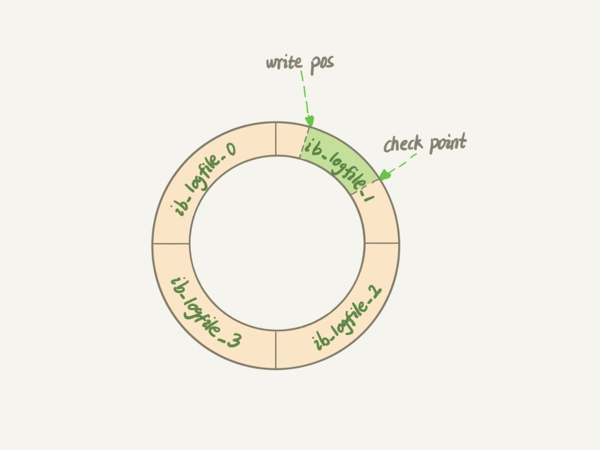
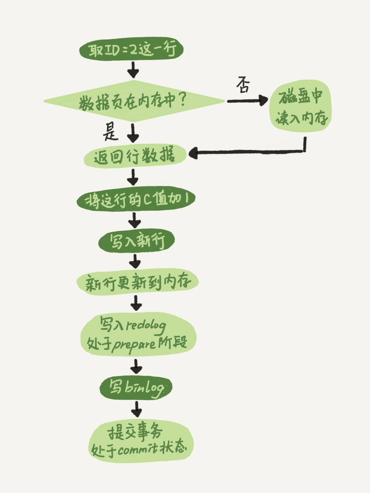

# 02-日志系统：一条SQL更新语句是如何执行的

更新语句和查询语句的执行过程一样，都是经过连接器、分析器、优化器、执行器等功能模块，最后到达存储引擎。

更新语句与查询语句不一样的是，更新流程还涉及两个重要的日志模块：`redo log`（重做日志）和 `binlog`（归档日志）。

## 重要的日志模块：redo log

当有一条记录需要更新的时候，`InnoDB` 引擎就会先把记录写到 `redo log` 里面，并更新内存，这个时候更新就算完成了。

同时，`InnoDB` 引擎会在适当的时候，将这个操作记录更新到磁盘里面，而这个更新往往是在系统比较空闲的时候做。

`InnoDB` 的 `redo log` 是固定大小的，比如可以配置为一组 4 个文件，每个文件的大小是 1GB，那么总共就可以记录 4GB 的操作。

`redo log` 从头开始写，写到末尾就回到开头循环写，如下图所示：

`write pos` 是当前记录的位置，一边写一边后移，写到第 3 号文件末尾后就回到 0 号文件开头。

`checkpoint` 是当前要擦除的位置，也是往后推移并且循环的，擦除记录前要把记录更新到数据文件。

`write pos` 和 `checkpoint` 之间还空着的部分，可以用来记录新的操作。

如果 `write pos` 追上 `checkpoint`，这时候不能再执行新的更新，得停下来先擦掉一些记录，把 `checkpoint` 推进一下。

这样 `InnoDB` 就可以保证即使数据库发生异常重启，之前提交的记录都不会丢失。

## 重要的日志模块：binlog

MySQL 整体来看，其实就有两块：
- 一块是 `Server` 层，它主要做的是 MySQL 功能层面的事情。
- 一块是`存储引擎`层，负责存储相关的具体事宜。

`redo log` 是 `InnoDB` 存储引擎的日志，`binlog` 是 `Server` 层的日志。

这两种日志有三点不同：
- `redo log` 是 `InnoDB` 引擎特有的，`binlog` 是 MySQL 的 `Server` 层实现的，所有引擎都可以使用。
- `redo log` 是物理日志，记录的是在某个数据页上做了什么修改，`binlog` 是逻辑日志，记录的是这个语句的原始逻辑。
- `redo log` 是循环写的，空间固定会用完，`binlog` 是可以追加写入的，`binlog` 文件写到一定大小后会切换到下一个，并不会覆盖以前的日志。

有了对这两个日志的概念性理解，再来看`执行器`和 `InnoDB` 引擎在执行这个简单的 update 语句时的内部流程。

    create table T(ID int primary key, c int);

    update T set c=c+1 where ID=2;

- 执行器先找引擎取 `ID=2` 这一行。`ID` 是主键，引擎直接用树搜索找到这一行。如果 `ID=2` 这一行所在的数据页本来就在内存中，就直接返回给执行器，否则，需要先从磁盘读入内存，然后再返回。
- 执行器拿到引擎给的行数据，把这个值加上 `1`，比如原来是 `N`，现在就是 `N+1`，得到新的一行数据，再调用引擎接口写入这行新数据。
- 引擎将这行新数据更新到内存中，同时将这个更新操作记录到 `redo log` 里面，此时 `redo log` 处于 `prepare` 状态。然后告知执行器执行完成了，随时可以提交事务。
- 执行器生成这个操作的 `binlog`，并把 `binlog` 写入磁盘。
- 执行器调用引擎的提交事务接口，引擎把刚刚写入的 `redo log` 改成提交（commit）状态，更新完成。

这里给出这个 update 语句的执行流程图，图中浅色框表示是在 `InnoDB` 内部执行的，深色框表示是在`执行器`中执行的。

最后三步看上去有点绕，将 `redo log` 的写入拆成了两个步骤：`prepare` 和 `commit`，这就是`两阶段提交`。

## 两阶段提交

两阶段提交是为了让 `redo log` 和 `binlog` 两份日志之间保持同步一致。

`redo log` 和 `binlog` 都可以用于表示事务的提交状态，而两阶段提交就是让这两个状态保持逻辑上的一致。

## 小结

MySQL 里面最重要的两个日志，即物理日志 `redo log` 和逻辑日志 `binlog`。

`innodb_flush_log_at_trx_commit` 这个参数设置成 `1` 的时候，表示每次事务的 `redo log` 都直接持久化到磁盘。

这个参数建议设置成 `1`，这样可以保证 MySQL 异常重启之后`数据`不丢失。

`sync_binlog` 这个参数设置成 `1` 的时候，表示每次事务的 `binlog` 都持久化到磁盘。

这个参数也建议设置成 `1`，这样可以保证 MySQL 异常重启之后 `binlog` 不丢失。

`两阶段提交`是跨系统维持数据逻辑一致性时常用的一个方案，即使不做数据库内核开发，日常开发中也有可能会用到。

# 完