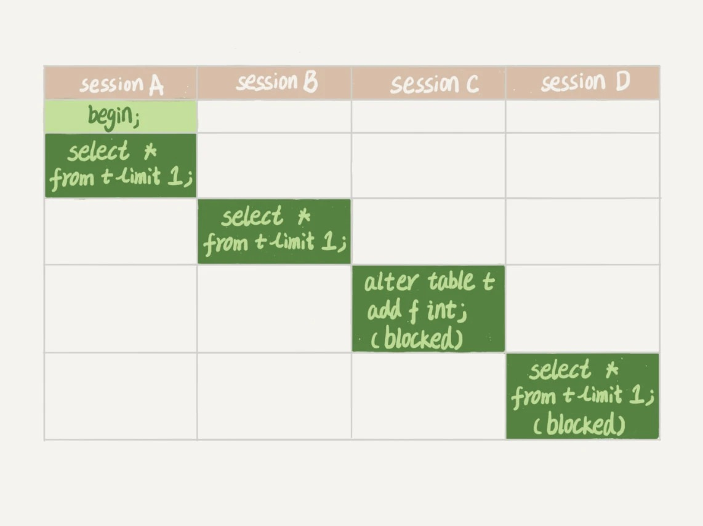

# 06-全局锁和表锁：给表加个字段怎么有这么多阻碍

数据库锁设计的初衷是处理并发问题。

当出现并发访问的时候，数据库需要合理地控制资源的访问规则。

而锁就是用来实现这些访问规则的重要数据结构。

根据加锁的范围，`MySQL` 里面的锁大致可以分成`全局锁`、`表级锁`和`行锁`三类。

这篇文章分享`全局锁`和`表级锁`。

需要说明的是，锁的设计比较复杂，文章不会涉及锁的具体实现细节，主要介绍的是碰到锁时的现象和其背后的原理。

## 全局锁

`全局锁`就是对整个数据库实例加锁。

MySQL 提供了一个加`全局读锁`的方法，命令是 `flush tables with read lock` (`FTWRL`)。

该命令让整个库处于`只读`状态，之后其他线程的以下语句会被阻塞：
- 数据更新语句
- 数据定义语句
- 更新类事务的提交语句

`全局锁`的典型使用场景是，做`全库逻辑备份`。

以前有一种做法，是通过 `FTWRL` 确保不会有其他线程对数据库做更新，然后对整个库做备份。

但是让整库都`只读`很危险：
- 如果在主库上备份，那么在备份期间都不能执行更新，业务基本上停摆。
- 如果在从库上备份，那么备份期间从库不能执行主库同步过来的 `binlog`，会导致主从延迟。

但是如果不加锁的话，备份系统得到的库不是一个逻辑时间点，备份的数据可能是逻辑不一致的。

前面讲事务隔离的时候，在`可重复读`隔离级别下开启一个事务，通过`MVCC`是可以读到一致性数据的。

官方自带的逻辑备份工具是 `mysqldump` 使用参数 `–single-transaction` 的时候，导数据之前就会启动一个事务，确保拿到一致性视图。

而且由于 `MVCC` 的支持，这个过程中数据是可以正常更新的。

然而这种方式只适用于所有的表都使用事务存储引擎的库，如果存在不支持事务的存储引擎的表，就只能使用 `FTWRL` 命令了。

所以 `DBA` 要求业务开发人员使用 `InnoDB` 存储引擎。

下面的命令也能让全库进入只读状态：

    set global readonly=true

但还是建议用 `FTWRL` 方式，两个原因：
- 有些系统中，`readonly` 的值会被用来做其他逻辑，比如用来判断一个库是主库还是备库。这样修改 `global` 变量的方式影响面更大。
- 在异常处理机制上有差异：
  - 执行 `FTWRL` 命令之后由于客户端发生异常断开，`MySQL` 会自动释放这个全局锁，整个库回到可以正常更新的状态。
  - 将整个库设置为 `readonly` 之后，如果客户端发生异常，数据库就会一直保持 `readonly` 状态，导致整个库长时间处于不可写状态。

业务更新不只是增删改数据，还有可能是加字段等修改表结构的操作。

不论是哪种方法，一个库被全局锁上以后，要对里面任何一个表做加字段操作，都是会被锁住。

然而，即使没有被全局锁住，加字段也还会碰到接下来要介绍的`表级锁`。

## 表级锁

`MySQL` 里面表级别的锁有两种：
- 表锁
- 元数据锁（meta data lock，`MDL`）

表锁的语法：

    // 锁表
    LOCK TABLE T [READ|WRITE];

    // 释放所有表锁
    UNLOCK TABLES;

与 `FTWRL` 类似，表锁在客户端断开的时候自动释放。

`LOCK TABLE` 语法除了会限制别的线程的读写外，也限定了本线程接下来的操作对象。

举个例子：

线程 `A` 中执行：

    lock tables t1 read, t2 write;
    
则其他线程写 `t1`、读写 `t2` 的语句都会被阻塞。

线程 `A` 在执行 `unlock tables` 之前，也只能执行读 `t1`、读写 `t2` 的操作，而且也不能访问其他表。

对于 `InnoDB` 这种支持行锁的引擎，一般不使用 `lock tables` 命令来控制并发，毕竟锁住整个表的影响面还是太大。

另一类表级的锁是`元数据锁`（`MDL`），它不需要显式使用，在访问一个表的时候会被自动加上，它的作用是保证读写的正确性。
- 当对一个表做增删改查操作的时候，加 `MDL 读锁`。
- 当对一个表做结构变更操作的时候，加 `MDL 写锁`。

元数据锁的互斥关系：
- 读锁之间不互斥，可以有多个线程同时对一张表增删改查。
- 读写锁之间、写锁之间是互斥的，用来保证变更表结构操作的安全性。

虽然 `MDL` 锁是系统默认会加的，但却是不能忽略的一个机制。

例子：  
给一个小表加个字段，导致整个库挂了。

给一个表加字段，或者修改字段，或者加索引，需要扫描全表的数据。

在对大表操作的时候，肯定会特别小心。

实际上，即使是小表，也会出问题。

假设表 `t` 是一个小表：

- `session A` 先启动，对表 `t` 加一个 `MDL 读锁`。
- `session B` 需要的也是 `MDL 读锁`，可以正常执行。
- `session C` 会被 `blocked`，是因为 `session A` 的 `MDL` 读锁还没有释放，而 `session C` 需要 `MDL` 写锁，因此只能被阻塞。
- `session D` 以及之后的 `MDL` 读锁请求也会被 `session C` 阻塞。

此时所有对表的增删改查操作都需要先申请 `MDL` 读锁，就都被锁住，等于这个表现在完全不可读写了。

如果这个表上的查询语句频繁，而且客户端有重试机制，超时后会再起一个新 `session` 再请求的话，这个库的线程很快就会爆满。

事务中的 `MDL` 锁，在语句执行开始时申请，但是语句结束后并不会马上释放，而会等到整个事务提交后再释放。

如何安全地给小表加字段？

首先要解决`长事务`，事务不提交，就会一直占着 `MDL` 锁。  
通过 `information_schema` 库的 `innodb_trx` 表中，可以查到当前执行中的事务。  
如果要做 `DDL` 变更的表刚好有长事务在执行，要考虑先暂停 `DDL`，或者 `KILL` 掉这个长事务。

如果要变更的表是一个热点表，虽然数据量不大，但是上面的请求很频繁，而又不得不加个字段，该怎么做呢？

这时候 `KILL` 可能未必管用，因为新的请求马上就来了。  
比较理想的机制是，在 `ALTER TABLE` 语句里面设定等待时间，如果在这个指定的等待时间里面能够拿到 `MDL` 写锁最好，拿不到也不要阻塞后面的业务语句，先放弃，之后再通过重试命令重复这个过程。

目前 `MariaDB` 已经合并了 `AliSQL` 的这个功能，所以这两个开源分支目前都支持 `DDL NOWAIT/WAIT N` 这个语法。

    ALTER TABLE tb_name NOWAIT add column ...
    ALTER TABLE tb_name WAIT N add column ...

## 小结

全局锁主要用在逻辑备份过程中。

对于全部是 `InnoDB` 引擎的库，建议使用 `mysqldump` 加参数 `–single-transaction` 进行备份，对应用会更友好。

表锁一般是在数据库引擎不支持行锁的时候才会被用到的。

建议统一使用 `InnoDB` 存储引擎就不需要使用表锁了。

`MDL` 元数据锁直到事务提交才释放，在做表结构变更的时候，要小心不要导致锁住线上查询和更新。

# 完