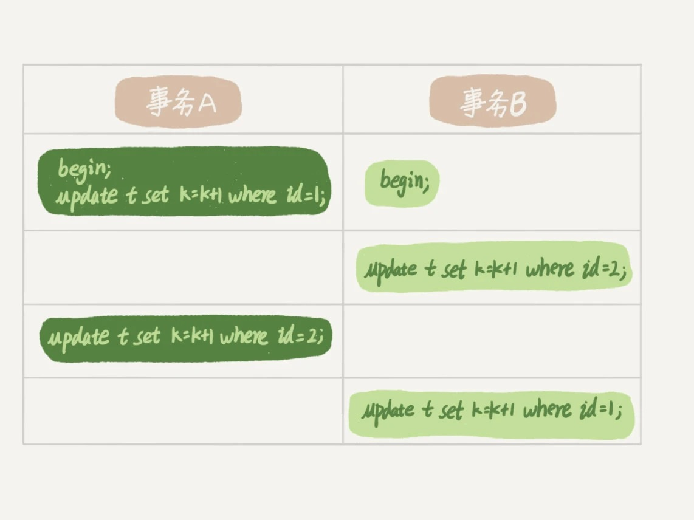

# 07-行锁功过：怎么减少行锁对性能的影响

`MySQL` 的`行锁`是在引擎层由各个引擎自己实现的。

并不是所有的引擎都支持`行锁`。
- `MyISAM` 不支持行锁。
- `InnoDB` 支持行锁。

主要介绍 `InnoDB` 的行锁，以及如何通过减少锁冲突来提升业务并发度。

## 从两阶段锁说起

在 `InnoDB` 事务中，`行锁`是在需要的时候才加上的，但并不是不需要了就立刻释放，而是要等到事务结束时才释放。这个就是`两阶段锁协议`。

如果事务中需要锁多个行，要把最可能造成锁冲突、最可能影响并发度的锁尽量往后放，这样能提升并发性能。

当并发比较高的时候，`MySQL` 仍然会出问题，比如 `CPU` 消耗接近 `100%`，整个数据库每秒执行不了几个事务。

这就要说到`死锁`和`死锁检测`了。

## 死锁和死锁检测

当并发系统中不同线程出现循环资源依赖，涉及的线程都在等待别的线程释放资源时，就会导致这几个线程都进入无限等待的状态，称为`死锁`。

事务 `A` 在等待事务 `B` 释放 `id=2` 的`行锁`，而事务 `B` 在等待事务 `A` 释放 `id=1` 的`行锁`。 

事务 `A` 和事务 `B` 在互相等待对方的资源释放，就是进入了`死锁`状态。

出现死锁后有两种策略：
- 策略一：直接进入等待，直到超时。    
  这个超时时间可以通过参数 `innodb_lock_wait_timeout` 来设置。

- 策略二：发起死锁检测，发现死锁后，主动回滚死锁链条中的某一个事务，让其他事务得以继续执行。    
  将参数 `innodb_deadlock_detect` 设置为 `on`，表示开启这个逻辑。

`InnoDB` 中，`innodb_lock_wait_timeout` 的默认值是 `50s`，对于在线服务来说，这个等待时间往往是无法接受的。如果超时时间设置太短的话，又会出现很多误伤。

正常情况下采用第二种策略，主动`死锁检测`，而且 `innodb_deadlock_detect` 的默认值本身就是 `on`。

主动死锁检测在发生死锁的时候，是能够快速发现并进行处理的，但也是有额外负担的。

每当一个事务获取锁失败被锁的时候，就要查看当前事务和如下事务会不会形成死锁：
- 拥有当前锁的事务
- 排队等待当前锁的事务

判断过程：  
目标事务有没有被别的事务锁住，如果被锁住了，需要继续判断，如此循环，最后判断是否出现了循环等待，也就是`死锁`。

高并发举例：  
如果有 `1000` 个线程并发写入一条记录，只有第一个线程获取到锁，其他 `999` 个线程排队等待。

后续获取锁失败的线程都要针对当时拥有锁和排队等待锁的的事务进行死锁检测，最后到达的线程进行死锁检测的次数最多，需要针对其它 `999` 个线程的事务做死锁检测。

虽然最终检测的结果是没有死锁，但是这期间要消耗大量的 `CPU` 资源。  
因此就会看到服务器 `CPU` 利用率很高，但是每秒却执行不了几个事务。

怎么解决由这种热点行更新导致的性能问题？

问题的症结在于，死锁检测要耗费大量的 `CPU` 资源。

- 关掉死锁检测  
  
  关掉死锁检测意味着可能会出现大量的超时，这是业务有损的。

- 控制并发度  
  
  并发控制要做在数据库服务端。  
  可以考虑在中间件实现。  

- 考虑将一行改成逻辑上的多行来减少锁冲突  
  
  比如要并发更新一个账户记录，可以考虑把账户记录放在多条记录上，比如分成 `10` 条记录，账户的总额等于 `10` 条记录的值的总和。  
  这样每次更新账户增加金额的时候，随机选其中一条记录来加，这样每次冲突概率变成原来的 `1/10`，可以减少锁等待个数，也就减少了死锁检测的 `CPU` 消耗。    
  这个方案需要业务逻辑的支持。  
  而且如果要减少账户余额，可能某条账号余额不足，就需要代码特殊处理了。  
  
## 小结

介绍了 `MySQL` 的`行锁`，涉及了`两阶段锁协议`、`死锁`和`死锁检测`。

两阶段锁协议建议：  
如果事务中需要锁多个行，要把最可能造成锁冲突、最可能影响并发度的锁的申请时机尽量往后放。

调整语句顺序并不能完全避免`死锁`。

减少死锁的主要方向，就是控制访问相同资源的并发事务量。

# 完