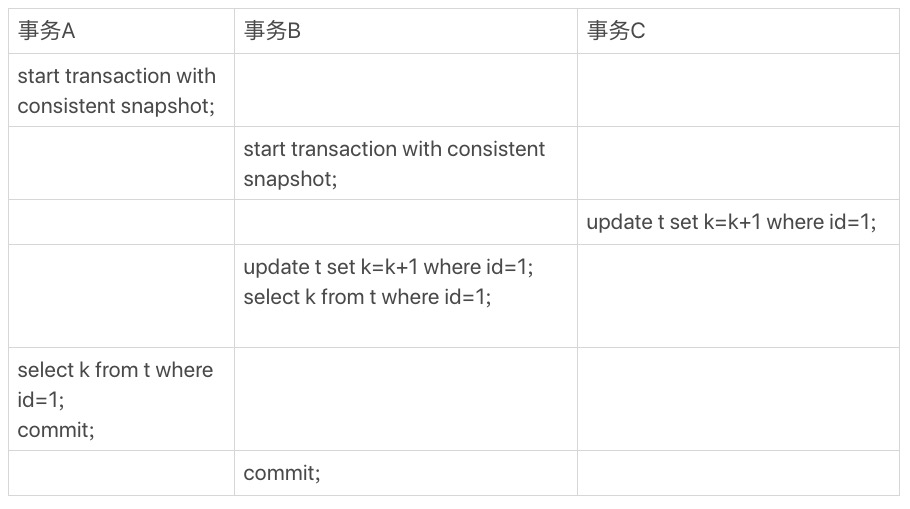
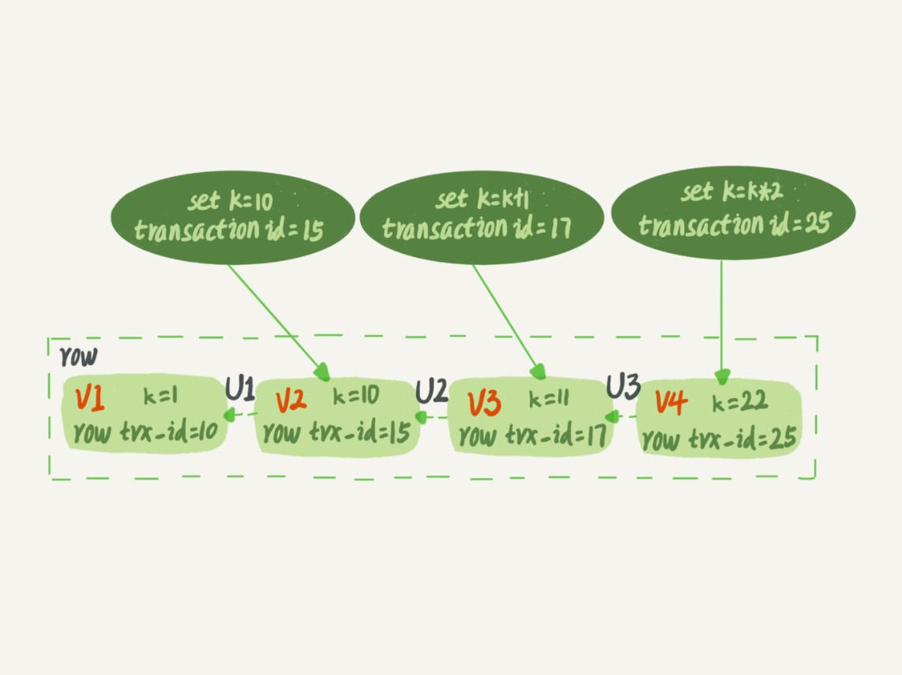
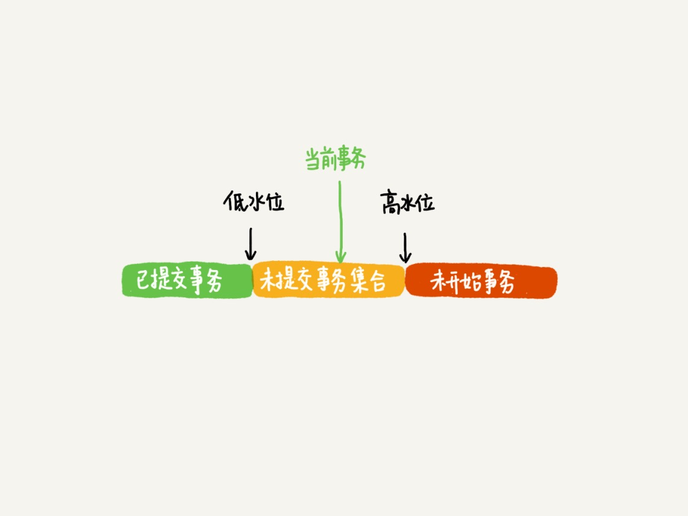
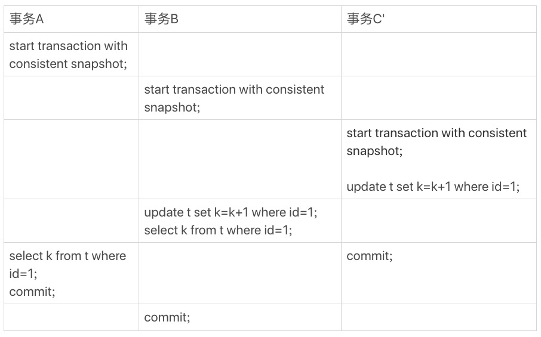

# 08-事务到底是隔离的还是不隔离的

在`可重复读`隔离级别，事务启动的时候会创建一个`视图`，之后即使有其他事务修改了数据，本事务读到的数据仍然和启动时一样。

如果一个事务要更新一行，刚好有另外一个事务也在更新这一行，并且先拥有这一行的`行锁`，该事务会被锁住，进入等待状态。  

等到这个事务获取到行锁要更新数据的时候，它读到的值是什么，能看到另一个事务更新的结果吗？

举一个例子：

    CREATE TABLE t (
      id int(11) NOT NULL,
      k int(11) DEFAULT NULL,
      PRIMARY KEY (id)
    ) ENGINE=InnoDB;

    insert into t(id, k) values
    (1,1),
    (2,2);

- `begin/start transaction` 命令在执行到它们之后的第一个操作 InnoDB 表的语句，事务才真正启动。一致性视图是在执行第一个快照读语句时创建。
- `start transaction with consistent snapshot` 命令马上启动一个事务。一致性视图也马上创建。

如果没有特别说明，默认 `autocommit=1`。

结果：
- 事务 `B` 查到的 `k` 的值是 `3`
- 事务 `A` 查到的 `k` 的值是 `1`

InnoDB 在实现 `MVCC` 时用到的`一致性读视图`（`consistent read view`）用于支持 `RC`（`Read Committed`，`读提交`）和 `RR`（`Repeatable Read`，`可重复读`）隔离级别的实现。它的作用是事务执行期间用来定义能看到什么数据。

## 快照在 MVCC 里是怎么工作的

InnoDB 里面每个事务有一个唯一的事务 `ID`，叫作 `transaction id`。  
它是在事务开始的时候向 `InnoDB` 的事务系统申请的，是按申请顺序严格递增的。

每次事务更新数据的时候，都会生成一个新的数据版本，并且把 `transaction id` 赋值给这个数据版本的事务 `ID`。

也就是数据表中的一行记录，其实可能有多个版本，每个版本有自己的 `transaction id`。

一个记录被多个事务连续更新后的状态：

图中虚线框里是同一行数据的 4 个版本，当前最新版本是 V4，k 的值是 22，它是被 `transaction id` 为 25 的事务更新的。

实际上这个版本链底层是 `undo log` 链表。  
从当前记录的版本可以依次通过 `undo log` 计算出之前的各个版本。

在`可重复读`隔离级别下，一个事务只能看到它启动的时候已经提交的事务生成的结果和它自己生成的结果，而在事务执行期间其他事务的更新是不可见。

也就是以事务启动的时刻为准：
- 如果一个数据版本是在该事务启动之前生成的，就认。
- 如果一个数据版本是在该事物启动以后生成的，不认，必须要找到它的上一个版本，如果上一个版本也不可见，就继续往前找。
- 如果是该事务自己更新的数据，是要认的。

实现：  
`InnoDB` 为每个事务构造了一个`数组`，用来保存这个事务启动瞬间，当前正在活跃的所有事务 `ID`，活跃指的是正在执行还没提交的事务。  
数组里面事务 `ID` 的最小值记为`低水位`，当前系统里面已经创建过的事务 `ID` 的最大值加 `1` 记为高水位。  
这个视图数组和高水位，就组成了当前事务的`一致性视图`（`read-view`）。

数据版本针对当前事务的可见性规则，就是基于数据版本的 `transaction id` 和这个一致性视图的对比结果得到的。

这个视图数组把数据版本的 `transaction id` 分成了几种不同的情况：
- 如果落在绿色部分，表示这个版本是已提交的事务或者是当前事务自己生成的，是可见的。
- 如果落在红色部分，表示这个版本是由将来启动的事务生成的，是不可见的。
- 如果落在黄色部分，那就包括两种情况：
  - 若 `transaction id` 在数组中，表示这个版本是由还没提交的事务生成的，不可见。
  - 若 `transaction id` 不在数组中，表示这个版本是已经提交了的事务生成的，可见。

`InnoDB` 利用了所有数据都有多个版本的这个特性，实现了`秒级创建快照`的能力。

总结：  
一个数据版本，对于一个事务视图来说，除了自己的更新总是可见以外，有三种情况：
- 版本未提交，不可见。
- 版本已提交，但是是在视图创建后提交的，不可见。
- 版本已提交，而且是在视图创建前提交的，可见。

## 更新逻辑

事务 `B` 的 `update` 语句，如果按照一致性读，好像结果不对？

事务 `B` 的视图数组是先生成的，之后事务 `C` 才提交，不是应该看不见 `(1,2)` 吗，怎么能算出 `(1,3)` 呢？

是的，如果事务 `B` 在更新之前查询一次数据，这个查询返回的 `k` 的值确实是 `1`。

但是，当它要去更新数据的时候，就不能再在历史版本上更新了，否则事务 `C` 的更新就丢失了。  
因此，事务 `B` 此时的 `set k=k+1` 是在（`1,2）`的基础上进行的操作。

规则：  
更新数据都是先读后写的，而这个读只能读当前的值，称为`当前读`（`current read`）。

因此在更新的时候，当前读拿到的数据是 `(1,2)`，更新后生成了新版本的数据 `(1,3)`。

在执行事务 `B` 查询语句的时候，最新数据的版本是自己的更新，可以直接使用，所以查询得到的 `k` 的值是 `3`。

其实除了 `update` `语句外，select` 语句如果`加锁`，也是`当前读`。

    select k from t where id=1 lock in share mode;
    select k from t where id=1 for update;

再进一步，假设事务 C 不是马上提交的，而是变成了下面的事务 C，会怎么样呢？

根据`两阶段锁协议`， 事务 `C` 没提交，记录上的写锁还没释放。
事务 B 是`当前读`，必须要读最新版本，而且必须`加锁`，因此就被锁住了，必须等到事务 `C` 释放这个锁，才能继续它的当前读。

到这里，`一致性读`、`当前读`和`行锁`就串起来了。  
可重复读的核心就是`一致性读`（`consistent read`）。  
事务更新数据的时候，只能用`当前读`，如果当前的记录的`行锁`被其他事务占用的话，就需要进入锁等待。

`读提交`隔离级别的逻辑和`可重复读`隔离级别的逻辑类似，最主要的区别是：
- 在`可重复读`隔离级别下，只需要在`事务开始`的时候创建一致性视图，之后事务里的其他查询都`共用`这个一致性视图。
- 在`读提交`隔离级别下，每一个`语句执行前`都会重新算出一个新的视图。

所以在读提交隔离级别下：
- 事务 `A` 查询语句返回的是 `k=2`
- 事务 `B` 查询结果 `k=3`

## 小结

`InnoDB` 的行数据有多个版本，每个数据版本有自己的 `transaction id`，每个事务或者语句有自己的`一致性视图`。  

`普通查询语句`是`一致性读`，`一致性读会`根据 `transaction id` 和`一致性视图`确定数据版本的可见性。

- 对于`可重复读`，查询只承认在事务启动前就已经提交完成的数据。
- 对于`读提交`，查询只承认在语句启动前就已经提交完成的数据。

而`当前读`，总是读取已经提交完成的`最新`版本。

# 完