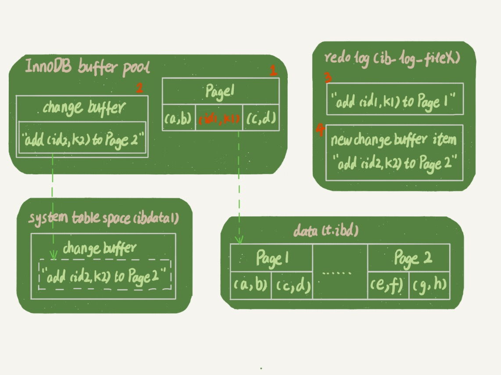
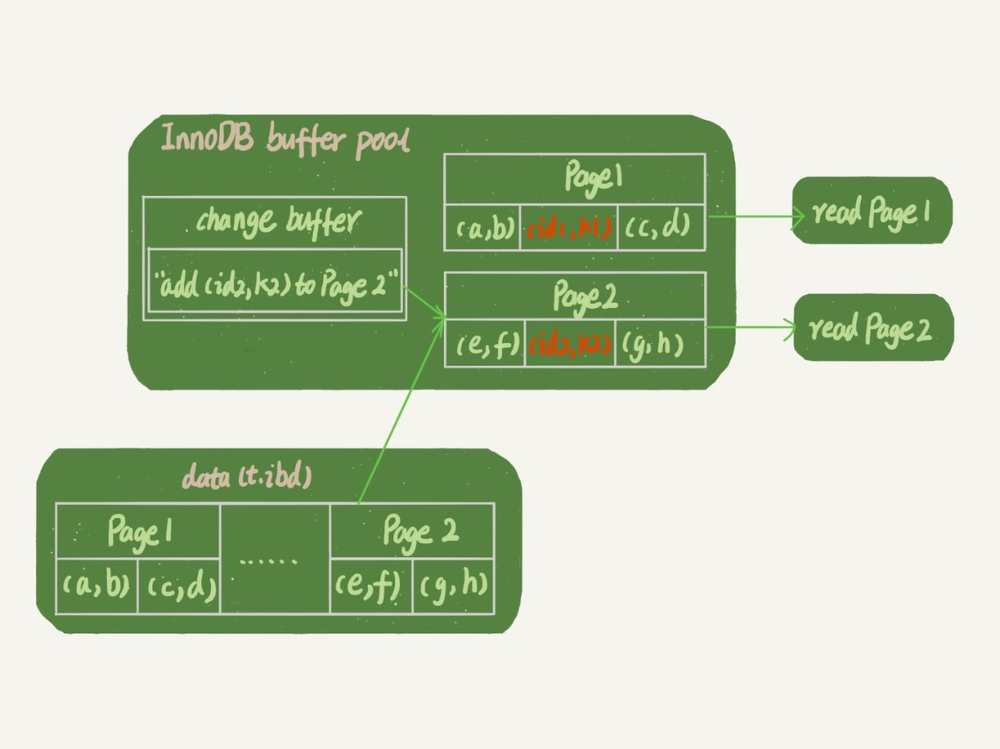

# 09-普通索引和唯一索引，应该怎么选择

如果业务代码已经保证了不会写入重复的索引字段值，那么从性能的角度考虑，选择唯一索引还是普通索引呢？

## 查询过程

相比唯一索引，普通索引查询的时候只是多了一个判断下一条记录是否符合条件的动作。  
查询的过程是将索引的数据页一次性读入内存的，极大概率下一条记录也在同一个页中，很少几率从磁盘读取下一条记录所在的索引数据页。  
所以普通索引的性能损失微乎其微。

## 更新过程

先跟介绍一下 `change buffer`。

当需要更新一个数据页时，如果数据页在内存中就直接更新，如果数据页还没有在内存中，在不影响数据一致性的前提下，`InnoDB` 会将这些更新操作缓存在 `change buffer` 中，这样就不需要从磁盘中读入这个数据页了。  
在下次查询需要访问这个数据页的时候，将数据页读入内存，然后执行 `change buffer` 中与这个页有关的操作，通过这种方式就能保证这个数据逻辑的正确性。

虽然名字叫作 `change buffer`，实际上它也会被写入到磁盘上。

将 `change buffer` 中的操作应用到原数据页，得到最新结果的过程称为 `merge`。  
除了访问这个数据页会触发 `merge` 外，系统有后台线程会定期 `merge`。  
在数据库正常关闭的过程中，也会执行 `merge`。  

显然 `change buffer` 能减少读磁盘，更新语句的执行速度会得到明显的提升。  
而且数据读入内存是需要占用 `buffer pool` 的，所以还节省了内存。

**可以使用 change buffer 的条件**

对于唯一索引来说，所有的更新操作都要先判断这个操作是否违反唯一性约束，必须要将数据页读入内存才能判断。  
既然都已经读入到内存了，那直接更新内存会更快，就没必要使用 `change buffer` 了。

因此唯一索引的更新是不能使用 `change buffer` 的，只有普通索引可以使用。

`change buffer` 用的是 `buffer pool` 里的内存，可以通过参数 `innodb_change_buffer_max_size` 来设置使用比例。

    mysql> SHOW VARIABLES LIKE 'innodb_change_buffer_max_size';
    +-------------------------------+-------+
    | Variable_name                 | Value |
    +-------------------------------+-------+
    | innodb_change_buffer_max_size | 25    |
    +-------------------------------+-------+

针对普通索引，更新目标数据页不在内存中，则将更新记录在 `change buffer` 后语句执行就结束了。

因为减少了随机磁盘访问，所以对更新性能的提升是会很明显的。

反例：  
业务有大量插入数据的操作，将普通索引改成了唯一索引后，内存命中率突然从 99% 降低到了 75%，整个系统处于阻塞状态，更新语句全部堵住。

## change buffer 的使用场景

使用 `change buffer` 对更新过程的加速作用，只限于用在普通索引的场景下，而不适用于唯一索引。

对于写多读少的业务来说，页面在写完以后马上被访问到的概率比较小，此时 `change buffer` 的使用效果最好。这种业务模型常见的就是账单类、日志类的系统。

对于更新模式是写入之后马上会做查询来说，即使满足了条件，将更新先记录在 `change buffer`，但之后由于马上要访问这个数据页，会立即触发 `merge` 过程。这样随机访问 `IO` 的次数不会减少，反而增加了 `change buffer` 的维护代价。

## 索引选择和实践

普通索引和唯一索引在查询能力上是没差别的，主要考虑的是对更新性能的影响。所以建议尽量选择普通索引。

如果所有的更新后面，都马上伴随着对这个记录的查询，那么应该关闭 `change buffer`。而在其他情况下，`change buffer` 都能提升更新性能。

在实际使用中，普通索引和 `change buffer` 的配合使用，对于数据量大的表的更新优化还是很明显的。

## change buffer 和 redo log

在表上执行这个插入语句：

    insert into t(id,k) values(id1,k1),(id2,k2);

假设当前 `k1` 所在的数据页在内存中，`k2` 所在的数据页不在内存中。

下图是带 `change buffer` 的更新状态图：

图中涉及了四个部分：`内存`、`redo log`、 `数据表空间`（t.ibd）、`系统表空间`（ibdata1）。

这条更新语句做了如下的操作：
- `Page 1` 在内存中，直接更新内存（图中 `1`）。
- `Page 2` 没有在内存中，就在内存的 `change buffer` 区域记录下 `要往 Page 2 插入一行` 这个信息（图中 `2`）。
- 将上述两个动作记入 `redo log` 中（图中 `3` 和 `4`）。

做完上面这些，事务就可以完成了。

所以执行这条更新语句的成本很低，就是写了两处内存，顺序写了一处磁盘（两次操作合在一起写了一次磁盘）。  
图中的两个虚线箭头，是后台操作，不影响更新的响应时间。

之后执行如下查询语句：

    select * from t where k in (k1, k2);

如果读语句发生在更新语句后不久，内存中的数据都还在，那么此时的这两个读操作就与 `系统表空间` 和 `redo log` 无关了。

如下图：

可以看到：
- 读 `Page 1` 的时候，直接从内存返回。
- 读 `Page 2` 的时候，需要把 `Page 2` 从磁盘读入内存中，然后应用 `change buffer` 里面的操作日志，生成一个正确的版本并返回结果。

可见直到需要读 `Page 2` 的时候，这个数据页才会被读入内存。

对比这两个机制在提升更新性能上的收益：
- `redo log` 主要节省的是随机写磁盘的 `IO` 消耗，转成了顺序写。 
- `change buffer` 主要节省的是随机读磁盘的 `IO` 消耗。

## 小结

介绍了 `change buffer` 的机制以及应用场景。

由于唯一索引用不上 `change buffer` 的优化机制，因此如果业务可以接受，从性能角度出发建议优先考虑非唯一索引。

# 完