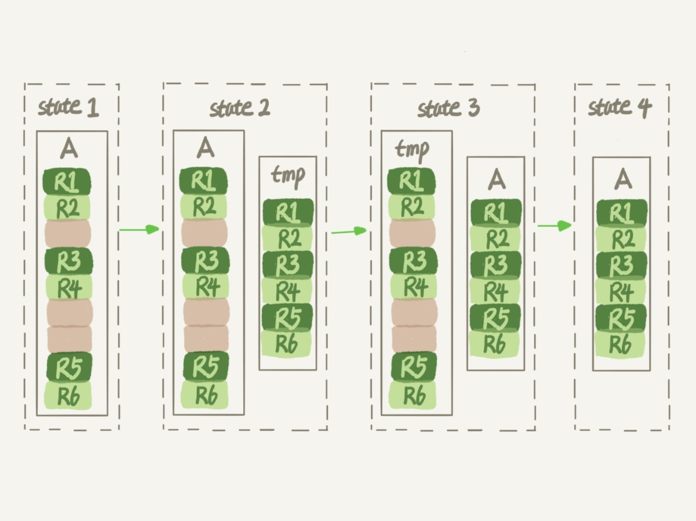
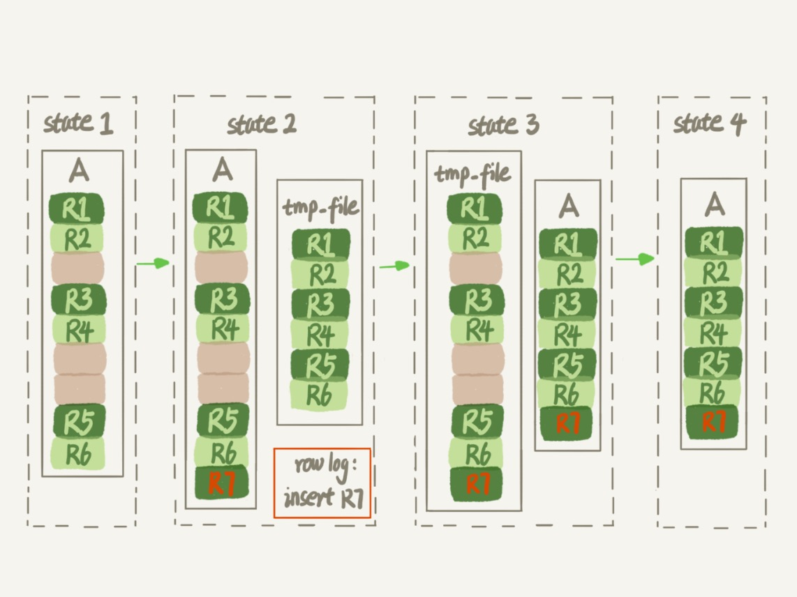

# 13-为什么表数据删掉一半，表文件大小不变

今天聊数据库表的空间回收。

还是对应用最广泛的 `InnoDB` 引擎展开讨论。

一个 `InnoDB` 表包含两部分：
- 表结构定义(`t.frm`)
- 表数据(`t.ibd`)

主要讨论`表数据`。

为什么简单地删除表数据达不到表空间回收的效果，如何正确回收空间？

## 参数 innodb_file_per_table

表数据既可以存放在系统共享表空间，也可以存放在独立表空间。

这是由参数 `innodb_file_per_table` 控制的：
- `OFF` 表示表的数据放在系统共享表空间。
- `ON` 表示表的数据放在独立表空间。

建议使用独立表空间，这样更容易管理，在不需要某个表的时候，通过 `drop table` 命令，系统就会直接删除这个文件。  
如果是放在共享表空间中，即使表删掉了，空间也是不会回收的。

接下来的讨论都是基于`独立表空间`展开的。

## 数据删除流程

`InnoDB` 里的数据都是用 `B+` 树的结构组织的。

每条记录都放在数据页中。

如果删除一个记录，只会把这个记录标记为删除，之后有要插入到该页的记录时会复用这个位置，磁盘文件的大小不会缩小。  
如果删掉了一个数据页上的所有记录，那这个数据页就被标记为可复用，磁盘文件的大小不会缩小。  
如果相邻的两个数据页利用率都很小，系统就会把这两个页上的数据合到其中一个页上，另外一个数据页就被标记为可复用，磁盘文件的大小不会缩小。  
如果用 `delete` 命令把整个表的数据都删除，那所有的数据页都会被标记为可复用，磁盘文件的大小不会缩小。  

也就是说，通过 `delete` 命令是不能回收表空间的。这些可以复用的空间，称为`空洞`。

实际上插入数据也会造成空洞。

如果数据是按照索引递增顺序插入的，那么索引是紧凑的。  
如果数据是随机插入的，就可能造成索引的数据页`分裂`，页分裂后就会在数据页上形成`空洞`。

另外更新索引的值，可以理解为删除一个旧的值，再插入一个新值，显然也会造成`空洞`。

也就是说，经过大量增删改的表，都是可能存在`空洞`的。

如果能够把这些空洞去掉，就能达到收缩表空间的目的。

而重建表，就可以达到这样的目的。

## 重建表

可以使用 `alter table A engine=InnoDB` 命令来重建表。

在 `MySQL 5.5` 版本之前，这个命令的执行流程：

- 新建一个与表 `A` 结构相同的表 `B`。
- 按照主键 `ID` 递增的顺序，把数据一行一行地从表 `A 里读出来再插入到表 `B` 中。
- 用表 `B` 替换 `A`，从效果上看，就起到了收缩表 `A` 空间的作用。

由于表 `B` 是新建的表，所以表 `A` 主键索引上的空洞，在表 `B` 中就都不存在了，表 `B` 的主键索引更紧凑，数据页的利用率也更高。

在这个过程中，花时间最多的步骤是往临时表插入数据的过程，这段时间如果有新的数据要写入到表 `A` 的话，就会造成数据丢失。

因此在整个 `DDL` 过程中，表 `A` 中不能有更新。

在 `MySQL 5.6` 版本开始引入 `Online DDL`，这个命令的执行流程：

- 建立一个临时文件，扫描表 `A` 主键的所有数据页。
- 用数据页中表 `A` 的记录生成 `B+` 树，存储到临时文件中。
- 生成临时文件的过程中，将所有对 `A` 的操作记录在一个日志文件（`row log`）中，对应的是图中 `state2` 的状态。
- 临时文件生成后，将日志文件中的操作应用到临时文件，得到一个逻辑数据上与表 `A` 相同的数据文件，对应的就是图中 `state3` 的状态。
- 用临时文件替换表 `A` 的数据文件。

由于日志文件记录和重放操作这个功能的存在，这个方案在重建表的过程中，允许对表 `A` 做增删改操作。

讲表锁的时候说 `DDL` 之前是要拿 `MDL` 写锁的，这样还能叫 `Online DDL` 吗？

确实，在上图的流程中，`alter` 语句在启动的时候需要获取 `MDL` 写锁，但是这个写锁在真正拷贝数据之前就退化成`读锁`了。

为什么要退化呢？  
为了实现 `Online`，`MDL` 读锁不会阻塞增删改操作。

为什么不干脆直接解锁呢？  
为了保护自己，禁止其他线程对这个表同时做 `DDL`。

对于一个大表 `Online DDL` 最耗时的过程就是拷贝数据到临时表的过程，这个步骤的执行期间可以接受增删改操作。  
所以相对于整个 `DDL` 过程来说，锁的时间非常短，对业务来说，就可以认为是 `Online` 的。

对于很大的表来说，这个操作是很消耗 `IO` 和 `CPU` 资源的。  
如果是线上服务，要选择合适的操作时间。  
如果想要比较安全的操作的话，推荐使用 `GitHub` 开源的 `gh-ost` 来做。  

## Online 和 inplace

`Online` 和另一个跟 `DDL` 有关的、容易混淆的概念 `inplace` 的区别。

在 `MySQL 5.6` 版本后，重建表的 `DDL` 过程在 `InnoDB` 内部完成，是一个`原地`操作，这就是 `inplace` 名称的来源。

如果有一个 `1TB` 的表，现在磁盘空间是 `1.2TB`，能不能做一个 `inplace` 的 `DDL` 呢？  
答案是不能，因为 `tmp_file` 也是要占用临时空间的。

重建表的这个语句 `alter table t engine=InnoDB` 其实隐含的意思是：

    alter table t engine=innodb, ALGORITHM=inplace;

跟 `inplace` 对应的是拷贝表的方式：

    alter table t engine=innodb, ALGORITHM=copy;

当使用 `ALGORITHM=copy` 的时候，表示的是强制拷贝表，对应的流程就是上面 `MySQL 5.5` 版本之前的重建表流程。

最后，再延伸一下：
- `alter table t engine = InnoDB` 也就是 `recreate`。
- `analyze table t` 只是对表的索引信息做重新统计，没有修改数据，这个过程中加 `MDL` 读锁。
- `optimize table t` 等于 `recreate` + `analyze`。

## 小结

讨论了数据库中收缩表空间的方法。

如果要收缩一个表，只是 `delete` 掉表里面不用的数据的话，表文件的大小是不会变的。

还要通过 `alter table` 命令重建表，才能达到表文件变小的目的。

# 完