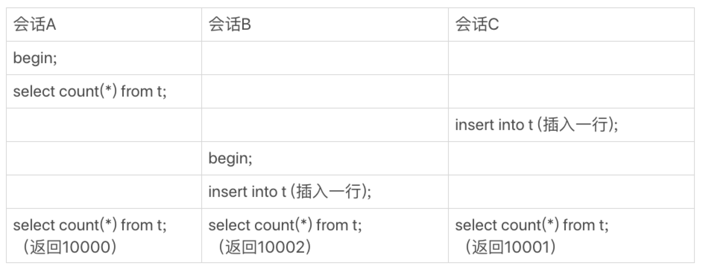
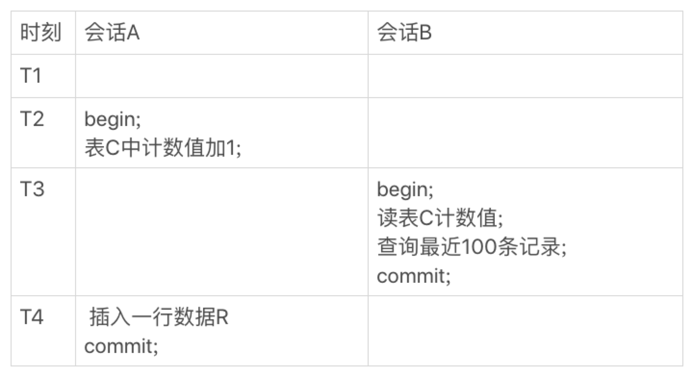

# 14-count()这么慢，我该怎么办

一条 `select count(*) from t` 语句，随着系统中记录数越来越多，这条语句执行得也会越来越慢。

那 `count(*)` 语句到底是怎样实现的？

对于频繁变更并需要统计表行数的需求，业务设计上可以怎么做？

## count(*) 的实现方式

不同的 `MySQL` 引擎 `count(*)` 的实现方式不同：
- `MyISAM` 引擎把一个表的总行数存在了磁盘上，因此可以直接返回这个数，效率很高。
- `InnoDB` 引擎需要把数据一行一行地从引擎里面读出来，然后累积计数。

注意：  
这篇文章里讨论的是没有过滤条件的 `count(*)`，如果加了 `where` 条件，`MyISAM` 表也是不能返回这么快的。

为什么 `InnoDB` 不跟 `MyISAM` 一样把数字存起来？

这是因为即使是在同一个时刻的多个查询，由于多版本并发控制（`MVCC`）的原因，`InnoDB` 表`应该返回多少行`也是不确定的。

三个会话 `A`、`B`、`C` 会同时查询表 `t` 的总行数，但拿到的结果却不同。

这和 `InnoDB` 的事务设计有关系，可重复读是它默认的隔离级别，在代码上就是通过多版本并发控制，也就是 `MVCC` 来实现的。

每一行记录都要判断自己是否对这个会话可见，因此对于 `count(*)` 请求来说，`InnoDB` 只好把数据一行一行地读出依次判断，可见的行才能够用于计算`基于这个查询`的表的总行数。

`MySQL` 在执行 `count(*)` 操作的时候还是做了优化的。

`InnoDB` 是索引组织表，主键索引树的叶子节点是数据，而普通索引树的叶子节点是主键值，普通索引树比主键索引树小很多。  
对于 `count(*)` 这样的操作，遍历哪个索引树得到的结果逻辑上都是一样的。  
因此 `MySQL` 优化器会找到最小的那棵树来遍历。  

    CREATE TABLE t (
        id int(11) NOT NULL AUTO_INCREMENT,
        a int(11) DEFAULT NULL,
        b int(11) DEFAULT NULL,
        PRIMARY KEY (id),
        KEY a (a),
        KEY b (b)
    ) ENGINE=InnoDB;

    mysql> explain select count(*) from t;
    +----+-------------+-------+------------+-------+---------------+------+---------+------+--------+----------+-------------+
    | id | select_type | table | partitions | type  | possible_keys | key  | key_len | ref  | rows   | filtered | Extra       |
    +----+-------------+-------+------------+-------+---------------+------+---------+------+--------+----------+-------------+
    |  1 | SIMPLE      | t     | NULL       | index | NULL          | a    | 5       | NULL | 100256 |   100.00 | Using index |
    +----+-------------+-------+------------+-------+---------------+------+---------+------+--------+----------+-------------+

    mysql> select count(*) from t;
    +----------+
    | count(*) |
    +----------+
    |   100000 |
    +----------+

在保证逻辑正确的前提下，尽量减少扫描的数据量，是数据库系统设计的通用法则之一。

小结一下：
- `MyISAM` 表 `count(*)` 很快但是不支持事务。
- `show table status` 的行数不准确。
- `InnoDB` 表 `count(*)` 会遍历全表，虽然准确但会导致性能问题。

如果现在有一个页面经常要显示交易系统的操作记录总数，到底应该怎么办呢？

答案是：`只能自己计数`。

## 用缓存系统保存计数

可以用一个 `Redis` 服务来保存这个表的总行数。
- 每插入一行 `Redis` 计数就加 `1`。
- 每删除一行 `Redis` 计数就减 `1`。

这种方式下，读和更新操作都很快。

存在的问题：
- 缓存没有`持久化`会丢失。
- `操作记录`和`操作缓存`是分`2`步执行的，在并发系统里面这个计数值还是做不到精确。

## 在数据库保存计数

把这个计数直接放到数据库里单独的一张计数表中：
- 计数值能`持久化`不会丢失。
- 可以依赖 `事务` 和 `MVCC` 做到在并发的情况下一个事务读取到的记录数和计数值是一致的。

会话 `B` 的读操作在 `T3` 执行，因为这时候会话 `A` 的更新事务还没有提交，所以计数值加 `1` 这个操作对会话 `B` 还不可见。
因此会话 `B` 看到的结果里，`计数值`和`最近 100 条记录`是一致的。

## 不同的 count 用法

下面的讨论还是基于 `InnoDB` 引擎的。

首先弄清楚 `count()` 的语义：  
`count()` 是一个聚合函数，对于返回的结果集，一行行地判断，如果 `count` 函数的参数不是 `NULL`，累计值就加 `1`，否则不加，最后返回`累计值`。

所以：  
- `count(*)`、`count(主键 id)`、`count(1)` 都表示返回满足条件的结果集的总行数。
- `count(字段)` 则表示返回满足条件的数据行里面，参数 `字段` 不为 `NULL` 的总个数。

分析性能差别的几个原则：
- `server` 层要什么就给什么。
- `InnoDB` 只给必要的值。
- 现在的优化器只优化了 `count(*)` 的语义为`取行数`，其他`显而易见`的优化并没有做。

分别来看：
- `count(主键 id)`  
  `InnoDB` 引擎遍历整张表，把每一行的 `id` 值都取出来，返回给 `server` 层。  
  `server` 层拿到 `id` 后，判断`主键字段`是不可能为空的，就按行累加。

- `count(1)`  
  `InnoDB` 引擎遍历整张表，但不取值。
  `server` 层对于返回的每一行，放一个数字 `1` 进去，判断是不可能为空的，按行累加。

可以看出 `count(1)` 执行得要比 `count(主键 id)` 快。  
因为从引擎返回 `id` 会涉及到解析数据行，以及拷贝字段值的操作。

- `count(字段)`  
  - 如果这个`字段`不允许为`NULL`，一行行地从记录里面读出这个字段，判断`字段`不能为`NULL`，按行累加。
  - 如果这个`字段`是允许为`NULL`，一行行地从记录里面读出这个字段，判断`字段`可能为`NULL`，把`字段值`取出来再判断一下，不是`NULL`才累加。

- `count(*)`  
  这是个例外，并不会把全部字段取出来，而是专门做了优化，不取值。`count(*)` 肯定不是`NULL`，按行累加。

所以结论：按照效率排序 `count(字段)` < `count(主键 id)` < `count(1)` ≈ `count(*)`。

所以建议：尽量使用 `count(*)`。

## 小结

在不同引擎中 `count(*)` 的实现方式是不一样的。

把计数放在 `Redis` 里面，不能够保证计数和 `MySQL` 表里的数据精确一致的原因，是这两个不同的存储构成的系统，不支持`分布式事务`，无法拿到精确一致的视图。

把计数值也放在 `MySQL` 中，就解决了一致性视图的问题。

`InnoDB` 引擎支持事务，利用好事务的`原子性`和`隔离性`，就可以简化在业务开发时的逻辑。

这也是 `InnoDB` 引擎备受青睐的原因之一。

# 完