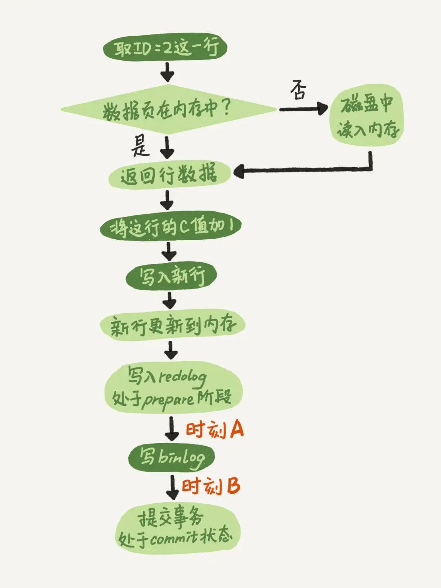

# 15-答疑文章（一）：日志和索引相关问题

## 日志相关问题

前面讲到 `binlog`（归档日志）和 `redo log`（重做日志）配合崩溃恢复的时候，说如果没有`两阶段提交`，会导致 `MySQL` 出现主备数据不一致等问题。

在`两阶段提交`的不同瞬间，`MySQL` 如果发生异常重启，怎么保证数据完整性？

两阶段提交图：



图中的 `commit 步骤`，指的是事务提交过程中的一个小步骤，也是最后一步。当这个步骤执行完成后，这个事务就提交完成了。

分析一下在`两阶段提交`的不同时刻，`MySQL` 异常重启会出现什么现象。

如果在 `时刻 A` 发生了崩溃，此时 `binlog` 还没写，`redo log` 也还没提交，所以崩溃恢复的时候，这个事务会回滚。
由于 `binlog` 还没写，所以也不会传到备库。

如果在 `时刻 B` 发生了崩溃，那崩溃恢复的时候 `MySQL` 会怎么处理？

先看一下崩溃恢复时的判断规则：
- 如果 `redo log` 里面的事务有 `commit` 标识，则直接提交。
- 如果 `redo log` 里面的事务只有 `prepare` 标识，则判断对应的事务 `binlog` 是否存在并完整：
  - 如果是，则提交事务。
  - 否则，回滚事务。

由此可见，在 `时刻 B` 发生的崩溃，在崩溃恢复过程中事务会被提交。

### 追问 1：MySQL 怎么知道 binlog 是完整的?

一个事务的 `binlog` 是有完整格式的：
- `statement` 格式的 `binlog`，最后会有 `COMMIT`。
- `row` 格式的 `binlog`，最后会有一个 `XID event`。

### 追问 2：redo log 和 binlog 是怎么关联起来的?

它们有一个共同的数据字段，叫 `XID`。

### 追问 3：处于 prepare 阶段的 redo log 加上完整 binlog，重启就能恢复，MySQL 为什么要这么设计?

这个问题和数据与备份的一致性有关。  
在 `时刻 B`，`binlog` 已经写入，会被从库使用，所以主库上也要提交这个事务，这样主库和备库的数据才能保证一致。

### 追问 4：如果这样的话，为什么还要两阶段提交呢？干脆先 redo log 写完，再写 binlog。崩溃恢复的时候，必须得两个日志都完整才可以。是不是一样的逻辑？

`两阶段提交`是经典的分布式系统问题，并不是 `MySQL` 独有的。

对于 `InnoDB` 引擎来说，如果 `redo log` 提交完成了，事务就不能回滚（回滚可能覆盖掉别的事务的更新）。
如果 `redo log` 直接提交，然后 `binlog` 写入的时候失败，`InnoDB` 又回滚不了，数据和 `binlog` 日志又不一致了。

`两阶段提交`就是为了给所有人一个机会，当每个人都说 `ok` 的时候，再一起提交。

### 追问 5：不引入两个日志，也就没有两阶段提交的必要了。只用 binlog 来支持崩溃恢复，又能支持归档，不就可以了？

binlog 没有能力恢复 `数据页`。

InnoDB 执行事务的时候，写完内存和日志，事务就算完成了。
如果之后崩溃，要依赖于日志来恢复数据页。

### 追问 6：那能不能反过来，只用 redo log，不要 binlog？

如果只从崩溃恢复的角度来讲是可以的，可以把 `binlog` 关掉，这样就没有两阶段提交了，但系统依然是安全的。

但 `binlog` 有着 `redo log` 无法替代的功能。

一个是归档。`redo log `是循环写，写到末尾是要回到开头继续写的。这样历史日志没法保留，`redo log` 也就起不到归档的作用。

一个就是 `MySQL` 系统依赖于 `binlog`。`binlog` 作为 `MySQL` 一开始就有的功能，被用在了很多地方。  
其中，`MySQL` 系统高可用的基础，就是 `binlog` 复制。

### 追问 7：redo log 一般设置多大？

`redo log` 太小的话，会导致很快就被写满，然后不得不强行刷 `redo log` 导致不停的刷脏页，影响性能。

如果是现在常见的几个 `TB` 的磁盘的话，直接将 `redo log` 设置为 `4` 个文件、每个文件 `1GB` 吧。

### 追问 8：正常运行中的实例，数据写入后的最终落盘，是从 redo log 更新过来的还是从 buffer pool 更新过来的呢？

`redo log` 并没有记录数据页的完整数据。
- 如果是正常运行的实例，数据页被修改以后，跟磁盘的数据页不一致，称为`脏页`。最终数据落盘，就是把内存中的数据页写盘。
- 在崩溃恢复场景中，对于崩溃前没来得及落盘的`脏页`，会从磁盘读到内存，通过 `redo log` 更新这些数据页，就成了和崩溃前一样的`脏页`，然后再落盘。

### 追问 9：redo log buffer 是什么？是先修改内存，还是先写 redo log 文件？

事务执行中生成的日志都是先保存起来，到事务提交的时候再写到 `redo log` 文件里。

`redo log buffer` 就是一块内存，用来先存 `redo` 日志的。

真正把日志写到 `redo log` 文件（`ib_logfile0`、`ib_logfile1`），是在执行 `commit` 语句的时候做的。

这里说的是事务执行过程中不会`主动去刷盘`，以减少不必要的 `IO` 消耗。
但是可能会出现`被动写入磁盘`，比如内存不够、其他事务提交等情况。

## 业务设计问题

一个用户双向关注后成为好友关系的业务。

问题：  
如果双方同时执行关注对方，双方事务同时开启，同时查询到对方没有关注自己，则双方事务完成后，彼此都关注了对方，但却没有成为好友。

设计：

```sql
CREATE TABLE user_follow (
    id bigint(20) unsigned NOT NULL AUTO_INCREMENT COMMENT 'ID',
    user_id_a bigint(20) unsigned NOT NULL COMMENT '用户AID',
    user_id_b bigint(20) unsigned NOT NULL COMMENT '用户BID',
    status int(20) NOT NULL COMMENT '用户关注状态 1-A关注B 2-B关注A 3-AB互相关注',
    PRIMARY KEY (id) USING BTREE,
    UNIQUE KEY uk_follow (user_id_a,user_id_b) USING BTREE COMMENT '唯一索引'
) ENGINE=InnoDB COMMENT='用户关注表';

CREATE TABLE user_friend (
    id bigint(20) unsigned NOT NULL AUTO_INCREMENT COMMENT 'ID',
    user_id_a bigint(20) unsigned NOT NULL COMMENT '用户AID',
    user_id_b bigint(20) unsigned NOT NULL COMMENT '用户BID',
    PRIMARY KEY (id) USING BTREE,
    UNIQUE KEY uk_friend (user_id_a,user_id_b) USING BTREE COMMENT '唯一索引'
) ENGINE=InnoDB COMMENT='用户好友表';
```

用户关注表 增加 status 字段：
- 1 A关注B 
- 2 B关注A 
- 3 AB互相关注

并且业务约定：user_id_a <= user_id_b

执行：

- A(111) 关注 B(222)
  
  ```sql
  -- A(111) 关注 B(222)
  begin;
  insert into user_follow (user_id_a, user_id_b, status) values (111, 222, 1) on duplicate key update status = status | 1;
  select status from user_follow where user_id_a = 111 and user_id_b = 222;
  
  -- 如果 status = 1
  commit;
  
  -- 如果 status = 3
  insert ignore into user_friend (user_id_a, user_id_b) values (111, 222);
  commit;
  ```

- B(222) 关注 A(111)

  ```sql
  -- B(222) 关注 A(111)
  begin;
  insert into user_follow (user_id_a, user_id_b, status) values (111, 222, 2) on duplicate key update status = status | 2;
  select status from user_follow where user_id_a = 111 and user_id_b = 222;
  
  -- 如果 status = 2
  commit;
  
  -- 如果 status = 3
  insert ignore into user_friend (user_id_a, user_id_b) values (111, 222);
  commit;
  ```

其中：
- 让表里的数据保证 `user_id_a <= user_id_b`，这样不论是 `A` 关注 `B`，还是 `B` 关注 `A`，在操作 `user_follow` 表的时候，如果反向的关系已经存在，就会出现行锁冲突。
- `insert ... on duplicate` 语句确保在事务内部，执行了这个 `SQL` 语句后，就强行占住了这个行锁，之后的 `select` 判断 `status` 这个逻辑时就确保了是在行锁保护下的读操作。
- 操作符 `|` 是按位或，连同最后一句 `insert` 语句里的 `ignore`，是为了保证重复调用时的幂等性。

实例：


实例时序：


# 完