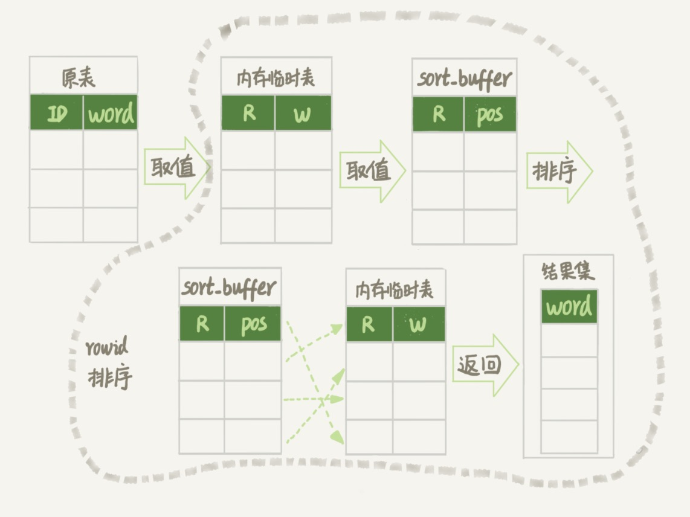

# 17-如何正确地显示随机消息

单词表：

```sql
CREATE TABLE words (
  id int(11) NOT NULL AUTO_INCREMENT,
  word varchar(64) DEFAULT NULL,
  PRIMARY KEY (id)
) ENGINE=InnoDB;
```

随机插入 `10000` 条记录：

```sql
CREATE PROCEDURE insert_words()
BEGIN
  DECLARE i int;
	SET i=0;
	WHILE i<10000 DO
		INSERT INTO words(word) values(
			concat(
			char(97+(i div 1000)), 
			char(97+(i % 1000 div 100)), 
			char(97+(i % 100 div 10)), 
			char(97+(i % 10)))
		);
		SET i=i+1;
	END WHILE;
END
```

要随机选择 `3` 个单词，怎么实现？

## 内存临时表

用 `order by rand()` 来实现：

```sql
SELECT word FROM words ORDER BY rand() LIMIT 3;
```

执行计划：

    mysql> EXPLAIN SELECT word FROM words ORDER BY rand() LIMIT 3;
    +----+-------------+-------+------------+------+---------------+------+---------+------+------+----------+---------------------------------+
    | id | select_type | table | partitions | type | possible_keys | key  | key_len | ref  | rows | filtered | Extra                           |
    +----+-------------+-------+------------+------+---------------+------+---------+------+------+----------+---------------------------------+
    |  1 | SIMPLE      | words | NULL       | ALL  | NULL          | NULL | NULL    | NULL | 9980 |   100.00 | Using temporary; Using filesort |
    +----+-------------+-------+------------+------+---------------+------+---------+------+------+----------+---------------------------------+

`Extra` 中：
- `Using temporary` 表示需要使用临时表。
- `Using filesort` 表示需要执行排序操作。

也就是需要`临时表`，并且需要在临时表上`排序`。

对于临时`内存表`来说，排序会选择上一篇介绍的哪一种算法呢？
- 对于 `InnoDB` 表来说，执行`全字段排序`会减少磁盘访问，会被优先选择。
- 对于`内存表`，`回表`是通过访问内存得到数据，不涉及访问磁盘，它优先考虑的是用于排序的行越小越好，所以会选择 `rowid 排序`。

这条语句的执行流程：
- 创建一个`临时表`。这个临时表使用的是 `memory` 引擎，表里有两个字段，第一个字段是 `double` 类型，为了后面描述方便，记为字段 `R`，第二个字段是 `varchar(64)` 类型，记为字段 `W`。并且，这个表没有建索引。
- 从 `words` 表中，按主键顺序取出所有的 `word` 值。对于每一个 `word` 值，调用 `rand()` 函数生成一个大于 `0` 小于 `1` 的随机小数，并把这个随机小数和 `word` 分别存入临时表的 `R` 和 `W` 字段中，到此，扫描行数是 `10000`。
- 现在临时表有 `10000` 行数据了，接下来要在这个没有索引的内存临时表上，按照字段 `R` 排序。
- 初始化 `sort_buffer`。`sort_buffer` 中有两个字段，一个是 `double` 类型，另一个是`整型`。
- 从内存临时表中一行一行地取出 `R` 值和`位置信息`，分别存入 `sort_buffer` 中的两个字段里。这个过程要对内存临时表做全表扫描，此时扫描行数增加 `10000`，变成了 `20000`。
- 在 `sort_buffer` 中根据 `R` 的值进行排序。注意，这个过程没有涉及到表操作，所以不会增加扫描行数。
- 排序完成后，取出前三个结果的`位置信息`，依次到内存临时表中取出 `word` 值，返回给客户端。这个过程中，访问了表的 `3` 行数据，总扫描行数变成了 `20003`。



这里的 `位置信息` 是个什么概念？
对于 MEMORY 引擎的表，可以认为就是一个数组。因此，这个 `位置信息` 其实就是数组的下标。

小结一下：  
`order by rand()` 使用了`内存临时表`，内存临时表排序的时候使用了 `rowid 排序`方法。

## 磁盘临时表

不是所有的`临时表`都是`内存表`。

参数 `tmp_table_size` 限制了内存临时表的大小，默认值是 `16M`。  
如果临时表大小超过了 `tmp_table_size`，那么内存临时表就会转成磁盘临时表。

    mysql> SHOW VARIABLES LIKE 'tmp_table_size';
    +----------------+----------+
    | Variable_name  | Value    |
    +----------------+----------+
    | tmp_table_size | 16777216 |
    +----------------+----------+

磁盘临时表使用的引擎默认是 `InnoDB`，是由参数 `internal_tmp_disk_storage_engine` 控制的。

    mysql> SHOW VARIABLES LIKE 'internal_tmp_disk_storage_engine';
    +----------------------------------+--------+
    | Variable_name                    | Value  |
    +----------------------------------+--------+
    | internal_tmp_disk_storage_engine | InnoDB |
    +----------------------------------+--------+

当使用磁盘临时表的时候，对应的就是一个没有显式索引的 `InnoDB` 表的排序过程。

为了复现这个过程：
- 把 `tmp_table_size` 设置成 `1024`
- 把 `sort_buffer_size` 设置成 `32768`
- 把 `max_length_for_sort_data` 设置成 `16`

执行过程：

    mysql> set tmp_table_size=1024;
    Query OK, 0 rows affected (0.00 sec)
    
    mysql> set sort_buffer_size=32768;
    Query OK, 0 rows affected (0.00 sec)
    
    mysql> set max_length_for_sort_data=16;
    Query OK, 0 rows affected (0.00 sec)
    
    mysql> SET optimizer_trace='enabled=on';
    Query OK, 0 rows affected (0.00 sec)
    
    mysql> SELECT word FROM words ORDER BY rand() LIMIT 3;
    +------+
    | word |
    +------+
    | cagg |
    | cdhi |
    | ffie |
    +------+
    3 rows in set (0.01 sec)
    
    mysql> SELECT * FROM `information_schema`.`OPTIMIZER_TRACE`\G
    *************************** 1. row ***************************
                                QUERY: SELECT word FROM words ORDER BY rand() LIMIT 3
                                TRACE: {
      "steps": [
        {
          "join_preparation": {
            "select#": 1,
            "steps": [
              {
                "expanded_query": "/* select#1 */ select `words`.`word` AS `word` from `words` order by rand() limit 3"
              }
            ]
          }
        },
        {
          "join_optimization": {
            "select#": 1,
            "steps": [
              {
                "substitute_generated_columns": {
                }
              },
              {
                "table_dependencies": [
                  {
                    "table": "`words`",
                    "row_may_be_null": false,
                    "map_bit": 0,
                    "depends_on_map_bits": [
                    ]
                  }
                ]
              },
              {
                "rows_estimation": [
                  {
                    "table": "`words`",
                    "table_scan": {
                      "rows": 9980,
                      "cost": 21
                    }
                  }
                ]
              },
              {
                "considered_execution_plans": [
                  {
                    "plan_prefix": [
                    ],
                    "table": "`words`",
                    "best_access_path": {
                      "considered_access_paths": [
                        {
                          "rows_to_scan": 9980,
                          "access_type": "scan",
                          "resulting_rows": 9980,
                          "cost": 2017,
                          "chosen": true
                        }
                      ]
                    },
                    "condition_filtering_pct": 100,
                    "rows_for_plan": 9980,
                    "cost_for_plan": 2017,
                    "chosen": true
                  }
                ]
              },
              {
                "attaching_conditions_to_tables": {
                  "original_condition": null,
                  "attached_conditions_computation": [
                  ],
                  "attached_conditions_summary": [
                    {
                      "table": "`words`",
                      "attached": null
                    }
                  ]
                }
              },
              {
                "clause_processing": {
                  "clause": "ORDER BY",
                  "original_clause": "rand()",
                  "items": [
                    {
                      "item": "rand()"
                    }
                  ],
                  "resulting_clause_is_simple": false,
                  "resulting_clause": "rand()"
                }
              },
              {
                "refine_plan": [
                  {
                    "table": "`words`"
                  }
                ]
              }
            ]
          }
        },
        {
          "join_execution": {
            "select#": 1,
            "steps": [
              {
                "creating_tmp_table": {
                  "tmp_table_info": {
                    "table": "intermediate_tmp_table",
                    "row_length": 268,
                    "key_length": 0,
                    "unique_constraint": false,
                    "location": "memory (heap)",
                    "row_limit_estimate": 3
                  }
                }
              },
              {
                "converting_tmp_table_to_ondisk": {
                  "cause": "memory_table_size_exceeded",
                  "tmp_table_info": {
                    "table": "intermediate_tmp_table",
                    "row_length": 268,
                    "key_length": 0,
                    "unique_constraint": false,
                    "location": "disk (InnoDB)",
                    "record_format": "packed"
                  }
                }
              },
              {
                "filesort_information": [
                  {
                    "direction": "asc",
                    "table": "intermediate_tmp_table",
                    "field": "tmp_field_0"
                  }
                ],
                "filesort_priority_queue_optimization": {
                  "limit": 3,
                  "rows_estimate": 1170,
                  "row_size": 14,
                  "memory_available": 32768,
                  "chosen": true
                },
                "filesort_execution": [
                ],
                "filesort_summary": {
                  "rows": 4,
                  "examined_rows": 10000,
                  "number_of_tmp_files": 0,
                  "sort_buffer_size": 88,
                  "sort_mode": "<sort_key, rowid>"
                }
              }
            ]
          }
        }
      ]
    }
    MISSING_BYTES_BEYOND_MAX_MEM_SIZE: 0
              INSUFFICIENT_PRIVILEGES: 0
    1 row in set (0.00 sec)

因为 `max_length_for_sort_data` 设置成 `16`，小于 `word` 字段的长度定义，所以 `sort_mode` 里面显示的是 `rowid` 排序，这个符合预期，参与排序的是随机值 `R` 字段和 `rowid` 字段组成的行。

`R` 字段存放的随机值就 `8` 个字节，`rowid` 是 `6` 个字节，数据总行数是 `10000`，这样算出来就有 `140000` 字节，超过了 `sort_buffer_size` 定义的 `32768` 字节了。
但是 `number_of_tmp_files` 的值居然是 `0`，难道不需要用临时文件排序吗？

这个 `SQL` 语句的排序确实没有用到临时文件，采用是一个新的排序算法，即：`优先队列排序算法`。

为什么没有使用临时文件的算法，也就是`归并排序算法`，而是采用了`优先队列排序算法`？

其实现在的 `SQL` 只需要取 `R` 值最小的 `3` 个 `rowid`。  
如果使用`归并排序算法`的话，虽然最终也能得到前 `3` 个值，但是这个算法结束后，已经将 `10000` 行数据都排好序了，这浪费了非常多的计算量。

`优先队列算法`，可以精确地只得到三个最小值，执行流程如下：
- 对于这 `10000` 个准备排序的 `(R,rowid)`，先取前三行，构造成一个`堆`。
- 取下一个行 `(R’,rowid’)`，跟当前堆里面最大的 `R` 比较，如果 `R’`小于` R`，把这个 `(R,rowid)` 从堆中去掉，换成 `(R’,rowid’)`。
- 重复第 `2` 步，直到第 `10000` 个 `(R’,rowid’)` 完成比较。

整个排序过程中，为了最快地拿到当前堆的最大值，总是保持最大值在堆顶，因此这是一个`最大堆`。

`OPTIMIZER_TRACE` `结果中，filesort_priority_queue_optimization` 这个部分的 `chosen=true`，就表示使用了`优先队列排序算法`，这个过程不需要临时文件，因此对应的 `number_of_tmp_files` 是 `0`。

这个流程结束后，堆里面就是这个 `10000` 行里面 `R` 值最小的三行。

然后依次把它们的 `rowid` 取出来，去临时表里回表拿到 `word` 字段，返回给客户端。

再看一下上面一篇文章的 `SQL` 查询语句：

```sql
select city, name, age from t where city='杭州' order by name limit 1000;
```

为什么没用`优先队列排序算法`呢？

原因是这条 `SQL` 语句是 `limit 1000`，如果使用优先队列算法的话，需要维护的堆的大小就是 `1000` 行的 `(name,rowid)`，超过了我设置的 `sort_buffer_size` 大小，所以只能使用`归并排序算法`。

总之：  
不论是使用哪种类型的临时表，`order by rand()` 这种写法都会让计算过程非常复杂，需要大量的扫描行数，因此排序过程的资源消耗也会很大。

## 随机排序方法

步骤：
- 取得整个表的行数，记为 `C`。
- 根据相同的随机方法得到 `Y1`、`Y2`、`Y3`。
- 再执行三个 `LIMIT Y, 1` 语句得到三行数据。

示例：

    mysql> select count(*) into @C from words;
    Query OK, 1 row affected (0.00 sec)

    mysql> SELECT @C;
    +-------+
    | @C    |
    +-------+
    | 10000 |
    +-------+
    1 row in set (0.00 sec)

    mysql> set @Y1 = floor(@C * rand());
    Query OK, 0 rows affected (0.00 sec)

    mysql> set @Y2 = floor(@C * rand());
    Query OK, 0 rows affected (0.00 sec)

    mysql> set @Y3 = floor(@C * rand());
    Query OK, 0 rows affected (0.00 sec)

    mysql> SELECT @Y1;
    +------+
    | @Y1  |
    +------+
    | 1715 |
    +------+
    1 row in set (0.00 sec)

    mysql> SELECT @Y2;
    +------+
    | @Y2  |
    +------+
    | 7759 |
    +------+
    1 row in set (0.00 sec)

    mysql> SELECT @Y3;
    +------+
    | @Y3  |
    +------+
    | 3650 |
    +------+
    1 row in set (0.00 sec)

    mysql> select * from words limit 1715, 1;
    +------+------+
    | id   | word |
    +------+------+
    | 1716 | bhbf |
    +------+------+
    1 row in set (0.00 sec)

    mysql> select * from words limit 7759, 1;
    +------+------+
    | id   | word |
    +------+------+
    | 7760 | hhfj |
    +------+------+
    1 row in set (0.00 sec)

    mysql> select * from words limit 3650, 1;
    +------+------+
    | id   | word |
    +------+------+
    | 3651 | dgfa |
    +------+------+
    1 row in set (0.00 sec)

其实 `LIMIT Y, 1` 虽然只取一条记录，但扫描行数是 `Y + 1`，当 `Y` 较大时也应该尽量避免。

## 小结

文章借着随机排序的需求，介绍了 `MySQL` 对临时表排序的执行过程。

如果直接使用 `order by rand()`，这个语句需要 `Using temporary` 和 `Using filesort`，查询的执行代价往往是比较大的。

所以，要尽量避开这种写法。

# 完