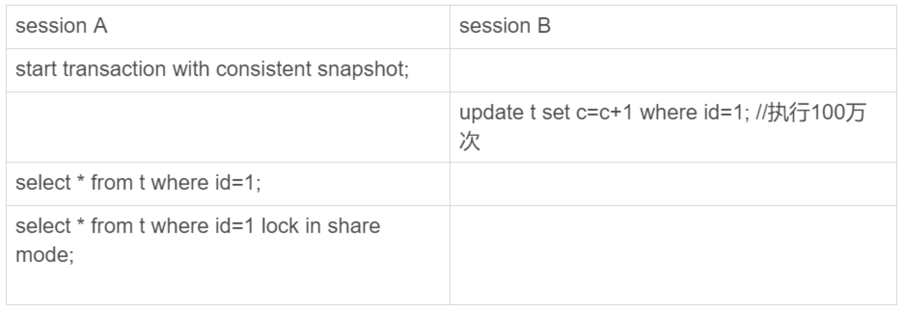
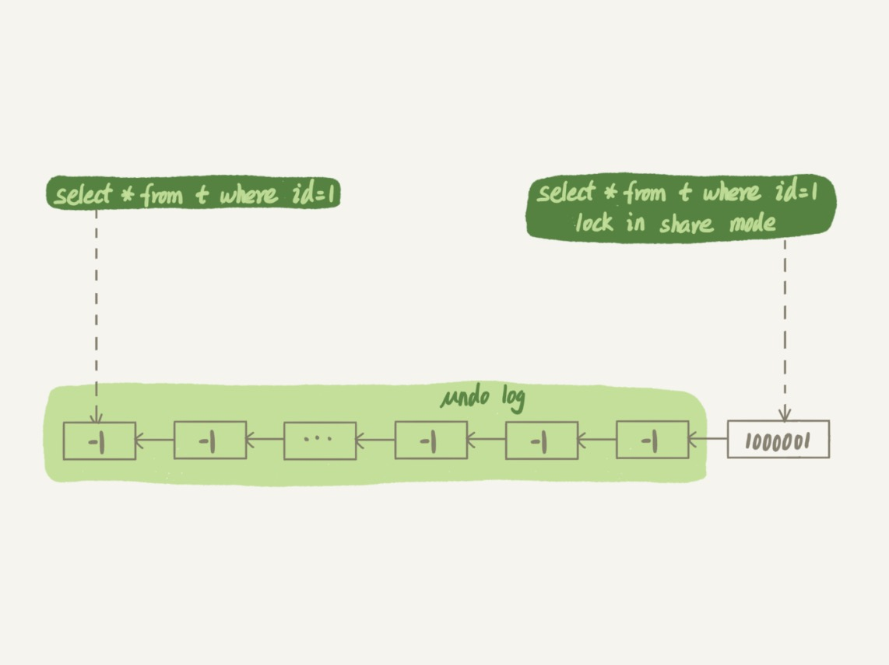

# 19-为什么我只查一行的语句，也执行这么慢

新建一个表，并插入 `10` 万行记录：

```sql
CREATE TABLE t (
  id int(11) NOT NULL,
  c int(11) DEFAULT NULL,
  PRIMARY KEY (id)
) ENGINE=InnoDB;

CREATE PROCEDURE insert_data()
BEGIN
  declare i int;
  set i=1;
  while(i<=100000) do
    insert into t values(i, i);
    set i=i+1;  
  end while;
END
```

## 第一类：查询长时间不返回

在表 `t` 执行下面的 `SQL` 语句，查询结果长时间不返回：

    select * from t where id=1;

大概率是表 `t` 被锁住了。

### 等 MDL 锁

复现这个场景：

- `session A`

  会话 `A` 持有表 `t` 的 `MDL` 写锁。

      mysql> lock table t write;
      Query OK, 0 rows affected (0.00 sec)

- `session B`

  会话 `B` 查询表 `t` 一条记录，需要获取表 `t` 的 `MDL` 读锁，因此阻塞。

      mysql> select * from t where id = 1;

- `session C`

  会话 `C` 找到谁持有 `MDL` 写锁，然后把它 `kill` 掉。

  通过 `SHOW PROCESSLIST` 查看各连接进程的状态：
  - 可以看到 `process id` 为 `3` 的连接正在等待 `MDL` 锁。
  - 真正持有表 `t` 的 `MDL` 写锁的是 `process id` 为 `2` 的连接，`Command` 为 `Sleep`，无法确定就是持有 `MDL` 写锁的连接。
  
        mysql> SHOW PROCESSLIST;
        +----+------+---------------------+------+---------+------+---------------------------------+------------------------------+
        | Id | User | Host                | db   | Command | Time | State                           | Info                         |
        +----+------+---------------------+------+---------+------+---------------------------------+------------------------------+
        |  2 | root | localhost           | test | Sleep   |    9 |                                 | NULL                         |
        |  3 | root | localhost           | test | Query   |    6 | Waiting for table metadata lock | select * from t where id = 1 |
        |  4 | root | localhost           | NULL | Query   |    0 | starting                        | SHOW PROCESSLIST             |
        |  5 | root | 223.72.75.107:11779 | sys  | Sleep   |   16 |                                 | NULL                         |
        +----+------+---------------------+------+---------+------+---------------------------------+------------------------------+
        4 rows in set (0.00 sec)

  设置 `MYSQL` 的启动参数，并重启 `MYSQL` 服务：

      performance-schema-instrument='wait/lock/metadata/sql/mdl=ON'

  复现上面的场景，然后查询如下系统表，查看锁等待情况：

      mysql> select * from sys.schema_table_lock_waits\G
      *************************** 1. row ***************************
                     object_schema: test
                       object_name: t
                 waiting_thread_id: 28
                       waiting_pid: 3
                   waiting_account: root@localhost
                 waiting_lock_type: SHARED_READ
             waiting_lock_duration: TRANSACTION
                     waiting_query: select * from t where id = 1
                waiting_query_secs: 63
       waiting_query_rows_affected: 0
       waiting_query_rows_examined: 0
                blocking_thread_id: 27
                      blocking_pid: 2
                  blocking_account: root@localhost
                blocking_lock_type: SHARED_NO_READ_WRITE
            blocking_lock_duration: TRANSACTION
           sql_kill_blocking_query: KILL QUERY 2
      sql_kill_blocking_connection: KILL 2
      1 row in set (0.00 sec)

  执行如下命令 `kill` 掉持有 `MDL` 锁的进程（`blocking_pid`）：

      mysql> kill 2;
      Query OK, 0 rows affected (0.00 sec)

### 等 flush

复现这个场景：

- `session A`

  会话 `A` 故意每行都调用一次 `sleep(1)`，这个语句默认要执行 `10` 万秒，在这期间表 `t` 一直是被 `打开` 着的。

      mysql> select sleep(1) from t;

- `session B`

  会话 `B` 去关闭表 `t`，就需要等 `session A` 的查询结束。

      mysql> flush tables t;

- `session C`

  会话 `C` 再次查询的话，就会被 `flush` 命令堵住了。

      mysql> select * from t where id = 1;

- `session D`

  会话 `D` 通过 `SHOW PROCESSLIST` 查看各连接进程的状态：

      mysql> show processlist;
      +----+------+---------------------+------+---------+------+-------------------------+------------------------------+
      | Id | User | Host                | db   | Command | Time | State                   | Info                         |
      +----+------+---------------------+------+---------+------+-------------------------+------------------------------+
      |  5 | root | 223.72.75.107:11779 | sys  | Sleep   |    1 |                         | NULL                         |
      |  6 | root | 223.72.75.107:12187 | sys  | Sleep   |    7 |                         | NULL                         |
      |  7 | root | 223.72.75.107:12188 | sys  | Sleep   |    7 |                         | NULL                         |
      |  8 | root | localhost           | test | Query   |   40 | User sleep              | select sleep(1) from t       |
      |  9 | root | localhost           | test | Query   |   28 | Waiting for table flush | flush tables t               |
      | 10 | root | localhost           | test | Query   |   17 | Waiting for table flush | select * from t where id = 1 |
      | 11 | root | localhost           | test | Query   |    0 | starting                | show processlist             |
      +----+------+---------------------+------+---------+------+-------------------------+------------------------------+
      7 rows in set (0.00 sec)

  执行如下命令 `kill` 掉 `session A`：

      mysql> kill 8;
      Query OK, 0 rows affected (0.00 sec)

  再通过 `SHOW PROCESSLIST` 查看各连接进程的状态：

      mysql> show processlist;
      +----+------+---------------------+------+---------+------+----------+------------------+
      | Id | User | Host                | db   | Command | Time | State    | Info             |
      +----+------+---------------------+------+---------+------+----------+------------------+
      |  5 | root | 223.72.75.107:11779 | sys  | Sleep   |   18 |          | NULL             |
      |  6 | root | 223.72.75.107:12187 | sys  | Sleep   |   22 |          | NULL             |
      |  7 | root | 223.72.75.107:12188 | sys  | Sleep   |   22 |          | NULL             |
      |  9 | root | localhost           | test | Sleep   |  143 |          | NULL             |
      | 10 | root | localhost           | test | Sleep   |  132 |          | NULL             |
      | 11 | root | localhost           | test | Query   |    0 | starting | show processlist |
      +----+------+---------------------+------+---------+------+----------+------------------+
      6 rows in set (0.00 sec)

### 等行锁

复现这个场景：

- `session A`

  会话 `A` 启动一个事务，更新语句获取到了行的写锁，不提交。

      mysql> begin;
      Query OK, 0 rows affected (0.00 sec)
      
      mysql> update t set c=c+1 where id = 1;
      Query OK, 1 row affected (0.00 sec)
      Rows matched: 1  Changed: 1  Warnings: 0

- `session B`

  会话 `B` 访问同一条记录并且要加行的读锁，被堵住了。

      mysql> select * from t where id = 1 lock in share mode;

- `session C`

  会话 `C` 通过 `SHOW PROCESSLIST` 查看各连接进程的状态：

      mysql> show processlist;
      +----+------+---------------------+------+---------+------+------------+-------------------------------------------------+
      | Id | User | Host                | db   | Command | Time | State      | Info                                            |
      +----+------+---------------------+------+---------+------+------------+-------------------------------------------------+
      |  5 | root | 223.72.75.107:11779 | sys  | Sleep   |    1 |            | NULL                                            |
      |  6 | root | 223.72.75.107:12187 | sys  | Sleep   |    1 |            | NULL                                            |
      |  7 | root | 223.72.75.107:12188 | sys  | Sleep   |    1 |            | NULL                                            |
      |  9 | root | localhost           | test | Sleep   | 4110 |            | NULL                                            |
      | 10 | root | localhost           | test | Sleep   | 4099 |            | NULL                                            |
      | 11 | root | localhost           | test | Sleep   | 3967 |            | NULL                                            |
      | 12 | root | localhost           | test | Query   |    0 | starting   | show processlist                                |
      | 13 | root | localhost           | test | Query   |    5 | statistics | select * from t where id = 1 lock in share mode |
      | 14 | root | localhost           | test | Sleep   |    9 |            | NULL                                            |
      +----+------+---------------------+------+---------+------+------------+-------------------------------------------------+
      9 rows in set (0.00 sec)

  显然，`session A` 启动了事务，占有写锁，还不提交，是导致 `session B` 被堵住的原因。

  那怎么查出是谁占着这个写锁？
  
  可以通过 `sys.innodb_lock_waits` 表查到：

      mysql> select * from sys.innodb_lock_waits where locked_table = '`test`.`t`'\G
      *************************** 1. row ***************************
                      wait_started: 2022-12-19 17:39:42
                          wait_age: 00:00:09
                     wait_age_secs: 9
                      locked_table: `test`.`t`
                      locked_index: PRIMARY
                       locked_type: RECORD
                    waiting_trx_id: 421346061508672
               waiting_trx_started: 2022-12-19 17:39:42
                   waiting_trx_age: 00:00:09
           waiting_trx_rows_locked: 1
         waiting_trx_rows_modified: 0
                       waiting_pid: 13
                     waiting_query: select * from t where id = 1 lock in share mode
                   waiting_lock_id: 421346061508672:140:4:2
                 waiting_lock_mode: S
                   blocking_trx_id: 229138
                      blocking_pid: 14
                    blocking_query: NULL
                  blocking_lock_id: 229138:140:4:2
                blocking_lock_mode: X
              blocking_trx_started: 2022-12-19 17:39:38
                  blocking_trx_age: 00:00:13
          blocking_trx_rows_locked: 1
        blocking_trx_rows_modified: 1
           sql_kill_blocking_query: KILL QUERY 14
      sql_kill_blocking_connection: KILL 14
      1 row in set, 3 warnings (0.00 sec)

  执行如下命令 `kill` 掉 `session A`：

      mysql> kill 14;
      Query OK, 0 rows affected (0.00 sec)
  
  实际上 `KILL 14` 就是直接断开这个连接。
  
  这里隐含的一个逻辑是，连接被断开的时候，会自动回滚这个连接里面正在执行的线程，也就释放了 `id=1` 上的行锁。

## 第二类：查询慢

这个场景：



实践：

- `session A`

  会话 `A` 立刻启动一个一致性读事务。

      mysql> start transaction with consistent snapshot;
      Query OK, 0 rows affected (0.00 sec)

- `session B`

  会话 `B` 新建一个存储过程，修改记录 `10` 万次。

      mysql> delimiter ;;
      mysql> CREATE PROCEDURE update_data()
          -> BEGIN
          ->   declare i int;
          ->   set i=1;
          ->   while(i<=100000) do
          ->     update t set c=c+1 where id = 1;
          ->     set i=i+1;
          ->   end while;
          -> END;;
      Query OK, 0 rows affected (0.00 sec)
      
      mysql> delimiter ;
      mysql> call update_data();
      Query OK, 1 row affected (1 min 36.74 sec)

- `session A`

      mysql> select * from t where id = 1;
      +----+------+
      | id | c    |
      +----+------+
      |  1 |    1 |
      +----+------+
      1 row in set (0.06 sec)
      
      mysql> select * from t where id = 1 lock in share mode;
      +----+--------+
      | id | c      |
      +----+--------+
      |  1 | 100001 |
      +----+--------+
      1 row in set (0.00 sec)

其中 `session B` 执行完 `10` 万次 `update` 语句后，生成了 `10` 万个回滚日志 (`undo log`)：



结论：
- `select * from t where id = 1 lock in share mode;`
  
  是当前读，因此是直接读最新值 `100001` 所以速度很快。

- `select * from t where id = 1;`
  
  是一致性读，因此需要从最新值 `100001` 开始，依次执行 `undo log`，执行了 `10` 万次以后，才将 `1` 这个结果返回。

## 小结

在一个简单的表上执行 `查一行`，可能会出现的被锁住和执行慢。

这其中涉及到了`表锁`、`行锁`和`一致性读`的概念。

# 完