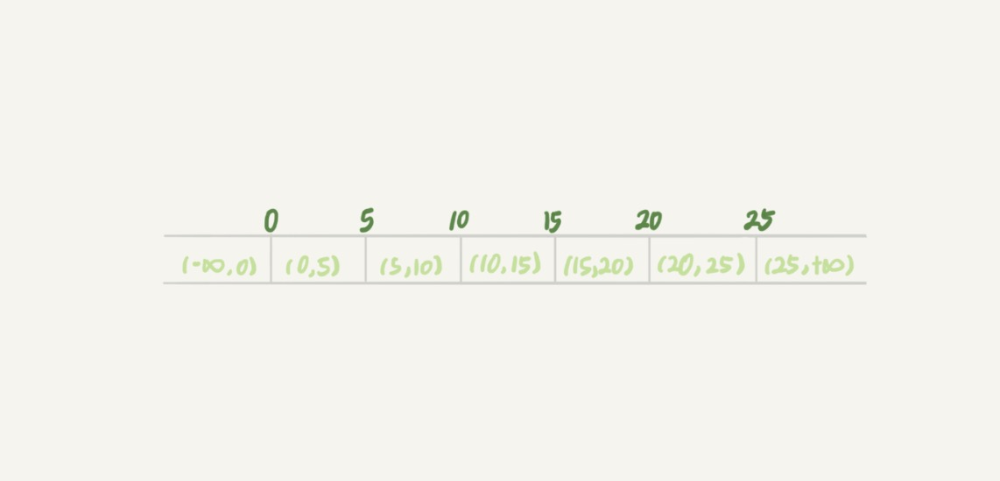
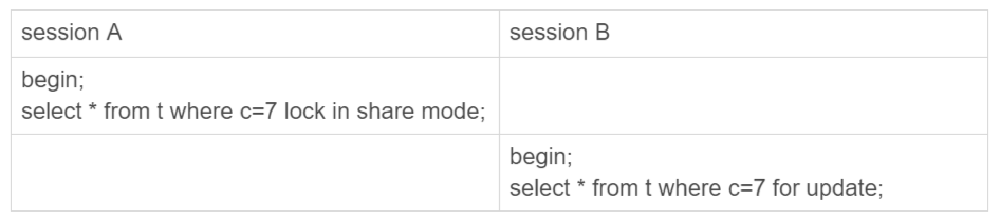
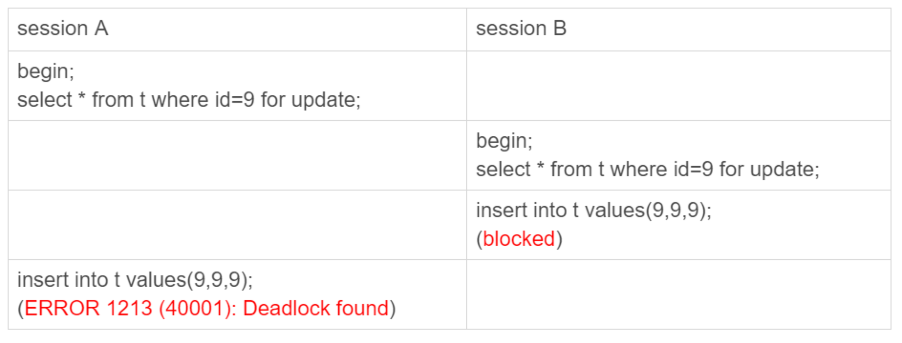

# 20-幻读是什么，幻读有什么问题

新建一个表，并插入 `6` 条记录：

```sql
CREATE TABLE t (
    id int(11) NOT NULL,
    c int(11) DEFAULT NULL,
    d int(11) DEFAULT NULL,
    PRIMARY KEY (id),
    KEY c (c)
) ENGINE=InnoDB;

INSERT INTO t VALUES
(0,0,0),
(5,5,5),
(10,10,10),
(15,15,15),
(20,20,20),
(25,25,25);
```

`InnoDB` 的默认事务隔离级别是`可重复读`，接下来都设定在`可重复读`隔离级别下。

下面的语句序列，是怎么加锁的，加的锁又是什么时候释放的呢？

```sql
begin;
select * from t where d=5 for update;
commit;
```

## 幻读是什么？

`幻读`指的是一个事务在前后两次查询同一个范围的时候，后一次查询看到了前一次查询没有看到的行。

## 幻读有什么问题？

- 破坏语义的问题。
- 数据一致性的问题。

## 如何解决幻读？

`InnoDB` 怎么解决幻读的问题。

产生`幻读`的原因是，`行锁`只能锁住行，但是新插入记录这个动作，要更新的是记录之间的`间隙`。

因此，为了解决`幻读`问题，`InnoDB` 只好引入新的锁，也就是`间隙锁` (`Gap Lock`)。

顾名思义，`间隙锁`，锁的就是两个值之间的`空隙`。

比如表 `t`，初始化插入了 `6` 个记录，这就产生了 `7` 个间隙。



这样，当执行 `select * from t where d=5 for update` 的时候，就不止是给数据库中已有的 `6` 个记录加上了`行锁`，还同时加了 `7` 个`间隙锁`。

这样就确保了无法再插入新的记录。

`数据行`是可以加上锁的实体，数据行之间的`间隙`，也是可以加上锁的实体。

`行锁`分成`读锁`和`写锁`。

下图就是这两种类型`行锁`的冲突关系：


`间隙锁`跟之前碰到过的`锁`都不太一样，跟`间隙锁`存在冲突关系的，是`往这个间隙中插入一个记录`这个操作，`间隙锁`之间都不存在冲突关系。

例子：



这里 `session B` 并不会被堵住。

因为表 `t` 里并没有 `c=7` 这个记录，因此 `session A` 加的是间隙锁 `(5,10)`。

而 `session B` 也是在这个间隙加的间隙锁。

它们有共同的目标，即：保护这个间隙，不允许插入值。但，它们之间是不冲突的。


`间隙锁`和`行锁`合称 `next-key lock`，每个 `next-key lock` 是前开后闭区间。

也就是说，表 `t` 初始化以后，如果用 `select * from t for update` 要把整个表所有记录锁起来，就形成了 7 个 `next-key lock`，分别是：

`(-∞,0]`、`(0,5]`、`(5,10]`、`(10,15]`、`(15,20]`、`(20, 25]`、`(25, +supremum]`。


`间隙锁`和 `next-key lock` 的引入，解决了`幻读`的问题，但同时也带来了一些`困扰`。

下面的场景在并发的情况下，就会碰到`死锁`。



分析一下：
- `session A` 执行 `select … for update` 语句，由于 `id=9` 这一行并不存在，因此会加上间隙锁 `(5,10)`。
- `session B` 执行 `select … for update` 语句，同样会加上间隙锁 `(5,10)`，间隙锁之间不会冲突，因此这个语句可以执行成功。
- `session B` 试图插入一行 `(9,9,9)`，被 `session A` 的间隙锁挡住了，只好进入等待。
- `session A` 试图插入一行 `(9,9,9)`，被 `session B` 的间隙锁挡住了。

至此，两个 `session` 进入互相等待状态，形成`死锁`。

当然，`InnoDB` 的死锁检测马上就发现了这对死锁关系，让 `session A` 的 `insert` 语句报错返回了。

**间隙锁的引入，可能会导致同样的语句锁住更大的范围，这其实是影响了并发度的。**

`间隙锁`是在可重复读隔离级别下才会生效的。

所以，如果把隔离级别设置为`读提交`的话，就没有`间隙锁`了。

但同时，要解决可能出现的`数据`和`日志`不一致问题，需要把 `binlog` 格式设置为 `row`。

这，也是现在不少公司使用的配置组合。

## 小结

即使给所有的行都加上`行锁`，仍然无法解决`幻读`问题，因此引入了`间隙锁`的概念。

# 完