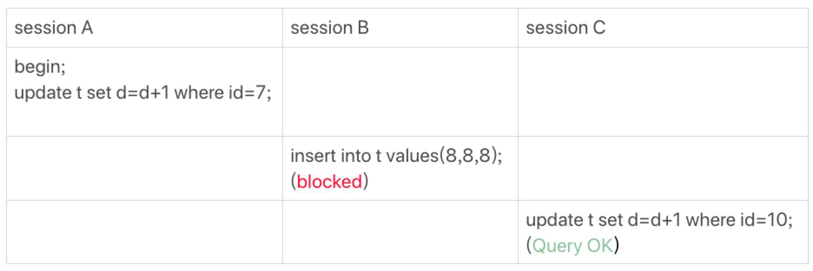
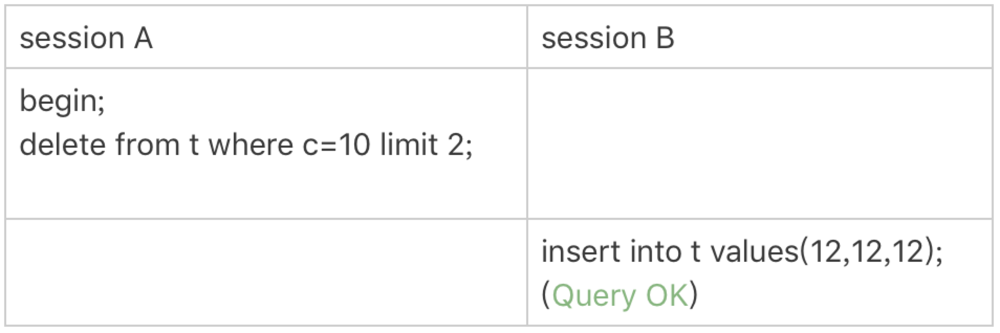

# 21-为什么我只改一行的语句，锁这么多

今天讨论`加锁规则`。

`间隙锁`在`可重复读`隔离级别下才有效，接下来的描述默认是`可重复读`隔离级别。

总结加锁规则，包含两个`原则`、两个`优化`和一个`bug`：
- `原则 1`：加锁的基本单位是 `next-key lock`，是前开后闭区间。
- `原则 2`：查找过程中访问到的对象才会加锁。
- `优化 1`：索引上的等值查询，给唯一索引加锁的时候，`next-key lock` 退化为`行锁`。
- `优化 2`：索引上的等值查询，向右遍历时且最后一个值不满足等值条件的时候，`next-key lock` 退化为`间隙锁`。
- `一个 bug`：唯一索引上的范围查询会访问到不满足条件的第一个值为止。

新建一个表，并插入 `6` 条记录：

```sql
CREATE TABLE t (
    id int(11) NOT NULL,
    c int(11) DEFAULT NULL,
    d int(11) DEFAULT NULL,
    PRIMARY KEY (id),
    KEY c (c)
) ENGINE=InnoDB;

INSERT INTO t VALUES
(0,0,0),
(5,5,5),
(10,10,10),
(15,15,15),
(20,20,20),
(25,25,25);
```

## 案例一：等值查询间隙锁

关于等值条件操作间隙：



表 `t` 中没有 `id=7` 的记录，用加锁规则判断一下：
- 根据`原则 1`，加锁单位是 `next-key lock`，`session A` 加锁范围就是 `(5,10]`。
- 根据`优化 2`，这是一个等值查询 (`id=7`)，而 `id=10` 不满足查询条件，`next-key lock` 退化成间隙锁，因此最终加锁的范围是 `(5,10)`。
 
所以，`session B` 要往这个间隙里面插入 `id=8` 的记录会被锁住，但是 `session C` 修改 `id=10` 这行是可以的。

## 案例二：非唯一索引等值锁

关于覆盖索引上的锁：


这里 `session A` 要给索引 `c` 上 `c=5` 的这一行加上`读锁`。

- 根据`原则 1`，加锁单位是 `next-key lock`，因此会给 `(0,5]`加上 `next-key lock`。
- 要注意 `c` 是普通索引，因此仅访问 `c=5` 这一条记录是不能马上停下来的，需要向右遍历，查到 `c=10` 才放弃。根据`原则 2`，访问到的都要加锁，因此要给 `(5,10]`加 `next-key lock`。
- 但是同时这个符合`优化 2`：等值判断，向右遍历，最后一个值不满足 `c=5` 这个等值条件，因此退化成间隙锁 `(5,10)`。
- 根据`原则 2` ，只有访问到的对象才会加锁，这个查询使用`覆盖索引`，并不需要访问`主键索引`，所以`主键索引`上没有加任何锁，这就是为什么 `session B` 的 `update` 语句可以执行完成。

但 `session C` 要插入一个 `(7,7,7)` 的记录，就会被 `session A` 的间隙锁 `(5,10)` 锁住。

需要注意，`lock in share mode` 只锁覆盖索引，如果是 `for update`，系统会认为接下来要更新数据，因此会顺便给主键索引上满足条件的行加上`行锁`。

`锁`是加在`索引`上的。

如果要用 `lock in share mode` 来给行加读锁避免数据被更新的话，就必须得绕过`覆盖索引`的优化，在查询字段中加入索引中不存在的字段。

比如将 `session A` 的查询语句改成 `select d from t where c=5 lock in share mode`。

## 案例三：主键索引范围锁

关于范围查询的。

下面这两条查询语句，加锁范围相同吗？

    select * from t where id=10 for update;
    select * from t where id>=10 and id<11 for update;

在逻辑上，这两条查语句肯定是等价的，但是它们的加锁规则不太一样。


分析：
- 开始执行的时候，要找到第一个 `id=10` 的行，因此本该是 `next-key lock(5,10]`。 根据`优化 1`，主键 `id` 上的等值条件，退化成`行锁`，只加了 `id=10` 这一行的`行锁`。
- 范围查找就往后继续找，找到 `id=15` 这一行停下来，因此需要加 `next-key lock(10,15]`。

所以，`session A` 这时候锁的范围就是`主键索引`上，行锁 `id=10` 和 `next-key lock(10,15]`。

这样，`session B` 和 `session C` 的结果就能理解了。

需要注意一点，首次 `session A` 定位查找 `id=10` 的行的时候，是当做`等值查询`来判断的，而向右扫描到 `id=15` 的时候，用的是`范围查询`判断。

## 案例四：非唯一索引范围锁

与案例三不同的是，案例四中查询语句的 `where` 部分用的是字段 `c`。


这次 `session A` 用字段 `c` 来判断，加锁规则跟案例三唯一的不同是：

在第一次用 `c=10` 定位记录的时候，索引 `c` 上加了 `(5,10]`这个 `next-key lock` 后，由于索引 `c` 是非唯一索引，没有优化规则，也就是说不会蜕变为`行锁`。

因此最终 `sesion A` 加的锁是，索引 `c` 上的 `(5,10]` 和 `(10,15]` 这两个 `next-key lock`。

所以从结果上来看，`sesson B` 要插入（`8,8,8)` 的这个 `insert` 语句时就被堵住了。

这里需要扫描到 `c=15` 才停止扫描，是合理的，因为 `InnoDB` 要扫到 `c=15`，才知道不需要继续往后找了。

## 案例五：唯一索引范围锁 bug

关于加锁规则中 `bug` 的案例。


`session A` 是一个范围查询，按照`原则 1` ，应该是索引 `id` 上只加 `(10,15]`这个 `next-key lock`，并且因为 `id` 是唯一键，所以循环判断到 `id=15` 这一行就应该停止了。

但是实现上，`InnoDB` 会往前扫描到第一个不满足条件的行为止，也就是 `id=20`。而且由于这是个范围扫描，因此索引 `id` 上的 `(15,20]`这个 `next-key lock` 也会被锁上。

所以，`session B` 要更新 `id=20` 这一行，是会被锁住的。同样，`session C` 要插入 `id=16` 的一行，也会被锁住。

照理说，这里锁住 `id=20` 这一行的行为，其实是没有必要的。因为扫描到 `id=15`，就可以确定不用往后再找了。

但实现上还是这么做了，因此认为这是个 `bug`。

## 案例六：非唯一索引上存在"等值"的例子

给表 `t` 插入一条新记录：

    insert into t values(30,10,30);

这时候索引 `c` 上的间隙如下图：


这次用 `delete` 语句来验证，它的加锁的逻辑，跟 `select ... for update` 是类似的。


`session A` 在遍历的时候，先访问第一个 `c=10` 的记录。根据`原则 1`，这里加的是 `(c=5,id=5)` 到 `(c=10,id=10)` 的 `next-key lock`。

`session A` 向右查找，直到碰到 `(c=15,id=15)` 这一行，循环才结束。根据`优化 2`，这是一个等值查询，向右查找到了不满足条件的行，所以会退化成 `(c=10,id=10)` 到 `(c=15,id=15)` 的`间隙锁`。

这个 `delete` 语句在索引 `c` 上的加锁范围，就是下图中蓝色区域覆盖的部分。


这个蓝色区域左右两边都是虚线，表示开区间，即 `(c=5,id=5)` 和 `(c=15,id=15)` 这两行上都没有锁。

## 案例七：limit 语句加锁

案例六对照案例：



这个例子 `session A` 的 `delete` 语句加了 `limit 2`。

表 `t` 里 `c=10` 的记录其实只有两条，因此加不加 `limit 2`，删除的效果都是一样的，但是加锁的效果却不同。

`session B` 的 `insert` 语句执行通过了，跟案例六的结果不同。

这是因为 `delete` 语句明确加了 `limit 2` 的限制，因此在遍历到 `(c=10, id=30)` 这一行之后，满足条件的语句已经有两条，循环就结束了。

索引 `c` 上的加锁范围就变成了从`（c=5,id=5)` 到`（c=10,id=30)` 这个前开后闭区间：


可以看到 `(c=10,id=30` 之后的这个间隙并没有在加锁范围里，因此 `insert` 语句插入 `c=12` 是可以执行成功的。

**因此在删除数据的时候尽量加 `limit`，这样不仅可以控制删除数据的条数，让操作更安全，还可以减小加锁的范围。**

## 案例八：一个死锁的例子

前面的例子是按照 `next-key lock` 的逻辑来分析的，因为这样分析比较方便。

再看一个案例，目的是说明：`next-key lock` 实际上是`间隙锁`和`行锁`加起来的结果。


分析：
- `session A` 启动事务后执行查询语句加 `lock in share mode`，在索引 `c` 上加了 `next-key lock(5,10]` 和 `间隙锁 (10,15)`。
- `session B` 的 `update` 语句也要在索引 `c` 上加 `next-key lock(5,10]`，进入锁等待。
- 然后 `session A` 要再插入 `(8,8,8)` 这一行，被 `session B` 的`间隙锁`锁住。由于出现了`死锁`，`InnoDB` 让 `session B` 回滚。

`session B` 的 `next-key lock` 不是还没申请成功吗？

其实是这样的，`session B` 的 `加 next-key lock(5,10]` 操作，实际上分成了`两步`，先是加 `(5,10)` 的`间隙锁`，加锁成功，然后加 `c=10` 的`行锁`，这时候才被锁住的。

在分析加锁规则的时候可以用 `next-key lock` 来分析。

但是要知道，具体执行的时候，是要分成`间隙锁`和`行锁`两段来执行的。

## 小结

上面所有案例都是在`可重复读`隔离级别下验证的。

同时，`可重复读`隔离级别遵守`两阶段锁`协议，所有加锁的资源，都是在事务`提交`或者`回滚`的时候才释放的。

`next-key lock` 实际上是由`间隙锁`加`行锁`实现的。

如果切换到`读提交`隔离级别，就好理解了，去掉`间隙锁`的部分，只剩下`行锁`的部分。

在`读提交`隔离级别下还有一个优化：语句执行过程中加上的行锁，在语句执行完成后，就要把`不满足条件的行`上的`行锁`直接释放了，不需要等到事务提交。

也就是说，`读提交`隔离级别下，锁的范围更小，锁的时间更短，这也是不少业务都默认使用`读提交`隔离级别的原因。

通过上面的分析，可以对 `next-key lock` 的概念有更清晰的认识，并且会用加锁规则去判断语句的加锁范围。

在业务需要使用`可重复读`隔离级别的时候，能够更细致地设计操作数据库的语句，解决`幻读`问题的同时，最大限度地提升系统并行处理事务的能力。

## 思考题

还是本文开头初始化的表 `t`，里面有 `6` 条记录，下面的语句序列中，为什么 `session B` 的 `insert` 操作，会被锁住呢？


分析：
- 由于是 `order by c desc`，第一个要定位的是索引 `c` 上 `最右边的 c=20` 的行，所以会加上`间隙锁` `(20,25)` 和 `next-key lock` `(15,20]`。
- 在索引 `c` 上向左遍历，要扫描到 `c=10` 才停下来，所以 `next-key lock` 会加到 `(5,10]`，这正是阻塞 `session B` 的 `insert` 语句的原因。
- 在扫描过程中，`c=20`、`c=15` 这二行符合条件，由于是 `select *` 需要`回表`访问索引 `id`，所以会在主键 `id` 上加二个`行锁`。

因此，`session A` 的 `select` 语句锁的范围就是：
- 索引 `c` 上 `(5, 25)`。
- 主键索引上 `id=15`、`id=20` 两个行锁。

另外，主键索引上 `id=10` 没有加锁，可以修改主键记录，但不能涉及到索引 `c` 的修改，因为索引 `c` 上有 `(5, 25)` 加锁。


**最后，锁就是加在索引上的，这是 `InnoDB` 的一个基础设定，需要在分析问题的时候要一直记得。**


**情况2**

没有 `order by c desc` 的锁的范围：
- 索引 `c` 上 `(10, 25)`。
- 主键索引上 `id=15`、`id=20` 两个行锁。


# 完