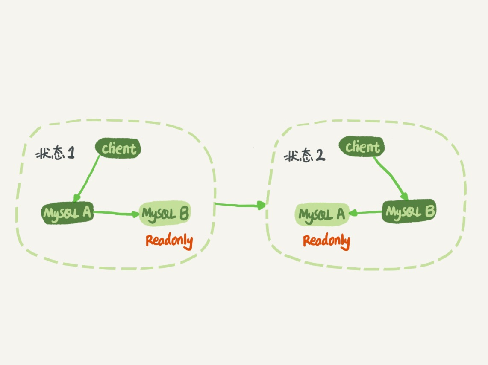
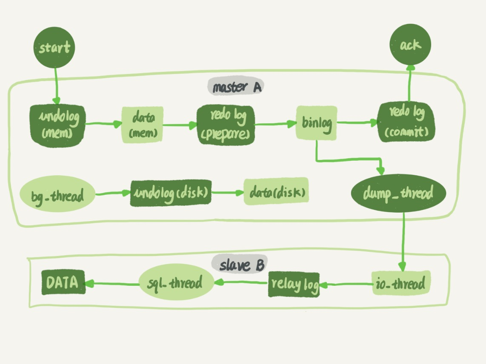
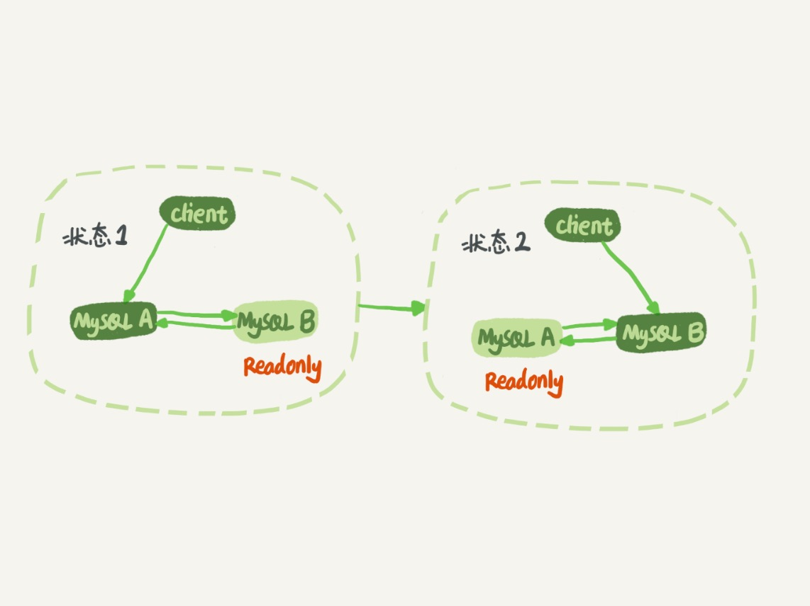

# 24-MySQL是怎么保证主备一致的

大家知道 `binlog` 可以用来归档，也可以用来做主备同步。

`MySQL` 能够成为现下最流行的开源数据库，`binlog` 功不可没。

`MySQL` 的几乎所有的高可用架构，都直接依赖于 `binlog`。

虽然这些高可用架构已经呈现出越来越复杂的趋势，但都是从最基本的`一主一备`演化过来的。

## MySQL 主备的基本原理

基本的主备切换流程：

在`状态 1` 中，客户端的读写都直接访问节点 `A`，而节点 `B` 是 `A` 的备库，只是将 `A` 的更新都同步过来，到本地执行，这样可以保持节点 `B` 和 `A` 的数据是相同的。

当需要切换的时候，就切成`状态 2`。这时候客户端读写访问的都是节点 `B`，而节点 `A` 是 `B` 的备库。

建议把备库设置成`只读`（`readonly`）模式：
- 有时候一些查询类业务会被放到备库上去查，设置为`只读`可以防止误操作。
- 防止切换逻辑有 `bug`，比如切换过程中出现双写，造成主备不一致。
- 可以用 `readonly` 状态，来判断节点的角色。

备库 `readonly` 设置对超级 (`super`) 权限用户是无效的，而用于同步更新的线程，就拥有超级权限。

节点 `A` 到 `B` 这条线的内部流程是什么样的？

下面是一个 `update` 语句在节点 `A` 执行，然后同步到节点 `B` 的完整流程图：

可以看到，主库接收到客户端的更新请求后，执行内部事务的更新逻辑，同时写 `binlog`。

备库 `B` 跟主库 `A` 之间维持了一个长连接。主库 `A` 内部有一个线程，专门用于服务备库 `B` 的这个长连接。

一个事务日志同步的完整过程是这样的：
- 在备库 `B` 上通过 `change master` 命令，设置主库 `A` 的 `IP`、`端口`、`用户名`、`密码`，以及要从哪个位置开始请求 `binlog`，这个位置包含`文件名`和`日志偏移量`。
- 在备库 `B` 上执行 `start slave` 命令，这时候备库会启动两个线程，就是图中的 `io_thread` 和 `sql_thread`。其中 `io_thread` 负责与主库建立连接。
- 主库 `A` 校验完`用户名`、`密码`后，开始按照备库 `B` 传过来的位置，从本地读取 `binlog`，发给 `B`。
- 备库 `B` 拿到 `binlog` 后，写到本地文件，称为`中转日志`（`relay log`）。
- `sql_thread` 读取中转日志，解析出日志里的命令，并执行。

后来由于多线程复制方案的引入，`sql_thread` 演化成为了多个线程。

## binlog 的三种格式对比

开启binlog日志：

    [mysqld]
    server-id=1
    log-bin=/var/lib/mysql/binlog/mylog

需要设置目录权限：

    chown -R mysql.mysql /var/lib/mysql/binlog/

`binlog` 有三种格式：
- `statement`  
  记录到 `binlog` 里的是语句原文。  
  可能会出现主备数据不一致的情况。  
- `row`  
  记录到 `binlog` 里的是以行为单位的操作语句。  
  不会出现主备数据不一致的情况。  
  但占用空间更大。  
- `mixed`  
  前两种格式的混合。  
  如果这条 `SQL` 语句可能引起主备不一致，就用 `row` 格式，否则就用 `statement` 格式。

现在越来越多的场景要求把 `MySQL` 的 `binlog` 格式设置成 `row`。

理由有很多，一个可以直接看出来的好处：`恢复数据`。

接下来从 `delete`、`insert` 和 `update` 这三种 `SQL` 语句的角度，来看看数据恢复的问题。

- 如果执行的是 `delete` 语句，`row` 格式的 `binlog` 也会把被删掉的行的整行信息保存起来。  
  恢复数据的时候，可以直接把 `binlog` 中记录的 `delete` 语句转成 in`sert，把被错删的数据插入回去就可以恢复了。

- 如果执行的是 `insert` 语句，`row` 格式的 `binlog` 里会记录所有的字段信息，这些信息可以用来精确定位刚刚被插入的那一行。  
  恢复数据的时候，可以直接把 `insert` 语句转成 `delete` 语句，删除掉被误插入的一行数据就可以了。

- 如果执行的是 `update` 语句，`row` 格式的 `binlog` 里面会记录修改前整行的数据和修改后的整行数据。  
  恢复数据的时候，可以把这个 `event` 前后的两行信息对调一下，再去数据库里面执行，就能恢复这个更新操作了。

`MariaDB` 的 `Flashback` 工具就是基于上面介绍的原理来回滚数据的。

用 `binlog` 来恢复数据的标准做法是，用 `mysqlbinlog` 工具解析出来，然后把解析结果整个发给 `MySQL` 执行。

类似下面的命令：

    mysqlbinlog master.000001  --start-position=2738 --stop-position=2973 | mysql -h127.0.0.1 -P13000 -u$user -p$pwd;

这个命令将 `master.000001` 文件里面从第 `2738` 字节到第 `2973` 字节中间这段内容解析出来，放到 `MySQL` 去执行。

## 循环复制问题

上面介绍的是 `M-S` 结构，但实际生产上使用比较多的是 `双 M`结构，也就是下图所示的主备切换流程。

`双 M` 结构和 `M-S` 结构，其实区别只是多了一条线，即：节点 `A` 和 `B` 之间总是互为主备关系。这样在切换的时候就不用再修改主备关系。

`双 M` 结构还有一个问题需要解决。

业务逻辑在节点 `A` 上更新了一条语句，然后再把生成的 `binlog` 发给节点 `B`，节点 `B` 执行完这条更新语句后也会生成 `binlog`。

那么，如果节点 `A` 同时是节点 `B` 的备库，相当于又把节点 `B` 新生成的 `binlog` 拿过来执行了一次，然后节点 `A` 和 `B` 间，会不断地循环执行这个更新语句，也就是循环复制了。

这个要怎么解决呢？

`MySQL` 在 `binlog` 中记录了这个命令第一次执行时所在实例的 `server id`。

可以用下面的逻辑，来解决两个节点间的循环复制的问题：
- 规定两个库的 `server id` 必须不同，如果相同，则它们之间不能设定为主备关系。
- 一个备库接到 `binlog` 并在重放的过程中，生成与原 `binlog` 的 `server id` 相同的新的 `binlog`。
- 每个库在收到从自己的主库发过来的日志后，先判断 `server id`，如果跟自己的相同，表示这个日志是自己生成的，就直接丢弃这个日志。

`双 M` 结构，日志的执行流就会变成这样：
- 从节点 `A` 更新的事务，`binlog` 里面记的都是 `A` 的 `server id`。
- 传到节点 `B` 执行一次以后，节点 `B` 生成的 `binlog` 的 `server id` 也是 `A` 的 `server id`。
- 再传回给节点 `A`，`A` 判断到这个 `server id` 与自己的相同，就不会再处理这个日志。所以，死循环在这里就断掉了。

## 小结

今天介绍了 `MySQL` `binlog` 的格式和一些基本机制，是后面要介绍的读写分离等系列文章的背景知识。

# 完