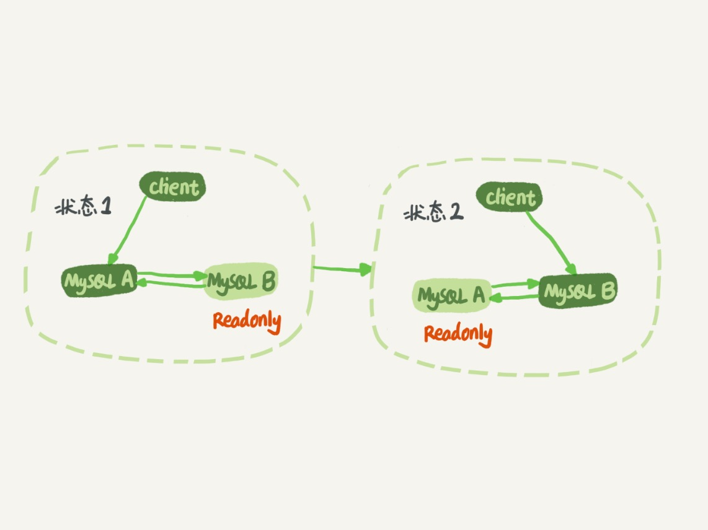
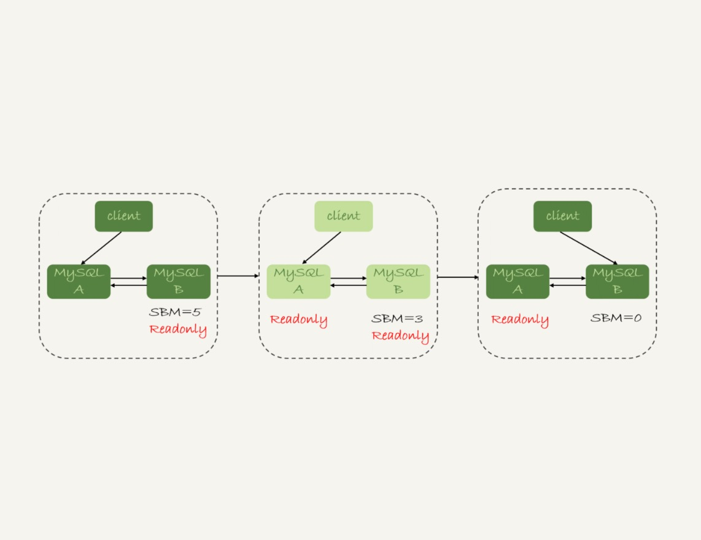
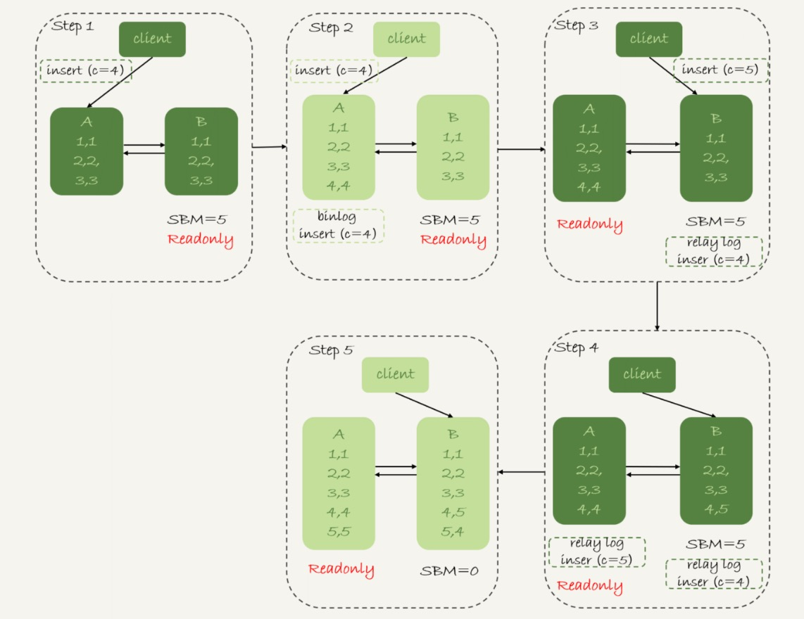
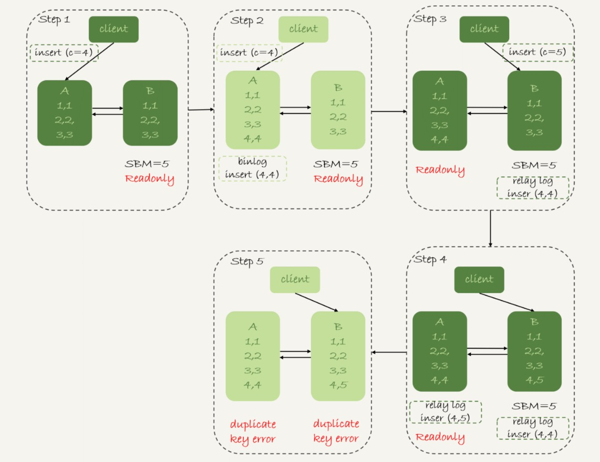
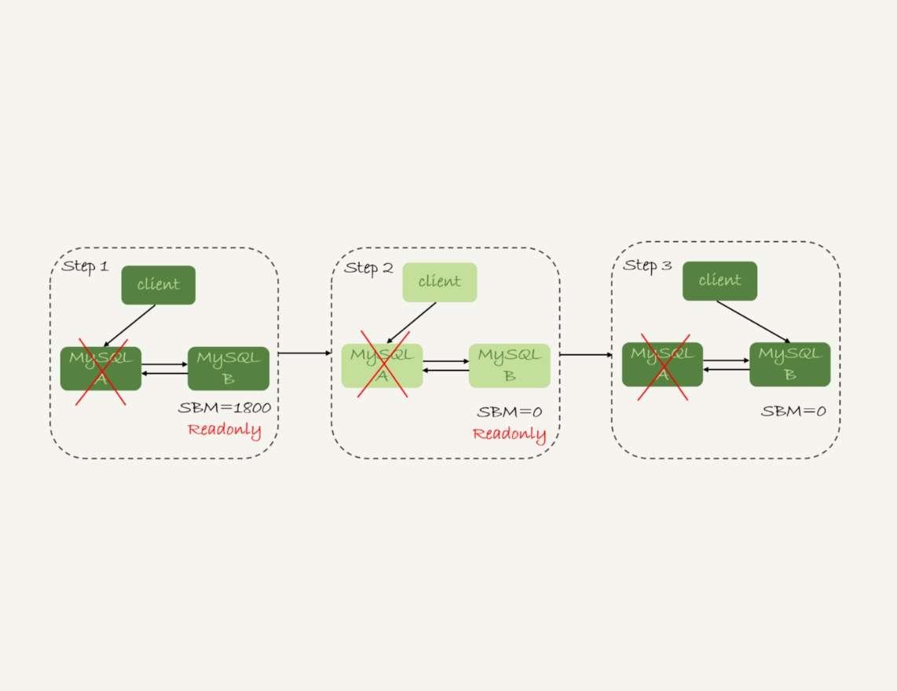

# 25-MySQL是怎么保证高可用的

正常情况下，只要主库执行更新生成的所有 `binlog`，都可以传到备库并被正确地执行，备库就能达到跟主库一致的状态，这就是`最终一致性`。

但是，`MySQL` 要提供高可用能力，只有`最终一致性`是不够的。

`双 M` 结构的主备切换流程图：

## 主备延迟

主备切换可能是一个主动运维动作，比如软件升级、主库所在机器下线等，也可能是被动操作，比如主库所在机器掉电。

接下来看主动切换的场景。

先说明一个概念：`同步延迟`。

与数据同步有关的时间点主要包括以下三个：
- 主库 `A` 执行完成一个事务，写入 `binlog`，这个时刻记为 `T1`。
- 之后传给备库 `B`，备库 `B` 接收完这个 `binlog` 的时刻记为 `T2`。
- 备库 `B` 执行完成这个事务，这个时刻记为 `T3`。

主备延迟，就是同一个事务，在备库执行完成的时间和主库执行完成的时间之间的差值，也就是 `T3-T1`。

可以在备库上执行 `show slave status` 命令，返回结果里面会显示 `seconds_behind_master`，用于表示当前备库延迟了多少秒。

`seconds_behind_master` 的计算方法是这样的：
- 每个事务的 `binlog` 里面都有一个时间字段，用于记录主库上写入的时间。
- 备库执行完同步事务后取出主库写入的时间的值，计算它与当前系统时间的差值，得到 `seconds_behind_master`。

备库连接到主库的时候，会通过执行 `SELECT UNIX_TIMESTAMP()` 函数来获得当前主库的系统时间。  
如果发现主库的系统时间与自己不一致，备库在执行 `seconds_behind_master` 计算的时候会自动扣掉这个差值。

在网络正常的时候，日志从主库传给备库所需的时间是很短的，即 `T2-T1` 的值是非常小的。  
也就是说，主备延迟的主要来源是备库接收完 `binlog` 到执行完这个事务之间的时间差。

所以主备延迟最直接的表现是，备库消费中转日志（`relay log`）的速度，比主库生产 `binlog` 的速度要慢。

## 主备延迟的来源

- 备库所在机器的性能要比主库所在的机器性能差
  
  当备库机器的性能差时，在备库上执行同步事务的时间就会长，主备延时就会大。  
  因为主备可能发生切换，备库随时可能变成主库，所以主备库选用相同规格的机器，并且做对称部署，是现在比较常见的情况。

- 备库压力大  
  
  一般的想法是，主库既然提供了写能力，那么备库可以提供一些读能力。  
  或者一些运营后台的分析语句，不能影响正常业务，所以在备库上跑。  
  结果就是，备库上的查询耗费了大量的 `CPU` 资源，影响了同步速度，造成主备延迟。

  一般可以这么处理：
  - `一主多从`。除了备库外，可以多接几个从库，让这些从库来分担读的压力。
  - 通过 `binlog` 输出到外部系统，比如 `Hadoop` 这类系统，让外部系统提供统计类查询的能力。
  
  其中，`一主多从`的方式大都会被采用。  
  因为作为数据库系统，还必须保证有定期全量备份的能力。  
  从库就很适合用来做备份。

- 大事务  
  
  大事务这种情况很好理解。  
  因为主库上必须等事务执行完成才会写入 binlog，再传给备库。  
  所以主库上的语句执行 `10` 分钟，这个事务很可能就会导致从库延迟 `10` 分钟。

  一次性地用 `delete` 语句删除太多数据就是一个典型的大事务场景。  
  删除数据的时候，要控制每个事务删除的数据量，分成多次删除。

  另一种典型的大事务场景，就是大表 `DDL`。  
  处理方案就是，计划内的 `DDL`，建议使用 `gh-ost` 方案。

造成主备延迟还有一个大方向的原因，就是备库的`并行复制`能力。  
这个话题在下一篇文章详细介绍。

由于主备延迟的存在，所以在主备切换的时候，就相应的有不同的策略。

## 可靠性优先策略

`双 M` 结构下，从`状态 1` 到`状态 2` 切换的详细过程是这样的：

- `步骤1`：判断备库 `B` 现在的 `seconds_behind_master`，如果小于某个值（比如 `5` 秒）继续下一步，否则持续重试这一步。
- `步骤2`：把主库 `A` 改成只读状态，即把 `readonly` 设置为 `true`。
- `步骤3`：判断备库 `B` 的 `seconds_behind_master` 的值，直到这个值变成 `0` 为止。
- `步骤4`：把备库 `B` 改成可读写状态，也就是把 `readonly` 设置为 `false`。
- `步骤5`：把业务请求切到备库 `B`。

这个切换流程，一般是由专门的 `HA` 系统来完成的，称之为`可靠性优先流程`。

这个切换流程中是有不可用时间的。

在`步骤 2` 之后，主库 `A` 和备库 `B` 都处于 `readonly` 状态，这时系统处于不可写状态，直到`步骤 5` 完成后恢复。

其中比较耗费时间的是`步骤 3`，可能需要耗费好几秒的时间。

所以需要在`步骤 1` 先做判断，确保 `seconds_behind_master` 的值足够小。

## 可用性优先策略

如果强行把`步骤 4、5` 调整到最开始执行，也就是说不等主备数据同步，直接把连接切到备库 `B`，并且让备库 `B` 可以读写，那么系统几乎就没有不可用时间了。

这个切换流程，称作`可用性优先流程`。

代价就是可能出现`数据不一致`的情况。

创建一个表，初始化数据后，主库和备库上都是 `3` 行数据。

    CREATE TABLE t (
      id int(11) unsigned NOT NULL AUTO_INCREMENT,
      c int(11) unsigned DEFAULT NULL,
      PRIMARY KEY (id)
    ) ENGINE=InnoDB;
    
    insert into t(c) values(1),(2),(3);

接下来业务人员要继续在表 `t` 上执行两条插入语句的命令，依次是：

    insert into t(c) values(4);
    insert into t(c) values(5);

假设现在主库上其他的数据表有大量的更新，导致主备延迟达到 `5` 秒。  
在插入一条 `c=4` 的语句后，发起了主备切换。

**可用性优先策略：binlog_format=mixed 时的切换流程和数据结果：**

分析下这个切换流程：
- `步骤 2` 中，主库 `A` 执行完 `insert` 语句，插入了一行数据（`4,4）`，之后开始进行主备切换。
- `步骤 3` 中，由于主备之间有 `5` 秒的延迟，所以备库 `B` 还没来得及应用 `插入 c=4` 这个中转日志，就开始接收客户端 `插入 c=5` 的命令。
- `步骤 4` 中，备库 `B` 插入了一行数据（`4,5）`，并且把这个 `binlog` 发给主库 `A`。
- `步骤 5` 中，备库 `B` 执行 `插入 c=4` 这个中转日志，插入了一行数据`（5,4）`。而在备库 `B` 执行的 `插入 c=5` 这个语句，传到主库 `A`，就插入了一行新数据`（5,5）`。

最后的结果是：  
主库 `A` 和备库 `B` 上出现了两行不一致的数据，是由可用性优先流程导致的。

**可用性优先策略：binlog_format=row 时的切换流程和数据结果：**

因为 `row` 格式在记录 `binlog` 的时候，会记录新插入的行的所有字段值，所以最后只会有一行不一致。  
两边的主备同步的应用线程会报错 `duplicate key error` 并停止。

**结论：**

- 使用 `row` 格式的 `binlog` 时，数据不一致的问题更容易被发现。  
  使用 `mixed` 或者 `statement` 格式的 `binlog` 时，数据很可能悄悄地就不一致了。  
  如果很久才发现数据不一致的问题，很可能这时的数据不一致已经不可查，或者连带造成了更多的数据逻辑不一致。

- 主备切换的可用性优先策略会导致`数据不一致`。  
  大多数情况下，建议使用`可靠性优先`策略。  
  毕竟数据的可靠性一般还是要优于可用性的。

**可靠性优先，异常切换的情况：**

假设：  
主库 `A` 和备库 `B` 间的主备延迟是 `30` 分钟，这时候主库 `A` 掉电了，`HA` 系统要切换 `B` 作为主库。

采用可靠性优先策略，必须得等到备库 `B` 的 `seconds_behind_master=0` 之后，才能切换。  
现在的情况比刚刚更严重，并不是系统只读、不可写的问题了，而是系统处于完全不可用的状态。  
因为主库 `A` 掉电后，连接还没有切到备库 `B`。

**总结：**

在满足数据可靠性的前提下，`MySQL` 高可用系统的可用性，是依赖于`主备延迟`的。  
延迟的时间越小，在主库故障的时候，服务恢复需要的时间就越短，可用性就越高。  

## 小结

今天介绍了 `MySQL` 高可用系统的基础，就是`主备切换`逻辑。

接着又讨论了几种会导致`主备延迟`的情况，以及相应的改进方向。

由于主备延迟的存在，切换策略就有不同的选择：
- 可靠性优先
- 可用性优先策略

在实际的应用中，建议使用`可靠性优先`的策略。

毕竟保证数据准确，应该是数据库服务的底线。

在这个基础上，通过减少`主备延迟`，提升`系统的可用性`。

# 完