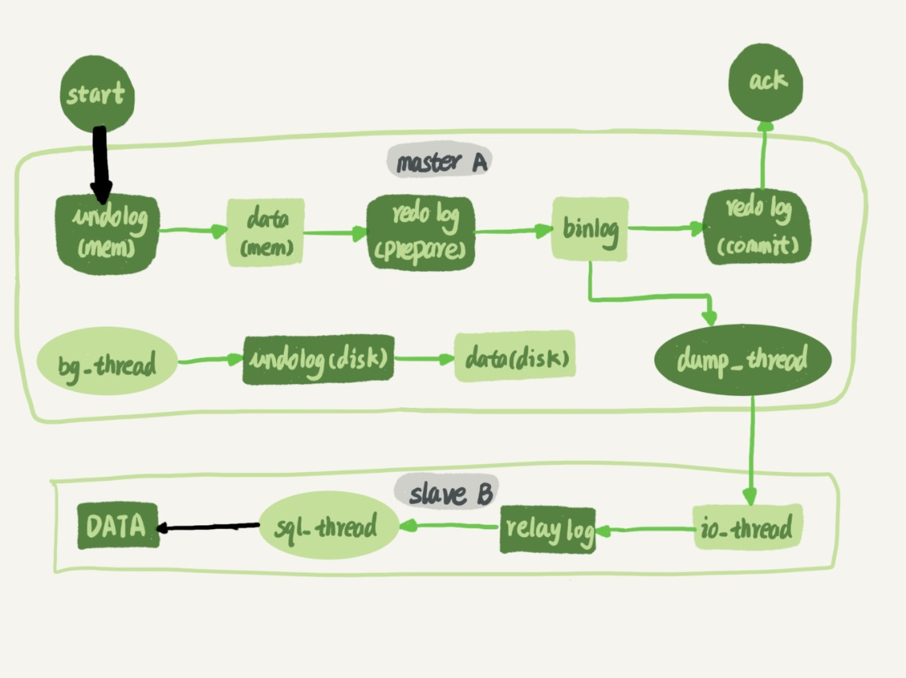
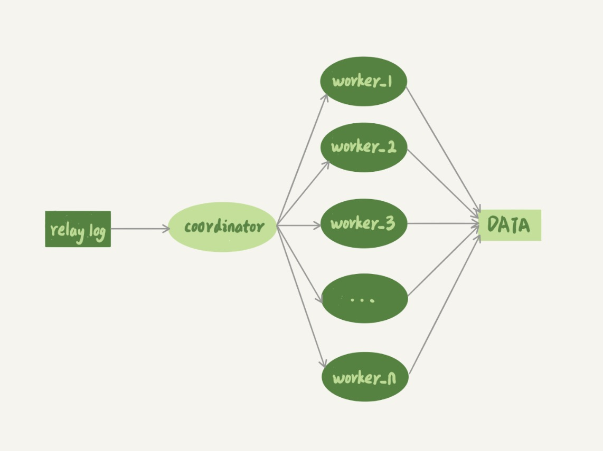
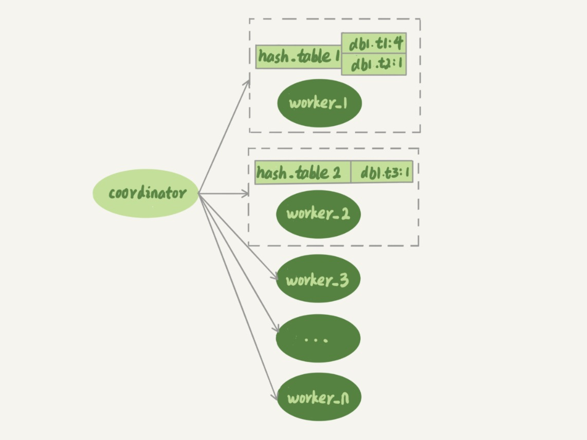
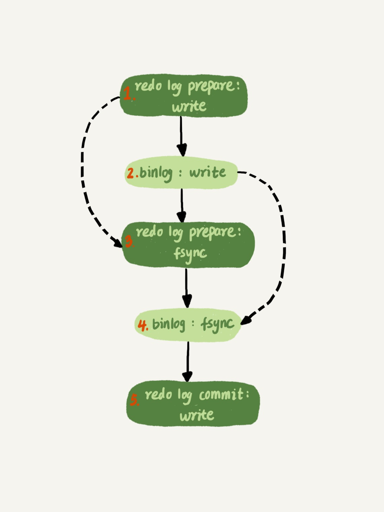

# 26-备库为什么会延迟好几个小时

上一篇介绍的几种可能导致备库延迟的原因，对备库延迟的影响一般是分钟级的，而且在备库恢复正常以后都能够追上来。

但是如果备库执行日志的速度持续低于主库生成日志的速度，那这个延迟就有可能成了小时级别。  
而且对于一个压力持续比较高的主库来说，备库很可能永远都追不上主库的节奏。

这就涉及到今天介绍的话题：`备库并行复制能力`。

主备流程图：

图中黑色的两个箭头：
- 一个箭头代表客户端写入主库
- 一个箭头代表备库执行中转日志

`箭头`的粗细代表并行度。

在主库上，由于 `InnoDB` 引擎支持行锁，它对业务并发度的支持还是很好的。  
在性能测试的时候也会发现，并发压测线程 `32` 就比单线程时总体吞吐量高。

而日志在备库上的执行，如果是用`单线程`的话，就会导致备库应用日志不够快，造成主备延迟。

`MySQL 5.6` 版本之前，只支持单线程复制。

从单线程复制到最新版本的多线程复制，中间的演化经历了好几个版本。

多线程复制机制，就是把线程 `sql_thread` 拆成多个线程，如下面的这个模型：

图中：  
`coordinator` 就是原来的 `sql_thread`, 负责读取中转日志和分发事务。  
`worker` 线程真正执行更新日志，线程的个数由参数 `slave_parallel_workers` 决定。  
根据经验，`worker` 线程的数量设置为 `8-16` 之间最好（`32` 核物理机的情况），备库还有可能要提供读查询，不能把 `CPU` 都耗光。

`coordinator` 在分发事务的时候，需要满足两个基本要求：
- 不能造成更新覆盖，要求更新同一行的两个事务，必须被分发到同一个 `worker` 中。
- 同一个事务不能被拆开，必须放到同一个 `worker` 中。
 
`MySQL` 各个版本的多线程复制，都遵循了这两条基本原则。

## MySQL 5.5 版本的并行复制策略

官方 `MySQL 5.5` 版本是不支持并行复制的。

介绍一下作者写的两个版本的并行策略：
- 按表分发策略
- 按行分发策略

帮助理解 `MySQL` 官方版本并行复制策略的迭代。

### 按表分发策略

按表分发事务的思路是，如果两个事务更新不同的表，就可以并行，这样可以保证两个 `worker` 不会更新同一行。

如果是跨表的事务，还要把多张表放在一起考虑。

下图是按表分发的规则：

每个 `worker` 线程对应一个 `hash` 表，用于保存当前正在这个 `worker` 的`执行队列`里的事务所涉及的表。  
`hash` 表的 `key` 是`库名.表名`，`value` 表示队列中有多少个事务修改这个表。

在事务分配给 `worker` 时，事务里面涉及的表会被加到对应的 `hash` 表中。  
事务执行完成后，这个表会被从 `hash` 表中去掉。

当一个待分配事务所涉及的表和某个 `worker` 的`执行队列`里的事务所涉及的表有重复时，称为这个事务和这个 `worker` 冲突。

事务在分发的时候，跟所有 `worker` 的冲突关系包括以下`三种`情况：
- 如果跟所有 `worker` 都不冲突，`coordinator` 线程就会把这个事务分配给最空闲的 `woker`。
- 如果跟多于一个 `worker` 冲突，`coordinator` 线程就进入等待状态，直到和这个事务存在冲突关系的 `worker` 只剩下 `1` 个。
- 如果只跟一个 `worker` 冲突，`coordinator` 线程就会把这个事务分配给这个存在冲突关系的 `worker`。

这个按表分发的方案，在多个表负载均匀的场景里应用效果很好。

但如果碰到热点表，比如所有的更新事务都会涉及到某一个表的时候，所有事务都会被分配到同一个 `worker` 中，就变成单线程复制了。

### 按行分发策略

要解决热点表的并行复制问题，就需要一个按行并行复制的方案。

按行复制的核心思路是：如果两个事务没有更新相同的行，它们在备库上可以并行执行。

显然，这个模式要求 `binlog` 格式必须是 `row`。

这时候判断一个事务 `T` 和 `worker` 是否冲突，用的规则是`修改同一行`。

按行复制和按表复制的数据结构差不多，也是为每个 `worker` 分配一个 `hash` 表。这时候的 `key`，就必须是 `库名 + 表名 + 唯一键的值`。

这个`唯一键`只有主键 `id` 还是不够的，还需要考虑`唯一索引`。

例如有如下表：

    CREATE TABLE t1 (
      id int(11) NOT NULL,
      a int(11) DEFAULT NULL,
      b int(11) DEFAULT NULL,
      PRIMARY KEY (id),
      UNIQUE KEY a (a)
    ) ENGINE=InnoDB;
    
    insert into t1 values
    (1,1,1),
    (2,2,2),
    (3,3,3),
    (4,4,4),
    (5,5,5);

要在主库执行这两个事务：

这两个事务要更新的行的`主键值`不同，但是如果它们被分到不同的 `worker`，就有可能 `session B` 的语句先执行。这时候 `id=1` 的行的 `a` 的值还是 `1`，就会报唯一键冲突。

因此，基于行的策略，事务 `hash` 表中还需要考虑`唯一键`，即 `key` 应该是 `库名 + 表名 + 索引 a 的名字 + a 的值`。

在上面这个例子中，在表 `t1` 上执行 `update t1 set a=1 where id=2` 语句，在 `binlog` 里面记录了整行的数据修改前各个字段的值和修改后各个字段的值。

因此，`coordinator` 在解析这个语句的 `binlog` 的时候，这个事务的 `hash` 表就有三个项:
- `key=hash_func(db1+t1+PRIMARY+2), value=2` 这里 `value=2` 是因为修改前后的行 `id` 值不变，出现了两次。
- `key=hash_func(db1+t1+a+2), value=1` 表示会影响到这个表 `a=2` 的行。
- `key=hash_func(db1+t1+a+1), value=1` 表示会影响到这个表 `a=1` 的行。

**相比于按表并行分发策略，按行并行策略在决定线程分发的时候，需要消耗更多的计算资源。**

这两个方案其实都有一些约束条件：
- 要能够从 `binlog` 里面解析出`表名`、`主键值`和`唯一索引`的值。也就是主库的 `binlog` 格式必须是 `row`。
- 表必须有`主键`。
- 不能有`外键`。表上如果有`外键`，级联更新的行不会记录在 `binlog` 中，这样冲突检测就不准确。

好在这三条约束规则，本来就是 `DBA` 之前要求业务开发人员必须遵守的线上使用规范。

按行分发策略的并行度更高，但如果是要操作很多行的`大事务`，按行分发的策略有两个问题：
- `耗费内存`。一个语句要删除 `100` 万行数据，这时候 `hash` 表就要记录 `100` 万个项。
- `耗费 CPU`。解析 `binlog`，然后计算 `hash` 值，对于大事务，这个成本还是很高的。

所以设置一个`阈值`，单个事务如果超过设置的行数`阈值`（比如 `10` 万行），就暂时退化为单线程模式。

退化过程的逻辑大概是这样的：
- `coordinator` 暂时先 `hold` 住这个事务。
- 等待所有 `worker` 都执行完成，变成空队列。
- `coordinator` 直接执行这个事务。
- 恢复并行模式。

这两个策略没有被合到官方，目的是抛砖引玉，方便理解后面要介绍的社区版本策略。

## MySQL 5.6 版本的并行复制策略

官方 `MySQL5.6` 版本，支持了并行复制，只是支持的粒度是按库并行。

用于决定分发策略的 `hash` 表里，`key` 就是数据库名。

优点：
- 构造 `hash` 值的时候很快，只需要库名。而且一个实例上 `DB` 数也不会很多，不会出现需要构造 `100` 万个项这种情况。
- 不要求 `binlog` 的格式。因为 `statement` 格式的 `binlog` 也可以很容易拿到库名。

缺点：
- 如果主库上的表都放在同一个 `DB` 里，这个策略就没有效果了。
- 如果不同 `DB` 的热点不同，比如一个是业务逻辑库，一个是系统配置库，也起不到并行的效果。

## MariaDB 的并行复制策略

第 `23` 篇文章中介绍了 `redo log` 组提交 (`group commit`) 优化，`MariaDB` 的并行复制策略利用的就是这个特性：
- 能够在同一组里提交的事务，一定不会修改同一行。
- 主库上可以并行执行的事务，备库上也一定是可以并行执行的。

`MariaDB` 是这么做的：
- 在一组里面一起提交的事务，有一个相同的 `commit_id`，下一组就是 `commit_id+1`。
- `commit_id` 直接写到 `binlog` 里面。
- 传到备库应用的时候，相同 `commit_id` 的事务分发到多个 `worker` 执行。
- 这一组全部执行完成后，`coordinator` 再去取下一批。

`MariaDB` 的这个策略，目标是`模拟主库的并行模式`。

这个策略有一个问题，它并没有实现`真正的模拟主库并发度`这个目标：
- 在主库上，一组事务在 `commit` 的时候，下一组事务是同时处于`执行中`状态的。
- 在备库上，要等第一组事务完全执行完成后，第二组事务才能开始执行，这样系统的吞吐量就不够。

## MySQL 5.7 的并行复制策略

在 `MariaDB` 并行复制实现之后，官方的 `MySQL 5.7` 版本也提供了类似的功能，由参数 `slave-parallel-type` 来控制并行复制策略：
- `DATABASE` 表示使用 `MySQL 5.6` 版本的按库并行策略。
- `LOGICAL_CLOCK` 表示使用类似 `MariaDB` 的策略。不过 `MySQL 5.7` 这个策略，针对并行度做了优化。

`MariaDB` 策略的核心，是所有处于 `commit` 状态的事务可以并行。  
事务处于 `commit` 状态，表示已经通过了锁冲突的检验了。

回顾一下两阶段提交：

其实，不用等到 `commit` 阶段，只要能够到达 `redo log prepare` 阶段，就表示事务已经通过锁冲突的检验了。

`MySQL 5.7` 并行复制策略的思想是：
- 同时处于 `prepare` 状态的事务，在备库执行时是可以并行的。
- 处于 `prepare` 状态的事务与处于 `commit` 状态的事务之间，在备库执行时也是可以并行的。

讲 `binlog` 的组提交的时候，介绍过两个参数：
- `binlog_group_commit_sync_delay` 表示延迟多少微秒后才调用 `fsync`。
- `binlog_group_commit_sync_no_delay_count` 表示累积多少次以后才调用 `fsync`。

这两个参数用于故意拉长 `binlog` 从 `write` 到 `fsync` 的时间，以此减少 `binlog` 的写盘次数。

在 `MySQL 5.7` 的并行复制策略里，它们可以用来制造更多的`同时处于 prepare 阶段的事务`，这样就增加了备库复制的并行度。

也就是说这两个参数，既可以`故意`让主库提交得慢些，又可以让备库执行得快些。

在 `MySQL 5.7` 处理备库延迟的时候，可以考虑调整这两个参数值，来达到提升备库复制并发度的目的。

## MySQL 5.7.22 的并行复制策略

`MySQL 5.7.22` 增加了一个新的并行复制策略，基于 `WRITESET` 的并行复制。

新增了一个参数 `binlog-transaction-dependency-tracking` 用来控制是否启用这个新策略。

这个参数的可选值有以下三种：
- `COMMIT_ORDER` 表示的就是前面介绍的`5.7`的并行复制策略，根据同时进入 `prepare` 和 `commit` 来判断是否可以并行的策略。
- `WRITESET` 表示的是对于事务涉及更新的每一行，计算出这一行的 `hash` 值，组成集合 `writeset`。如果两个事务没有操作相同的行，也就是说它们的 `writeset` 没有交集，就可以并行。
- `WRITESET_SESSION` 是在 `WRITESET` 的基础上多了一个约束，即在主库上同一个线程先后执行的两个事务，在备库执行的时候，要保证相同的先后顺序。

为了唯一标识，这个 `hash` 值是通过`库名 + 表名 + 索引名 + 值`计算出来的，其中`索引名`包括`主键索引`和`每个唯一索引`。

这跟前面介绍的基于 `MySQL 5.5` 版本的按行分发的策略是差不多的。

`MySQL` 官方的这个实现还是有很大的优势：
- `writeset` 是在主库生成后直接写入到 `binlog` 里面的，这样在备库执行的时候，不需要解析 `binlog` 内容，节省了很多计算量。
- 不需要把整个事务的 `binlog` 都扫一遍才能决定分发到哪个 `worker`，更省内存。
- 由于备库的分发策略不依赖于 `binlog` 内容，所以 `binlog` 是 `statement` 格式也是可以的。

因此 `MySQL 5.7.22` 的并行复制策略在通用性上还是有保证的。

对于`表上没主键`和`有外键约束`的场景，`WRITESET` 策略也是没法并行的，也会暂时退化为`单线程`模型。

## 小结

介绍了 `MySQL` 的各种多线程复制策略。

因为单线程复制的能力全面低于多线程复制，对于更新压力较大的主库，备库是可能一直追不上主库的。

从现象上看就是，备库上 `seconds_behind_master` 的值越来越大。

通过分析发现，`大事务`不仅会影响到主库，也是造成备库复制延迟的主要原因之一。

因此尽量减少`大事务`操作，把`大事务`拆成`小事务`。

官方 `MySQL 5.7` 版本新增的备库并行策略，修改了 `binlog` 的内容，也就是说 `binlog` 协议并不是向上兼容的，在主备切换、版本升级的时候需要把这个因素也考虑进去。

# 完