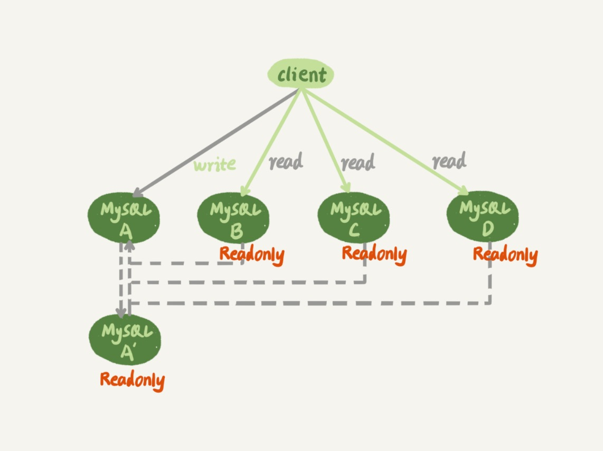
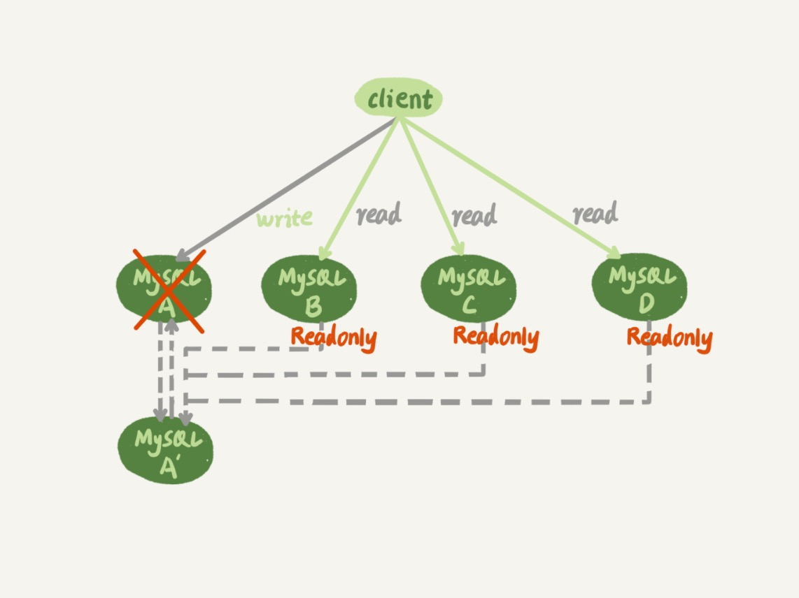

# 27-主库出问题了，从库怎么办

前面介绍的 `MySQL` 主备复制的基础结构，都是`一主一备`的结构。

大多数应用场景都是读多写少，很可能先会遇到读性能的问题。

在数据库层解决读性能问题，就是接下来两篇文章要讨论的架构：`一主多从`。

今天这篇文章先介绍`一主多从`的`切换`正确性。

下一篇文章中再介绍`一主多从`的`查询逻辑`正确性。

`一主多从`基本结构：

虚线箭头表示的是主备关系，也就是 `A` 和 `A’` 互为主备， 从库 `B`、`C`、`D` 指向的是主库 `A`。

`一主多从`的设置，一般用于`读写分离`，`主库`负责所有的写入和一部分读，其他的读请求则由`从库`分担。

`一主多从`架构下，主库故障后的主备切换：

`一主多从`结构在切换完成后，`A’` 会成为新的`主库`，从库 `B`、`C`、`D` 也要改接到 `A’`。

正是由于多了从库 `B`、`C`、`D` 重新指向的这个过程，所以`主备切换`的复杂性也相应增加了。

接下来看看一个切换系统会怎么完成`一主多从`的`主备切换`过程。

## 基于位点的主备切换

当把节点 `B` 设置成节点 `A’` 的从库的时候，需要执行一条 `change master` 命令：

    CHANGE MASTER TO 
    MASTER_HOST=$host_name 
    MASTER_PORT=$port 
    MASTER_USER=$user_name 
    MASTER_PASSWORD=$password 
    MASTER_LOG_FILE=$master_log_name 
    MASTER_LOG_POS=$master_log_pos 

这条命令 6 个参数：
- `MASTER_HOST`、`MASTER_PORT`、`MASTER_USER`、`MASTER_PASSWORD` 四个参数，分别代表了主库 `A’` 的 `IP`、`端口`、`用户名`、`密码`。
- `MASTER_LOG_FILE` 和 `MASTER_LOG_POS` 表示要从主库的 `master_log_name` 文件的 `master_log_pos` 这个位置的日志继续同步。

后 `2`个参数表示的位置就是`同步位点`，也就是主库对应的文件名和日志偏移量。

从库 `B` 要切换的时候，就需要先找`同步位点`。

这个位点很难精确取到，只能取一个大概位置。

这个方案不常用，不再详细介绍。

## GTID

`MySQL 5.6` 版本引入了 `GTID`，全称是 `Global Transaction Identifier`，也就是全局事务 `ID`，是一个事务在提交的时候生成的，是这个事务的唯一标识。

它由两部分组成，格式是：

    GTID=server_uuid:gno

其中：
- `server_uuid` 是一个实例第一次启动时自动生成的，是一个全局唯一的值。
- `gno` 是一个整数，初始值是 `1`，每次提交事务的时候分配给这个事务，并加 `1`。

`gno` 是在事务提交的时候才会分配，所以 `GTID` 往往是连续的。

`GTID` 模式的启动：

启动一个 `MySQL` 实例的时候加上参数：

    gtid_mode=on
    enforce_gtid_consistency=on

在 `GTID` 模式下，每个事务都会跟一个 `GTID` 一一对应。

这个 `GTID` 有两种生成方式，而使用哪种方式取决于 `session` 变量 `gtid_next` 的值。

- 如果 `gtid_next=automatic`，代表使用默认值。`MySQL` 就会把 `server_uuid:gno` 分配给这个事务。
  - a. 记录 `binlog` 的时候，先记录一行 `SET @@SESSION.GTID_NEXT='server_uuid:gno'`。
  - b. 把这个 `GTID` 加入本实例的 `GTID` 集合。

- 如果 `gtid_next` 是一个指定的 `GTID` 的值，比如通过 `set gtid_next='current_gtid'` 指定为 `current_gtid`，就有两种可能：
  - a. 如果 `current_gtid` 已经存在于实例的 `GTID` 集合中，接下来执行的这个事务会直接被系统忽略。
  - b. 如果 `current_gtid` 没有存在于实例的 `GTID` 集合中，就将这个 `current_gtid` 分配给接下来要执行的事务，也就是说系统不需要给这个事务生成新的 `GTID`，因此 `gno` 也不用加 `1`。

一个 `current_gtid` 只能给一个事务使用。

这个事务提交后，如果要执行下一个事务，就要执行 `set` 命令，把 `gtid_next` 设置成另外一个 `gtid` 或者 `automatic`。

这样每个 `MySQL` 实例都维护了一个 `GTID` 集合，对应这个实例执行过的所有事务。

## 基于 GTID 的主备切换

在 `GTID` 模式下，备库 `B` 要设置为新主库 `A’` 的从库的语法如下：

    CHANGE MASTER TO 
    MASTER_HOST=$host_name 
    MASTER_PORT=$port 
    MASTER_USER=$user_name 
    MASTER_PASSWORD=$password 
    master_auto_position=1 

其中 `master_auto_position=1` 就表示这个主备关系使用的是 `GTID` 协议。

我们把现在这个时刻，实例 `A’` 的 `GTID` 集合记为 `set_a`，实例 `B` 的 `GTID` 集合记为 `set_b`。

接下来看看现在的主备切换逻辑。

在实例 `B` 上执行 `start slave` 命令，取 `binlog` 的逻辑是这样的：
- 实例 `B` 指定主库 `A’`，基于主备协议建立连接。
- 实例 `B` 把 `set_b` 发给主库 `A’`。
- 实例 `A’` 算出 `set_a` 与 `set_b` 的差集，也就是所有存在于 `set_a`，但是不存在于 `set_b` 的 `GTID` 的集合，判断 `A’` 本地是否包含了这个差集需要的所有 `binlog` 事务。
  - a. 如果不包含，表示 `A’` 已经把实例 `B` 需要的 `binlog` 给删掉了，直接返回错误。
  - b. 如果全包含，那么 `A’` 从自己的 `binlog` 文件里面找出第一个不在 `set_b` 的事务发给 `B`。
- 之后就从这个事务开始，往后读文件，按顺序取 `binlog` 发给 `B` 去执行。

这个逻辑里面包含了一个设计思想：在基于 `GTID` 的主备关系里，系统认为只要建立主备关系，就必须保证主库发给备库的日志是完整的。

因此，如果实例 `B` 需要的日志已经不存在，`A’` 就拒绝把日志发给 `B`。

基于上面的介绍，再来看看引入 `GTID` 后，`一主多从`的切换场景下，主备切换是如何实现的。

从库 `B`、`C`、`D` 只需要分别执行 `change master` 命令指向实例 `A’` 即可。

之后这个系统就由新主库 `A’` 写入，主库 `A’` 的自己生成的 `binlog` 中的 `GTID` 集合格式是：`server_uuid_of_A’:1-M`。

如果之前从库 `B` 的 `GTID` 集合格式是 `server_uuid_of_A:1-N`， 那么切换之后 `GTID` 集合的格式就变成了 `server_uuid_of_A:1-N, server_uuid_of_A’:1-M`。

当然主库 `A’` 之前也是 `A` 的备库，因此主库 `A’` 和从库 `B` 的 `GTID` 集合是一样的。

这就达到了我们预期。

## GTID 和在线 DDL

要避免新增索引对主库性能造成的影响，可以先在备库加索引，然后主备切换，然后在新的备库再加索引。

详细过程省略。

## 小结

介绍了`一主多从`的`主备切换`流程。

在这个过程中，从库找新主库的`位点`是一个痛点。

`MySQL 5.6` 版本引入的 `GTID` 模式，`一主多从`切换就非常方便了。

如果 `MySQL` 版本支持 `GTID`，建议使用 `GTID` 模式来做`一主多从`的切换。

# 完