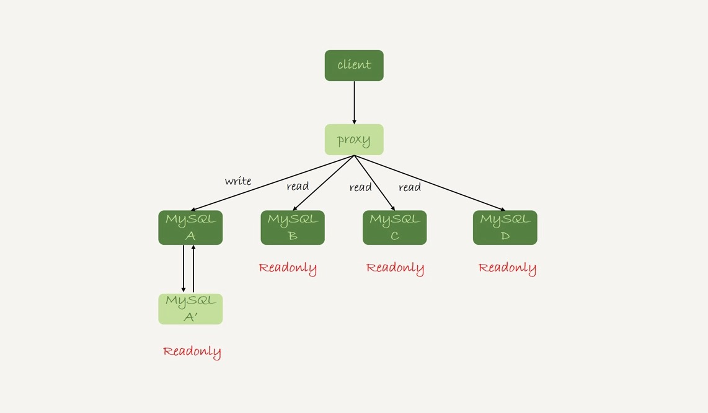

# 28-读写分离有哪些坑

今天继续聊`一主多从`架构的应用场景：`读写分离`，以及怎么处理`主备延迟`导致的`读写分离`问题。

`读写分离`的基本结构：

客户端主动做负载均衡，一般会把数据库的连接信息放在客户端的连接层，由客户端来选择后端数据库进行查询。

这种结构，由于要了解后端部署细节，在出现主备切换、库迁移等操作的时候，客户端都会感知到，并且需要调整数据库连接信息。

`读写分离`的代理结构：

在 `MySQL` 和客户端之间有一个中间代理层 `proxy`，客户端只连接 `proxy`， 由 `proxy` 根据请求类型和上下文决定请求的分发路由。

这种结构，客户端不需要关注后端细节，连接维护、后端信息维护等工作，都是由 `proxy` 完成的。

不论哪种结构，由于主从可能存在延迟，客户端执行完一个更新事务后马上发起查询，如果查询选择的是从库的话，就有可能读到刚刚的事务更新之前的状态。

在从库上会读到系统的一个过期状态，称为`过期读`。

处理`过期读`的方案：
- 强制走主库方案
- sleep 方案
- 判断主备无延迟方案
- 配合 semi-sync 方案
- 等主库位点方案
- 等 GTID 方案

## 强制走主库方案

将查询请求分为两类：
- 对于必须要拿到最新结果的请求，强制将其发到主库上。
- 对于可以读到旧数据的请求，才将其发到从库上。

这个方案是用得最多的。

这个方案，对于所有查询都不能是过期读的需求，比如金融类的业务，就要放弃读写分离，所有读写压力都在主库，等同于放弃了扩展性。

因此接下来讨论的话题是：**可以支持读写分离的场景下，有哪些解决过期读的方案**。

## Sleep 方案

主库更新后，读从库之前先 `sleep` 一下。

具体的方案就是，类似于执行一条 `select sleep(1)` 命令。

这个方案存在的问题就是不精确：
- 如果这个查询请求本来 `0.5` 秒就可以在从库上拿到正确结果，也会等 `1` 秒。
- 如果延迟超过 `1` 秒，还是会出现过期读。

## 判断主备无延迟方案

确保备库无延迟有三种做法。

**第一种方法**，每次从库执行查询请求前，先判断 `seconds_behind_master` 是否已经等于 `0`。

如果还不等于 `0` ，那就必须等到这个参数变为 `0` 才能执行查询请求。

还可以采用对比`位点`和 `GTID` 的方法来确保主备无延迟，也就是第二和第三种方法。

一个 `show slave status` 结果的部分截图：

**第二种方法**，对比`位点`确保主备无延迟：
- `Master_Log_File` 和 `Read_Master_Log_Pos` 表示的是读到的主库的最新位点。
- `Relay_Master_Log_File` 和 `Exec_Master_Log_Pos` 表示的是备库执行的最新位点。

如果这两组值完全相同，就表示接收到的日志已经同步完成。

**第三种方法**，对比 `GTID` 集合确保主备无延迟：
- `Auto_Position=1` 表示这对主备关系使用了 `GTID` 协议。
- `Retrieved_Gtid_Set` 是备库收到的所有日志的 `GTID` 集合。
- `Executed_Gtid_Set` 是备库所有已经执行完成的 `GTID` 集合。

如果这两个集合相同，也表示备库接收到的日志都已经同步完成。

问题：

上面判断主备无延迟的逻辑，是`备库收到的日志`都执行完成了。

主库可能还有一部分`已经提交`的事务，客户端也已经收到`提交确认`的日志，但还`没有传到`备库。

这个问题有没有办法解决呢？

## 配合 semi-sync

要解决这个问题，就要引入`半同步复制`，也就是 `semi-sync replication`。

`semi-sync` 的设计：
- 事务提交的时候，主库把 `binlog` 发给从库。
- 从库收到 `binlog` 以后，发回给主库一个 `ack`，表示收到了。
- 主库收到这个 `ack` 以后，再给客户端返回`事务完成`的确认。

如果启用了 `semi-sync`，就表示所有给客户端发送过确认的事务，都确保了备库已经收到了这个日志。

这样 `semi-sync` 配合前面关于`位点`的判断，就能够确定在从库上执行的查询请求，可以避免`过期读`。

但是 `semi-sync + 位点` 判断的方案，只对`一主一备`的场景是成立的。

在`一主多从`场景中，主库只要等到一个从库的 `ack`，就开始给客户端返回确认。

这时在从库上执行查询请求，就有两种情况：
- 如果查询落在这个响应了 `ack` 的从库上，是能够确保读到最新数据。
- 如果查询落在`其他`从库上，它们可能还没有收到最新的日志，就会产生过期读的问题。

其实判断`同步位点`的方案还有另外一个潜在的问题：  
在业务更新的高峰期，主库的`位点`或者 `GTID` 集合更新很快，上面的两个位点等值判断就会一直不成立，很可能出现从库上迟迟无法响应查询请求的情况。

实际上，当发起一个查询请求以后，要得到准确的结果，其实并不需要等到`主备完全同步`，只要发起查询前的事务同步完就可以了。

小结：

`semi-sync` 配合判断主备无延迟的方案，存在两个问题：
- `一主多从`的时候，在某些从库执行查询请求会存在过期读的现象。
- 在持续延迟的情况下，可能出现过度等待的问题。

接下来的等主库位点方案，就可以解决这两个问题。

## 等主库位点方案

要理解等主库`位点`方案，需要先介绍一条命令：

    select master_pos_wait(file, pos, timeout);

这条命令的逻辑如下：
- 它是在从库执行的。
- 参数 `file` 和 `pos` 指的是主库上的文件名和位置。
- `timeout` 可选，设置为正整数 `N` 表示这个函数最多等待 `N` 秒。

这个命令正常返回的结果是一个正整数 `M`，表示从命令开始执行，到应用完 `file` 和 `pos` 表示的 `binlog` 位置，执行了多少事务。

除了正常返回一个正整数 `M` 外，这条命令还会返回一些其他结果：
- 如果执行期间，备库同步线程发生异常，则返回 `NULL`。
- 如果等待超过 `N` 秒，就返回 `-1`。
- 如果刚开始执行的时候，就发现已经执行过这个位置了，则返回 `0`。

对于`主库`先执行一个`事务`，再在`从库`执行一个`查询`请求的逻辑，要保证能够查到正确的数据，可以使用这个逻辑：
- `主库`事务更新完成后，马上执行 `show master status` 得到当前主库执行到的 `File` 和 `Position`。
- 选定一个从库执行查询语句。
- 在从库上执行 `select master_pos_wait(File, Position, 1)`。
- 如果返回值是 `>=0` 的正整数，则在这个从库执行查询语句。
- 否则，到主库执行查询语句。

这里假设这条 `select` 查询最多在从库上等待 `1` 秒。
- 如果 `1` 秒内 `master_pos_wait` 返回一个大于等于 `0` 的整数，就确保了从库上执行的这个查询结果一定包含了最初主库事务的数据。
- 否则从库的延迟时间不可控，不能无限等待，到主库去查。

## GTID 方案

如果数据库开启了 `GTID` 模式，对应的也有等待 `GTID` 的方案。

`MySQL` 提供了一个类似的命令：

    select wait_for_executed_gtid_set(gtid_set, 1);

这条命令的逻辑是：
- 等待直到这个库执行的事务中包含传入的 `gtid_set` 返回 `0`。
- 超时返回 `1`。

在前面等`位点`的方案中，执行完事务后，还要主动去主库执行 `show master status`。

`MySQL 5.7.6` 版本开始，允许在执行完更新类事务后，把这个事务的 `GTID` 返回给客户端，这样等 `GTID` 的方案就可以减少一次查询。

等 `GTID` 的执行流程就变成了：
- `主库`事务更新完成后，从返回包直接获取这个事务的 `GTID` 记为 `gtid1`。
- 选定一个从库执行查询语句。
- 在从库上执行 `select wait_for_executed_gtid_set(gtid1, 1)`。
- 如果返回值是 `0` 则在这个从库执行查询语句。
- 否则到主库执行查询语句。

跟等主库`位点`的方案一样，等待超时后还是直接到主库查询。

怎么能够让 `MySQL` 在执行事务后，返回包中带上 `GTID` 呢？

只需要将参数 `session_track_gtids` 设置为 `OWN_GTID`，然后通过 `API` 接口 `mysql_session_track_get_first` 从返回包解析出 `GTID` 的值即可。

## 小结

今天介绍了`一主多从`做`读写分离`时，可能碰到`过期读`的原因，以及几种应对的方案。

这几种方案中，有的方案看上去是做了妥协，有的方案看上去不那么靠谱儿，但都是有实际应用场景的，需要根据业务需求选择。

即使是最后`等待位点`和等待 `GTID` 这两个方案，虽然看上去比较靠谱儿，但仍然存在需要权衡的情况。

如果所有的从库都延迟，那么请求就会全部落到主库上。

在实际应用中，可能会有别的不需要等待就可以`水平扩展`的`数据库方案`，但这往往是用`牺牲写性能`换来的，也就是需要在`读性能`和`写性能`中取权衡。

# 完