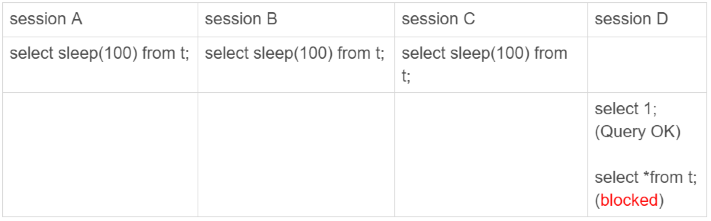

# 29-如何判断一个数据库是不是出问题了

在`一主一备`的`双 M` 架构里，`主备切换`只需要把客户端流量切到`备库`。

在`一主多从`架构里，`主备切换`除了要把客户端流量切到`备库`外，还需要把`从库`接到`新主库`上。

`主备切换`有两种场景：
- 一种是`主动切换`
- 一种是`被动切换`

`被动切换`，往往是因为`主库`出问题了，由 `HA` 系统发起的。

那怎么判断一个`主库`出问题了呢？

## select 1 判断

实际上 `select 1` 成功返回，只能说明这个库的进程还在，并不能说明主库没问题。

参数 `innodb_thread_concurrency` 控制 `InnoDB` 的并发线程上限。

一旦并发线程数达到这个值 `InnoDB` 再接收到新请求的时候就会进入等待状态。

现在把 `innodb_thread_concurrency` 设置成 `3`，表示 `InnoDB` 只允许 `3` 个线程并行执行：

    set global innodb_thread_concurrency=3;

启动 4 个会话：

前三个 `session` 中的 `sleep(100)` 使得这三个语句都处于`执行`状态来模拟大查询。

第四个会话里 `select 1` 是能执行成功的，但是查询表 `t` 的语句会被堵住。

这时候用 `select 1` 来检测实例是否正常是检测不出问题的。

在 `InnoDB` 中 `innodb_thread_concurrency` 的默认值是 `0`，表示不限制并发线程数量。

不限制并发线程数肯定是不行的，一个机器的 `CPU` 核数有限，线程全冲进来上下文切换的成本会很高。

通常情况建议把 `innodb_thread_concurrency` 设置为 `64-128` 之间的值。

注意`并发连接`和`并发查询`并不是一个概念。

在 `show processlist` 的结果里看到的几千个连接指的是`并发连接`。

而`当前正在执行`的语句才是`并发查询`。

`并发连接`数达到几千个影响并不大，就是多占一些内存而已，`并发查询`太高才是 `CPU` 杀手。

如果把 `innodb_thread_concurrency` 设置为 `128` 的话，那么出现同一行热点更新的问题时，是不是很快就把 `128` 消耗完了？

实际上在线程进入`锁等待`以后，`并发线程`的计数会`减一`，也就是说等行锁的线程是不算在 `128` 里面的。

因为进入锁等待的线程已经不吃 `CPU` 了，更重要的是这么设计才能避免整个系统锁死。

这个例子中同时执行的语句超过了设置的 `innodb_thread_concurrency` 的值，这时系统其实已经不行了，但是 `select 1` 仍然能正常返回。

## 查表判断

在系统库里创建一个表，里面只放一行数据，然后定期执行：

    select * from mysql.health_check; 

可以检测出由于`并发线程`过多导致的数据库不可用的情况。

但是，如果磁盘空间满了，更新事务要写 `binlog`，那么所有的更新语句和事务提交的 `commit` 语句就都会被堵住。  
但是，系统这时候还是可以正常读数据的。

## 更新判断

那看看把查询语句改成更新语句后的效果。

常见做法是放一个 `timestamp` 字段表示最后一次执行检测的时间。

更新语句：

    update mysql.health_check set modified = now();

节点可用性的检测应该包含`主库`和`备库`。

`双 M `结构下，在备库 `B` 上执行的检测命令的 `binlog` 也要发回给主库 `A`。

这样主库 `A` 和备库 `B` 都用相同的更新命令，就可能出现行冲突，也就是可能会导致主备同步停止。

为了让主备之间的更新不产生冲突，可以在 `health_check` 表上存入多行数据，并用 `A`、`B` 的 `server_id` 做主键。

由于主库和备库的 `server_id` 不同，这样就可以保证主、备库各自的检测命令不会发生冲突。

更新判断是一个相对常用的方案了，不过依然受系统资源影响存在`判定慢`等问题。

上面说的所有方法都是基于外部检测的，都有随机性。

因为外部检测都需要定时轮询，所以系统可能已经出问题了，但是却需要等到下一个检测发起执行语句的时候，才有可能发现问题。

而且可能第一次轮询还不能发现，这就会导致切换慢的问题。

## 内部统计

`MySQL` 提供的 `performance_schema` 库的 `file_summary_by_event_name` 表里统计了每次 `IO` 请求的时间。

这一行表示统计的是 `redo log` 的写入时间：

    mysql> SELECT * FROM performance_schema.file_summary_by_event_name WHERE event_name='wait/io/file/innodb/innodb_log_file'\G
    *************************** 1. row ***************************
                   EVENT_NAME: wait/io/file/innodb/innodb_log_file
                   COUNT_STAR: 123
               SUM_TIMER_WAIT: 57419940800
               MIN_TIMER_WAIT: 826400
               AVG_TIMER_WAIT: 466828400
               MAX_TIMER_WAIT: 2297874400
                   COUNT_READ: 7
               SUM_TIMER_READ: 52719200
               MIN_TIMER_READ: 826400
               AVG_TIMER_READ: 7531200
               MAX_TIMER_READ: 42145600
     SUM_NUMBER_OF_BYTES_READ: 70144
                  COUNT_WRITE: 55
              SUM_TIMER_WRITE: 1370930400
              MIN_TIMER_WRITE: 8368000
              AVG_TIMER_WRITE: 24926000
              MAX_TIMER_WRITE: 41126400
    SUM_NUMBER_OF_BYTES_WRITE: 44544
                   COUNT_MISC: 61
               SUM_TIMER_MISC: 55996291200
               MIN_TIMER_MISC: 1299200
               AVG_TIMER_MISC: 917971600
               MAX_TIMER_MISC: 2297874400
    1 row in set (0.00 sec)

第一列 `EVENT_NAME` 表示统计的类型，接下来的三组数据显示 `redo log` 操作的时间统计：
- 第一组五列：是所有 `IO` 类型的统计。
  - `COUNT_STAR` 是所有 `IO` 的总次数。
  - 接下来四列是具体的统计项，单位是`皮秒`(`1,000,000,000 皮秒 = 1毫秒`)，前缀 `SUM`、`MIN`、`AVG`、`MAX`，顾名思义指的就是`总和`、`最小值`、`平均值`和`最大值`。
- 第二组六列：是读操作的统计。最后一列 `SUM_NUMBER_OF_BYTES_READ` 统计的是，总共从 `redo log` 里读了多少个字节。
- 第三组六列：统计的是写操作。
- 第四组数据：是对其他类型数据的统计。在 `redo log` 里，就是对 `fsync` 的统计。

这一行表示统计的是 `binlog` 的写入时间：

    mysql> SELECT * FROM performance_schema.file_summary_by_event_name WHERE event_name='wait/io/file/sql/binlog'\G
    *************************** 1. row ***************************
                   EVENT_NAME: wait/io/file/sql/binlog
                   COUNT_STAR: 51
               SUM_TIMER_WAIT: 8454978400
               MIN_TIMER_WAIT: 574400
               AVG_TIMER_WAIT: 165783600
               MAX_TIMER_WAIT: 1085965600
                   COUNT_READ: 8
               SUM_TIMER_READ: 86533600
               MIN_TIMER_READ: 4569600
               AVG_TIMER_READ: 10816400
               MAX_TIMER_READ: 18085600
     SUM_NUMBER_OF_BYTES_READ: 3688
                  COUNT_WRITE: 8
              SUM_TIMER_WRITE: 95529600
              MIN_TIMER_WRITE: 5280000
              AVG_TIMER_WRITE: 11941200
              MAX_TIMER_WRITE: 23925600
    SUM_NUMBER_OF_BYTES_WRITE: 1666
                   COUNT_MISC: 35
               SUM_TIMER_MISC: 8272915200
               MIN_TIMER_MISC: 574400
               AVG_TIMER_MISC: 236368800
               MAX_TIMER_MISC: 1085965600
    1 row in set (0.00 sec)

建议只打开需要的统计项，因为每次操作数据库 `performance_schema` 都需要额外统计这些信息，这是有性能损耗的。

可以通过下面的方法打开或者关闭某个具体项：

打开 `redo log` 的时间监控：

    update setup_instruments set ENABLED='YES', Timed='YES' where name like '%wait/io/file/innodb/innodb_log_file%';

假设已经开启了 `redo log` 和 `binlog` 这两个统计信息，可以通过 `MAX_TIMER` 的值来判断数据库是否出问题了。

比如设定单次 `IO` 请求时间超过 `200` 毫秒属于异常，然后使用类似下面这条语句作为检测逻辑：

    select event_name, MAX_TIMER_WAIT  FROM performance_schema.file_summary_by_event_name 
    where event_name in ('wait/io/file/innodb/innodb_log_file','wait/io/file/sql/binlog') 
    and MAX_TIMER_WAIT > 200 * 1000000000;

发现异常后，取到需要的信息，再通过下面这条语句把之前的统计信息清空：

    truncate table performance_schema.file_summary_by_event_name;

## 小结

今天介绍了检测一个 `MySQL` 实例健康状态的几种方法，以及各种方法存在的问题和演进的逻辑。

你可能会觉得 `select 1` 这样的方法是不是已经被淘汰了，但实际上使用非常广泛的 `MHA`（`Master High Availability`）默认使用的就是这个方法。

每个改进的方案都会增加额外损耗，需要根据业务实际情况去做权衡。

个人比较倾向的方案是优先考虑 `update` 系统表，然后再配合增加检测 `performance_schema` 的信息。

# 完