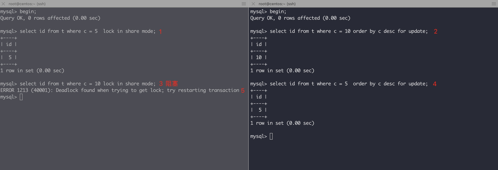
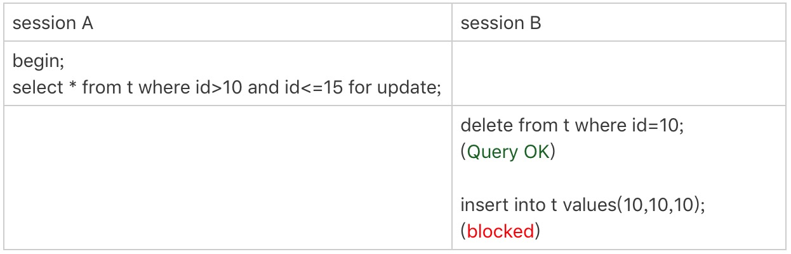
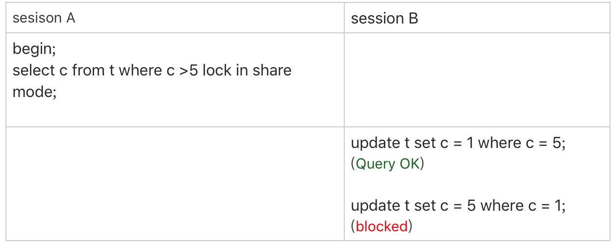
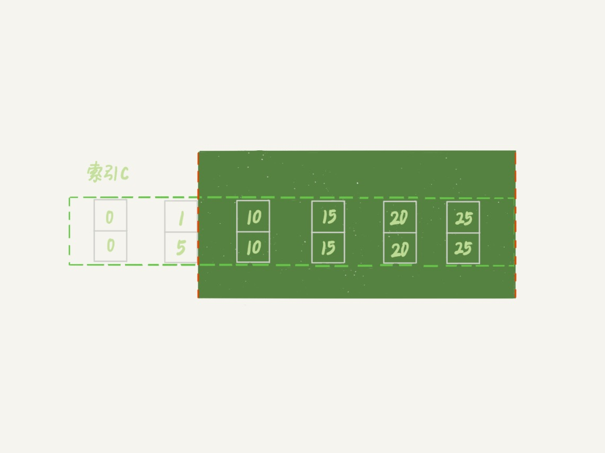

# 30-答疑文章（二）：用动态的观点看加锁

为了方便理解，再复习一下加锁规则，包含两个`原则`、两个`优化`和一个`bug`：
- `原则 1`：加锁的基本单位是 `next-key lock`，是前开后闭区间。
- `原则 2`：查找过程中访问到的对象才会加锁。
- `优化 1`：索引上的等值查询，给唯一索引加锁的时候，`next-key lock` 退化为`行锁`。
- `优化 2`：索引上的等值查询，向右遍历时且最后一个值不满足等值条件的时候，`next-key lock` 退化为`间隙锁`。
- `一个 bug`：唯一索引上的范围查询会访问到不满足条件的第一个值为止。

新建一个表，并插入 `6` 条记录：

```sql
CREATE TABLE t (
    id int(11) NOT NULL,
    c int(11) DEFAULT NULL,
    d int(11) DEFAULT NULL,
    PRIMARY KEY (id),
    KEY c (c)
) ENGINE=InnoDB;

INSERT INTO t VALUES
(0,0,0),
(5,5,5),
(10,10,10),
(15,15,15),
(20,20,20),
(25,25,25);
```

## 不等号条件里的等值查询

分析一下这条查询语句的加锁范围：

    begin;
    select * from t where id>9 and id<12 order by id desc for update;

这个语句的加锁范围是`主键索引`上的 `(0,5]`、`(5,10]` 和 `(10, 15)`。

其中 `id=15` 这一行没有加`行锁`。根据`优化 2`，即索引上的等值查询，向右遍历的时候 `id=15` 不满足条件，所以 `next-key lock` 退化为了间隙锁 `(10, 15)`。

查询语句中 `where` 条件是大于号和小于号，这里的`等值查询`又是从哪里来的呢？

加锁动作是发生在语句执行过程中的，分析加锁行为的时候，要从索引上的`数据结构`开始。
- 首先这个查询语句的语义是 `order by id desc`，要拿到满足条件的所有行，优化器必须先找到第一个 `id<12` 的值。
- 这个过程是通过索引树的搜索过程得到的，在引擎内部，其实是要找到 `id=12` 的这个值，只是最终没找到，但找到了 `(10,15)` 这个间隙。
- 然后向左遍历，在遍历过程中，就不是等值查询了，会扫描到 `id=5` 这一行，所以会加一个 `next-key lock` `(0,5]`。

也就是说，在执行过程中，通过树搜索的方式定位记录的时候，用的是`等值查询`的方法。

## 等值查询的过程

下面这个语句的加锁范围是什么？

    begin;
    select id from t where c in (5,20,10) lock in share mode;

这条语句的 `explain` 结果：

    mysql> explain select id from t where c in (5,20,10) lock in share mode;
    +----+-------------+-------+------------+-------+---------------+------+---------+------+------+----------+--------------------------+
    | id | select_type | table | partitions | type  | possible_keys | key  | key_len | ref  | rows | filtered | Extra                    |
    +----+-------------+-------+------------+-------+---------------+------+---------+------+------+----------+--------------------------+
    |  1 | SIMPLE      | t     | NULL       | range | c             | c    | 5       | NULL |    3 |   100.00 | Using where; Using index |
    +----+-------------+-------+------------+-------+---------------+------+---------+------+------+----------+--------------------------+

这条 `in` 语句使用了索引 `c` 并且 `rows=3`，说明这三个值都是通过 `B+` 树搜索定位的。
- 在查找 `c=5` 的时候，先锁住了 `(0,5]`，因为 `c` 不是唯一索引，还要向右遍历，找到 `c=10` 才确认没有了，这个过程满足`优化 2`，所以加了间隙锁 `(5,10)`。
- 同样：执行 `c=10` 这个逻辑的时候，加锁的范围是  `(5,10]` 和 `(10,15)`。
- 同样：执行 `c=20` 这个逻辑的时候，加锁的范围是 `(15,20]` 和 `(20,25)`。

通过分析，这条语句在索引 `c` 上加的三个记录锁的顺序是：
- 先加 `c=5` 的记录锁。
- 再加 `c=10` 的记录锁。
- 最后加 `c=20` 的记录锁。

这些锁是`在执行过程中一个一个加的`，而不是一次性加上去的。

理解了这个加锁过程，分析下面的死锁问题。

如果同时有另外一个语句，是这么写的：

    select id from t where c in (5,20,10) order by c desc for update;

间隙锁是不互锁的，这两条语句都会在索引 `c` 上的 `c=5`、`c=10`、`c=20` 这三行记录上加记录锁。

需要注意，由于语句里面是 `order by c desc`， 这三个记录锁的加锁顺序是：
- 先锁 `c=20`。
- 然后 `c=10`。
- 最后是 `c=5`。

这两条语句要加锁相同的资源，但是加锁顺序相反，当这两条语句并发执行的时候，就可能出现`死锁`。

## 怎么看死锁？

构造死锁示例：



- 会话1：

      mysql> begin;
      Query OK, 0 rows affected (0.00 sec)
      
      mysql> select id from t where c = 5  lock in share mode;
      +----+
      | id |
      +----+
      |  5 |
      +----+
      1 row in set (0.00 sec)
      
      mysql> select id from t where c = 10 lock in share mode;
      ERROR 1213 (40001): Deadlock found when trying to get lock; try restarting transaction


- 会话2：

      mysql> begin;
      Query OK, 0 rows affected (0.00 sec)
      
      mysql> select id from t where c = 10 order by c desc for update;
      +----+
      | id |
      +----+
      | 10 |
      +----+
      1 row in set (0.00 sec)
      
      mysql> select id from t where c = 5  order by c desc for update;
      +----+
      | id |
      +----+
      |  5 |
      +----+
      1 row in set (0.00 sec)

执行 `show engine innodb status` 命令输出：

    mysql> show engine innodb status\G
    *************************** 1. row ***************************
      Type: InnoDB
      Name:
    Status:
    =====================================
    2023-01-12 17:43:49 0x7fbc780bf700 INNODB MONITOR OUTPUT
    =====================================
    Per second averages calculated from the last 10 seconds
    -----------------
    BACKGROUND THREAD
    -----------------
    srv_master_thread loops: 60 srv_active, 0 srv_shutdown, 1304064 srv_idle
    srv_master_thread log flush and writes: 1304124
    ----------
    SEMAPHORES
    ----------
    OS WAIT ARRAY INFO: reservation count 32
    OS WAIT ARRAY INFO: signal count 32
    RW-shared spins 0, rounds 48, OS waits 24
    RW-excl spins 0, rounds 6, OS waits 0
    RW-sx spins 0, rounds 0, OS waits 0
    Spin rounds per wait: 48.00 RW-shared, 6.00 RW-excl, 0.00 RW-sx
    ------------------------
    LATEST DETECTED DEADLOCK
    ------------------------
    2023-01-12 17:42:49 0x7fbc6e9b4700
    *** (1) TRANSACTION:
    TRANSACTION 421922877590240, ACTIVE 29 sec starting index read
    mysql tables in use 1, locked 1
    LOCK WAIT 4 lock struct(s), heap size 1136, 3 row lock(s)
    MySQL thread id 112, OS thread handle 140447578801920, query id 6517 localhost root Sending data
    select id from t where c = 10 lock in share mode
    *** (1) WAITING FOR THIS LOCK TO BE GRANTED:
    RECORD LOCKS space id 143 page no 4 n bits 80 index c of table `test`.`t` trx id 421922877590240 lock mode S waiting
    Record lock, heap no 4 PHYSICAL RECORD: n_fields 2; compact format; info bits 0
     0: len 4; hex 8000000a; asc     ;;
     1: len 4; hex 8000000a; asc     ;;
    
    *** (2) TRANSACTION:
    TRANSACTION 633412, ACTIVE 21 sec starting index read
    mysql tables in use 1, locked 1
    5 lock struct(s), heap size 1136, 4 row lock(s)
    MySQL thread id 113, OS thread handle 140447286249216, query id 6518 localhost root Sending data
    select id from t where c = 5  order by c desc for update
    *** (2) HOLDS THE LOCK(S):
    RECORD LOCKS space id 143 page no 4 n bits 80 index c of table `test`.`t` trx id 633412 lock_mode X
    Record lock, heap no 4 PHYSICAL RECORD: n_fields 2; compact format; info bits 0
     0: len 4; hex 8000000a; asc     ;;
     1: len 4; hex 8000000a; asc     ;;
    
    *** (2) WAITING FOR THIS LOCK TO BE GRANTED:
    RECORD LOCKS space id 143 page no 4 n bits 80 index c of table `test`.`t` trx id 633412 lock_mode X waiting
    Record lock, heap no 3 PHYSICAL RECORD: n_fields 2; compact format; info bits 0
     0: len 4; hex 80000005; asc     ;;
     1: len 4; hex 80000005; asc     ;;
    
    *** WE ROLL BACK TRANSACTION (1)
    ------------
    TRANSACTIONS
    ------------
    Trx id counter 633414
    Purge done for trx's n:o < 633412 undo n:o < 0 state: running but idle
    History list length 0
    LIST OF TRANSACTIONS FOR EACH SESSION:
    ---TRANSACTION 421922877591152, not started
    0 lock struct(s), heap size 1136, 0 row lock(s)
    ---TRANSACTION 421922877590240, not started
    0 lock struct(s), heap size 1136, 0 row lock(s)
    ---TRANSACTION 421922877592064, not started
    0 lock struct(s), heap size 1136, 0 row lock(s)
    ---TRANSACTION 633412, ACTIVE 81 sec
    5 lock struct(s), heap size 1136, 5 row lock(s)
    MySQL thread id 113, OS thread handle 140447286249216, query id 6518 localhost root
    --------
    FILE I/O
    --------
    I/O thread 0 state: waiting for completed aio requests (insert buffer thread)
    I/O thread 1 state: waiting for completed aio requests (log thread)
    I/O thread 2 state: waiting for completed aio requests (read thread)
    I/O thread 3 state: waiting for completed aio requests (read thread)
    I/O thread 4 state: waiting for completed aio requests (read thread)
    I/O thread 5 state: waiting for completed aio requests (read thread)
    I/O thread 6 state: waiting for completed aio requests (write thread)
    I/O thread 7 state: waiting for completed aio requests (write thread)
    I/O thread 8 state: waiting for completed aio requests (write thread)
    I/O thread 9 state: waiting for completed aio requests (write thread)
    Pending normal aio reads: [0, 0, 0, 0] , aio writes: [0, 0, 0, 0] ,
     ibuf aio reads:, log i/o's:, sync i/o's:
    Pending flushes (fsync) log: 0; buffer pool: 0
    555 OS file reads, 466 OS file writes, 131 OS fsyncs
    0.00 reads/s, 0 avg bytes/read, 0.00 writes/s, 0.00 fsyncs/s
    -------------------------------------
    INSERT BUFFER AND ADAPTIVE HASH INDEX
    -------------------------------------
    Ibuf: size 1, free list len 0, seg size 2, 3 merges
    merged operations:
     insert 0, delete mark 0, delete 0
    discarded operations:
     insert 0, delete mark 0, delete 0
    Hash table size 34673, node heap has 0 buffer(s)
    Hash table size 34673, node heap has 0 buffer(s)
    Hash table size 34673, node heap has 0 buffer(s)
    Hash table size 34673, node heap has 0 buffer(s)
    Hash table size 34673, node heap has 0 buffer(s)
    Hash table size 34673, node heap has 0 buffer(s)
    Hash table size 34673, node heap has 0 buffer(s)
    Hash table size 34673, node heap has 0 buffer(s)
    0.00 hash searches/s, 0.00 non-hash searches/s
    ---
    LOG
    ---
    Log sequence number 165922720
    Log flushed up to   165922720
    Pages flushed up to 165922720
    Last checkpoint at  165922711
    0 pending log flushes, 0 pending chkp writes
    85 log i/o's done, 0.00 log i/o's/second
    ----------------------
    BUFFER POOL AND MEMORY
    ----------------------
    Total large memory allocated 137428992
    Dictionary memory allocated 377173
    Buffer pool size   8191
    Free buffers       7613
    Database pages     578
    Old database pages 193
    Modified db pages  0
    Pending reads      0
    Pending writes: LRU 0, flush list 0, single page 0
    Pages made young 85, not young 5
    0.00 youngs/s, 0.00 non-youngs/s
    Pages read 505, created 78, written 356
    0.00 reads/s, 0.00 creates/s, 0.00 writes/s
    No buffer pool page gets since the last printout
    Pages read ahead 0.00/s, evicted without access 0.00/s, Random read ahead 0.00/s
    LRU len: 578, unzip_LRU len: 0
    I/O sum[0]:cur[0], unzip sum[0]:cur[0]
    --------------
    ROW OPERATIONS
    --------------
    0 queries inside InnoDB, 0 queries in queue
    0 read views open inside InnoDB
    Process ID=505929, Main thread ID=140447600871168, state: sleeping
    Number of rows inserted 3460, updated 2, deleted 2, read 5024
    0.00 inserts/s, 0.00 updates/s, 0.00 deletes/s, 0.00 reads/s
    ----------------------------
    END OF INNODB MONITOR OUTPUT
    ============================

其中有一节 `LATEST DETECTED DEADLOCK` 如下：

    LATEST DETECTED DEADLOCK
    ------------------------
    2023-01-12 17:42:49 0x7fbc6e9b4700
    *** (1) TRANSACTION:
    TRANSACTION 421922877590240, ACTIVE 29 sec starting index read
    mysql tables in use 1, locked 1
    LOCK WAIT 4 lock struct(s), heap size 1136, 3 row lock(s)
    MySQL thread id 112, OS thread handle 140447578801920, query id 6517 localhost root Sending data
    select id from t where c = 10 lock in share mode
    *** (1) WAITING FOR THIS LOCK TO BE GRANTED: [表示这个事务在等待的锁信息]
    RECORD LOCKS space id 143 page no 4 n bits 80 index c of table `test`.`t` trx id 421922877590240 lock mode S waiting [等的是表 t 的索引 c 上面的读锁]
    Record lock, heap no 4 PHYSICAL RECORD: n_fields 2; compact format; info bits 0 [记录锁，记录有两列，也就是字段 c 和主键字段 id]
     0: len 4; hex 8000000a; asc     ;; [第一个字段 c  十六进制 a][asc 表示接下来要打印出值里面的可打印字符，10不是可打印字符因此显示空格]
     1: len 4; hex 8000000a; asc     ;; [第二个字段 id 十六进制 a][asc 表示接下来要打印出值里面的可打印字符，10不是可打印字符因此显示空格]
    
    *** (2) TRANSACTION:
    TRANSACTION 633412, ACTIVE 21 sec starting index read
    mysql tables in use 1, locked 1
    5 lock struct(s), heap size 1136, 4 row lock(s)
    MySQL thread id 113, OS thread handle 140447286249216, query id 6518 localhost root Sending data
    select id from t where c = 5  order by c desc for update
    *** (2) HOLDS THE LOCK(S): [这个事务持有哪些锁]
    RECORD LOCKS space id 143 page no 4 n bits 80 index c of table `test`.`t` trx id 633412 lock_mode X
    Record lock, heap no 4 PHYSICAL RECORD: n_fields 2; compact format; info bits 0
     0: len 4; hex 8000000a; asc     ;;
     1: len 4; hex 8000000a; asc     ;;
    
    *** (2) WAITING FOR THIS LOCK TO BE GRANTED:
    RECORD LOCKS space id 143 page no 4 n bits 80 index c of table `test`.`t` trx id 633412 lock_mode X waiting
    Record lock, heap no 3 PHYSICAL RECORD: n_fields 2; compact format; info bits 0
     0: len 4; hex 80000005; asc     ;;
     1: len 4; hex 80000005; asc     ;;
    
    *** WE ROLL BACK TRANSACTION (1)
    ------------

其中：
- `(1)` - 第一个事务的信息。
- `(2)` - 第二个事务的信息。
- `WE ROLL BACK TRANSACTION (1)` - 最终的处理结果，表示回滚了第一个事务。

可以得到两个结论：
- 由于锁是一个个加的，要避免`死锁`，对同一组资源，要按照尽量`相同的顺序`访问。
- 在发生`死锁`的时刻，`for update` 这条语句占有的资源更多，回滚成本更大，所以 `InnoDB` 选择了回滚成本更小的 `lock in share mode` 语句来回滚。

## 怎么看锁等待？

示例：



- `session A`：

      mysql> begin;
      Query OK, 0 rows affected (0.00 sec)
      
      mysql> select * from t where id > 10 and id <= 15 for update;
      +----+------+------+
      | id | c    | d    |
      +----+------+------+
      | 15 |   15 |   15 |
      +----+------+------+
      1 row in set (0.00 sec)


- `session B`：

      mysql> delete from t where id = 10;
      Query OK, 1 row affected (0.00 sec)
      
      mysql> insert into t values (10, 10, 10);
      ERROR 1205 (HY000): Lock wait timeout exceeded; try restarting transaction

由于 `session A` 执行完之后的加锁范围是 `(10,15]` 和 `(15,20]` 并没有锁住 `c=10` 这个记录，所以 `session B` 删除 `id=10` 这一行是可以的。

但是 `session B` 删除 `id=10` 这一行之后 `session A` 的加锁范围就变成了 `(5,15]` 和 `(15,20]` 了，所以再想插入 `id=10` 这一行回去就不行了。

执行 `show engine innodb status` 命令查看其中 `TRANSACTIONS` 的内容如下：

    ------------
    TRANSACTIONS
    ------------
    Trx id counter 633435
    Purge done for trx's n:o < 633433 undo n:o < 0 state: running but idle
    History list length 0
    LIST OF TRANSACTIONS FOR EACH SESSION:
    ---TRANSACTION 421922877591152, not started
    0 lock struct(s), heap size 1136, 0 row lock(s)
    ---TRANSACTION 633434, ACTIVE 14 sec inserting
    mysql tables in use 1, locked 1
    LOCK WAIT 2 lock struct(s), heap size 1136, 1 row lock(s)
    MySQL thread id 124, OS thread handle 140447285978880, query id 6692 localhost root update
    insert into t values (10, 10, 10)
    ------- TRX HAS BEEN WAITING 14 SEC FOR THIS LOCK TO BE GRANTED:
    RECORD LOCKS space id 143 page no 3 n bits 80 index PRIMARY of table `test`.`t` trx id 633434 lock_mode X locks gap before rec insert intention waiting
    Record lock, heap no 5 PHYSICAL RECORD: n_fields 5; compact format; info bits 0
     0: len 4; hex 8000000f; asc     ;;
     1: len 6; hex 00000009aa3b; asc      ;;;
     2: len 7; hex b2000001260137; asc     & 7;;
     3: len 4; hex 8000000f; asc     ;;
     4: len 4; hex 8000000f; asc     ;;
    
    ------------------
    ---TRANSACTION 633430, ACTIVE 240 sec
    2 lock struct(s), heap size 1136, 2 row lock(s)
    MySQL thread id 123, OS thread handle 140447444629248, query id 6684 localhost root

其中：
- `index PRIMARY of table test.t` 表示这个语句被锁住是因为表 `t` 主键上的某个锁。
- `lock_mode X locks gap before rec insert intention waiting` 有几个信息：
  - `insert intention` 表示当前线程准备插入一个记录，这是一个插入意向锁。可以认为它就是这个插入动作本身。
  - `gap before rec` 表示这是一个`间隙锁`，而不是`记录锁`。
- 那么这个 `gap` 是在哪个记录之前的呢？接下来的 `0-4` 这 `5` 行的内容就是这个记录的信息：
  - `0:` 主键 `id` 字段，十六进制 `f` 就是 `id=15`。
  - `1:` 长度为 `6` 字节的事务 `id`。
  - `2:` 长度为 `7` 字节的回滚段信息。
  - `3:` 字段 `c` 的值 `15`。
  - `4:` 字段 `d` 的值 `15`。

可见由于 `delete` 操作把 `id=10` 这一行删掉了，原来的两个间隙 `(5,10)`、`(10,15）`变成了一个 `(5,15)`。

也就是说，所谓`间隙`，其实根本就是由`这个间隙右边的那个记录`定义的。

## update 的例子

示例：



- `session A`：

      mysql> begin;
      Query OK, 0 rows affected (0.00 sec)
      
      mysql> select c from t where c > 5 lock in share mode;
      +------+
      | c    |
      +------+
      |   10 |
      |   15 |
      |   20 |
      |   25 |
      +------+
      4 rows in set (0.00 sec)


- `session B`：

      mysql> update t set c = 1 where c = 5;
      Query OK, 1 row affected (0.00 sec)
      Rows matched: 1  Changed: 1  Warnings: 0
      
      mysql> update t set c = 5 where c = 1;
      ERROR 1205 (HY000): Lock wait timeout exceeded; try restarting transaction

`session A` 的加锁范围是索引 `c` 上的 `(5,10]`、`(10,15]`、`(15,20]`、`(20,25]` 和 `(25,supremum]`。

注意：  
根据 `c>5` 查到的第一个记录是 `c=10`，因此不会加 `(0,5]`这个 `next-key lock`。

`session B` 的第一个 `update` 语句，要把 `c=5` 改成 `c=1`，可以理解为两步：
- 插入 `(c=1, id=5)` 这个记录。
- 删除 `(c=5, id=5)` 这个记录。

记住顺序：  
`update` 的过程是`插入`一个新数据再`删除`旧数据。

索引 `c` 上 `(5,10)` 间隙是由这个间隙右边的记录 `c=10` 定义的， 所以这个 `update` 操作后 `session A` 的加锁范围变成了下图的样子：



接下来 `session B` 要执行 `update t set c = 5 where c = 1` 这个语句一样地可以拆成两步：
- 插入 `(c=5, id=5)` 这个记录。
- 删除 `(c=1, id=5)` 这个记录。

第一步试图在已经加了间隙锁的 `(1,10)` 中插入数据，所以就被堵住了。

## 小结

今天再次复习了`加锁规则`。

分析加锁范围时一定要配合语句执行逻辑来进行。

如果想认真了解 `MySQL` 原理应该要能够做到：

通过 `explain` 的结果，就能够脑补出一个 `SQL` 语句的执行流程。

达到这样的程度，才算是对`索引组织表`、`索引`、`锁`的概念有了比较清晰的认识。

在分析这加锁规则的过程中，顺便介绍了怎么看 `show engine innodb status` 输出结果中的`事务信息`和`死锁信息`。

一个很重要的点：

所谓`间隙`，其实根本就是由`这个间隙右边的那个记录`定义的。

# 完