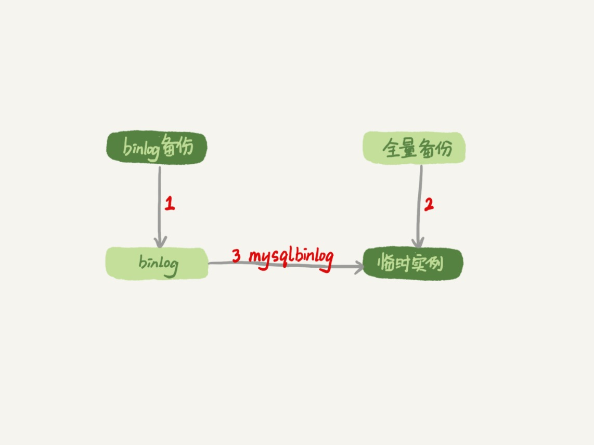
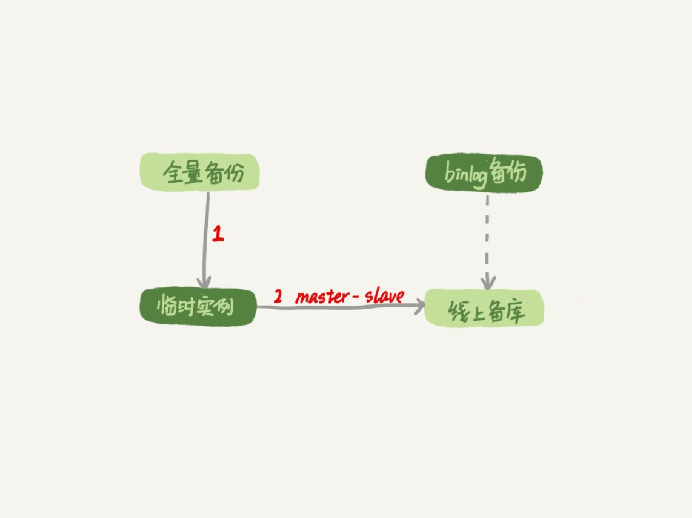

# 31-误删数据后除了跑路，还能怎么办

误删数据分类：
- 使用 `delete` 语句误删数据行。
- 使用 `drop table` 或者 `truncate table` 语句误删数据表。
- 使用 `drop database` 语句误删数据库。
- 使用 `rm` 命令误删整个 `MySQL` 实例。

## 误删行

如果是使用 `delete` 语句误删了数据行，可以用 `Flashback` 工具通过闪回把数据恢复回来。

`Flashback` 恢复数据的原理，是修改 `binlog` 的内容，拿回原库重放。

能够使用这个方案的前提是，需要确保 `binlog_format=row` 和 `binlog_row_image=FULL`。

具体恢复数据时，对单个事务做如下处理：
- 对于 `insert` 语句，将对应的 `binlog event` 类型 `Write_rows event` 改成 `Delete_rows event` 即可。
- 对于 `delete` 语句，将对应的 `binlog event` 类型 `Delete_rows event` 改成 `Write_rows event` 即可。
- 对于 `update` 语句，将对应的 `binlog` 里记录的数据行修改前和修改后的值对调位置即可。

如果误操作有多个，比如下面三个事务：

    (A)delete ...
    (B)insert ...
    (C)update ...

现在要把数据库恢复回这三个事务操作之前的状态，用 `Flashback` 工具解析 `binlog` 后写回主库的命令是：

    (reverse C)update ...
    (reverse B)delete ...
    (reverse A)insert ...

也就是说，如果误删数据涉及到了多个事务的话，需要将事务的顺序倒过来再执行。

**需要说明的是，不建议你直接在主库上执行这些操作。**

恢复数据比较安全的做法，是恢复出一个`备份`，在这个临时库上执行这些操作，然后再将确认过的临时库的数据，恢复回`主库`。

当然更重要是要做到事前预防，两个建议：
- 把 `sql_safe_updates` 参数设置为 `on`。这样一来，如果忘记在 `delete` 或者 `update` 语句中写 `where` 条件，或者 `where` 条件里面没有包含索引字段的话，这条语句的执行就会报错。
- 代码上线前，必须经过 `SQL` 审计。

设置了 `sql_safe_updates=on` 要把一个小表的数据全部删掉，可以在 `delete` 语句中加上 `where` 条件 `id>=0`。

注意 `delete` 全表是很慢的，需要生成`回滚日志`、写 `redo`、写 `binlog`。

从性能角度考虑，应该优先考虑使用 `truncate table` 或者 `drop table` 命令。

使用 `truncate/drop table` 和 `drop database` 命令删除的数据，没办法通过 `Flashback` 恢复。

因为即使配置了 `binlog_format=row` 执行这三个命令记录的 `binlog` 还是 `statement` 格式，只有一个 `truncate/drop` 语句。

## 误删库/表

如果真的是使用 `truncate/drop table` 和 `drop database` 误删数据了，又该怎么办呢？

这种情况下，要想恢复数据，就需要使用`全量备份`，加`增量日志`的方式了。

这个方案要求线上有`定期的全量备份`，并且`实时备份 binlog`。

在这两个条件都具备的情况下，假如有人中午 `12` 点误删了一个库，恢复数据的流程如下：
- 取最近一次全量备份，假设这个库是一天一备，上次备份是当天 `0` 点。
- 用备份恢复出一个临时库。
- 从日志备份里面，取出凌晨 `0` 点之后的日志。
- 把这些日志，除了误删除数据的语句外，全部应用到临时库。

这个流程如下所示：

这个过程说明如下几点：
- 为了加速数据恢复，如果这个临时库上有多个数据库，可以在使用 `mysqlbinlog` 命令时，加上一个 `–database` 参数，用来指定误删表所在的库，避免在恢复数据时还要应用其他库日志的情况。
- 在应用日志的时候，需要跳过 `12` 点误操作的那个语句的 `binlog`：
  - 如果原实例没有使用 `GTID` 模式，只能在应用到包含 `12` 点的 `binlog` 文件的时候，先用 `–stop-position` 参数执行到误操作之前的日志，然后再用 `–start-position` 从误操作之后的日志继续执行。
  - 如果实例使用了 `GTID` 模式，就方便多了。假设误操作命令的 `GTID` 是 `gtid1`，那么只需要执行 `set gtid_next=gtid1;begin;commit;` 先把这个 `GTID` 加到临时实例的 `GTID` 集合，之后按顺序执行 `binlog` 的时候，就会自动跳过误操作的语句。

使用 `mysqlbinlog` 方法恢复数据还是不够快，主要原因有两个：
- 如果是误删表，最好就是只恢复出这张表，也就是只重放这张表的操作，但是 `mysqlbinlog` 工具并不能指定只解析一个表的日志。
- 用 `mysqlbinlog` 解析出日志应用，应用日志的过程就只能是`单线程`，`并行复制`方法都用不上。

一种加速的方法是，在用备份恢复出临时实例之后，将这个临时实例设置成线上备库的从库，这样：
- 在 `start slave` 之前，先通过执行 `change replication filter replicate_do_table = tb_name` 命令，就可以让临时库只同步误操作的表。
- 这样做也可以用上并行复制技术，来加速整个数据恢复过程。

这个过程如下所示：

图中 `binlog` 备份系统到线上备库有一条虚线，是指如果由于时间太久，备库上已经删除了临时实例需要的 `binlog` 的话，可以从 `binlog` 备份系统中找到需要的 `binlog`，再放回备库中。

假设当前临时实例需要的 `binlog` 是从 `master.000005` 开始的，但是在备库上执行 `show binary logs` 显示的最小的 `binlog` 文件是 `master.000007`，意味着少了两个 `binlog` 文件。

这时就需要去 `binlog` 备份系统中找到这两个文件。

把之前删掉的 `binlog` 放回备库的操作步骤是这样的：
- 从备份系统下载 `master.000005` 和 `master.000006` 这两个文件，放到备库的日志目录下。
- 打开日志目录下的 `master.index` 文件，在文件开头加入两行内容 `./master.000005` 和 `./master.000006`。
- 重启备库，目的是要让备库重新识别这两个日志文件。
- 现在这个备库上就有了临时库需要的所有 `binlog` 了，建立主备关系，就可以正常同步了。

不论是把 `mysqlbinlog` 工具解析出的 `binlog` 文件应用到临时库，还是把临时库接到备库上，这两个方案的共同点是：  
误删库或表后，恢复数据的思路主要就是通过`备份`加上应用 `binlog` 的方式。

这两个方案都要求备份系统定期备份全量日志，而且需要确保 `binlog` 在被从本地删除之前已经做了备份。

根据成本和磁盘空间资源，设定一个合适的日志保留的天数。

如果 `DBA` 告诉你可以保证把某个实例恢复到半个月内的任意时间点，这就表示备份系统保留的日志时间就至少是半个月。

建议把这个数据恢复功能做成自动化工具，并且经常拿出来演练。

## 延迟复制备库

如果一个库的备份特别大，或者误操作的时间距离上一个全量备份的时间较长，比如一周一备的实例，在备份之后的第 `6` 天发生误操作，那就需要恢复 `6` 天的日志，这个恢复时间可能是要按天来计算的。

延迟复制的备库是一种特殊的备库，通过 `CHANGE MASTER TO MASTER_DELAY = N` 命令，可以指定这个备库持续保持跟主库有 `N` 秒的延迟。

比如把 `N` 设置为 `3600`，如果主库上有数据被误删了，并且在 `1` 小时内发现了这个误操作命令，这个命令就还没有在这个延迟复制的备库执行。

这时候到这个备库上执行 `stop slave`，再通过之前介绍的方法，跳过误操作命令，就可以恢复出需要的数据。

这样就随时可以得到一个只需要最多再追 `1` 小时就可以恢复出数据的临时实例，也就缩短了整个数据恢复需要的时间。

## 预防误删库/表的方法

常在河边走，很难不湿鞋。

一些减少误删操作风险的建议。

第一条建议是：`账号分离`，避免写错命令：
- 只给业务开发同学 `DML` 权限，不给 `truncate/drop` 权限。
- 即使是 `DBA` 日常也都只使用`只读账号`，必要时才使用有更新权限的账号。

第二条建议是：制定操作规范，避免写错要删除的表名：
- 在删除数据表之前，必须先对表做`改名`操作。观察一段时间确保对业务无影响以后再删除这张表。
- 改表名的时候，要求给表名加固定的后缀，然后删除表的动作必须通过管理系统执行。管理系删除表的时候，只能删除固定后缀的表。

## rm 删除数据

对于一个有高可用机制的 `MySQL` 集群来说，最不怕的就是 `rm` 删除数据了。

只要不是恶意把整个集群删除，而只是删掉了其中某一个节点的数据的话，`HA` 系统就会开始工作，选出一个新的主库，从而保证整个集群的正常工作。

这时要做的就是在这个节点上把数据恢复回来，再接入整个集群。

## 小结

今天讨论了误删数据的几种可能，以及误删后的处理方法。

要强调的是，`预防`远比处理的意义来得大。

在 `MySQL` 的集群方案中，会时不时地用到备份来恢复实例，因此定期检查备份的有效性也很有必要。

业务开发同学可以用 `show grants` 命令查看账户的权限，如果权限过大，可以建议 `DBA` 同学给你分配权限低一些的账号。

也可以评估业务的重要性，和 `DBA` 商量备份的周期、是否有必要创建延迟复制的备库等。

# 完