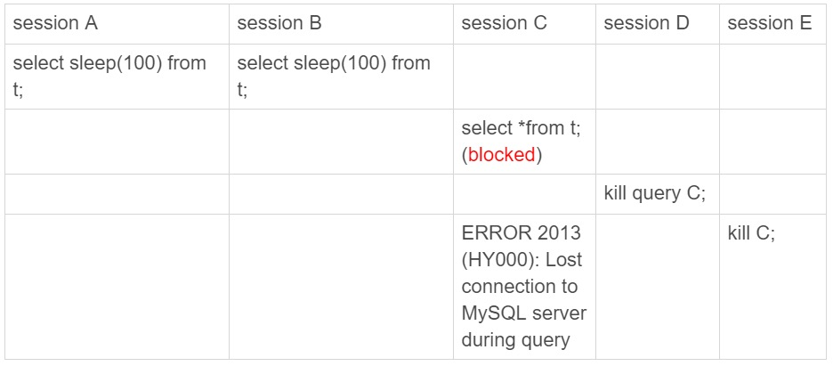

# 32-为什么还有kill不掉的语句

`MySQL` 中有两个 `kill` 命令：
- `kill query + 线程id`：表示终止这个线程中正在执行的语句。
- `kill connection + 线程id`：这里 `connection` 可以省略，表示终止这个线程中正在执行的语句，然后断开这个线程的连接。

你有没有遇到过这样的现象：  
使用了 `kill` 命令却没能断开这个连接，执行 `show processlist` 命令看到这条语句的 `Command` 列显示的是 `Killed`。

其实大多数情况下 `kill query/connection` 命令是有效的。
- 执行一个查询的过程中，要放弃继续查询，就可以用 `kill query` 命令终止这条查询语句。
- 语句处于锁等待的时候，直接使用 `kill query` 命令也是有效的。

## 收到 kill 以后，线程做什么？

其实 `kill` 是告诉执行线程这条语句已经不需要继续执行了，可以开始执行停止的逻辑了。

处理 `kill` 命令的线程做了两件事：
- 把 `session` 的运行状态改成 `THD::KILL_QUERY`。
- 给 `session` 的执行线程发一个`信号`。

当 `session` 处于锁等待状态，如果只把线程状态设置为 `THD::KILL_QUERY`，线程并不知道这个状态变化，还是会继续等待。

发一个信号的目的就是让 `session` 退出等待，来处理这个 `THD::KILL_QUERY` 状态。

上面的分析中，隐含了这么三层意思：
- 一个语句执行过程中有多处`埋点`，在这些`埋点`的地方判断线程状态，如果发现线程状态是 `THD::KILL_QUERY`，才开始进入语句终止逻辑。
- 如果处于等待状态，必须是一个可以被唤醒的等待，否则根本不会执行到`埋点`处。
- 语句从开始进入终止逻辑，到终止逻辑完全完成，是有一个过程的。

到这里就知道了，原来会话不是`说停就停的`。

接下来看一个 `kill` 不掉的例子。

首先执行 `set global innodb_thread_concurrency=2` 将 `InnoDB` 的并发线程上限数设置为 `2`，然后执行下面的序列：

可以看到：
- `sesssion C` 执行的时候被堵住了。
- 但是 `session D` 执行的 `kill query C` 命令却没什么效果。
- 直到 `session E` 执行了 `kill connection C` 命令，才断开了 `session C` 的连接，提示 `Lost connection to MySQL server during query`。

这时候执行 `show processlist` 如下：

    mysql> show processlist;
    +-----+------+-----------+------+---------+------+--------------+--------------------------+
    | Id  | User | Host      | db   | Command | Time | State        | Info                     |
    +-----+------+-----------+------+---------+------+--------------+--------------------------+
    | 149 | root | localhost | test | Query   |  149 | User sleep   | select sleep(100) from t |
    | 150 | root | localhost | test | Query   |  143 | User sleep   | select sleep(100) from t |
    | 151 | root | localhost | test | Killed  |  131 | Sending data | select * from t          |
    | 152 | root | localhost | test | Sleep   |   33 |              | NULL                     |
    | 153 | root | localhost | test | Sleep   |    7 |              | NULL                     |
    | 154 | root | localhost | NULL | Query   |    0 | starting     | show processlist         |
    +-----+------+-----------+------+---------+------+--------------+--------------------------+

这时候 `id=151` 这个线程的 `Commnad` 列显示的是 `Killed`。

也就是客户端虽然断开了连接，但实际上服务端上这条语句还在执行过程中。

为什么执行 `kill query` 命令时没有退出呢？

在实现上，等行锁时使用的是 `pthread_cond_timedwait` 函数，这个等待状态可以被唤醒。

但是在这个例子里，`151` 号线程的等待逻辑是这样的：每 `10` 毫秒判断一下是否可以进入 `InnoDB` 执行，如果不行，就调用 `nanosleep` 函数进入 `sleep` 状态。

也就是说，虽然 `151` 号线程的状态已经被设置成了 `KILL_QUERY`，但是在这个等待进入 `InnoDB` 的循环过程中，并没有去判断线程的状态，因此根本不会进入终止逻辑阶段。

而当执行 `kill connection` 命令时，是这么做的：
- 把 `151` 号线程状态设置为 `KILL_CONNECTION`。
- 关掉 `151` 号线程的网络连接，所以这时候 `session C` 收到了断开连接的提示。

那为什么执行 `show processlist` 的时候，会看到 `Command` 列显示为 `killed` 呢？

这因为在执行 `show processlist` 的时候，有一个特别的逻辑：  
如果一个线程的状态是 `KILL_CONNECTION` 就把 `Command` 列显示成 `Killed`。

所以即使是客户端退出了，这个线程的状态仍然是在等待中。

那这个线程什么时候会退出呢？

答案是：  
只有等到满足进入 `InnoDB` 的条件后，`session C` 的查询语句继续执行，然后才有可能判断到线程状态已经变成了 `KILL_QUERY` 或者 `KILL_CONNECTION` 再进入终止逻辑阶段。

小结：

这个例子是 `kill` 无效的第一类情况：**线程没有执行到判断线程状态的逻辑**。  
跟这种情况相同的，还有由于 `IO` 压力过大，读写 `IO` 的函数一直无法返回，导致不能及时判断线程的状态。

另一类情况是**终止逻辑耗时较长**，这时 `show processlist` 结果上看也是 `Command=Killed`，需要等到终止逻辑完成，语句才算真正完成。  
常见的场景：
- 超大事务执行期间被 `kill`。这时候回滚操作需要对事务执行期间生成的所有新数据版本做回收操作，耗时很长。
- 大查询回滚。如果查询过程中生成了比较大的临时文件，加上此时文件系统压力大，删除临时文件可能需要等待 `IO` 资源，导致耗时较长。
- `DDL` 命令执行到最后阶段，如果被 `kill`，需要删除中间过程的临时文件，也可能受 `IO` 资源影响耗时较久。

在客户端执行 `Ctrl+C` 的时候，是 `MySQL` 客户端另外启动一个连接，然后发送一个 `kill query` 命令。

不要以为在客户端执行完 `Ctrl+C` 就万事大吉了。要 `kill` 掉一个线程，还涉及到后端的很多操作。

## 另外两个关于客户端的误解

第一个误解是：如果库里面的表特别多，连接就会很慢。

当使用默认参数连接的时候，`MySQL` 客户端会提供一个本地库名和表名补全的功能。

为了实现这个功能，客户端在连接成功后，需要多做一些操作：
- 执行 `show databases`。
- 切到 `db1` 库，执行 `show tables`。
- 把这两个命令的结果用于构建一个本地的哈希表。

在这些操作中，最花时间的就是第三步在本地构建哈希表的操作。

所以当一个库中的表个数非常多的时候，这一步就会花比较长的时间。

所以其实并不是连接慢，也不是服务端慢，而是客户端慢。

另外 `–quick` 也是一个容易引起误会的参数，也是关于客户端常见的一个误解。

`MySQL` 客户端发送请求后，接收服务端返回结果的方式有两种：
- 一种是本地缓存，也就是在本地开一片内存，先把结果存起来。如果你用 `API` 开发，对应的就是 `mysql_store_result` 方法。
- 另一种是不缓存，读一个处理一个。如果你用 `API` 开发，对应的就是 `mysql_use_result` 方法。

`MySQL` 客户端默认采用第一种方式，而如果加上 `–quick` 参数，就会使用第二种不缓存的方式。

采用不缓存的方式时，如果本地处理得慢，就会导致服务端发送结果被阻塞，因此会让服务端变慢。

参数 `–quick` 可以达到以下三点效果：
- 第一点，就是前面提到的，跳过表名自动补全功能。
- 第二点，`mysql_store_result` 需要申请本地内存来缓存查询结果，如果查询结果太大，会耗费较多的本地内存，可能会影响客户端本地机器的性能。
- 第三点，是不会把执行命令记录到本地的命令历史文件。
 
所以 `–quick` 参数的意思，是让客户端变得更快。

## 小结

今天介绍了 `MySQL` 中有些语句和连接 `kill` 不掉的情况。

其实是因为发送 `kill` 命令的客户端并没有强行停止目标线程的执行，而只是设置了个`状态`，并唤醒对应的线程。

被 `kill` 的线程需要执行到判断状态的`埋点`，才会开始进入`终止逻辑`阶段。并且，`终止逻辑`本身也是需要耗费时间的。

如果发现一个线程处于 `Killed` 状态，可以通过影响系统环境，让这个 `Killed` 状态尽快结束。

如果是并发度的问题，可以临时调大 `innodb_thread_concurrency` 的值，或者停掉别的线程，让出位子给这个线程执行。

如果是回滚逻辑由于受到 `IO` 资源限制执行得比较慢，就通过减少系统压力让它加速。

做完这些操作，其实已经没有办法再做什么了，只能等待流程自己完成。

# 完