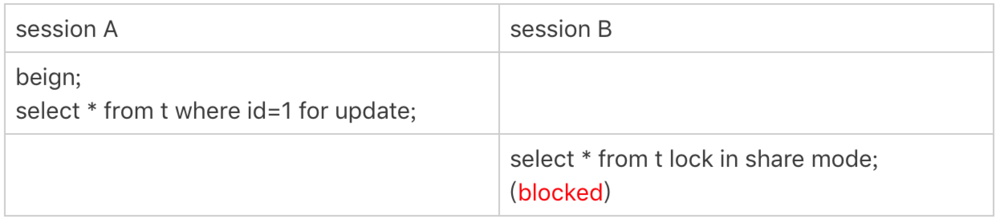

# 33-我查这么多数据，会不会把数据库内存打爆

## 全表扫描对 server 层的影响

`InnoDB` 的数据是保存在`主键索引`上的，所以全表扫描实际上是直接扫描表的`主键索引`，将每一行数据放到`结果集`里面，然后返回给客户端。

实际上服务端并不需要保存一个完整的`结果集`。

`取数据`和`发数据`的流程是这样的：
- 获取一行，写到 `net_buffer` 中。这块内存的大小是由参数 `net_buffer_length` 定义的，默认是 `16k`。
- 重复获取行，直到 `net_buffer` 写满，调用网络接口发出去。
- 如果发送成功，就清空 `net_buffer`，然后继续取下一行，并写入 `net_buffer`。
- 如果发送函数返回本地网络栈（`socket send buffer`）写满了，就进入等待，直到网络栈重新可写，再继续发送。

可以看到：
- 一个查询在发送过程中，占用的 `MySQL` 内部的内存最大就是 `net_buffer_length` 这么大。
- `socket send buffer` 也不很大，如果 `socket send buffer` 被写满，就会暂停读数据的流程。

也就是说 `MySQL` 是`边读边发的`，如果客户端接收得慢，会导致 `MySQL` 服务端由于结果发不出去，这个`事务`的执行时间变长。

如果故意让客户端不去读 `socket receive buffer` 中的内容，在服务端 `show processlist` 看到的结果是 `State` 的值一直处于 `Sending to client`，就表示服务器端的网络栈写满了。

因此对于正常的线上业务来说，如果一个查询的返回结果不会很多的话，建议使用 `mysql_store_result` 这个接口直接把查询结果保存到本地内存。

如果在 `MySQL` 里看到很多个线程都处于`Sending to client`状态，就要让业务开发同学优化查询结果，并评估这么多的返回结果是否合理。

与`Sending to client`长相类似的一个状态是`Sending data`，这是一个经常被误会的问题。

实际上，一个查询语句的状态变化是这样的（略去其他无关的状态）：
- 查询语句进入执行阶段后，首先把状态设置成`Sending data`。
- 然后发送执行结果的列相关的信息（`meta data`) 给客户端。
- 再继续执行语句的流程。
- 执行完成后把状态设置成空字符串。

也就是说，`Sending data`并不一定是指`正在发送数据`，可能是处于执行器过程中的任意阶段。

构造一个锁等待的场景，就能看到 `Sending data` 状态。

    mysql> show processlist;
    +-----+------+-----------+------+---------+------+--------------+------------------------------------+
    | Id  | User | Host      | db   | Command | Time | State        | Info                               |
    +-----+------+-----------+------+---------+------+--------------+------------------------------------+
    | 163 | root | localhost | test | Sleep   |    8 |              | NULL                               |
    | 166 | root | localhost | test | Query   |    2 | Sending data | select * from t lock in share mode |
    | 168 | root | localhost | test | Query   |    0 | starting     | show processlist                   |
    +-----+------+-----------+------+---------+------+--------------+------------------------------------+

可以看到 `session B` 明显是在等锁，状态显示为 `Sending data`。

也就是说：
- 仅当一个线程处于`等待客户端接收结果`的状态，才会显示`Sending to client`。
- 而如果显示成`Sending data`，它的意思只是`正在执行`。

现在知道了，查询的结果是分段发给客户端的，因此扫描全表，查询返回大量的数据，并不会把内存打爆。

## 全表扫描对 InnoDB 的影响

前面分析过 `InnoDB` 内存缓存的一个作用，是保存更新的结果，再配合 `redo log`，避免了随机写盘。

内存的数据页是在 `Buffer Pool` 中管理的，`Buffer Pool` 起到了加速更新的作用。

实际上 `Buffer Pool` 也起到了加速查询的作用。

一个查询要读某个数据页，如果该数据页已经在缓存中了，就不需要读磁盘，直接读内存页就可以了。

而 `Buffer Pool` 对查询的加速效果，依赖于一个重要的指标：**`内存命中率`**。

在 `show engine innodb status` 结果中，可以查看一个系统当前的 `BP` 命中率。

一般情况下，一个稳定服务的线上系统，要保证响应时间符合要求的话，内存命中率要在 `99%` 以上。

    BUFFER POOL AND MEMORY
    ----------------------
    Total large memory allocated 137428992
    Dictionary memory allocated 377173
    Buffer pool size   8191
    Free buffers       7612
    Database pages     579
    Old database pages 193
    Modified db pages  0
    Pending reads      0
    Pending writes: LRU 0, flush list 0, single page 0
    Pages made young 129, not young 7
    0.00 youngs/s, 0.00 non-youngs/s
    Pages read 506, created 93, written 636
    0.00 reads/s, 0.00 creates/s, 0.00 writes/s
    Buffer pool hit rate 1000 / 1000, young-making rate 0 / 1000 not 0 / 1000
    Pages read ahead 0.00/s, evicted without access 0.00/s, Random read ahead 0.00/s
    LRU len: 579, unzip_LRU len: 0
    I/O sum[0]:cur[0], unzip sum[0]:cur[0]
    --------------

其中：

    Buffer pool hit rate 1000 / 1000

显示的就是当前的命中率。

`InnoDB Buffer Pool` 的大小是由参数 `innodb_buffer_pool_size` 确定的，一般建议设置成可用物理内存的 `60%-80%`。

如果 `Buffer Pool` 满了，又要从磁盘读入一个数据页，那就要淘汰一个旧数据页的。

`InnoDB` 内存管理用的是最近最少使用 (`LRU`) 算法，这个算法的核心就是淘汰最久未使用的数据。

`InnoDB` 对 `LRU` 算法做了改进。

`InnoDB` 按照 `5:3` 的比例把整个 `LRU` 链表分成了 `young` 区域和 `old` 区域。

靠近链表头部的 `5/8` 是 `young` 区域，靠近链表尾部的 `3/8` 是 `old` 区域。

改进后的 `LRU` 算法执行流程：
- 要访问的数据页如果在 `young` 区域，和优化前的 `LRU` 算法一样，将其移到链表头部。
- 要访问的数据页如果不存在于当前链表中，淘汰掉链表末尾的数据页，将从磁盘读入的新数据页放在 `old` 区域的头部。
- 处于 `old` 区域的数据页，每次被访问的时候都要做下面这个判断：
  - 如果这个数据页在 `LRU` 链表中存在的时间超过 `1` 秒，就把它移动到链表头部。
  - 如果这个数据页在 `LRU` 链表中存在的时间短于 `1` 秒，位置保持不变。`1` 秒这个时间由参数 `innodb_old_blocks_time` 控制的，默认值是 `1000`，单位`毫秒`。

这个策略就是为了处理类似`全表扫描`的操作量身定制的。

改进后的 `LRU` 算法`全表扫描`的操作逻辑：
- 扫描过程中，需要新插入的数据页，都被放到 `old` 区域。
- 一个数据页里面有多条记录，这个数据页会被多次访问到，但由于是顺序扫描，这个数据页第一次被访问和最后一次被访问的时间间隔不会超过 `1` 秒，因此还是会被保留在 `old` 区域。
- 再继续扫描后续的数据，之前的这个数据页之后也不会再被访问到，于是始终没有机会移到链表头部，很快就会被淘汰出去。

这个策略最大的收益，就是在扫描大表的过程中，虽然也用到了 `Buffer Pool`，但是对 `young` 区域完全没有影响，从而保证了 `Buffer Pool` 响应正常业务的查询命中率。

## 小结

今天介绍了 `MySQL` 的查询结果发送给客户端的过程。

`MySQL` 采用`边算边发`的逻辑，不会在 `server` 端保存完整的结果集。所以客户端读结果不及时，会堵住 `MySQL` 的查询过程，但是不会把内存打爆。

`InnoDB` 引擎内部缓存池有淘汰策略，大查询也不会导致内存暴涨。并且 `InnoDB` 对 `LRU` 算法做了改进，冷数据的全表扫描对 `Buffer Pool` 的影响也能做到可控。

当然全表扫描还是比较耗费 `IO` 资源的，业务高峰期还是不能直接在主库执行全表扫描。

# 完