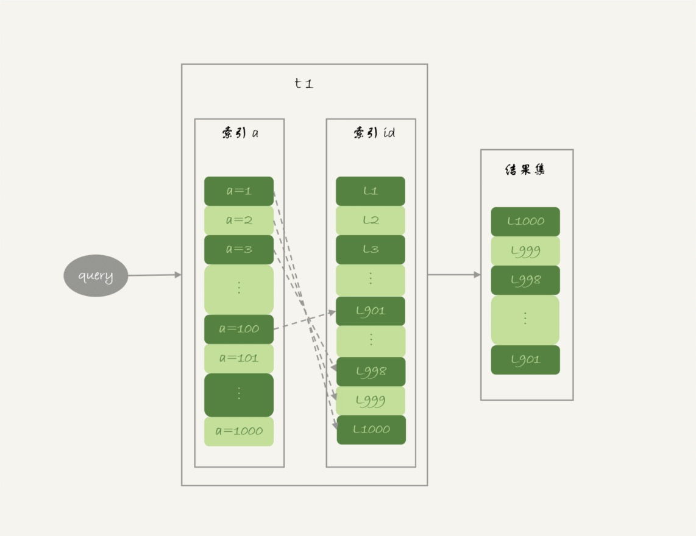
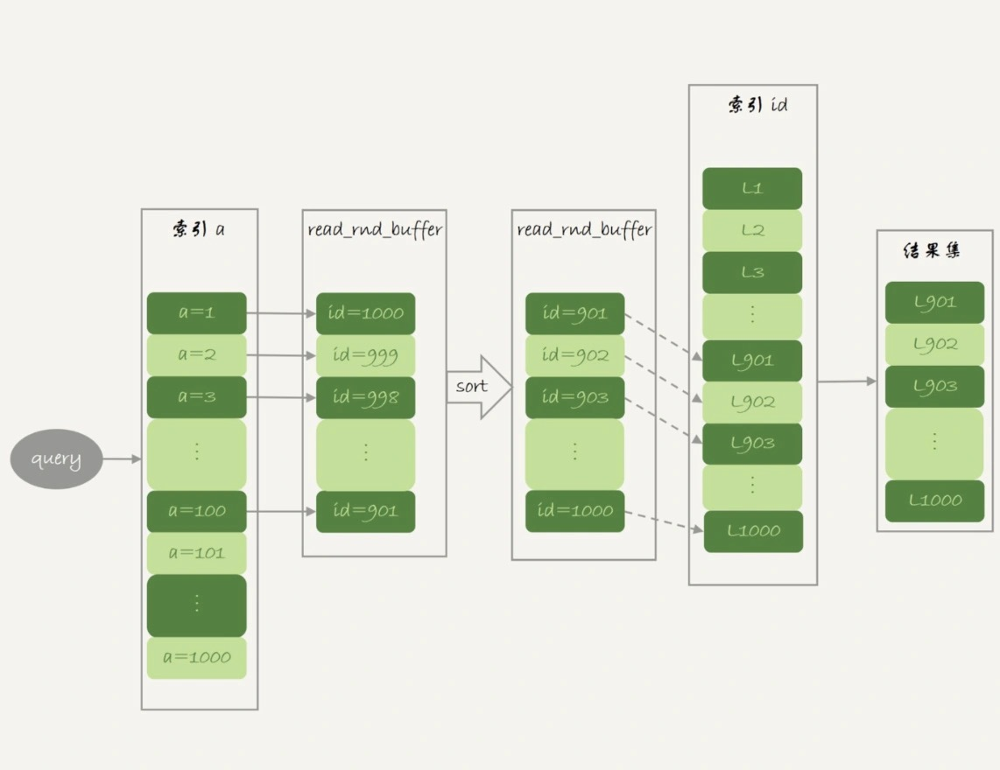
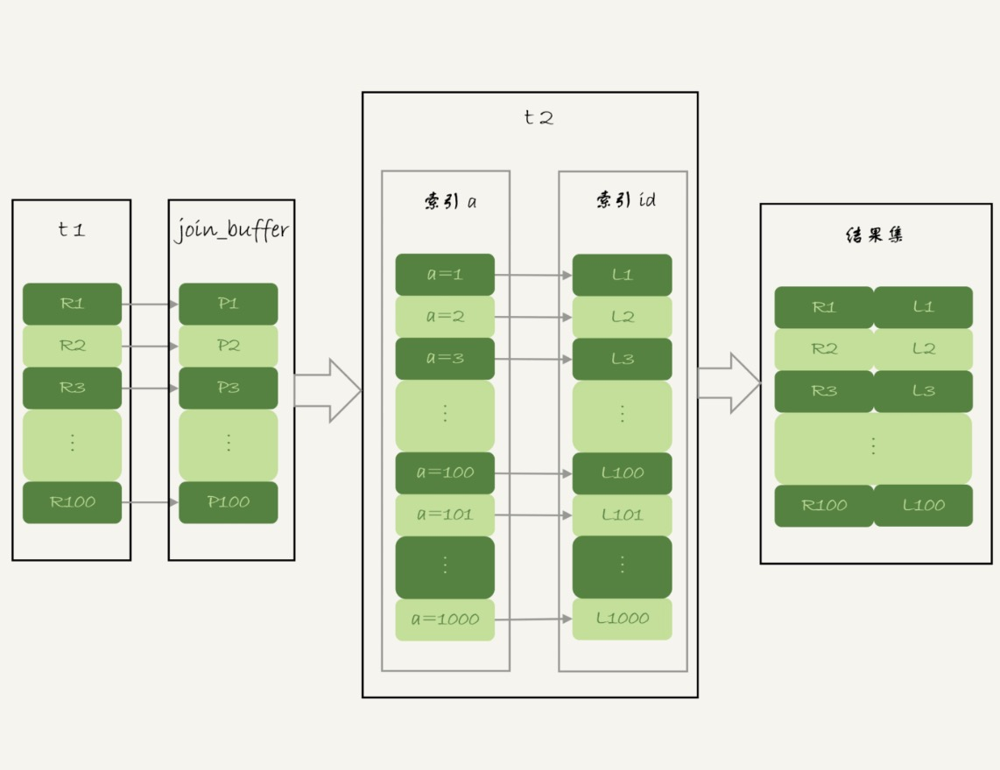

# 35-join语句怎么优化

上一篇文章中介绍了 `join` 语句的两种算法：
- `Index Nested-Loop Join`(`NLJ`)。
- `Block Nested-Loop Join`(`BNL`)。

使用 `NLJ` 算法的时候，其实效果还是不错的。

但是 `BNL` 算法在大表 `join` 的时候性能就差多了，比较次数等于两个表参与 `join` 的行数的乘积，很消耗 `CPU` 资源。

这两个算法都还有继续优化的空间。

准备数据：

```sql
-- 创建表 t1
CREATE TABLE t1 (
  id int(11) NOT NULL,
  a int(11) DEFAULT NULL,
  b int(11) DEFAULT NULL,
  PRIMARY KEY (id),
  KEY a (a)
) ENGINE=InnoDB;

-- 创建表 t2
CREATE TABLE t2 LIKE t1;

-- 存储过程
CREATE PROCEDURE insert_data()
BEGIN
  declare i int;
  set i=1;
  while(i<=1000) do
    insert into t1 values(i, 1001-i, i);
    set i=i+1;  
  end while;

  set i=1;
  while(i<=1000000) do
    insert into t2 values(i, i, i);
    set i=i+1;  
  end while;
END

-- 调用存储过程
CALL insert_data();
```

在表 `t1` 里插入了 `1000` 行数据，每一行的 `a=1001-id` 的值，也就是说字段 `a` 是逆序的。

在表 `t2` 中插入了 `100` 万行数据。

## Multi-Range Read 优化

先和介绍一个知识点：`Multi-Range Read` 优化 (`MRR`)。

这个优化的主要目的是尽量使用`顺序读盘`。

这个语句：

    select * from t1 where a>=1 and a<=100;

主键索引是一棵 `B+` 树，每次回表只能根据一个主键 `id` 查到一行数据，因此回表是一行行搜索主键索引的，如下图：



执行计划：

    mysql> explain select * from t1 where a>=1 and a<=100;
    +----+-------------+-------+------------+-------+---------------+------+---------+------+------+----------+-----------------------+
    | id | select_type | table | partitions | type  | possible_keys | key  | key_len | ref  | rows | filtered | Extra                 |
    +----+-------------+-------+------------+-------+---------------+------+---------+------+------+----------+-----------------------+
    |  1 | SIMPLE      | t1    | NULL       | range | a             | a    | 5       | NULL |  100 |   100.00 | Using index condition |
    +----+-------------+-------+------------+-------+---------------+------+---------+------+------+----------+-----------------------+

执行结果：

    mysql> select * from t1 where a>=1 and a<=100;
    +------+------+------+
    | id   | a    | b    |
    +------+------+------+
    | 1000 |    1 | 1000 |
    |  999 |    2 |  999 |
    |  998 |    3 |  998 |
    |  997 |    4 |  997 |
    |  996 |    5 |  996 |
    |  ... |    . |  ... |
    |  903 |   98 |  903 |
    |  902 |   99 |  902 |
    |  901 |  100 |  901 |
    +------+------+------+

由于使用索引 `a` 查询，结果集是按照 `a` 顺序递增的。

随着 `a` 的值递增顺序查询，`id` 的值就变成随机的，回表就会出现随机访问，性能相对较差。

如果按照主键的递增顺序查询的话，对磁盘的读比较接近顺序读，能够提升读性能，这就是 `MRR` 优化的设计思路。

此时语句的执行流程变成了这样：
- 根据索引 `a` 定位到满足条件的记录，将 `id` 值放入 `read_rnd_buffer` 中。
- 将 `read_rnd_buffer` 中的 `id` 进行递增排序。
- 排序后的 `id` 数组，依次到主键 `id` 索引中查记录，并作为结果返回。

这里 `read_rnd_buffer` 的大小是由 `read_rnd_buffer_size` 参数控制的。

如果 `步骤 1` 中 `read_rnd_buffer` 放满了，就会先执行完 `步骤 2 和 3`，然后清空 `read_rnd_buffer` 再继续找索引 `a` 的下个记录并继续循环。

如下图：



另外需要说明，如果想要稳定地使用 `MRR` 优化，需要设置 `set optimizer_switch='mrr_cost_based=off'`。

因为现在的优化器策略判断消耗的时候，会更倾向于不使用 `MRR`，把 `mrr_cost_based` 设置为 `off` 就是固定使用 `MRR` 了。

执行计划：

    mysql> set optimizer_switch = 'mrr_cost_based=off';
    Query OK, 0 rows affected (0.00 sec)

    mysql> explain select * from t1 where a>=1 and a<=100;
    +----+-------------+-------+------------+-------+---------------+------+---------+------+------+----------+----------------------------------+
    | id | select_type | table | partitions | type  | possible_keys | key  | key_len | ref  | rows | filtered | Extra                            |
    +----+-------------+-------+------------+-------+---------------+------+---------+------+------+----------+----------------------------------+
    |  1 | SIMPLE      | t1    | NULL       | range | a             | a    | 5       | NULL |  100 |   100.00 | Using index condition; Using MRR |
    +----+-------------+-------+------------+-------+---------------+------+---------+------+------+----------+----------------------------------+

执行结果：

    mysql> select * from t1 where a>=1 and a<=100;
    +------+------+------+
    | id   | a    | b    |
    +------+------+------+
    |  901 |  100 |  901 |
    |  902 |   99 |  902 |
    |  903 |   98 |  903 |
    |  ... |   .. |  ... |
    |  996 |    5 |  996 |
    |  997 |    4 |  997 |
    |  998 |    3 |  998 |
    |  999 |    2 |  999 |
    | 1000 |    1 | 1000 |
    +------+------+------+

从 `explain` 结果中可以看到 `Extra` 字段多了 `Using MRR` 表示的是用上了 `MRR` 优化。

由于在 `read_rnd_buffer` 中按照 `id` 做了排序，所以最后得到的结果集也是按照主键 `id` 递增顺序的，和不使用 `MRR` 优化的结果集顺序相反。

小结：

`MRR` 能够提升性能的核心在于，查询语句在二级索引上做的是一个多值查询，可以得到足够多的主键 id，这样通过排序以后，再去主键索引查数据，才能体现出`顺序性`的优势。

## Batched Key Access

`MySQL` 的 `Batched Key Access` 算法，简称 `BKA` 算法，其实是对上一篇中介绍的 `NLJ` 算法的优化。

`NLJ` 算法执行的逻辑是：从驱动表 `t1` 一行行地取出 `a` 的值，再到被驱动表 `t2` 去做 `join`。对于表 `t2` 来说，每次都是匹配一个值。这时 `MRR` 的优势就用不上了。

怎么才能一次性地多传些值给表 `t2` 呢？

方法是从表 `t1` 里一次性地多拿些行出来，一起传给表 `t2`。

就是把表 `t1` 的数据取出来一部分，先放到一个临时内存。这个临时内存就是 `join_buffer`。

我们知道 `join_buffer` 在 `BNL` 算法里是暂存驱动表的数据，但在 `NLJ` 算法里并没有用。

那么刚好就可以复用 `join_buffer` 到 `BKA` 算法中。

下面是 `NLJ` 算法优化后的 `BKA` 算法流程：



图中 `join_buffer` 中放入的数据是 `P1-P100` 表示的是只会取查询需要的字段。

当然如果 `join buffer` 放不下 `P1-P100` 的所有数据，就会把这 `100` 行数据分成多段执行上图的流程。

启用 `BKA` 算法，需要先设置：

    set optimizer_switch='mrr=on,mrr_cost_based=off,batched_key_access=on';

其中前两个参数的作用是要启用 `MRR`，`BKA` 算法的优化要依赖于 `MRR`。

执行计划：

    mysql> set optimizer_switch='mrr=on,mrr_cost_based=off,batched_key_access=on';
    Query OK, 0 rows affected (0.00 sec)

    mysql> explain select * from t1 inner join t2 on (t1.a=t2.a);
    +----+-------------+-------+------------+------+---------------+------+---------+-----------+------+----------+----------------------------------------+
    | id | select_type | table | partitions | type | possible_keys | key  | key_len | ref       | rows | filtered | Extra                                  |
    +----+-------------+-------+------------+------+---------------+------+---------+-----------+------+----------+----------------------------------------+
    |  1 | SIMPLE      | t1    | NULL       | ALL  | a             | NULL | NULL    | NULL      | 1000 |   100.00 | Using where                            |
    |  1 | SIMPLE      | t2    | NULL       | ref  | a             | a    | 5       | test.t1.a |    1 |   100.00 | Using join buffer (Batched Key Access) |
    +----+-------------+-------+------------+------+---------------+------+---------+-----------+------+----------+----------------------------------------+

执行结果：

    mysql> select * from t1 inner join t2 on (t1.a=t2.a);
    +------+------+------+------+------+------+
    | id   | a    | b    | id   | a    | b    |
    +------+------+------+------+------+------+
    | 1000 |    1 | 1000 |    1 |    1 |    1 |
    |  999 |    2 |  999 |    2 |    2 |    2 |
    |  998 |    3 |  998 |    3 |    3 |    3 |
    |  997 |    4 |  997 |    4 |    4 |    4 |
    |  996 |    5 |  996 |    5 |    5 |    5 |
    |    . |  ... |    . |  ... |  ... |  ... |
    |    3 |  998 |    3 |  998 |  998 |  998 |
    |    2 |  999 |    2 |  999 |  999 |  999 |
    |    1 | 1000 |    1 | 1000 | 1000 | 1000 |
    +------+------+------+------+------+------+

## BNL 算法的性能问题

使用 `Block Nested-Loop Join` 算法时，可能会对被驱动表做多次扫描。

如果这个被驱动表是一个大的冷数据表，除了会导致 `IO` 压力大以外，还会对系统有什么影响呢？

由于 `InnoDB` 对 `Bufffer Pool` 的 `LRU` 算法做了优化：
- 第一次从磁盘读入内存的数据页，会先放在 `old` 区域。
- 如果 `1` 秒之后这个数据页不再被访问了，就不会被移动到 `LRU` 链表头部，这样对 `Buffer Pool` 的命中率影响就不大。

分俩种情况：
- 这个冷表数据很小`能够`完全放入 `old` 区域
  这时一个使用 `BNL` 算法的 `join` 语句，多次扫描一个冷表，如果这个语句执行时间超过 `1` 秒，就会在再次扫描冷表的时候，把冷表的数据页移到 `LRU` 链表头部。

- 这个冷表数据很大`不能`完全放入 `old` 区域
  这时一个使用 `BNL` 算法的 `join` 语句，在扫描冷表的过程中会不停的淘汰 `old` 区域的内存页，导致其他正常业务访问的数据页进入 `old` 区域后，没有机会被再次访问进入 `young` 区域，就被淘汰了。

这两种情况都会影响 `Buffer Pool` 的正常运作。

大表 `join` 操作虽然对 `IO` 有影响，但是在语句执行结束后，对 `IO` 的影响也就结束了。

但是对 `Buffer Pool` 的影响就是持续性的，需要依靠后续的查询请求慢慢恢复`内存命中率`。

为了减少这种影响，可以考虑增大 `join_buffer_size` 的值，减少对被驱动表的扫描次数。

也就是说，`BNL` 算法对系统的影响主要包括三个方面：
- 可能会多次扫描被驱动表，占用磁盘 `IO` 资源。
- 判断 `join` 条件需要执行 `M*N` 次对比（`M`、`N` 分别是两张表的行数），如果是大表就会占用非常多的 `CPU` 资源。
- 可能会导致 `Buffer Pool` 的热数据被淘汰，影响`内存命中率`。

执行语句之前，需要通过理论分析和查看 `explain` 结果的方式，确认是否要使用 `BNL` 算法。

如果确认优化器会使用 `BNL` 算法，就需要做优化。

优化的常见做法是：给被驱动表的 `join` 字段加上索引，把 `BNL` 算法转成 `BKA` 算法。

接下来看看这个优化怎么做？

## BNL 转 BKA

通常可以直接在被驱动表上建索引，这时就可以直接转成 `BKA` 算法了。

有时候会碰到一些不适合在被驱动表上建索引的情况。

比如下面这个语句：

    select * from t1 join t2 on (t1.b=t2.b) where t2.b>=1 and t2.b<=2000;

表 `t2` 中有 `100` 万行数据，经过 `where` 条件过滤后，需要参与 `join` 的只有 `2000` 行数据。

如果这条语句同时是一个低频的 `SQL` 语句，那么再为这个语句在表 `t2` 的字段 `b` 上创建一个索引就很浪费了。

使用 `BNL` 算法来 `join` 的执行流程是这样的：
- 把表 `t1` 的所有字段取出来，存入 `join_buffer` 中。这个表只有 `1000` 行，`join_buffer_size` 默认值是 `256k`，可以完全存入。
- 扫描表 `t2` 取出每一行数据跟 `join_buffer` 中的数据进行对比：
  - 如果不满足 `t1.b=t2.b` 则跳过。
  - 如果满足 `t1.b=t2.b` 再判断是否满足` t2.b` 处于 `[1,2000]` 的条件，如果也满足就作为结果集的一部分返回，否则跳过。

对于表 `t2` 的每一行，判断 `join` 是否满足的时候，都需要遍历 `join_buffer` 中的所有行。

因此判断等值条件的次数是 `1000*100` 万 =`10` 亿次，这个判断的工作量很大。

执行计划：

    mysql> explain select * from t1 join t2 on (t1.b=t2.b) where t2.b>=1 and t2.b<=2000;
    +----+-------------+-------+------------+------+---------------+------+---------+------+--------+----------+----------------------------------------------------+
    | id | select_type | table | partitions | type | possible_keys | key  | key_len | ref  | rows   | filtered | Extra                                              |
    +----+-------------+-------+------------+------+---------------+------+---------+------+--------+----------+----------------------------------------------------+
    |  1 | SIMPLE      | t1    | NULL       | ALL  | NULL          | NULL | NULL    | NULL |   1000 |   100.00 | Using where                                        |
    |  1 | SIMPLE      | t2    | NULL       | ALL  | NULL          | NULL | NULL    | NULL | 998340 |     1.11 | Using where; Using join buffer (Block Nested Loop) |
    +----+-------------+-------+------------+------+---------------+------+---------+------+--------+----------+----------------------------------------------------+

执行结果：

    mysql> select * from t1 join t2 on (t1.b=t2.b) where t2.b>=1 and t2.b<=2000;
    +------+------+------+------+------+------+
    | id   | a    | b    | id   | a    | b    |
    +------+------+------+------+------+------+
    |    1 | 1000 |    1 |    1 |    1 |    1 |
    |    2 |  999 |    2 |    2 |    2 |    2 |
    |    3 |  998 |    3 |    3 |    3 |    3 |
    |    4 |  997 |    4 |    4 |    4 |    4 |
    |    5 |  996 |    5 |    5 |    5 |    5 |
    |  ... |    . |  ... |  ... |  ... |  ... |
    |  997 |    4 |  997 |  997 |  997 |  997 |
    |  998 |    3 |  998 |  998 |  998 |  998 |
    |  999 |    2 |  999 |  999 |  999 |  999 |
    | 1000 |    1 | 1000 | 1000 | 1000 | 1000 |
    +------+------+------+------+------+------+
    1000 rows in set (49.26 sec)

执行耗时 `49` 秒。

可以考虑使用`临时表`。

大致思路是：
- 把表 `t2` 中满足条件的数据放在临时表 `temp` 中。
- 为了让 `join` 使用 `BKA` 算法，给临时表 `temp` 的字段 `b` 加上索引。
- 让表 `t1` 和 `temp` 做 `join` 操作。

对应的 `SQL` 语句：

    create temporary table temp (
        id int primary key, 
        a int, 
        b int, 
        index(b)
    ) engine=innodb;

    insert into temp select * from t2 where b>=1 and b<=2000;

    select * from t1 join temp on (t1.b=temp.b);

执行计划：

    mysql> set optimizer_switch='mrr=on,mrr_cost_based=off,batched_key_access=on';
    Query OK, 0 rows affected (0.00 sec)

    -- 没有模拟出 BKA
    mysql> explain select * from t1 join temp on (t1.b=temp.b);
    +----+-------------+-------+------------+------+---------------+------+---------+-----------+------+----------+-------------+
    | id | select_type | table | partitions | type | possible_keys | key  | key_len | ref       | rows | filtered | Extra       |
    +----+-------------+-------+------------+------+---------------+------+---------+-----------+------+----------+-------------+
    |  1 | SIMPLE      | t1    | NULL       | ALL  | NULL          | NULL | NULL    | NULL      | 1000 |   100.00 | Using where |
    |  1 | SIMPLE      | temp  | NULL       | ref  | b             | b    | 5       | test.t1.b |    1 |   100.00 | NULL        |
    +----+-------------+-------+------------+------+---------------+------+---------+-----------+------+----------+-------------+

执行结果：

    mysql> select * from t1 inner join temp on (t1.b=temp.b);
    +------+------+------+------+------+------+
    | id   | a    | b    | id   | a    | b    |
    +------+------+------+------+------+------+
    |    1 | 1000 |    1 |    1 |    1 |    1 |
    |    2 |  999 |    2 |    2 |    2 |    2 |
    |    3 |  998 |    3 |    3 |    3 |    3 |
    |    4 |  997 |    4 |    4 |    4 |    4 |
    |    5 |  996 |    5 |    5 |    5 |    5 |
    |  ... |    . |  ... |  ... |  ... |  ... |
    |  996 |    5 |  996 |  996 |  996 |  996 |
    |  997 |    4 |  997 |  997 |  997 |  997 |
    |  998 |    3 |  998 |  998 |  998 |  998 |
    |  999 |    2 |  999 |  999 |  999 |  999 |
    | 1000 |    1 | 1000 | 1000 | 1000 | 1000 |
    +------+------+------+------+------+------+
    1000 rows in set (0.00 sec)

可以看到执行时间很少。

总体来看，不论是在`原表`上加索引，还是用有索引的`临时表`，都是让 `join` 语句能够用上被驱动表上的索引，来触发 `BKA` 算法，提升查询性能。

## 扩展 -hash join

其实上面计算 `10` 亿次那个操作，看上去有点儿傻。

如果 `join_buffer` 里面维护的不是一个无序数组，而是一个哈希表的话，那么就不是 `10` 亿次判断，而是 `100` 万次 `hash` 查找。

这样整条语句的执行速度就快多了。

`MySQL` 的优化器和执行器不支持哈希 `join`。

这个优化思路，可以自己实现在业务端：
- `select * from t1` 取得表 `t1` 的全部 `1000` 行数据，在业务端存入一个 `hash` 结构。
- `select * from t2 where b>=1 and b<=2000` 获取表 `t2` 中满足条件的 `2000` 行数据。
- 把这 `2000` 行数据一行一行地取到业务端，到 `hash` 结构的数据表中寻找匹配的数据。
- 满足匹配的条件的这行数据，就作为结果集的一行。

理论上这个过程会比临时表方案的执行速度还要快一些。

## 小结

今天分享了 `Index Nested-Loop Join` 和 `Block Nested-Loop Join` 的优化方法。

在这些优化方法中：
- `BKA` 优化是 `MySQL` 已经内置支持的，建议默认使用。
- `BNL` 算法效率低，建议尽量转成 `BKA` 算法。优化的方向就是给`被驱动表`的关联字段`加上索引`。
- 基于`临时表`的改进方案，对于能够提前过滤出小数据的 `join` 语句来说，效果还是很好的。
- `MySQL` 目前的版本还不支持 `hash join`，可以配合应用端自己模拟出来，理论上效果要好于临时表的方案。

# 完