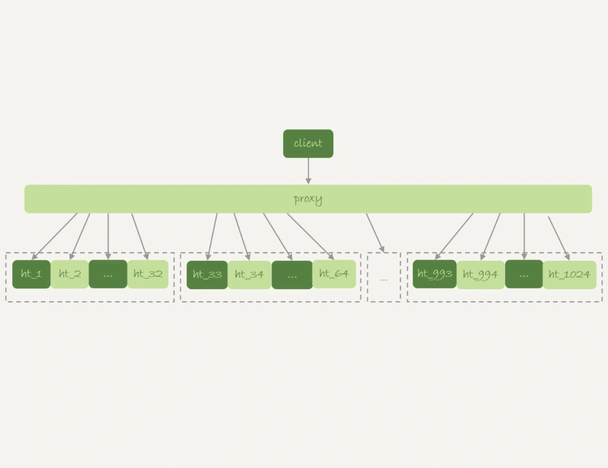
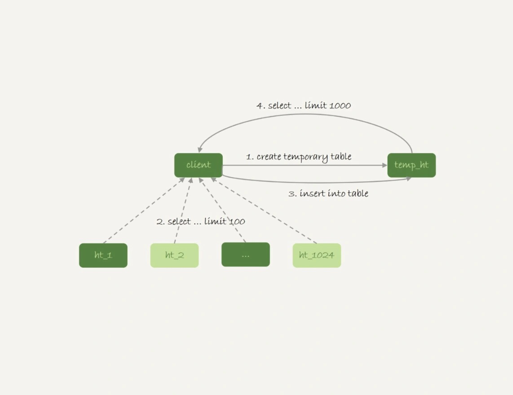

# 36-为什么临时表可以重名

`临时表`有哪些特征，它适合什么场景？

`临时表`和`内存表`这两个概念可是完全不同的。
- `内存表`：指的是使用 `Memory` 引擎的表。这种表的数据都保存在内存里，系统重启的时候会被清空，但是表结构还在。
- `临时表`：可以使用各种引擎类型。
  - 如果使用 `InnoDB` 引擎或者 `MyISAM` 引擎，数据就保存在磁盘上。
  - 如果使用 `Memory` 引擎，数据就保存在内存里。

## 临时表的特性

`临时表`在使用上有以下几个特点：
- 建表语法是 `create temporary table ...`
- `临时表`只对创建它的会话可见，会话结束时自动删除。
- `临时表`可以与普通表同名，此时 `show create table t` 语句，以及增删改查语句访问的都是临时表。
- `show tables` 命令不显示`临时表`。

使用`临时表`好处：
- 不同会话的`临时表`可以重名。不需要担心表名重复导致建表失败的问题。
- 不需要担心数据删除的问题。`临时表`会自动回收，不需要额外操作。

## 临时表的应用

由于不用担心线程之间的重名冲突，临时表经常会被用在复杂查询的优化过程中。

`分库分表`系统的跨库查询就是一个典型的使用场景。

一般`分库分表`就是要把一个逻辑上的大表分散到不同的数据库实例上。

比如将一个大表 `ht` 按照字段 `f` 拆分成 `1024` 个分表，然后分布到 `32` 个数据库实例上：

一般情况下这种分库分表系统都有一个中间层 `proxy`。

在这个架构中分区 `key` 的选择是以`减少跨库和跨表查询`为依据的。

如果大部分的语句都会包含 `f` 的等值条件，那么就要用 `f` 做分区键。

这样在 `proxy` 这一层解析完 `SQL` 语句以后，就能确定将这条语句路由到哪个分表做查询。

比如这条语句：

    select v from ht where f=N;

可以通过分表规则（比如：`N%1024`) 来确认需要的数据被放在了哪个分表上。

这种语句只需要访问一个分表，是分库分表方案最欢迎的语句形式了。

如果这个表上还有另外一个索引 `k` 查询语句是这样的：

    select v from ht where k >= M order by t_modified desc limit 100;

由于查询条件里面没有用到分区字段 `f` 只能到所有的分区中去查找满足条件的所有行，然后统一做 `order by` 的操作。

这种情况下，有两种比较常用的思路：

- 第一种思路：在 `proxy` 层的进程代码中实现排序。
  - 优点：处理速度快，拿到分库的数据以后，直接在内存中参与计算。
  - 缺点：
    - 不同的语句类型导致开发工作量大。
    - 对 `proxy` 端的压力比较大。

- 另一种思路：把各个分库拿到的数据汇总到一个 `MySQL` 实例的一个表中，然后在这个汇总实例上做逻辑操作。
  
  上面这条语句执行流程：
  
  - 在汇总库上创建一个临时表 `temp_ht`，表里包含三个字段 `v`、`k`、`t_modified`。
  
  - 在各个分库上执行：
    
        select v,k,t_modified from ht_x where k >= M order by t_modified desc limit 100;
  
  - 把分库执行的结果插入到 `temp_ht` 表中。
  
  - 执行：

        select v from temp_ht order by t_modified desc limit 100; 
    
    得到结果。

  这个过程对应的流程图：

  

  实践中往往会发现每个分库的计算量都不饱和，所以会直接把临时表 temp_ht 放到 `32` 个分库中的某一个上。

## 为什么临时表可以重名？

执行创建`临时表`语句的时候，`MySQL` 要给这个表创建一个 `frm` 文件保存表结构定义，还要有地方保存表数据。

这个 `frm` 文件放在临时文件目录下，文件名的后缀是`.frm`，前缀是 `#sql{进程 id}_{线程 id}_序列号`。

可以使用 `select @@tmpdir` 命令查看实例的临时文件目录。

    mysql> select @@tmpdir;
    +----------+
    | @@tmpdir |
    +----------+
    | /tmp     |
    +----------+

    [root@centos tmp]# ll
    总用量 12
    -rw-r----- 1 mysql mysql 8556 1月  18 18:20 '#sql7b849_bb_0.frm'

`临时表`中数据的存放方式：
- `MySQL 5.6` 之前的版本：在临时文件目录下创建一个同名的 `.ibd` 为后缀的文件用来存放数据文件。
- `MySQL 5.7` 之后的版本：引入了一个临时文件表空间，专门用来存放临时文件的数据。  
  参数 `innodb_temp_data_file_path` 定义临时表空间的路径、文件名、初始化大小和最大上限。

      mysql> show variables like 'innodb_temp_data_file_path';
      +----------------------------+-----------------------+
      | Variable_name              | Value                 |
      +----------------------------+-----------------------+
      | innodb_temp_data_file_path | ibtmp1:12M:autoextend |
      +----------------------------+-----------------------+

可以看到，创建一个 `t1` 的临时表的表名和普通表 `t1` 是不同的，因此同一个库下面已经有普通表 `t1` 的情况下，还是可以再创建一个临时表 `t1` 的。

`MySQL` 内存里面也有一套机制区别不同的表，每个表都对应一个 `table_def_key`。
- 普通表的 `table_def_key` 的值是 `库名 + 表名`。
- 临时表的 table`_`def_key 的值是 `库名 + 表名 + server_id + thread_id`。

也就是说 `session A` 和 `session B` 创建的两个临时表 `t1`，它们的 `table_def_key` 不同，`磁盘文件名`也不同，因此可以并存。

实现上，每个线程都维护了自己的`临时表链表`。
- 在 `session` 内操作表的时候，先遍历链表，检查是否有这个名字的`临时表`，如果有就优先操作`临时表`，如果没有再操作`普通表`。
- 在 `session` 结束时，对链表里的每个`临时表`，执行 `DROP TEMPORARY TABLE 表名` 操作。

这时候会发现，`binlog` 中也记录了 `DROP TEMPORARY TABLE 表名` 这条命令。

`临时表`只在线程内自己可以访问，为什么需要写到 `binlog` 里面？

这就需要说到`主备复制`了。

## 临时表和主备复制

既然写 `binlog` 就意味着备库需要。

设想在主库上执行下面这个语句序列：

    create table t_normal (id int primary key, c int) engine=innodb;
    create temporary table temp_t like t_normal;
    insert into temp_t values(1,1);
    insert into t_normal select * from temp_t;

如果关于`临时表`的操作都不记录，那么在`备库`就只有 `create table t_normal` 和 `insert into t_normal select * from temp_t` 这两个语句的 `binlog` 日志，备库在执行到 `insert into t_normal` 的时候，就会报错`表 temp_t 不存在`。

如果把 `binlog` 设置为 `row` 格式，那么跟`临时表`有关的语句，就不会记录到 `binlog` 里。

也就是说只在 `binlog_format=statment/mixed` 的时候，`binlog` 中才会记录`临时表`的操作。

这种情况下，创建`临时表`的语句会传到`备库`执行，因此`备库`的同步线程就会创建这个临时表。

`主库`在线程退出的时候，会自动删除临时表，但是备库同步线程是持续在运行的。

所以这时候就需要在主库上再写一个 `DROP TEMPORARY TABLE` 传给备库执行。

还有另外一个问题需要解决：  
主库上不同的线程创建同名的临时表是没关系的，但是传到备库执行，有可能是同一个线程执行，怎么处理的呢？

备库的应用日志线程是共用的，也就是说要在应用线程里面先后执行创建临时表多次，即使开了多线程复制，也可能被分配到从库的同一个 `worker` 中执行。

`MySQL` 在记录 `binlog` 的时候，会把主库执行这个语句的线程 `id` 写到 `binlog` 中。

这样在备库的应用线程就能够知道执行每个语句的主库线程 `id`，并利用这个线程 `id` 来构造临时表的 `table_def_key`：

    库名 + t1 + M的serverid + 主库线程id

由于 `table_def_key` 不同，所以这两个表在备库的应用线程里面是不会冲突的。

## 小结

今天介绍了`临时表`的用法和特性。

在实际应用中，`临时表`一般用于处理比较复杂的计算逻辑。

由于`临时表`是每个线程自己可见的，所以不需要考虑多个线程执行同一个处理逻辑时，`临时表`的`重名`问题。

在线程退出的时候，`临时表`也能自动删除。

在 `binlog_format='row'` 的时候，`临时表`的操作不记录到 `binlog` 中，省去了不少麻烦。

上面说到的这种`临时表`是用户自己创建的，也称为`用户临时表`。

与它相对应的，还有`内部临时表`。

# 完