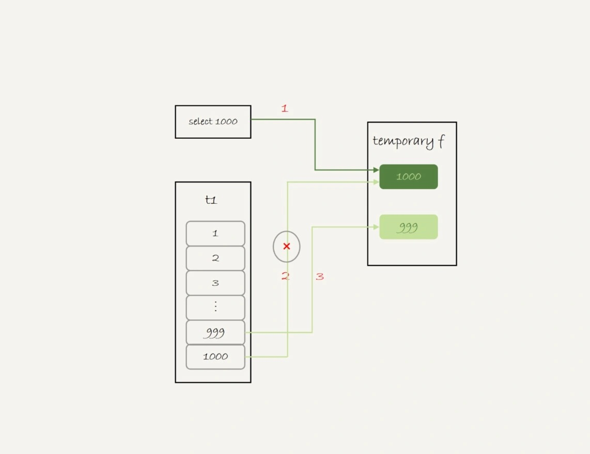
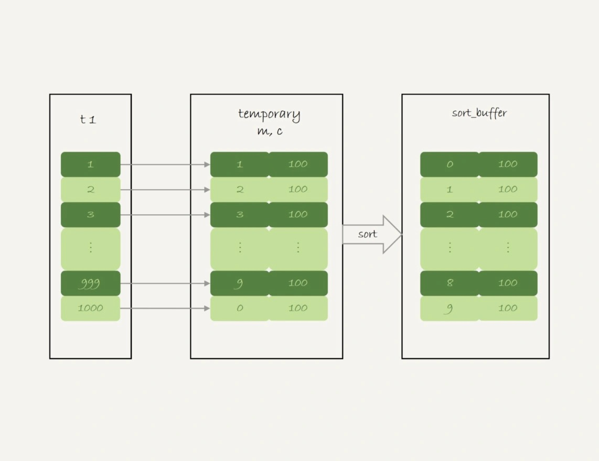
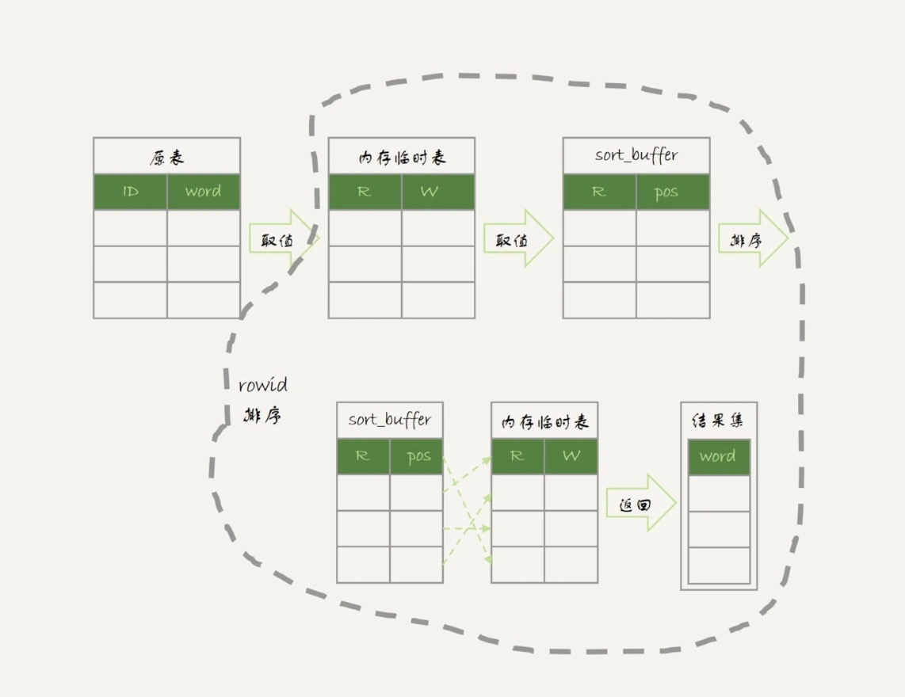

# 37-什么时候会使用内部临时表

`MySQL` 什么时候会使用`内部临时表`呢？

## union 执行流程

准备数据：

```sql
-- 创建表 t1
CREATE TABLE t1 (
  id int(11) NOT NULL,
  a int(11) DEFAULT NULL,
  b int(11) DEFAULT NULL,
  PRIMARY KEY (id),
  KEY a (a)
) ENGINE=InnoDB;

-- 存储过程
CREATE PROCEDURE insert_data()
BEGIN
  declare i int;
  set i=1;
  while(i<=1000) do
    insert into t1 values(i, i, i);
    set i=i+1;  
  end while;
END

-- 调用存储过程
CALL insert_data();
```

执行下面这条语句：

    (select 1000 as f) union (select id from t1 order by id desc limit 2);

`union` 的语义是取这两个子查询结果的并集，重复的行只保留一行。

执行计划：

    mysql> explain (select 1000 as f) union (select id from t1 order by id desc limit 2);
    +------+--------------+------------+------------+-------+---------------+---------+---------+------+------+----------+-----------------+
    | id   | select_type  | table      | partitions | type  | possible_keys | key     | key_len | ref  | rows | filtered | Extra           |
    +------+--------------+------------+------------+-------+---------------+---------+---------+------+------+----------+-----------------+
    |  1   | PRIMARY      | NULL       | NULL       | NULL  | NULL          | NULL    | NULL    | NULL | NULL |     NULL | No tables used  |
    |  2   | UNION        | t1         | NULL       | index | NULL          | PRIMARY | 4       | NULL |    2 |   100.00 | Using index     |
    | NULL | UNION RESULT | <union1,2> | NULL       | ALL   | NULL          | NULL    | NULL    | NULL | NULL |     NULL | Using temporary |
    +------+--------------+------------+------------+-------+---------------+---------+---------+------+------+----------+-----------------+

执行结果：

    mysql> (select 1000 as f) union (select id from t1 order by id desc limit 2);
    +------+
    | f    |
    +------+
    | 1000 |
    |  999 |
    +------+

可以看到：
- 第二行的 `key=PRIMARY` 说明第二个子句用到了索引 `id`。
- 第三行的 `Extra` 字段，表示在对子查询的结果集做 `union` 的时候，使用了临时表 (`Using temporary`)。

执行流程是这样的：
- 创建一个内存临时表，这个临时表只有一个整型字段 `f` 并且是主键字段。
- 执行第一个子查询：得到 `1000` 这个值，并存入临时表中。
- 执行第二个子查询：
  - 取到第一行 `id=1000`，试图插入临时表中。由于 `1000` 这个值已经存在于临时表了，违反了唯一性约束，所以插入失败，然后继续执行。
  - 取到第二行 `id=999`，插入临时表成功。
- 从临时表中按行取出数据，返回结果，并删除临时表，结果中包含两行数据分别是 `1000` 和 `999`。

流程图如下所示：



这里的内存临时表起到了暂存数据的作用，而且计算过程还用上了临时表主键 `id` 的唯一性约束，实现了 `union` 的语义。

另外，如果把语句中的 `union` 改成 `union all` 的话，就没有了`去重`的语义。

这样执行的时候，就依次执行子查询，得到的结果直接作为结果集的一部分，发给客户端。

因此也就不需要`临时表`了。

执行计划：

    mysql> explain (select 1000 as f) union all (select id from t1 order by id desc limit 2);
    +----+-------------+-------+------------+-------+---------------+---------+---------+------+------+----------+----------------+
    | id | select_type | table | partitions | type  | possible_keys | key     | key_len | ref  | rows | filtered | Extra          |
    +----+-------------+-------+------------+-------+---------------+---------+---------+------+------+----------+----------------+
    |  1 | PRIMARY     | NULL  | NULL       | NULL  | NULL          | NULL    | NULL    | NULL | NULL |     NULL | No tables used |
    |  2 | UNION       | t1    | NULL       | index | NULL          | PRIMARY | 4       | NULL |    2 |   100.00 | Using index    |
    +----+-------------+-------+------------+-------+---------------+---------+---------+------+------+----------+----------------+

执行结果：

    mysql> (select 1000 as f) union all (select id from t1 order by id desc limit 2);
    +------+
    | f    |
    +------+
    | 1000 |
    | 1000 |
    |  999 |
    +------+

第二行的 `Extra` 字段显示的是 `Using index`，表示只使用了`覆盖索引`，没有用`临时表`了。

## group by 执行流程

另外一个常见的使用临时表的例子是 `group by`。

这个语句：

    select id%10 as m, count(*) as c from t1 group by m;

执行计划：

    mysql> explain select id%10 as m, count(*) as c from t1 group by m;
    +----+-------------+-------+------------+-------+---------------+------+---------+------+------+----------+----------------------------------------------+
    | id | select_type | table | partitions | type  | possible_keys | key  | key_len | ref  | rows | filtered | Extra                                        |
    +----+-------------+-------+------------+-------+---------------+------+---------+------+------+----------+----------------------------------------------+
    |  1 | SIMPLE      | t1    | NULL       | index | PRIMARY,a     | a    | 5       | NULL | 1000 |   100.00 | Using index; Using temporary; Using filesort |
    +----+-------------+-------+------------+-------+---------------+------+---------+------+------+----------+----------------------------------------------+

执行结果：

    mysql> select id%10 as m, count(*) as c from t1 group by m;
    +------+-----+
    | m    | c   |
    +------+-----+
    |    0 | 100 |
    |    1 | 100 |
    |    2 | 100 |
    |    3 | 100 |
    |    4 | 100 |
    |    5 | 100 |
    |    6 | 100 |
    |    7 | 100 |
    |    8 | 100 |
    |    9 | 100 |
    +------+-----+

在 `Extra` 字段里面三个信息：
- `Using index` - 表示这个语句使用了覆盖索引，选择了索引 `a`，不需要`回表`。
- `Using temporary` - 表示使用了`临时表`。
- `Using filesort` - 表示需要`排序`。

执行流程是这样的：
- 创建`内存临时表`，表里有两个字段 `m` 和 `c`，主键是 `m`。
- 扫描表 `t1` 的索引 `a`，依次取出叶子节点上的 `id` 值，计算 `id%10` 的结果，记为 `x`：
  - 如果临时表中没有主键为 `x` 的行，就插入一个记录 `(x,1)`。
  - 如果临时表中存在主键为 `x` 的行，就将 `x` 这一行的 `c` 值加 `1`。
- 遍历完成后，再根据字段 `m` 做排序，得到结果集返回给客户端。

流程图如下所示：



最后一步，对内存临时表的排序，第 `17` 篇文章中已经介绍，把图贴过来：



如果需求不需要对结果进行排序，可以在 `SQL` 语句末尾增加 `order by null`：

    select id%10 as m, count(*) as c from t1 group by m order by null;

执行计划：

    mysql> explain select id%10 as m, count(*) as c from t1 group by m order by null;
    +----+-------------+-------+------------+-------+---------------+------+---------+------+------+----------+------------------------------+
    | id | select_type | table | partitions | type  | possible_keys | key  | key_len | ref  | rows | filtered | Extra                        |
    +----+-------------+-------+------------+-------+---------------+------+---------+------+------+----------+------------------------------+
    |  1 | SIMPLE      | t1    | NULL       | index | PRIMARY,a     | a    | 5       | NULL | 1000 |   100.00 | Using index; Using temporary |
    +----+-------------+-------+------------+-------+---------------+------+---------+------+------+----------+------------------------------+

执行结果：

    mysql> select id%10 as m, count(*) as c from t1 group by m order by null;
    +------+-----+
    | m    | c   |
    +------+-----+
    |    1 | 100 |
    |    2 | 100 |
    |    3 | 100 |
    |    4 | 100 |
    |    5 | 100 |
    |    6 | 100 |
    |    7 | 100 |
    |    8 | 100 |
    |    9 | 100 |
    |    0 | 100 |
    +------+-----+

这个例子里由于临时表只有 `10` 行，内存可以放得下，因此全程只使用了`内存临时表`。

内存临时表的大小是有限制的，参数 `tmp_table_size` 就是控制这个内存大小的，默认是 `16M`。

执行下面这个语句序列：

    set tmp_table_size=1024;
    select id%100 as m, count(*) as c from t1 group by m order by null limit 10;

把内存临时表的大小限制为最大 `1024` 字节，并把语句改成 `id % 100`，这样返回结果里有 `100` 行数据。

这时的内存临时表大小不够存下这 `100` 行数据，也就是说，执行过程中会发现内存临时表大小到达了上限（`1024` 字节）。

这时候就会把`内存临时表`转成`磁盘临时表`，`磁盘临时表`默认使用的引擎是 `InnoDB`。 

执行计划：

    mysql> explain select id%100 as m, count(*) as c from t1 group by m order by null limit 10;
    +----+-------------+-------+------------+-------+---------------+------+---------+------+------+----------+------------------------------+
    | id | select_type | table | partitions | type  | possible_keys | key  | key_len | ref  | rows | filtered | Extra                        |
    +----+-------------+-------+------------+-------+---------------+------+---------+------+------+----------+------------------------------+
    |  1 | SIMPLE      | t1    | NULL       | index | PRIMARY,a     | a    | 5       | NULL | 1000 |   100.00 | Using index; Using temporary |
    +----+-------------+-------+------------+-------+---------------+------+---------+------+------+----------+------------------------------+

执行结果：

    -- 磁盘临时表 引擎是 InnoDB 默认按 m 排序了
    mysql> select id%100 as m, count(*) as c from t1 group by m order by null limit 10;
    +------+----+
    | m    | c  |
    +------+----+
    |    0 | 10 |
    |    1 | 10 |
    |    2 | 10 |
    |    3 | 10 |
    |    4 | 10 |
    |    5 | 10 |
    |    6 | 10 |
    |    7 | 10 |
    |    8 | 10 |
    |    9 | 10 |
    +------+----+

## group by 优化方法 -- 索引

不论是使用`内存临时表`还是`磁盘临时表`，`group by` 逻辑都需要构造一个带唯一索引的表，执行代价都是比较高的。

如果表的数据量比较大，上面这个 `group by` 语句执行起来就会很慢。

执行 `group by` 语句为什么需要临时表？

`group by` 的语义逻辑，是统计不同的值出现的个数。

由于每一行的 `id%100` 的结果是无序的，所以就需要有一个`临时表`，来记录并统计结果。

如果可以确保输入的数据是`有序`的，那么计算 `group by` 的时候，就只需要从左到右，顺序扫描，分组依次累加，扫描到整个输入数据结束，就可以拿到 `group by` 的结果，不需要`临时表`，也不需要再`额外排序`。

`InnoDB` 的索引就可以满足这个输入有序的条件。

`MySQL 5.7 `版本支持了 `generated column` 机制，用来实现列数据的关联更新，可以用下面的方法创建一个列 `z`，然后在 `z` 列上创建一个索引。  

`MySQL 5.6` 及之前的版本，可以创建普通列和索引，来解决这个问题。

    alter table t1 add column z int generated always as(id % 100), add index(z);

这样索引 `z` 上的数据就是有序的了。

这是的表结构：

    CREATE TABLE t1 (
        id int(11) NOT NULL,
        a int(11) DEFAULT NULL,
        b int(11) DEFAULT NULL,
        z int(11) GENERATED ALWAYS AS ((id % 100)) VIRTUAL,
        PRIMARY KEY (id),
        KEY a (a),
        KEY z (z)
    ) ENGINE=InnoDB;

上面的 `group by` 语句就可以改成：

    select z, count(*) as c from t1 group by z;

执行计划：

    mysql> explain select z, count(*) as c from t1 group by z;
    +----+-------------+-------+------------+-------+---------------+------+---------+------+------+----------+-------------+
    | id | select_type | table | partitions | type  | possible_keys | key  | key_len | ref  | rows | filtered | Extra       |
    +----+-------------+-------+------------+-------+---------------+------+---------+------+------+----------+-------------+
    |  1 | SIMPLE      | t1    | NULL       | index | z             | z    | 5       | NULL | 1000 |   100.00 | Using index |
    +----+-------------+-------+------------+-------+---------------+------+---------+------+------+----------+-------------+

执行结果：

    mysql> select z, count(*) as c from t1 group by z limit 10;
    +------+----+
    | z    | c  |
    +------+----+
    |    0 | 10 |
    |    1 | 10 |
    |    2 | 10 |
    |    3 | 10 |
    |    4 | 10 |
    |    5 | 10 |
    |    6 | 10 |
    |    7 | 10 |
    |    8 | 10 |
    |    9 | 10 |
    +------+----+

从 `Extra` 字段可以看到，这个语句的执行不再需要`临时表`，也不需要`排序`了。

## group by 优化方法 -- 直接排序

如果碰上不适合创建索引的场景，还是要老老实实做排序的。

如果明明知道，一个 `group by` 语句中需要放到临时表上的数据量特别大，却还是要按照`先放到内存临时表，插入一部分数据后，发现内存临时表不够用了再转成磁盘临时表`，看上去有点儿傻。

`MySQL` 有没有直接走磁盘临时表的方法呢？

在 `group by` 语句中加入 `SQL_BIG_RESULT` 这个提示，就可以告诉优化器：  
这个语句涉及的数据量很大，请直接用磁盘临时表。

`MySQL` 的优化器一看，磁盘临时表是 `B+` 树存储，存储效率不如`数组`来得高。  
所以，既然数据量很大，那从磁盘空间考虑，还是直接用`数组`来存吧。

下面这个语句：

    select SQL_BIG_RESULT id%100 as m, count(*) as c from t1 group by m;

执行流程：
- 初始化 `sort_buffer` 确定放入一个整型字段 `m`。
- 扫描表 `t1` 的索引 `a` 依次取出里面的 `id` 值, 将 `id%100` 的值存入 `sort_buffer` 中。
- 扫描完成后，对 `sort_buffer` 的字段 `m` 做排序（如果 `sort_buffer` 内存不够用，就会利用磁盘临时文件辅助排序）。
- 排序完成后，就得到了一个有序数组。

根据`有序数组`，得到数组里面的不同值，以及每个值的出现次数。

执行计划：

    mysql> explain select SQL_BIG_RESULT id%100 as m, count(*) as c from t1 group by m;
    +----+-------------+-------+------------+-------+---------------+------+---------+------+------+----------+-----------------------------+
    | id | select_type | table | partitions | type  | possible_keys | key  | key_len | ref  | rows | filtered | Extra                       |
    +----+-------------+-------+------------+-------+---------------+------+---------+------+------+----------+-----------------------------+
    |  1 | SIMPLE      | t1    | NULL       | index | z             | z    | 5       | NULL | 1000 |   100.00 | Using index; Using filesort |
    +----+-------------+-------+------------+-------+---------------+------+---------+------+------+----------+-----------------------------+

从 `Extra` 字段可以看到，这个语句的执行没有再使用`临时表`，而是直接用了`排序`算法。

总结：
- 如果语句执行过程可以一边读数据，一边直接得到结果，是不需要额外内存的，否则就需要额外的内存，来保存中间结果。
- `join_buffer` 是无序数组，`sort_buffer` 是有序数组，`临时表`是二维表结构。
- 如果执行逻辑需要用到`二维表`特性，就会优先考虑使用`临时表`。比如 `union` 需要用到唯一索引约束，`group by` 需要用到另外一个字段来存累积计数。

## 小结

重点讲了 `group by` 的几种实现算法，总结一些使用的指导原则：
- 如果对 `group by` 语句的结果没有排序要求，要在语句后面加 `order by null`。
- 尽量让 `group by` 过程用上表的`索引`，确认方法是 `explain` 结果里没有 `Using temporary` 和 `Using filesort`。
- 如果 `group by` 需要统计的数据量不大，尽量只使用`内存临时表`，可以通过适当调大 `tmp_table_size` 参数来避免用到`磁盘临时表`。
- 如果数据量实在太大，使用 `SQL_BIG_RESULT` 来告诉优化器直接使用`排序算法`得到 `group by` 的结果。

# 完