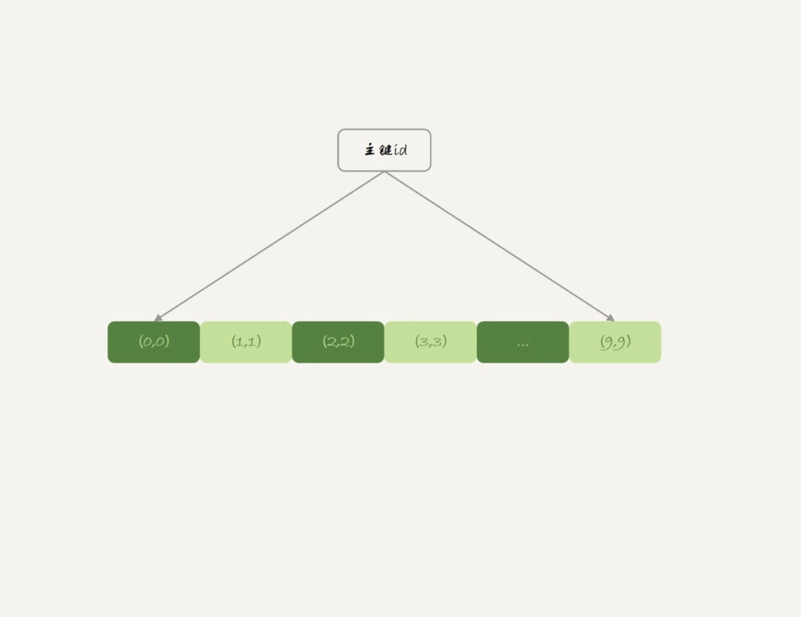
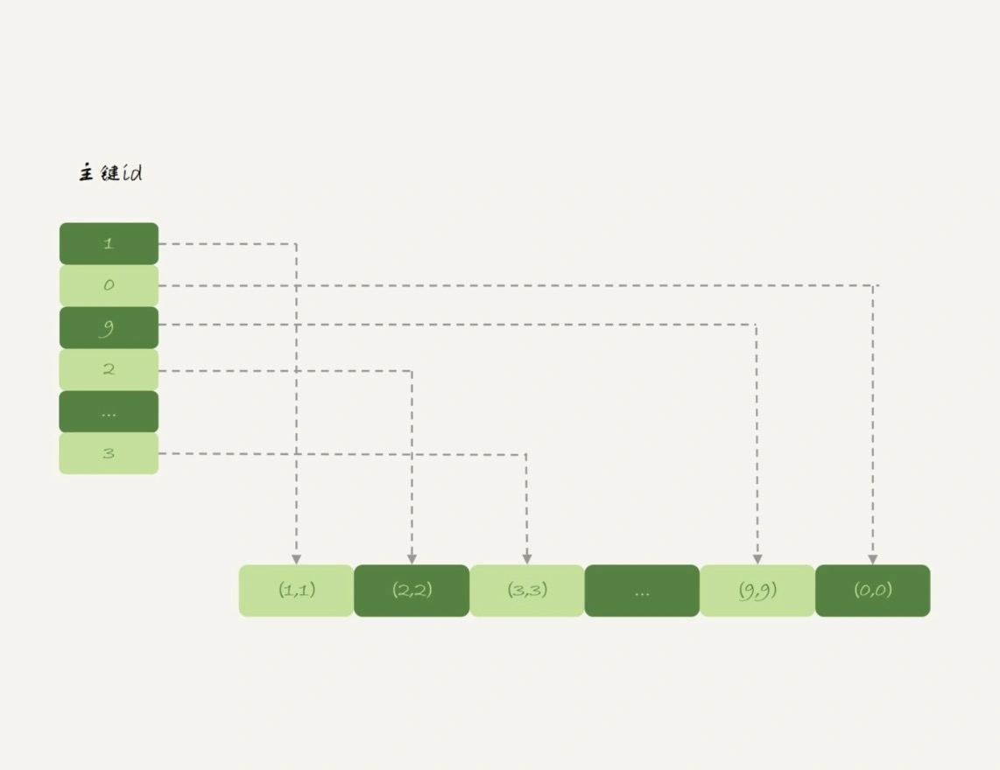
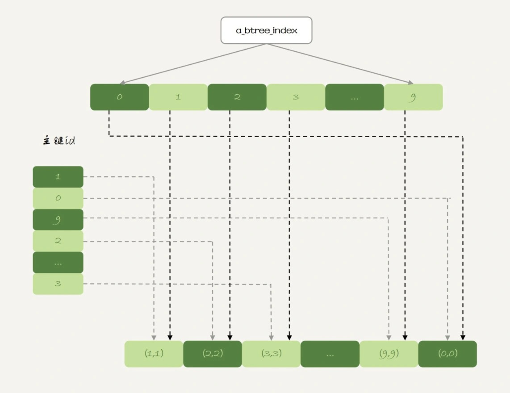
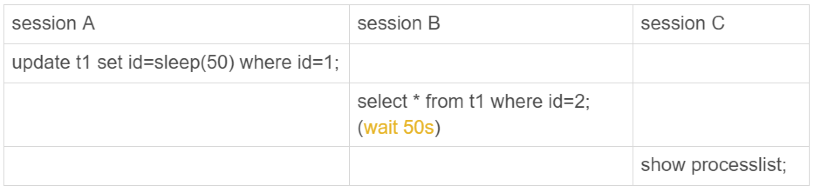
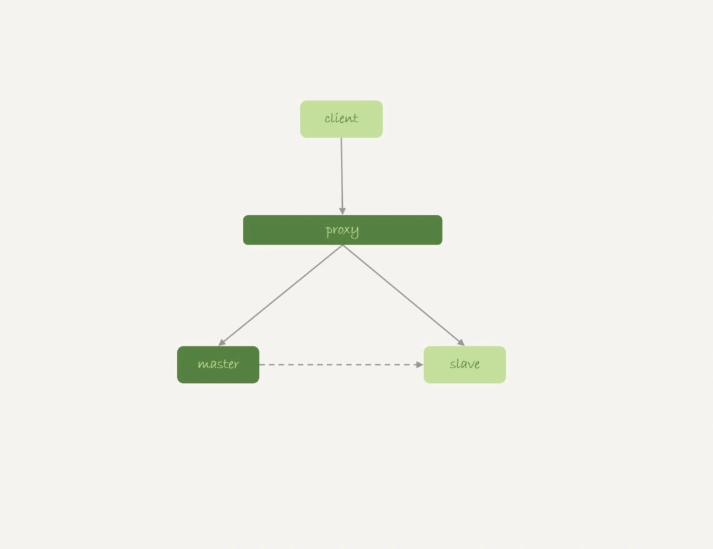
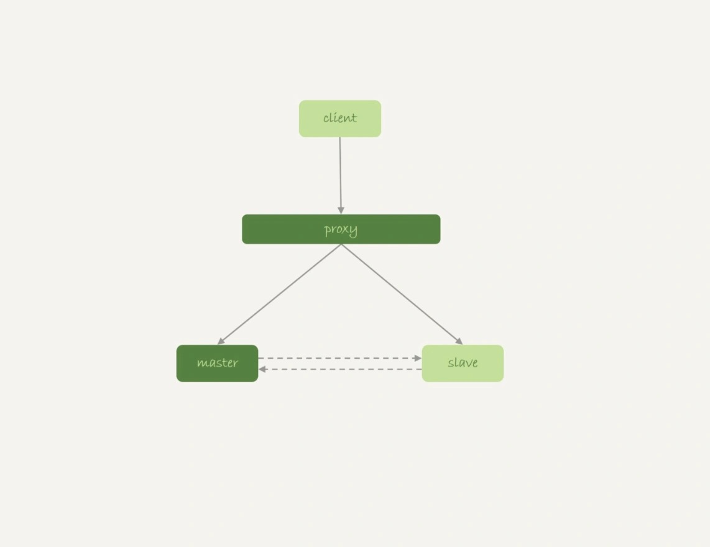

# 38-都说InnoDB好，那还要不要使用Memory引擎

## 内存表的数据组织结构

创建两张表 `t1` 和 `t2`，其中表 `t1` 使用 `Memory` 引擎，表 `t2` 使用 `InnoDB` 引擎。

    create table t1(id int primary key, c int) engine=Memory;
    create table t2(id int primary key, c int) engine=innodb;
    insert into t1 values(1,1),(2,2),(3,3),(4,4),(5,5),(6,6),(7,7),(8,8),(9,9),(0,0);
    insert into t2 values(1,1),(2,2),(3,3),(4,4),(5,5),(6,6),(7,7),(8,8),(9,9),(0,0);

分别执行 `select * from t1` 和 `select * from t2`。

    mysql> select * from t1;
    +----+------+
    | id | c    |
    +----+------+
    |  1 |    1 |
    |  2 |    2 |
    |  3 |    3 |
    |  4 |    4 |
    |  5 |    5 |
    |  6 |    6 |
    |  7 |    7 |
    |  8 |    8 |
    |  9 |    9 |
    |  0 |    0 |
    +----+------+

    mysql> select * from t2;
    +----+------+
    | id | c    |
    +----+------+
    |  0 |    0 |
    |  1 |    1 |
    |  2 |    2 |
    |  3 |    3 |
    |  4 |    4 |
    |  5 |    5 |
    |  6 |    6 |
    |  7 |    7 |
    |  8 |    8 |
    |  9 |    9 |
    +----+------+

`Memory` 表 `t1` 的返回结果里 `0` 在最后一行

`InnoDB` 表 `t2` 的返回结果里 `0` 在第一行。

出现这个区别要从这两个引擎的主键索引的组织方式说起。

表 `t2` 用的是 `InnoDB` 引擎：`InnoDB` 表的数据就放在主键索引树上，主键索引是 `B+` 树。如下图所示：

主键索引上的值是`有序`存储的。

在执行 `select *` 的时候，就会按照叶子节点从左到右扫描，所以得到的结果里 `0` 就出现在第一行。

表 `t1` 用的是 `Memory` 引擎：`Memory` 引擎的数据和索引是分开的。如下图所示：

内存表的数据部分以数组的方式单独存放，而主键 `id` 索引里，存的是每个数据的位置。

主键 `id` 是 `hash` 索引，可以看到索引上的 `key` 并不是有序的。

在内存表 `t1` 中执行 `select *` 的时候，走的是全表扫描，也就是顺序扫描这个数组，所以 `0` 就是最后一个被读到。

可见 `InnoDB` 和 `Memory` 引擎的数据组织方式是不同的：
- `InnoDB` 引擎把数据放在主键索引上，其他索引上保存的是主键 `id`。称之为`索引组织表`（`Index Organizied Table`）。
- `Memory` 引擎把数据单独存放，索引上保存数据的`位置`。称之为`堆组织表`（`Heap Organizied Table`）。

这两个引擎的一些典型不同：
- `InnoDB` 表的数据总是有序存放的，而内存表的数据就是按照写入顺序存放的。
- 当数据文件有空洞的时候，`InnoDB` 表在插入新数据的时候，为了保证数据有序性，只能在固定的位置写入新值，而内存表找到空位就可以插入新值。
- 数据位置发生变化的时候，`InnoDB` 表只需要修改主键索引，而内存表需要修改所有索引。
- `InnoDB` 表用主键索引查询时需要走一次索引查找，用普通索引查询的时候，需要走两次索引查找。而内存表没有这个区别，所有索引的都是相同的。
- `InnoDB` 支持`变长`数据类型，不同记录的长度可能不同。内存表不支持 `Blob` 和 `Text` 字段，并且即使定义了 `varchar(N)`，实际也当作 `char(N)`，也就是固定长度字符串来存储，因此内存表的每行数据长度相同。

由于内存表的这些特性，每个数据行被删除以后，空出的这个位置都可以被接下来要插入的数据复用。

    mysql> delete from t1 where id = 5;
    Query OK, 1 row affected (0.00 sec)

    mysql> insert into t1 values (10,10);
    Query OK, 1 row affected (0.01 sec)

    mysql> select * from t1;
    +----+------+
    | id | c    |
    +----+------+
    |  1 |    1 |
    |  2 |    2 |
    |  3 |    3 |
    |  4 |    4 |
    | 10 |   10 |
    |  6 |    6 |
    |  7 |    7 |
    |  8 |    8 |
    |  9 |    9 |
    |  0 |    0 |
    +----+------+
    10 rows in set (0.00 sec)

返回结果里 `id=10` 这一行就是原来 `id=5` 这行数据的位置。

内存表 `t1` 的这个主键索引是`哈希索引`，如果执行范围查询，是用不上主键索引的，需要走全表扫描。

    mysql> explain select * from t1 where id<5;
    +----+-------------+-------+------------+------+---------------+------+---------+------+------+----------+-------------+
    | id | select_type | table | partitions | type | possible_keys | key  | key_len | ref  | rows | filtered | Extra       |
    +----+-------------+-------+------------+------+---------------+------+---------+------+------+----------+-------------+
    |  1 | SIMPLE      | t1    | NULL       | ALL  | PRIMARY       | NULL | NULL    | NULL |   10 |    33.33 | Using where |
    +----+-------------+-------+------------+------+---------------+------+---------+------+------+----------+-------------+

那如果要让内存表支持范围扫描，应该怎么办呢？

## hash 索引和 B-Tree 索引

实际上内存表也是支持 `B-Tree` 索引的。

在 `id` 列上创建一个 `B-Tree` 索引：

    alter table t1 add index a_btree_index using btree (id);

表结构：

    CREATE TABLE t1 (
        id int(11) NOT NULL,
        c int(11) DEFAULT NULL,
        PRIMARY KEY (id),
        KEY a_btree_index (id) USING BTREE
    ) ENGINE=MEMORY;

表 `t1` 的数据组织形式就变成了这样：

新增的这个 `B-Tree` 索引跟 `InnoDB` 的 `B+` 树索引组织形式类似。

看一下这下面这两个语句的输出：

    -- 使用了btree索引，id 有序
    mysql> select * from t1 where id<5;
    +----+------+
    | id | c    |
    +----+------+
    |  0 |    0 |
    |  1 |    1 |
    |  2 |    2 |
    |  3 |    3 |
    |  4 |    4 |
    +----+------+

    -- 使用主键hash索引，id是数据插入顺序
    mysql> select * from t1 force index(primary) where id<5;
    +----+------+
    | id | c    |
    +----+------+
    |  1 |    1 |
    |  2 |    2 |
    |  3 |    3 |
    |  4 |    4 |
    |  0 |    0 |
    +----+------+

内存表的优势是速度快，其中的一个原因就是 `Memory` 引擎支持 `hash` 索引。

更重要的原因是，内存表的所有数据都保存在内存，而内存的读写速度总是比磁盘快。

但是不建议在生产环境上使用内存表。

原因主要包括两个方面：
- `锁粒度`问题。
- `数据持久化`问题。

## 内存表的锁

`内存表`不支持`行锁`，只支持`表锁`。

一张表只要有更新，就会堵住其他所有在这个表上的读写操作。

模拟内存表的表级锁：

`session A` 执行：

    update t1 set id=sleep(50) where id = 1;

`session B` 执行：

    select * from t1 where id = 2;

`session C` 的 `show processlist` 结果输出如下：

    mysql> show processlist;
    +-----+------+-----------+------+---------+------+------------------------------+-----------------------------------------+
    | Id  | User | Host      | db   | Command | Time | State                        | Info                                    |
    +-----+------+-----------+------+---------+------+------------------------------+-----------------------------------------+
    | 210 | root | localhost | test | Query   |   28 | User sleep                   | update t1 set id=sleep(50) where id = 1 |
    | 211 | root | localhost | test | Query   |   14 | Waiting for table level lock | select * from t1 where id = 2           |
    | 212 | root | localhost | NULL | Query   |    0 | starting                     | show processlist                        |
    +-----+------+-----------+------+---------+------+------------------------------+-----------------------------------------+

跟`行锁`比起来，`表锁`对并发访问的支持不够好。

内存表的锁粒度问题，决定了它在处理并发事务的时候，性能不会太好。

## 数据持久性问题

数据库重启的时候，所有的内存表都会被清空。

在高可用架构下，内存表的这个特点简直可以当做 `bug` 来看待了。

`M-S 架构`下使用内存表存在的问题。

来看一下这个时序：
- 业务正常访问主库。
- 备库硬件升级，备库重启，备库内存表 `t1` 内容被清空。
- 备库重启后，客户端发送一条 `update` 语句到主库，修改表 `t1` 的数据行，同步到备库时，备库应用线程就会报错`找不到要更新的行`。
 
这样就会导致`主备同步停止`。

如果这时候发生主备切换的话，客户端会看到，表 `t1` 的数据`丢失`了。

接下来内存表的这个特性会显得更`诡异`了。

由于 `MySQL` 知道重启之后内存表的数据会丢失，担心主库重启之后，出现主备不一致，在实现上做了这样一件事儿：  
在数据库重启之后，往 `binlog` 里面写入一行 `DELETE FROM t1`。

此时如果使用的是`双 M 结构`的话：

在备库重启的时候，备库 `binlog` 里的 `delete` 语句就会传到主库，然后把主库内存表的内容删除。

这样就导致`主库`的`内存表`数据突然被清空了。

基于上面的分析，**内存表并不适合在生产环境上作为普通数据表使用**。

还有：
- 如果表更新量大，那么并发度是一个很重要的指标，`InnoDB` 支持`行锁`，并发度比内存表好。
- 能放到内存表的数据量都不大。考虑读性能，即使是使用 `InnoDB` 数据也都会缓存在 `InnoDB Buffer Pool` 里的，读性能也不会差。

所以，**建议把普通内存表都用 InnoDB 表来代替**。

但是，有一个场景是**例外**的。
这个场景就是`用户临时表`。

在数据量可控，不会耗费过多内存的情况下，可以考虑使用内存表。

`内存临时表`可以无视内存表的两个不足：
- `临时表`不会被其他线程访问，没有并发性的问题。
- `临时表`重启后也是需要删除的，清空数据这个问题不存在。
- 备库的`临时表`也不会影响主库的用户线程。

回过头再看一下第 `35` 篇的例子，当时建议的是创建一个 `InnoDB` 临时表：

    create temporary table temp (
        id int primary key, 
        a int, 
        b int, 
        index(b)
    ) engine=innodb;

    insert into temp select * from t2 where b>=1 and b<=2000;

    select * from t1 join temp on (t1.b=temp.b);

 其实这里使用`内存临时表`的效果更好：
 - 内存表不需要写磁盘，表 `temp` 的写数据的速度更快。
 - 索引 `b` 使用 `hash` 索引，查找的速度比 `B-Tree` 索引快。
 - 临时表数据只有 `2000` 行，占用的内存有限。

因此，可以将临时表 `temp` 改成`内存临时表`，并且在字段 `b` 上创建一个 `hash` 索引：

    create temporary table temp (
        id int primary key, 
        a int, 
        b int, 
        index(b)
    ) engine=memory;

    insert into temp select * from t2 where b>=1 and b<=2000;

    select * from t1 join temp on (t1.b=temp.b);

执行：

    mysql> insert into temp select * from t2 where b>=1 and b<=2000;
    Query OK, 2000 rows affected (0.46 sec)
    Records: 2000  Duplicates: 0  Warnings: 0

    mysql> select * from t1 join temp on (t1.b=temp.b);
    +------+------+------+------+------+------+
    | id   | a    | b    | id   | a    | b    |
    +------+------+------+------+------+------+
    |    1 | 1000 |    1 |    1 |    1 |    1 |
    |    2 |  999 |    2 |    2 |    2 |    2 |
    |    3 |  998 |    3 |    3 |    3 |    3 |
    |    4 |  997 |    4 |    4 |    4 |    4 |
    |    5 |  996 |    5 |    5 |    5 |    5 |
    |  ... |    . |  ... |  ... |  ... |  ... |
    |  996 |    5 |  996 |  996 |  996 |  996 |
    |  997 |    4 |  997 |  997 |  997 |  997 |
    |  998 |    3 |  998 |  998 |  998 |  998 |
    |  999 |    2 |  999 |  999 |  999 |  999 |
    | 1000 |    1 | 1000 | 1000 | 1000 | 1000 |
    +------+------+------+------+------+------+
    1000 rows in set (0.01 sec)

使用内存临时表的速度比使用 `InnoDB` 临时表要更快一些。

## 小结

今天讨论了要不要使用内存表这个问题。

介绍了 `Memory` 引擎的几个特性。

由于重启会丢数据：
- 如果一个备库重启，会导致主备同步线程停止。
- 如果主库跟这个备库是`双 M 架构`，还可能导致主库的内存表数据被删掉。

**因此在生产上，不建议使用普通内存表。**

其实 `InnoDB` 表性能还不错，而且数据安全也有保障。

`内存表`由于不支持`行锁`，更新语句会阻塞查询，性能也未必就如想象中那么好。

基于`内存表`的特性，分析了它的一个适用场景，就是`内存临时表`。

内存表支持 `hash` 索引，对复杂查询的加速效果还是不错的。

# 完