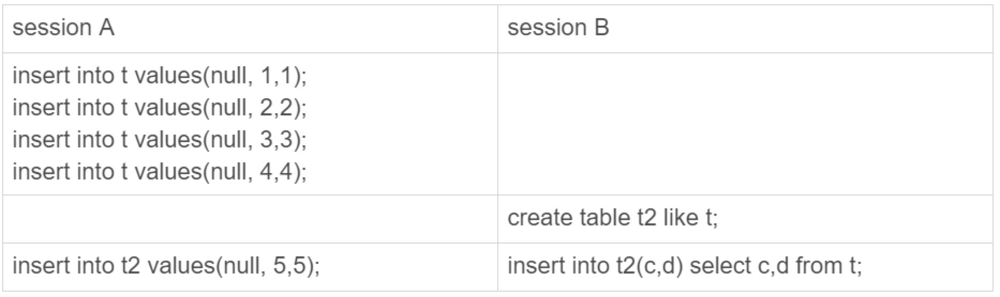

# 39-自增主键为什么不是连续的

`自增主键`可以让主键索引尽量地保持递增顺序插入，避免了页分裂，索引更紧凑。

`自增主键`不能保证`连续递增`。

今天看看什么情况下自增主键会出现 `空洞`？

创建一个表：
- `id` 是`自增主键`字段
- `c` 是`唯一索引`

```sql
CREATE TABLE t (
    id int(11) NOT NULL AUTO_INCREMENT,
    c int(11) DEFAULT NULL,
    d int(11) DEFAULT NULL,
    PRIMARY KEY (id),
    UNIQUE KEY c (c)
) ENGINE=InnoDB;
```

## 自增值保存在哪儿？

插入一行数据：

    insert into t values(null, 1, 1);

执行 `show create table t` 命令：

    CREATE TABLE t (
        id int(11) NOT NULL AUTO_INCREMENT,
        c int(11) DEFAULT NULL,
        d int(11) DEFAULT NULL,
        PRIMARY KEY (id),
        UNIQUE KEY c (c)
    ) ENGINE=InnoDB AUTO_INCREMENT=2 DEFAULT CHARSET=utf8mb4;

表定义里面出现了一个 `AUTO_INCREMENT=2` 表示下一次插入数据时，如果需要自动生成自增值，会生成 `id=2`。

不同的引擎自增值的保存策略不同：
- MyI`SAM 引擎的自增值保存在数据文件中。
- Inn`oDB 引擎：
  - 在 `MySQL 5.7` 版本，自增值保存在`内存`里，并没有持久化。每次重启后，第一次打开表的时候，都会去找自增值的最大值 `max(id)`，然后将 `max(id)+1` 作为这个表当前的自增值。
  - 在 `MySQL 8.0` 版本，自增值的变更记录在了 `redo log` 中，重启的时候依靠 `redo log` 恢复重启之前的值。

## 自增值修改机制

如果字段 `id` 被定义为 `AUTO_INCREMENT` 在插入一行数据的时候，`自增值`的行为如下：
- 如果插入数据时 `id` 字段指定为 `0`、`null` 或`未指定值`，那么就把这个表当前的 `AUTO_INCREMENT` 值填到自增字段。
- 如果插入数据时 `id` 字段指定了具体的值，就直接使用语句里指定的值。

根据要插入的值和当前自增值的大小关系，自增值的变更结果也会有所不同。

假设某次要插入的值是 `X`，当前的自增值是 `Y`：
- 如果 `X<Y` 那么这个表的`自增值`不变。
- 如果 `X≥Y` 就需要把当前`自增值`修改为`新的自增值`。

**新的自增值生成算法是**：

从 `auto_increment_offset` 开始，以 `auto_increment_increment` 为步长，持续叠加，直到找到第一个大于 `X` 的值，作为`新的自增值`。

其中两个系统参数：
- `auto_increment_offset` - 自增的`初始值`，默认值是 `1`。
- `auto_increment_increment` - 自增的`步长`，默认值是 `1`。

在这两个参数都设置为 `1` 的时候，自增主键 `id` 却不能保证是`连续`的，这是什么原因呢？

## 自增值的修改时机

看一下自增值的修改时机。

假设表 `t` 里面已经有了 `(1,1,1)` 这条记录，这时我再执行一条插入数据命令：

    insert into t values(null, 1, 1); 

执行流程：
- 执行器调用 `InnoDB` 引擎接口写入一行，传入的这一行的值是 `(0,1,1)`。
- `InnoDB` 发现用户没有指定自增 `id` 的值，获取表 `t` 当前的自增值 `2`。
- 将传入的行的值改成 `(2,1,1)`。
- 将表的自增值改成 `3`。
- 继续执行插入数据操作，由于已经存在 `c=1` 的记录，所以报 `Duplicate key error` 语句返回。

这个表的自增值改成 `3`，是在真正执行插入数据的操作之前。

这个语句真正执行的时候，因为碰到唯一键 `c` 冲突，所以 `id=2` 这一行并没有插入成功，但也没有将自增值再改回去。

在这之后，再插入新的数据行时，拿到的自增 `id` 就是 `3`，出现了`自增主键不连续`的情况。

    mysql> insert into t values(null, 1, 1);
    Query OK, 1 row affected (0.00 sec)

    mysql> insert into t values(null, 1, 1);
    ERROR 1062 (23000): Duplicate entry '1' for key 'c'
    
    mysql> insert into t values(null, 2, 2);
    Query OK, 1 row affected (0.00 sec)

    mysql> select * from t;
    +----+------+------+
    | id | c    | d    |
    +----+------+------+
    |  1 |    1 |    1 |
    |  3 |    2 |    2 |
    +----+------+------+

可见，`唯一键冲突`是导致自增主键 `id` 不连续的**第一种原因**。

`事务回滚`也会产生类似的现象，这就是**第二种原因**。

    mysql> insert into t values(null, 1, 1);
    Query OK, 1 row affected (0.00 sec)

    mysql> begin;
    Query OK, 0 rows affected (0.00 sec)

    mysql> insert into t values(null, 2, 2);
    Query OK, 1 row affected (0.00 sec)

    mysql> rollback;
    Query OK, 0 rows affected (0.01 sec)

    mysql> insert into t values(null, 2, 2);
    Query OK, 1 row affected (0.00 sec)

    mysql> select * from t;
    +----+------+------+
    | id | c    | d    |
    +----+------+------+
    |  1 |    1 |    1 |
    |  3 |    2 |    2 |
    +----+------+------+

为什么在出现唯一键冲突或者回滚的时候，`MySQL` 没有把表 `t` 的自增值改回去呢？

`MySQL` 这么设计是为了`提升性能`。

接下来分析一下这个设计思路，看看自增值为什么不能回退。

假设有两个并行执行的事务，在申请自增值的时候，为了避免两个事务申请到相同的自增 `id`，肯定要`加锁`，然后`顺序申请`。
- 假设事务 `A` 申请到了 `id=2`，事务 `B` 申请到 `id=3`，那么这时候表 `t` 的自增值是 `4`，之后继续执行。
- 事务 `B` 正确提交了，但事务 `A` 出现了唯一键冲突。
- 如果允许事务 `A` 把自增 `id` 回退，也就是把表 `t` 的当前自增值改回 `2`，那么就会出现这样的情况：表里面已经有 `id=3` 的行，而当前的自增 `id` 值是 `2`。
- 接下来继续执行的其他事务就会申请到 `id=2`，然后再申请到 `id=3`。这时，就会出现插入语句报错`主键冲突`。

为了解决这个主键冲突，有两种方法：
- 每次申请 `id` 之前，先判断表里面是否已经存在这个 `id`。如果存在，就跳过这个 `id`。但是，这个方法的`成本很高`。
- 把自增 `id` 的锁范围扩大，必须等到一个事务执行完成并提交，下一个事务才能再申请自增 `id`。但是，`锁粒度太大`，影响系统并发。

因此 `InnoDB` 放弃了这个设计，语句执行失败也不回退自增 `id`。

正是因为这样，所以才只保证了自增 `id` 是`递增`的，但不保证是`连续`的。

## 自增锁的优化

可以看到，自增 `id` 锁并不是一个`事务锁`，而是每次申请完就马上释放，以便允许别的事务再申请。

`MySQL 5.0` 自增锁的范围是语句级别。如果一个语句申请了一个表自增锁，这个锁会等语句执行结束以后才释放。显然，这样设计会影响并发度。

`MySQL 5.1.22` 引入了一个新策略，新增参数 `innodb_autoinc_lock_mode` 默认值是 `1`。
- 这个参数的值被设置为 `0` 时，表示采用之前 `MySQL 5.0` 版本的策略，即语句执行结束后才释放锁。
- 这个参数的值被设置为 `1` 时：
  - 普通 `insert` 语句，自增锁在申请之后就马上释放。
  - 类似 `insert ... select` 这样的批量插入数据的语句，自增锁还是要等语句结束后才被释放。
- 这个参数的值被设置为 `2` 时，所有的申请自增主键的动作都是申请后就释放锁。

为什么默认设置下 `insert ... select` 要使用语句级的锁？

为什么这个参数的默认值不是 `2` ？

这么设计还是为了数据的`一致性`。

看一下这个场景：



如果 `session B` 是申请了自增值以后马上就释放自增锁，就可能出现这样的情况：
- `session B` 先插入了两个记录 `(1,1,1)`、`(2,2,2)`。
- 然后 `session A` 来申请自增 `id` 得到 `id=3` 插入了（`3,5,5)`。
- 之后 `session B` 继续执行插入两条记录 `(4,3,3)`、`(5,4,4)`。

如果 `binlog_format=statement` 那么 `binlog` 会怎么记录？

`binlog` 对表 `t2` 的更新日志只有两种情况：要么先记 `session A` 的，要么先记 `session B` 的。

但不论是哪一种情况，这个 `binlog` 拿去从库执行，`session B` 这个语句生成的 `id` 都是连续的。

这时`从库`就发生了`数据不一致`。

解决这个问题有两种思路：
- 让原库的批量插入数据语句固定生成连续的 `id` 值。自增锁直到语句执行结束才释放，就是为了达到这个目的。
- 在 `binlog` 里面把插入数据的操作都如实记录进来，到备库执行的时候，不再依赖于自增主键去生成。  
  这种情况，其实就是 `innodb_autoinc_lock_mode` 设置为 `2` 同时 `binlog_format` 设置为 `row`。

因此，对于批量插入数据的场景（`insert ... select`、`replace ... select`、 `load data`），从并发插入数据性能的角度考虑，建议这样设置：
- `innodb_autoinc_lock_mode=2`
- `binlog_format=row`

这样既能提升并发性，又不会出现数据一致性问题。

在普通的 `insert` 语句里面包含多个 `value` 值的情况下，即使 `innodb_autoinc_lock_mode` 设置为 `1` 也不会等语句执行完成才释放锁。  
因为这类语句在申请自增 `id` 的时候是可以精确计算出需要多少个 `id` 的，然后一次性申请，申请完成后锁就可以释放了。

批量插入数据的语句，之所以需要这么设置，是因为`不知道要预先申请多少个 id`。

既然预先不知道要申请多少个自增 `id`，那么一种直接的想法就是需要一个时申请一个。  
但是在大批量插入数据的情况下，不但速度慢，还会影响并发插入的性能。

因此，对于批量插入数据的语句，`MySQL` 有一个批量申请自增 `id` 的策略：
- 第一次申请自增 `id` 会分配 `1` 个。
- `1` 个用完以后，第二次申请自增 `id` 会分配 `2` 个。
- `2` 个用完以后，第三次申请自增 `id` 会分配 `4` 个。
- 依此类推，同一个语句去申请自增 `id` 每次申请到的自增 `id` 个数都是上一次的`两倍`。

这样如果最后一次申请的自增 `id` 没有用完就会`浪费掉`。

这是主键 `id` 出现自增 `id` 不连续的**第三种原因**。

## 小结

从`自增主键为什么会出现不连续的值`这个问题开始，首先讨论了自增值的存储。

在 `MyISAM` 中，自增值是被写在数据文件上的。
在 `InnoDB` 中，自增值是被记录在内存的。

`MySQL` 直到 `8.0` 版本，才给 `InnoDB` 表的自增值加上了持久化的能力，确保重启前后一个表的自增值不变。

从一个语句执行过程中，自增值改变的时机，分析了为什么 `MySQL` 在事务回滚的时候不能回收自增 `id`。

`MySQL 5.1.22` 版本开始引入的参数 `innodb_autoinc_lock_mode` 控制了自增值申请时的`锁范围`。

从并发性能的角度考虑，建议将其设置为 `2`，同时将 `binlog_format` 设置为 `row`。

前面的文章中其实多次提到 `binlog_format` 设置为 `row` 是很有必要的。

今天的例子给这个结论多了一个理由。

# 完