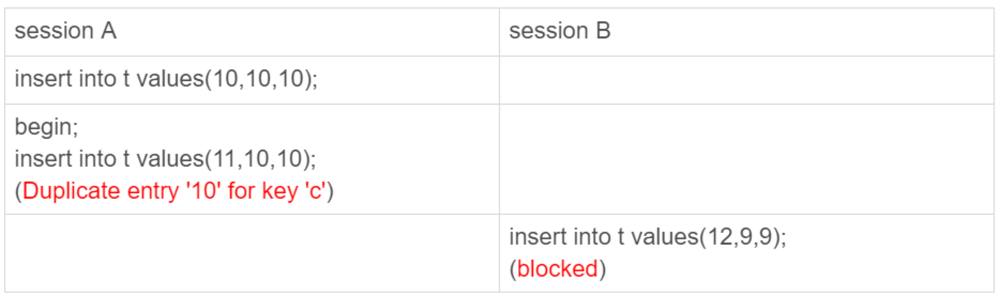
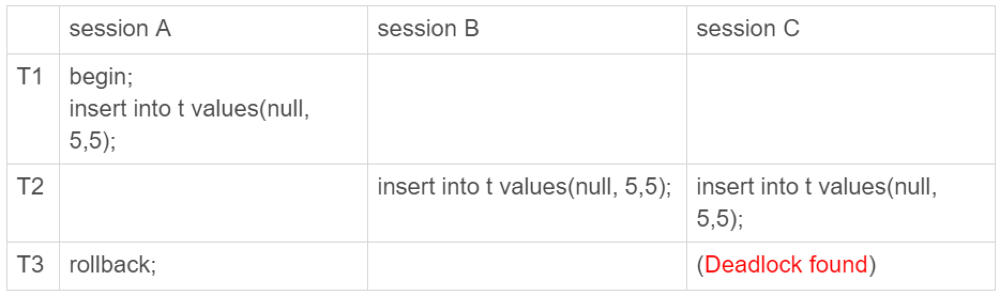
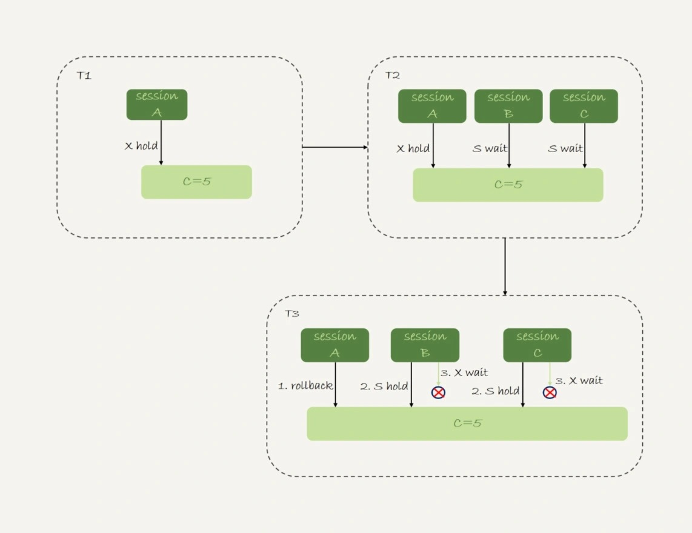

# 40-insert语句的锁为什么这么多

`MySQL` 对`自增主键锁`做了优化，尽量在申请到自增 `id` 以后，就释放`自增锁`。

因此 `insert` 语句是一个很轻量的操作。

不过这个结论对于`普通的 insert 语句`才有效。

还有些 `insert` 语句在执行过程中需要给其他资源加锁，或者无法在申请到自增 `id` 以后就立马释放`自增锁`。

## insert … select 语句

从上篇的问题说起。

表 `t` 和 `t2` 的表结构、初始化数据语句如下：

```sql
CREATE TABLE t (
    id int(11) NOT NULL AUTO_INCREMENT,
    c int(11) DEFAULT NULL,
    d int(11) DEFAULT NULL,
    PRIMARY KEY (id),
    UNIQUE KEY c (c)
) ENGINE=InnoDB;

insert into t values(null, 1,1);
insert into t values(null, 2,2);
insert into t values(null, 3,3);
insert into t values(null, 4,4);

create table t2 like t
```

为什么在可重复读隔离级别下 `binlog_format=statement` 时执行这个语句需要对表 `t` 的所有行和间隙加锁呢？

    insert into t2(c,d) select c,d from t;

这个问题需要考虑的还是日志和数据的一致性。

看这个执行序列：


实际的执行效果是，如果 `session B` 先执行，由于这个语句对表 `t` 主键索引加了 `(-∞,1]` 这个 `next-key lock`，会在语句执行完成后，才允许 `session A` 的 `insert` 语句执行。

但如果没有锁的话，就可能出现 `session B` 的 `insert` 语句先执行，但是后写入 `binlog` 的情况。

于是在 `binlog_format=statement` 的情况下 `binlog` 里面就记录了这样的语句序列：

    insert into t values(-1,-1,-1);
    insert into t2(c,d) select c,d from t;

这个语句到了备库执行，就会把 `id=-1` 这一行也写到表 `t2` 中，出现`主备不一致`。

## insert 循环写入

如果现在有这么一个需求：  
要往表 `t2` 中插入一行数据，这一行的 `c` 值是表 `t` 中 `c` 值的最大值加 `1`。

    insert into t2(c,d) (select c+1, d from t force index(c) order by c desc limit 1);

这个语句的加锁范围是表 `t` 索引 `c` 上的 `(3,4]` 和 `(4,supremum]` 这两个 `next-key lock` 以及主键索引上 `id=4` 这一行。

它的执行流程也比较简单，从表 `t` 中按照索引 `c` 倒序，扫描第一行，拿到结果写入到表 `t2` 中。

因此整条语句的扫描行数是 `1`。

如果是要把这样的一行数据插入到表 `t` 中的话：

    insert into t(c,d) (select c+1, d from t force index(c) order by c desc limit 1);

语句的执行流程是怎样的？

扫描行数又是多少呢？

通过慢查询日志发现扫描行数是 `5`。

执行计划：

    mysql> explain insert into t(c,d) (select c+1, d from t force index(c) order by c desc limit 1);
    +----+-------------+-------+------------+-------+---------------+------+---------+------+------+----------+-----------------+
    | id | select_type | table | partitions | type  | possible_keys | key  | key_len | ref  | rows | filtered | Extra           |
    +----+-------------+-------+------------+-------+---------------+------+---------+------+------+----------+-----------------+
    |  1 | INSERT      | t     | NULL       | ALL   | NULL          | NULL | NULL    | NULL | NULL |     NULL | NULL            |
    |  1 | SIMPLE      | t     | NULL       | index | NULL          | c    | 5       | NULL |    1 |   100.00 | Using temporary |
    +----+-------------+-------+------------+-------+---------------+------+---------+------+------+----------+-----------------+

从 `Extra` 字段可以看到 `Using temporary` 字样，表示这个语句用到了`临时表`。

也就是说，执行过程中，需要把表 `t` 的内容读出来，写入`临时表`。

`Explain` 结果里的 `rows=1` 是因为受到了 `limit 1` 的影响。

从另一个角度考虑，看看 `InnoDB` 扫描了多少行。

在执行这个语句前后查看 `Innodb_rows_read` 的值：

    mysql> SHOW STATUS LIKE 'Innodb_rows_read';
    +------------------+-------+
    | Variable_name    | Value |
    +------------------+-------+
    | Innodb_rows_read | 2231  |
    +------------------+-------+
    1 row in set (0.01 sec)

    mysql> insert into t(c,d) (select c+1, d from t force index(c) order by c desc limit 1);
    Query OK, 1 row affected (0.01 sec)
    Records: 1  Duplicates: 0  Warnings: 0

    mysql> SHOW STATUS LIKE 'Innodb_rows_read';
    +------------------+-------+
    | Variable_name    | Value |
    +------------------+-------+
    | Innodb_rows_read | 2235  |
    +------------------+-------+
    1 row in set (0.00 sec)

可以看到，这个语句执行前后 `Innodb_rows_read` 的值增加了 `4`。

因为默认临时表是使用 `Memory` 引擎的，所以这 `4` 行查的都是表 `t`，也就是说对表 `t` 做了全表扫描。

这样整个执行过程理清楚了：
- 创建`临时表`，表里有两个字段 `c` 和 `d`。
- 按照索引 `c` 扫描表 `t`，依次取 `c=4、3、2、1`，然后回表，读到 `c` 和 `d` 的值写入`临时表`。这时扫描行数是 `4`。
- 由于语义里面有 `limit 1` 所以只取了临时表的第一行，再插入到表 `t` 中。这时扫描行数的值加 `1`，变成了 `5`。

也就是说，这个语句会导致在表 `t` 上做全表扫描，并且会给索引 `c` 上的所有间隙都加上共享的 `next-key lock`。

所以这个语句执行期间，其他事务不能在这个表上插入数据。

至于这个语句的执行为什么需要`临时表`，原因是：  
这类一边遍历数据，一边更新数据的情况，如果读出来的数据直接写回原表，就可能在遍历过程中，读到刚刚插入的记录，新插入的记录如果参与计算逻辑，就跟语义不符。

由于实现上这个语句没有在子查询中就直接使用 `limit 1`，从而导致了这个语句的执行需要遍历整个表 `t`。优化方法：  
就是用前面介绍的方法，先 `insert into` 到临时表 `temp`，这样就只需要扫描一行，然后再从临时表表 `temp` 里面取出这行数据插入表 `t1`。

由于这个语句涉及的数据量很小，可以考虑使用`内存临时表`来做这个优化：

    create temporary table temp(c int, d int) engine=memory;
    insert into temp (select c+1, d from t force index(c) order by c desc limit 1);
    insert into t select * from temp;
    drop table temp;

## insert 唯一键冲突

对于有`唯一键`的表，插入数据时出现`唯一键冲突`也是常见的情况。

一个简单的唯一键冲突的例子：



这个例子也是在可重复读隔离级别下执行的。

`session B` 要执行的 `insert` 语句进入了锁等待状态。

`session A` 执行的 `insert` 语句，发生唯一键冲突的时候，并不只是简单地报错返回，还在冲突的索引上加了锁。

一个 `next-key lock` 就是由它右边界的值定义的。

`session A` 持有索引 `c` 上的 `(5,10]` 共享 `next-key lock`（读锁）。

提示：
- 如果冲突的是`主键索引`，加`记录锁`。
- 如果冲突的是`唯一索引`，加 `next-key 锁`。

分享一个经典的死锁场景：



在 `session A` 执行 `rollback` 语句回滚的时候，`session C` 几乎同时发现死锁并返回。

这个死锁产生的逻辑：
- `T1` 时刻：`session A` 执行 `insert` 语句在索引 `c` 的 `c=5` 上加了记录锁。注意，这个索引是唯一索引，因此退化为记录锁。
- `T2` 时刻：
  - `session B` 要执行相同的 `insert` 语句发现了唯一键冲突，加上`读锁`。
  - `session C` 也在索引 `c` 上 `c=5` 这一个记录上加了`读锁`。

  [备注]  
  这里应该是判断数据是否能写入需要进行`当前读`，进行当前读需要先加`读锁`，然后就被`写锁`阻塞住了。  
  最后 `session A` 回滚，`session B` 和 `session C` 成功加上读锁，且读取判断可以写入，然后都要升级成`写锁`，于是互相`死锁`了。

- `T3` 时刻：`session A` 回滚。这时候，`session B` 和 `session C` 都试图继续执行插入操作，都要加上`写锁`。两个 `session` 都要等待对方的行锁，所以就出现了`死锁`。

这个流程的状态变化图如下所示。



## insert into … on duplicate key update

上面这个例子是主键冲突后直接报错，如果是改写成：

    insert into t values (11,10,10) on duplicate key update d=100;

就会给索引 `c` 上 `(5,10]` 加一个排他的 `next-key lock` 写锁。

`insert into ... on duplicate key update` 这个语义的逻辑是，插入一行数据，如果碰到唯一键约束，就执行后面的更新语句。

注意，如果有多个列违反了唯一性约束，就会按照索引的顺序，修改跟第一个索引冲突的行。

现在表 `t` 里面有 `(1,1,1)` 和 `(2,2,2)` 这两行，执行下面这个语句：

    mysql> select * from t;
    +----+------+------+
    | id | c    | d    |
    +----+------+------+
    |  1 |    1 |    1 |
    |  2 |    2 |    2 |
    +----+------+------+
    2 rows in set (0.00 sec)

    mysql> insert into t values (2, 1, 100) on duplicate key update d = 100;
    Query OK, 2 rows affected (0.00 sec)

    mysql> select * from t;
    +----+------+------+
    | id | c    | d    |
    +----+------+------+
    |  1 |    1 |    1 |
    |  2 |    2 |  100 |
    +----+------+------+
    2 rows in set (0.00 sec)

可以看到，主键 `id` 是先判断的，`MySQL` 认为这个语句跟 `id=2` 这一行冲突，所以修改的是 `id=2` 的行。

需要注意，执行这条语句的 `affected rows` 是 `2` 很容易造成误解。

实际上，真正更新的只有一行，只是在代码实现上，`insert` 和 `update` 都认为自己成功了，`update` 计数加了 `1`，`insert` 计数也加了 `1`。

## 小结

今天介绍了几种特殊情况下的 `insert` 语句。

`insert ... select` 是很常见的在两个表之间拷贝数据的方法。在可重复读隔离级别下，这个语句会给 `select` 的表里扫描到的记录和间隙加读锁。

而如果 `insert` 和 `select` 的对象是同一个表，则有可能会造成循环写入。这种情况下，需要引入`用户临时表`来做优化。

`insert` 语句如果出现唯一键冲突，会在冲突的唯一值上加共享的 `next-key lock`(`读锁`)。

因此，碰到由于唯一键约束导致报错后，要尽快提交或回滚事务，避免加锁时间过长。

# 完