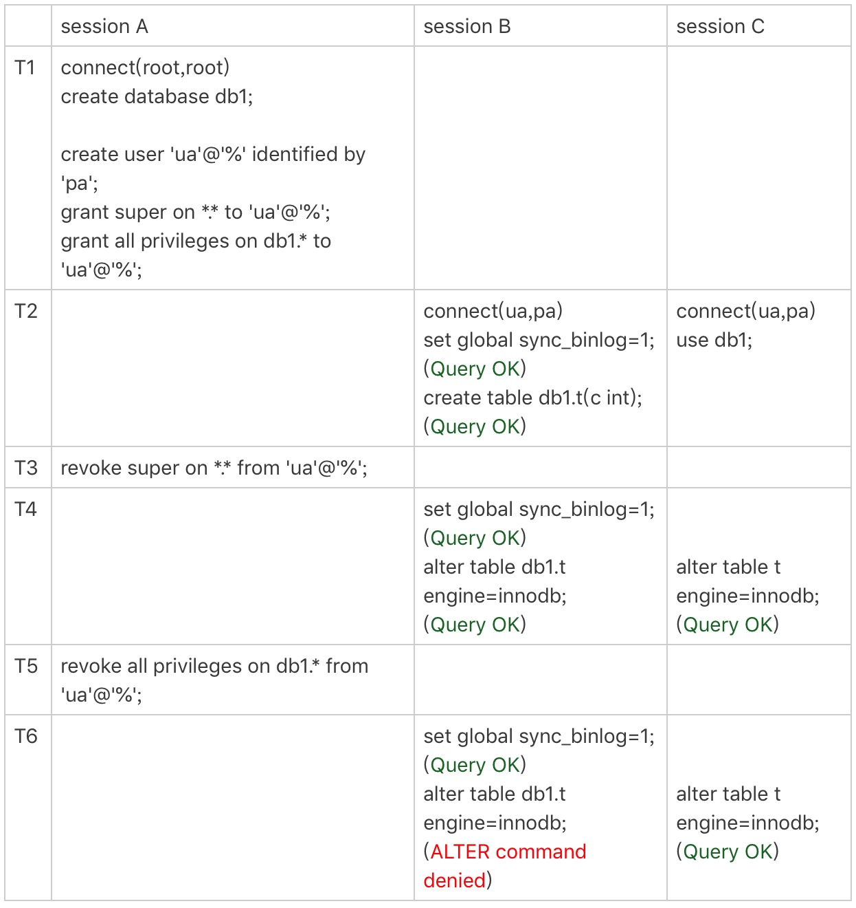
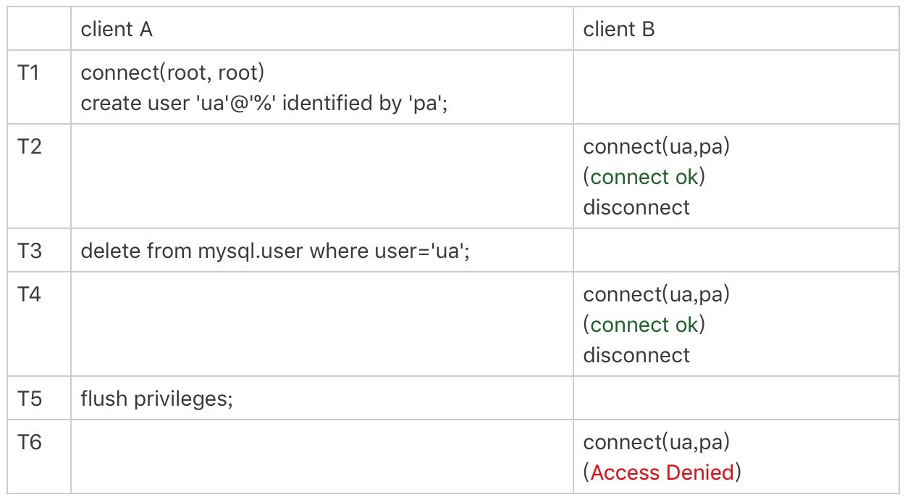

# 42-grant之后要跟着flush-privileges吗

`MySQL` 里面 `grant` 语句是用来给用户赋权的。

一些操作文档里面提到 `grant` 之后要马上跟着执行一个 `flush privileges` 命令才能使赋权语句生效。

那么 `grant` 之后真的需要执行 `flush privileges` 吗？

接下来先介绍 `grant` 语句和 `flush privileges` 语句分别做了什么事情，然后再分析这个问题。

先创建一个用户：

    mysql> create user 'ua'@'%' identified by 'abcDEF123!!!';
    Query OK, 0 rows affected (0.00 sec)

这条语句创建一个用户 `'ua'@'%'` 密码是 `abcDEF123!!!`。

`MySQL` 里 `用户名(user) + 地址(host)` 才表示一个用户，`ua@ip1` 和 `ua@ip2` 代表的是两个不同的用户。

这条命令做了两个动作：
- `磁盘上`：往 `mysql.user` 表里插入一行，由于没有指定权限，所以这行数据上所有表示权限的字段的值都是 `N`。
- `内存里`：往数组 `acl_users` 里插入一个 `acl_user` 对象，这个对象的 `access` 字段值为 `0`。

这个时刻用户 `ua` 在 `user` 表中的状态：

    mysql> select * from mysql.user where user='ua'\G
    *************************** 1. row ***************************
                      Host: %
                      User: ua
               Select_priv: N
               Insert_priv: N
               Update_priv: N
               Delete_priv: N
               Create_priv: N
                 Drop_priv: N
               Reload_priv: N
             Shutdown_priv: N
              Process_priv: N
                 File_priv: N
                Grant_priv: N
           References_priv: N
                Index_priv: N
                Alter_priv: N
              Show_db_priv: N
                Super_priv: N
     Create_tmp_table_priv: N
          Lock_tables_priv: N
              Execute_priv: N
           Repl_slave_priv: N
          Repl_client_priv: N
          Create_view_priv: N
            Show_view_priv: N
       Create_routine_priv: N
        Alter_routine_priv: N
          Create_user_priv: N
                Event_priv: N
              Trigger_priv: N
    Create_tablespace_priv: N
                  ssl_type:
                ssl_cipher:
               x509_issuer:
              x509_subject:
             max_questions: 0
               max_updates: 0
           max_connections: 0
      max_user_connections: 0
                    plugin: mysql_native_password
     authentication_string: *DC1B7B2CC24AB758CD6D073E65CEFC05D0C7668A
          password_expired: N
     password_last_changed: 2023-02-07 14:27:42
         password_lifetime: NULL
            account_locked: N
    1 row in set (0.00 sec)

在 `MySQL` 中，用户权限是有不同的`范围`的。

接下来按照用户权限范围从大到小的顺序依次说明。

## 全局权限

`全局权限`，作用于整个 `MySQL` 实例，这些权限信息保存在 `mysql` 库的 `user` 表里。

给用户 `ua` 赋一个最高权限：

    mysql> grant all privileges on *.* to 'ua'@'%' with grant option;
    Query OK, 0 rows affected (0.00 sec)
    
    mysql> select * from mysql.user where user='ua'\G
    *************************** 1. row ***************************
                      Host: %
                      User: ua
               Select_priv: Y
               Insert_priv: Y
               Update_priv: Y
               Delete_priv: Y
               Create_priv: Y
                 Drop_priv: Y
               Reload_priv: Y
             Shutdown_priv: Y
              Process_priv: Y
                 File_priv: Y
                Grant_priv: Y
           References_priv: Y
                Index_priv: Y
                Alter_priv: Y
              Show_db_priv: Y
                Super_priv: Y
     Create_tmp_table_priv: Y
          Lock_tables_priv: Y
              Execute_priv: Y
           Repl_slave_priv: Y
          Repl_client_priv: Y
          Create_view_priv: Y
            Show_view_priv: Y
       Create_routine_priv: Y
        Alter_routine_priv: Y
          Create_user_priv: Y
                Event_priv: Y
              Trigger_priv: Y
    Create_tablespace_priv: Y
                  ssl_type:
                ssl_cipher:
               x509_issuer:
              x509_subject:
             max_questions: 0
               max_updates: 0
           max_connections: 0
      max_user_connections: 0
                    plugin: mysql_native_password
     authentication_string: *DC1B7B2CC24AB758CD6D073E65CEFC05D0C7668A
          password_expired: N
     password_last_changed: 2023-02-07 14:27:42
         password_lifetime: NULL
            account_locked: N
    1 row in set (0.00 sec)

这个 `grant` 命令做了两个动作：
- 磁盘上：将 `mysql.user` 表里，用户 `'ua'@'%'` 这一行的所有表示权限的字段的值都修改为 `Y`。
- 内存里：从数组 `acl_users` 中找到这个用户对应的对象，将 `access` 值（权限位）修改为二进制的 `全 1`。

注意：  
`Grant_priv` 权限是通过 `with grant option` 设置的。
`Grant_priv` 权限表示用户可以将自己的权限赋予其他用户。

这个 `grant` 命令执行完成后，如果有新的客户端使用用户名 `ua` 登录成功，`MySQL` 会为新连接维护一个`线程对象`，然后从 `acl_users` 数组里查到这个用户的权限，并将权限值拷贝到这个`线程对象`中。
之后在这个连接中执行的语句，所有关于`全局权限`的判断，都直接使用`线程对象`内部保存的权限位。

基于上面的分析可以知道：
- `grant` 命令对于全局权限，同时更新了`磁盘`和`内存`。命令完成后即时生效，接下来新创建的连接会使用新的权限。
- 对于一个已经存在的连接，它的全局权限不受 `grant` 命令的影响。

提示：  
**一般在生产环境上要合理控制用户权限的范围。**  
上面这个 `grant` 语句就是一个典型的`错误示范`。  
如果一个用户有所有权限，一般就不应该设置为所有 `IP` 地址都可以访问。

回收上面的 `grant` 语句赋予的权限：

    mysql> revoke all privileges on *.* from 'ua'@'%';
    Query OK, 0 rows affected (0.00 sec)
    
    mysql> select * from mysql.user where user='ua'\G
    *************************** 1. row ***************************
                      Host: %
                      User: ua
               Select_priv: N
               Insert_priv: N
               Update_priv: N
               Delete_priv: N
               Create_priv: N
                 Drop_priv: N
               Reload_priv: N
             Shutdown_priv: N
              Process_priv: N
                 File_priv: N
                Grant_priv: Y
           References_priv: N
                Index_priv: N
                Alter_priv: N
              Show_db_priv: N
                Super_priv: N
     Create_tmp_table_priv: N
          Lock_tables_priv: N
              Execute_priv: N
           Repl_slave_priv: N
          Repl_client_priv: N
          Create_view_priv: N
            Show_view_priv: N
       Create_routine_priv: N
        Alter_routine_priv: N
          Create_user_priv: N
                Event_priv: N
              Trigger_priv: N
    Create_tablespace_priv: N
                  ssl_type:
                ssl_cipher:
               x509_issuer:
              x509_subject:
             max_questions: 0
               max_updates: 0
           max_connections: 0
      max_user_connections: 0
                    plugin: mysql_native_password
     authentication_string: *DC1B7B2CC24AB758CD6D073E65CEFC05D0C7668A
          password_expired: N
     password_last_changed: 2023-02-07 14:27:42
         password_lifetime: NULL
            account_locked: N
    1 row in set (0.00 sec)

这个 `revoke` 命令做了两个动作：
- 磁盘上：将 `mysql.user` 表里，用户 `'ua'@'%'` 这一行的所有表示权限的字段的值都修改为 `N`。
- 内存里：从数组 `acl_users` 中找到这个用户对应的对象，将 `access` 的值修改为 `0`。

注意：  
`Grant_priv` 权限需要通过如下语句回收：

    mysql> revoke grant option on *.* from 'ua'@'%';
    Query OK, 0 rows affected (0.00 sec)

## db 权限

除了`全局权限`，`MySQL` 也支持`库`级别的权限定义。

让用户 `ua` 拥有库 `db1` 的所有权限：

    mysql> grant all privileges on db1.* to 'ua'@'%' with grant option;
    Query OK, 0 rows affected (0.01 sec)
    
    mysql> select * from mysql.db where user='ua'\G
    *************************** 1. row ***************************
                     Host: %
                       Db: db1
                     User: ua
              Select_priv: Y
              Insert_priv: Y
              Update_priv: Y
              Delete_priv: Y
              Create_priv: Y
                Drop_priv: Y
               Grant_priv: Y
          References_priv: Y
               Index_priv: Y
               Alter_priv: Y
    Create_tmp_table_priv: Y
         Lock_tables_priv: Y
         Create_view_priv: Y
           Show_view_priv: Y
      Create_routine_priv: Y
       Alter_routine_priv: Y
             Execute_priv: Y
               Event_priv: Y
             Trigger_priv: Y
    1 row in set (0.00 sec)

基于`库`的权限记录保存在 `mysql.db` 表中，在内存里则保存在数组 `acl_dbs` 中。

这条 `grant` 命令做了两个动作：
- 磁盘上：往 `mysql.db` 表中插入了一行记录，所有权限位字段设置为 `Y`。
- 内存里：增加一个对象到数组 `acl_dbs` 中，这个对象的权限位为 `全 1`。

每次需要判断一个用户对一个数据库读写权限的时候，都需要遍历一次 `acl_dbs` 数组，根据 `user`、`host` 和 `db` 找到匹配的对象，然后根据对象的权限位来判断。

也就是说，`grant` 修改 `db` 权限的时候，是同时对`磁盘`和`内存`生效的。

注意：

`grant` 操作对于已经存在的连接的影响，在`全局权限`和`基于db的权限`效果是不同的。

做一个对照试验：

图中 `set global sync_binlog` 这个操作是需要 `super` 权限的。

虽然用户 `ua` 的 `super` 权限在 `T3` 时刻已经通过 `revoke` 语句回收了，但是在 `T4` 时刻执行 `set global` 的时候，权限验证还是通过了。  
这是因为 `super` 是全局权限，这个权限信息在`线程对象`中，而 `revoke` 操作影响不到这个`线程对象`。  
**结论1：全局权限存储在全局数组，会话建立时同步到线程对象中。**

在 `T5` 时刻去掉 `ua` 对 `db1` 库的所有权限后，在 `T6` 时刻 `session B` 再操作 `db1` 库的表，就会报错权限不足。  
这是因为 `acl_dbs` 是一个全局数组，所有线程判断 `db` 权限都用这个数组，这样 `revoke` 操作马上就会影响到 `session B`。  
**结论2：库权限存储在全局数组。**

在代码实现上有一个`特别的逻辑`，如果当前会话已经处于某一个 `db` 里面，之前 `use` 这个`库`的时候拿到的`库权限`会保存在`会话变量`中。

所以在 `T6` 时刻 `session C` 和 `session B` 对表 `t` 的操作逻辑是一样的。  
但是 `session B` 报错，而 `session C` 可以执行成功。  
这是因为 `session C` 在 `T2` 时刻执行的 `use db1` 拿到了这个库的权限，在切换出 `db1` 库之前，`session C` 对这个库就一直有权限。  
**结论3：会话进入某个库的时候会将库权限同步到会话变量中。**

## 表权限和列权限

除了 `db` 级别的权限外，`MySQL` 支持更细粒度的`表权限`和`列权限`。

`表权限`定义存放在表 `mysql.tables_priv` 中。  
`列权限`定义存放在表 `mysql.columns_priv` 中。  

这两类权限，组合起来存放在`内存`的 `hash` 结构 `column_priv_hash` 中。

    mysql> create table db1.t1(id int, a int);
    Query OK, 0 rows affected (0.01 sec)
    
    mysql> grant all privileges on db1.t1 to 'ua'@'%' with grant option;
    Query OK, 0 rows affected (0.00 sec)
    
    mysql> create table db1.t2(id int, a int);
    Query OK, 0 rows affected (0.01 sec)
    
    mysql> grant select(id), insert(id, a) on db1.t2 to 'ua'@'%' with grant option;
    Query OK, 0 rows affected (0.00 sec)
    
    
    mysql> select * from mysql.tables_priv where user='ua' \G
    *************************** 1. row ***************************
           Host: %
             Db: db1
           User: ua
     Table_name: t1
        Grantor: root@localhost
      Timestamp: 0000-00-00 00:00:00
     Table_priv: Select,Insert,Update,Delete,Create,Drop,Grant,References,Index,Alter,Create View,Show view,Trigger
    Column_priv:
    *************************** 2. row ***************************
           Host: %
             Db: db1
           User: ua
     Table_name: t2
        Grantor: root@localhost
      Timestamp: 0000-00-00 00:00:00
     Table_priv: Grant
    Column_priv: Select,Insert
    2 rows in set (0.00 sec)
    
    mysql> select * from mysql.columns_priv where user='ua' \G
    *************************** 1. row ***************************
           Host: %
             Db: db1
           User: ua
     Table_name: t2
    Column_name: id
      Timestamp: 0000-00-00 00:00:00
    Column_priv: Select,Insert
    *************************** 2. row ***************************
           Host: %
             Db: db1
           User: ua
     Table_name: t2
    Column_name: a
      Timestamp: 0000-00-00 00:00:00
    Column_priv: Insert
    2 rows in set (0.00 sec)

跟 `db` 权限类似，这两个权限每次 `grant` 的时候都会修改数据表，也会同步修改内存中的 `hash` 结构。

因此，对这两类权限的操作，也会马上影响到已经存在的连接。

看来 `grant` 语句都是`即时生效`的，那这么看应该就不需要执行 `flush privileges` 语句了呀。

答案也确实是这样的。

`flush privileges` 命令会清空 `acl_users` 数组，然后从 `mysql.user` 表中读取数据重新加载，重新构造一个 `acl_users` 数组。  
也就是以数据表中的数据为准，会将全局权限内存数组重新加载一遍。  

同样，对于 `db` 权限、`表`权限和`列`权限 `MySQL` 也做了这样的处理。

也就是说，如果`内存`的权限数据和`磁盘数据表`相同的话，不需要执行 `flush privileges`。  
而如果用 `grant/revoke` 语句来执行的话，`内存`和`数据表`本来就是保持同步更新的。  

**因此，正常情况下，grant 命令之后，没有必要跟着执行 flush privileges 命令。**

## flush privileges 使用场景

当数据表中的权限数据跟内存中的权限数据不一致的时候，`flush privileges` 语句可以用来`重建内存数据`，达到一致状态。

这种不一致往往是由不规范的操作导致的，比如直接用 `DML` 语句操作`系统权限表`。

示例：

`T3` 时刻虽然已经用 `delete` 语句删除了用户 `ua`，但是在 `T4` 时刻，仍然可以用 `ua` 连接成功。
因为这时候内存中 `acl_users` 数组中还有这个用户，因此系统判断时认为用户还正常存在。

`T5` 时刻执行过 `flush` 命令后，内存更新，`T6` 时刻再要用 `ua` 来登录的话，就会报错无法访问了。

直接操作系统表是不规范的操作，这个不一致状态也会导致一些更`诡异`的现象发生。

比如：

    mysql> create user 'ua'@'%' identified by 'abcDEF123!!!';
    Query OK, 0 rows affected (0.00 sec)
    
    -- 从用户表直接删除用户
    mysql> delete from mysql.user where user = 'ua';
    Query OK, 1 row affected (0.00 sec)
    
    -- 用户 ua 赋权限失败
    -- 因为 mysql.user 表中找不到这行记录
    mysql> grant super on *.* to 'ua'@'%' with grant option;
    ERROR 1133 (42000): Can't find any matching row in the user table
    
    -- 重新创建这个用户也不行
    -- 因为在做内存判断的时候，会认为这个用户还存在
    mysql> create user 'ua'@'%' identified by 'abcDEF123!!!';
    ERROR 1396 (HY000): Operation CREATE USER failed for 'ua'@'%'

    -- 刷新权限
    -- 清空了内存中还存在的用户权限
    mysql> flush privileges;
    Query OK, 0 rows affected (0.01 sec)
    
    -- 用户 ua 赋权限失败
    -- 因为 mysql.user 表中找不到这行记录
    -- 尝试创建用户发现密码不符合要求
    mysql> grant super on *.* to 'ua'@'%' with grant option;
    ERROR 1819 (HY000): Your password does not satisfy the current policy requirements
    
    -- 重新创建这个用户可以了
    mysql> create user 'ua'@'%' identified by 'abcDEF123!!!';
    Query OK, 0 rows affected (0.00 sec)
    
    -- 用户 ua 赋权限也可以了
    mysql> grant super on *.* to 'ua'@'%' with grant option;
    Query OK, 0 rows affected (0.00 sec)

## 小结

今天介绍了 `MySQL` 用户权限在`数据表`和`内存`中的存在形式，以及 `grant` 和 `revoke` 命令的执行逻辑。

`grant` 语句会同时修改`数据表`和`内存`，判断权限的时候使用的是`内存数据`。

规范地使用 `grant` 和 `revoke` 语句，是不需要随后加上 `flush privileges` 语句的。

`flush privileges` 语句本身会用数据表的数据重建一份内存权限数据，所以在权限数据可能存在不一致的情况下再使用。

这种不一致往往是由于直接用 `DML` 语句操作系统权限表导致的，尽量不要使用这类语句。

另外一个 `grant` 语句赋权时的写法：

    grant super on *.* to 'ua'@'%' identified by 'pa';

这条命令加了 `identified by '密码'` 除了赋权外，还包含了：
- 如果用户 `'ua'@'%'` 不存在，就创建这个用户，密码是 `pa`。
- 如果用户 `ua` 已经存在，就将密码修改成 `pa`。

这也是一种不建议的写法，这种写法很容易就会不慎把密码给改了。

# 完