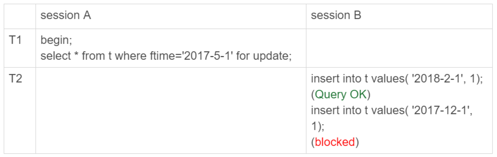
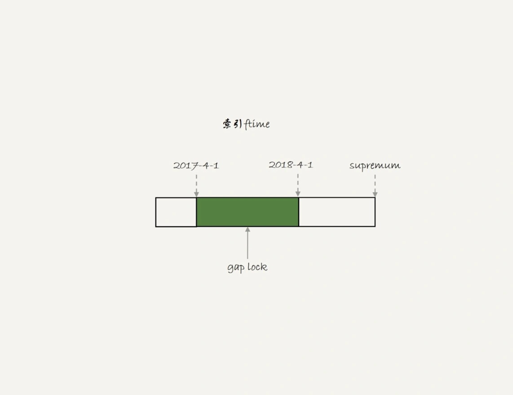
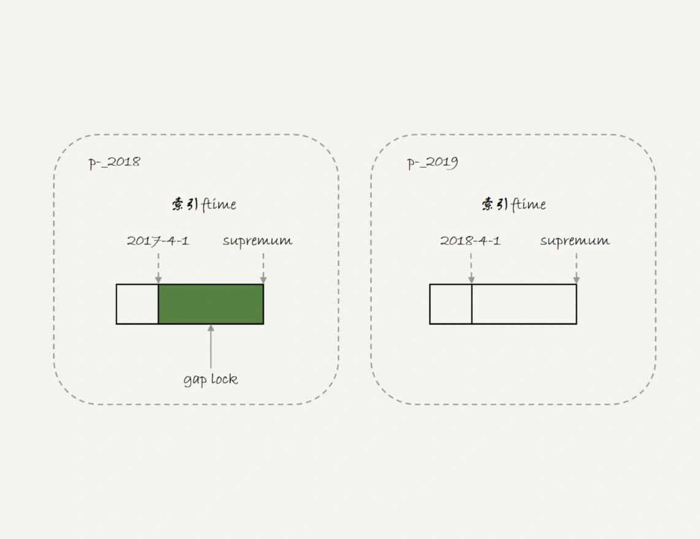
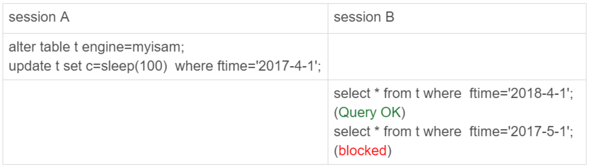
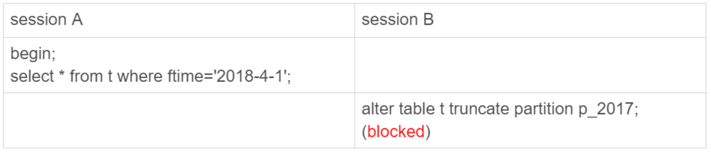

# 43-要不要使用分区表

`分区表`有什么问题，为什么公司规范不让使用`分区表`呢？

## 分区表是什么？

先创建一个表：

    CREATE TABLE `t` (
      `ftime` datetime NOT NULL,
      `c` int(11) DEFAULT NULL,
      KEY (`ftime`)
    ) ENGINE=InnoDB DEFAULT CHARSET=latin1
    PARTITION BY RANGE (YEAR(ftime))
    (PARTITION p_2017 VALUES LESS THAN (2017) ENGINE = InnoDB,
     PARTITION p_2018 VALUES LESS THAN (2018) ENGINE = InnoDB,
     PARTITION p_2019 VALUES LESS THAN (2019) ENGINE = InnoDB,
     PARTITION p_others VALUES LESS THAN MAXVALUE ENGINE = InnoDB);
    
    insert into t values('2017-4-1',1),('2018-4-1',1);

在表 `t` 中初始化插入了两行记录，按照定义的分区规则，这两行记录分别落在 `p_2018` 和 `p_2019` 这两个分区上。

这个表包含了一个 `.frm` 文件和 `4` 个 `.ibd` 文件，每个分区对应一个 `.ibd` 文件。

    [root@centos aa]# ll
    总用量 464
    -rw-r----- 1 mysql mysql     61 2月   7 18:57 db.opt
    -rw-r----- 1 mysql mysql   8586 2月   8 11:54 t.frm
    -rw-r----- 1 mysql mysql 114688 2月   8 11:54 t#P#p_2017.ibd
    -rw-r----- 1 mysql mysql 114688 2月   8 11:54 t#P#p_2018.ibd
    -rw-r----- 1 mysql mysql 114688 2月   8 11:54 t#P#p_2019.ibd
    -rw-r----- 1 mysql mysql 114688 2月   8 11:54 t#P#p_others.ibd

也就是说：
- 对于引擎层来说：这是 `4` 个表。
- 对于 `Server` 层来说：这是 `1` 个表。

这两句话非常重要，可以帮理解分区表的执行逻辑。

## 分区表的引擎层行为

举个在`分区表`加间隙锁的例子。

目的是说明对于 `InnoDB` 来说是 `4` 个表。

这里可以复习一下第 `21` 篇文章介绍的`间隙锁`加锁规则。

初始化表 `t` 的时候插入的两行数据 `ftime` 的值分别是 `'2017-4-1'` 和 `'2018-4-1'`。

`session A` 的 `select` 语句对索引 `ftime` 上这两个记录之间的间隙加了锁。

如果是一个`普通表`，那么 `T1` 时刻，在表 `t` 的 `ftime` 索引上，间隙和加锁状态如下图：

也就是说 `'2017-4-1'` 和 `'2018-4-1'` 这两个记录之间的间隙是会被锁住的。

`sesion B` 的两条插入语句应该都要进入锁等待状态。

但在`分区表`中 `session B` 的第一个 `insert` 语句是可以执行成功的。

这是因为对于引擎来说 `p_2018` 和 `p_2019` 是两个不同的表，也就是说 `2017-4-1` 的下一个记录并不是 `2018-4-1` 而是 `p_2018` 分区的 `supremum`。

所以 `T1` 时刻，在表 `t` 的 `ftime` 索引上，间隙和加锁的状态如下图：

由于分区表的规则 `session A` 的 `select` 语句其实只操作了分区 `p_2018` 因此加锁范围就是上图中深绿色的部分。

所以 `session B` 要写入一行 `ftime` 是 `2018-2-1` 的时候是可以成功的，而要写入 `2017-12-1` 这个记录就要等 `session A` 的间隙锁。

看完 `InnoDB` 引擎的例子，再来一个 `MyISAM` 分区表的例子。

对于 `MyISAM` 引擎来说，这是 `4` 个表。

在 `session A` 用 `sleep(100)` 将这条语句的执行时间设置为 `100` 秒。

由于 `MyISAM` 引擎只支持表锁，所以这条 `update` 语句会锁住整个表 `t` 上的读。

但结果是 `session B` 的第一条查询语句可以正常执行，第二条语句才进入锁等待状态。

这是因为 `MyISAM` 的表锁是在`引擎层`实现的，`session A` 加的表锁是锁在分区 `p_2018` 上。

因此只会堵住在这个分区上执行的查询，落到其他分区的查询是不受影响的。

使用`分区表`的一个重要原因就是`单表过大`。  
如果不使用`分区表`的话，就是要使用`手动分表`的方式。  

**手动分表和分区表有什么区别？**

`分区表`和`手工分表`，一个是由 `server` 层来决定使用哪个分区，一个是由`应用层`代码来决定使用哪个分表。

因此，从引擎层看，这两种方式是没有差别的。

其实这两个方案的区别，主要是在 `server` 层上。

从 `server` 层看，就不得不提到分区表一个被广为诟病的问题：`打开表的行为`。

## 分区策略

当第一次访问一个分区表的时候 `MySQL` 需要把所有的分区都访问一遍。

一个典型的报错情况是这样的： 
`MySQL` 的 `open_files_limit` 参数默认值是 `1024`。  
如果一个分区表的分区很多，就会在访问这个表的时候，由于需要打开所有的文件，导致打开表文件的个数超过了上限而报错。  

注意：
- 使用 `MyISAM` 引擎就会出现这个问题。
- 使用 `InnoDB` 引擎并不会出现这个问题。

`MyISAM` 分区表使用的分区策略，称为`通用分区策略`，每次访问分区都由 `server` 层控制。

`InnoDB` 引擎引入了`本地分区策略`，这个策略是在 `InnoDB` 内部自己管理打开分区的行为。  
`InnoDB` 引擎打开文件超过 `innodb_open_files` 这个值的时候，就会关掉一些之前打开的文件。  
`InnoDB` 分区表使用了本地分区策略以后，即使分区个数大于 `open_files_limit` 打开分区表也不会报 `打开文件过多` 这个错误，就是 `innodb_open_files` 这个参数发挥的作用。  

## 分区表的 server 层行为

从 `server` 层看一个分区表就只是一个表。

用下面这个例子来说明。

    mysql> show processlist;
    +-----+------+---------------------+------+---------+------+---------------------------------+-----------------------------------------+
    | Id  | User | Host                | db   | Command | Time | State                           | Info                                    |
    +-----+------+---------------------+------+---------+------+---------------------------------+-----------------------------------------+
    | 141 | root | localhost           | aa   | Sleep   |   75 |                                 | NULL                                    |
    | 142 | root | localhost           | aa   | Query   |   48 | Waiting for table metadata lock | alter table t truncate partition p_2017 |
    | 144 | root | localhost           | NULL | Sleep   | 2035 |                                 | NULL                                    |
    | 146 | root | localhost           | NULL | Query   |    0 | starting                        | show processlist                        |
    +-----+------+---------------------+------+---------+------+---------------------------------+-----------------------------------------+

虽然 `session B` 只需要操作 `p_2017` 这个分区，由于 `session A` 持有整个表 `t` 的 `MDL` 锁，就导致了 `session B` 的 `alter` 语句被堵住。

也就是说，分区表在做 `DDL` 的时候，影响会更大。

如果是`普通分表`，当 `truncate` 一个分表的时候，肯定不会跟另外一个分表上的查询语句出现 `MDL` 锁冲突。

小结一下：
- `MySQL` 在第一次打开分区表的时候，需要访问所有的分区。
- 在 `server` 层，认为这是同一张表，因此所有分区共用同一个 `MDL` 锁。
- 在引擎层，认为这是不同的表，因此 `MDL` 锁之后的执行过程，会根据分区表规则，只访问必要的分区。

关于`必要的分区`的判断，是根据 `SQL` 语句中的 `where` 条件，结合`分区规则`来实现的。

如果查询语句的 `where` 条件中没有分区 `key` 那就只能访问所有分区了。

## 分区表的应用场景

`分区表`的一个显而易见的优势是对业务透明，相对于用户分表来说，使用分区表的业务代码更简洁。

另外，分区表可以很方便的`清理历史数据`。

如果一项业务跑的时间足够长，往往就会有根据时间删除历史数据的需求。

这时候，按照时间分区的分区表，就可以直接通过 `alter table t drop partition p_xxxx` 这个语法删掉分区，从而删掉过期的历史数据。

这个操作是直接删除分区文件，效果跟 `drop` 普通表类似。

与使用 `delete` 语句删除数据相比，优势是速度快、对系统影响小。

## 小结

这篇文章介绍的是 `server` 层和`引擎层`对`分区表`的处理方式。

需要注意的是，文章是以范围分区（`range`）为例介绍的。

实际上 `MySQL` 还支持 `hash` 分区、`list` 分区等分区方法。

实际使用时，`分区表`跟`用户分表`比起来，有两个绕不开的问题：
- `分区表`是第一次访问的时候需要访问所有分区。
- `用户分表`是共用 `MDL` 锁。

因此，如果要使用`分区表`，就不要创建`太多`的分区。

两个问题需要注意：
- 分区并不是越细越好。
- 分区也不要提前预留太多，在使用之前预先创建即可。

实际上单表或者单分区的数据`一千万`行，只要没有特别大的索引，对于现在的硬件能力来说都已经是`小表`了。

如果是按月分区，每年年底时再把下一年度的 `12` 个新分区创建上即可。

对于没有数据的历史分区，要及时的 `drop` 掉。

至于`分区表`查询需要跨多个分区取数据，查询性能就会比较慢，基本上就不是分区表的问题了，而是数据量的问题或者说是使用方式的问题了。

如果团队已经维护了成熟的分库分表中间件，用业务分表，对业务开发同学没有额外的复杂性，对 `DBA` 也更直观，自然是更好的。

# 完